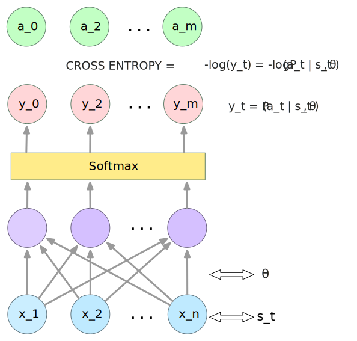
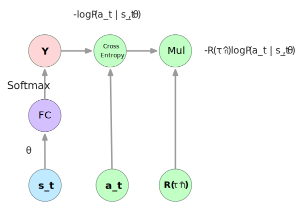
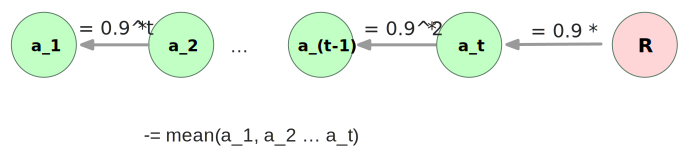

运行本目录下的程序示例需要使用PaddlePaddle的最新develop分枝。如果您的PaddlePaddle安装版本低于此要求，请按照[安装文档](http://www.paddlepaddle.org/docs/develop/documentation/zh/build_and_install/pip_install_cn.html)中的说明更新PaddlePaddle安装版本。

---

# Policy Gradient RL by PaddlePaddle
本文介绍了如何使用PaddlePaddle通过policy-based的强化学习方法来训练一个player（actor model）, 我们希望这个player可以完成简单的走阶梯任务。

 内容分为:

 - 任务描述
 -  模型
 -  策略（目标函数）
 -  算法（Gradient ascent）
 -  PaddlePaddle实现


## 1. 任务描述
假设有一个阶梯，连接A、B点，player从A点出发，每一步只能向前走一步或向后走一步，到达B点即为完成任务。我们希望训练一个聪明的player，它知道怎么最快的从A点到达B点。
我们在命令行以下边的形式模拟任务：
```
A - O - - - - - B
```
一个‘-'代表一个阶梯，A点在行头，B点在行末，O代表player当前在的位置。

## 2. Policy Gradient
### 2.1 模型
#### inputyer
模型的输入是player观察到的当前阶梯的状态$S$, 要包含阶梯的长度和player当前的位置信息。
在命令行模拟的情况下，player的位置和阶梯长度连个变量足以表示当前的状态，但是我们为了便于将这个demo推广到更复杂的任务场景，我们这里用一个向量来表示游戏状态$S$.
向量$S$的长度为阶梯的长度，每一维代表一个阶梯，player所在的位置为1，其它位置为0.
下边是一个例子：
```
S = [0, 1, 0, 0]  // 阶梯长度为4，player在第二个阶梯上。
```
#### hidden layer
隐藏层采用两个全连接layer `FC_1`和`FC_2`, 其中`FC_1` 的size为10， `FC_2`的size为2.

#### output layer
我们使用softmax将`FC_2`的output映射为所有可能的动作（前进或后退）的概率分布（Probability of taking the action）,即为一个二维向量`act_probs`, 其中，`act_probs[0]` 为后退的概率，`act_probs[1]`为前进的概率。

#### 模型表示
我将我们的player模型(actor)形式化表示如下：
$$a = \pi_\theta(s)$$
其中$\theta$表示模型的参数，$s$是输入状态。


### 2.2 策略（目标函数）
我们怎么评估一个player(模型)的好坏呢？首先我们定义几个术语：
我们让$\pi_\theta(s)$来玩一局游戏，$s_t$表示第$t$时刻的状态，$a_t$表示在状态$s_t$做出的动作，$r_t$表示做过动作$a_t$后得到的奖赏。
一局游戏的过程可以表示如下：
$$\tau = [s_1, a_1, r_1, s_2, a_2, r_2 ... s_T, a_T, r_T] \tag{1}$$

一局游戏的奖励表示如下：
$$R(\tau) = \sum_{t=1}^Tr_t$$

player玩一局游戏，可能会出现多种操作序列$\tau$ ,某个$\tau$出现的概率是依赖于player model的$\theta$, 记做：
$$P(\tau | \theta)$$
那么，给定一个$\theta$(player model), 玩一局游戏，期望得到的奖励是：
$$\overline {R}_\theta = \sum_\tau R(\tau)\sum_\tau R(\tau) P(\tau|\theta)$$
大多数情况，我们无法穷举出所有的$\tau$，所以我们就抽取N个$\tau$来计算近似的期望：
$$\overline {R}_\theta = \sum_\tau R(\tau) P(\tau|\theta) \approx \frac{1}{N} \sum_{n=1}^N R(\tau^n)$$

$\overline {R}_\theta$就是我们需要的目标函数，它表示了一个参数为$\theta$的player玩一局游戏得分的期望，这个期望越大，代表这个player能力越强。
### 2.3 算法（Gradient ascent）
我们的目标函数是$\overline {R}_\theta$, 我们训练的任务就是, 我们训练的任务就是:
$$\theta^* = \arg\max_\theta  \overline {R}_\theta$$

为了找到理想的$\theta$，我们使用Gradient ascent方法不断在$\overline {R}_\theta$的梯度方向更新$\theta$，可表示如下：
$$\theta' = \theta + \eta * \bigtriangledown \overline {R}_\theta$$

$$ \bigtriangledown \overline {R}_\theta =  \sum_\tau R(\tau)  \bigtriangledown P(\tau|\theta)\\
= \sum_\tau R(\tau) P(\tau|\theta) \frac{\bigtriangledown P(\tau|\theta)}{P(\tau|\theta)} \\
=\sum_\tau R(\tau) P(\tau|\theta) {\bigtriangledown \log P(\tau|\theta)} $$


$$P(\tau|\theta) = P(s_1)P(a_1|s_1,\theta)P(s_2, r_1|s_1,a_1)P(a_2|s_2,\theta)P(s_3,r_2|s_2,a_2)...P(a_t|s_t,\theta)P(s_{t+1}, r_t|s_t,a_t)\\
=P(s_1) \sum_{t=1}^T P(a_t|s_t,\theta)P(s_{t+1}, r_t|s_t,a_t)$$

$$\log P(\tau|\theta) =  \log P(s_1)  + \sum_{t=1}^T [\log P(a_t|s_t,\theta) + \log P(s_{t+1}, r_t|s_t,a_t)]$$

$$ \bigtriangledown \log P(\tau|\theta) =  \sum_{t=1}^T \bigtriangledown \log P(a_t|s_t,\theta)$$

$$ \bigtriangledown \overline {R}_\theta =  \sum_\tau R(\tau) P(\tau|\theta) {\bigtriangledown \log P(\tau|\theta)} \\
\approx  \frac{1}{N} \sum_{n=1}^N R(\tau^n) {\bigtriangledown \log P(\tau|\theta)} \\
= \frac{1}{N} \sum_{n=1}^N R(\tau^n) {\sum_{t=1}^T \bigtriangledown \log P(a_t|s_t,\theta)} \\
= \frac{1}{N} \sum_{n=1}^N \sum_{t=1}^T R(\tau^n) { \bigtriangledown \log P(a_t|s_t,\theta)} \tag{11}$$

#### 2.3.2 导数解释

在使用深度学习框架进行训练求解时，一般用梯度下降方法，所以我们把Gradient ascent转为Gradient
descent, 重写等式$(5)(6)$为：

$$\theta^* = \arg\min_\theta  (-\overline {R}_\theta \tag{13}$$
$$\theta' = \theta - \eta * \bigtriangledown (-\overline {R}_\theta)) \tag{14}$$

根据上一节的推导，$ (-\bigtriangledown \overline {R}_\theta) $结果如下：

$$ -\bigtriangledown \overline {R}_\theta
= \frac{1}{N} \sum_{n=1}^N \sum_{t=1}^T R(\tau^n) { \bigtriangledown -\log P(a_t|s_t,\theta)} \tag{15}$$

根据等式(14), 我们的player的模型可以设计为：

<p align="center">
 <br/>
图 1
</p>

用户的在一局游戏中的一次操作可以用元组$(s_t, a_t)$, 就是在状态$s_t$状态下做了动作$a_t$, 我们通过图(1)中的前向网络计算出来cross entropy cost为$−\log P(a_t|s_t,\theta)$， 恰好是等式(15)中我们需要微分的一项。
图1是我们需要的player模型，我用这个网络的前向计算可以预测任何状态下该做什么动作。但是怎么去训练学习这个网络呢？在等式(15)中还有一项$R(\tau^n)$, 我做反向梯度传播的时候要加上这一项，所以我们需要在图1基础上再加上$R(\tau^n)$， 如 图2 所示：

<p align="center">
 <br/>
图 2
</p>

图2就是我们最终的网络结构。

#### 2.3.3 直观理解
对于等式(15),我只看游戏中的一步操作，也就是这一项: $R(\tau^n) { \bigtriangledown -\log P(a_t|s_t,\theta)}$,  我们可以简单的认为我们训练的目的是让 $R(\tau^n) {[ -\log P(a_t|s_t,\theta)]}$尽可能的小，也就是$R(\tau^n) \log P(a_t|s_t,\theta)$尽可能的大。

-  如果我们当前游戏局的奖励$R(\tau^n)$为正，那么我们希望当前操作的出现的概率$P(a_t|s_t,\theta)$尽可能大。
-  如果我们当前游戏局的奖励$R(\tau^n)$为负，那么我们希望当前操作的出现的概率$P(a_t|s_t,\theta)$尽可能小。

#### 2.3.4 一个问题

一人犯错，诛连九族。一人得道，鸡犬升天。如果一局游戏得到奖励，我们希望帮助获得奖励的每一次操作都被重视；否则，导致惩罚的操作都要被冷落一次。
是不是很有道理的样子？但是，如果有些游戏场景只有奖励，没有惩罚，怎么办？也就是所有的$R(\tau^n)$都为正。
针对不同的游戏场景，我们有不同的解决方案：

1. 每局游戏得分不一样：将每局的得分减去一个bias，结果就有正有负了。
2. 每局游戏得分一样：把完成一局的时间作为计分因素，并减去一个bias.

我们在第一章描述的游戏场景，需要用第二种 ，player每次到达终点都会收到1分的奖励，我们可以按完成任务所用的步数来定义奖励R.
更进一步，我们认为一局游戏中每步动作对结局的贡献是不同的，有聪明的动作，也有愚蠢的操作。直观的理解，一般是靠前的动作是愚蠢的，靠后的动作是聪明的。既然有了这个价值观，那么我们拿到1分的奖励，就不能平均分给每个动作了。
如图3所示，让所有动作按先后排队，从后往前衰减地给每个动作奖励，然后再每个动作的奖励再减去所有动作奖励的平均值：

<p align="center">
 <br/>
图 3
</p>

## 3. 训练效果

demo运行训练效果如下，经过1000轮尝试，我们的player就学会了如何有效的完成任务了：

```
---------O    epoch: 0; steps: 42
---------O    epoch: 1; steps: 77
---------O    epoch: 2; steps: 82
---------O    epoch: 3; steps: 64
---------O    epoch: 4; steps: 79
---------O    epoch: 501; steps: 19
---------O    epoch: 1001; steps: 9
---------O    epoch: 1501; steps: 9
---------O    epoch: 2001; steps: 11
---------O    epoch: 2501; steps: 9
---------O    epoch: 3001; steps: 9
---------O    epoch: 3002; steps: 9
---------O    epoch: 3003; steps: 9
---------O    epoch: 3004; steps: 9
---------O    epoch: 3005; steps: 9
---------O    epoch: 3006; steps: 9
---------O    epoch: 3007; steps: 9
---------O    epoch: 3008; steps: 9
---------O    epoch: 3009; steps: 9
---------O    epoch: 3010; steps: 11
---------O    epoch: 3011; steps: 9
---------O    epoch: 3012; steps: 9
---------O    epoch: 3013; steps: 9
---------O    epoch: 3014; steps: 9
```
