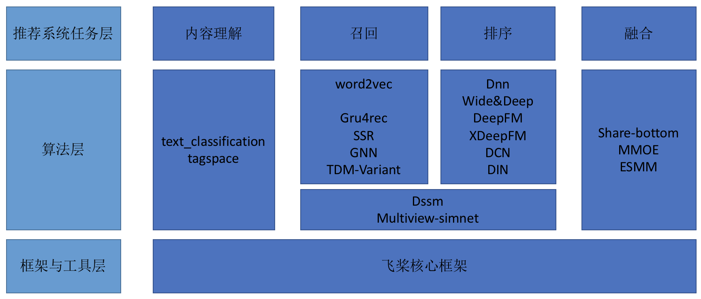

PaddleRec
=========

个性化推荐
-------

推荐系统在当前的互联网服务中正在发挥越来越大的作用，目前大部分电子商务系统、社交网络，广告推荐，搜索引擎，信息流，都不同程度的使用了各种形式的个性化推荐技术，帮助用户快速找到他们想要的信息。

在工业可用的推荐系统中，推荐策略一般会被划分为多个模块串联执行。以新闻推荐系统为例，存在多个可以使用深度学习技术的环节，例如新闻的内容理解--标签标注，个性化新闻召回，个性化匹配与排序，融合等。PaddlePaddle对推荐算法的训练提供了完整的支持，并提供了多种模型配置供用户选择。

PaddleRec全景图：

| 任务场景                  |                        模型                        |                             简介                             |
| :------------------------:| :------------------------------------------------: | :----------------------------------------------------------: |
| 内容理解                  | [TagSpace](https://github.com/PaddlePaddle/models/tree/develop/PaddleRec/tagspace) |Tagspace模型学习文本及标签的embedding表示，应用于工业级的标签推荐，具体应用场景有feed新闻标签推荐。|
| 内容理解                  | [TextClassification](https://github.com/PaddlePaddle/models/tree/develop/PaddleRec/text_classification) |文本分类，具体应用场景有feed新闻标签分类。|
| 召回                      | [Word2Vec](https://github.com/PaddlePaddle/models/tree/develop/PaddleRec/word2vec) |训练得到词的向量表示、广泛应用于NLP、推荐等任务场景。 |
| 召回                      | [GraphNeuralNetwork](https://github.com/PaddlePaddle/models/tree/develop/PaddleRec/gnn) |SR-GNN，全称为Session-based Recommendations with Graph Neural Network（GNN）。使用GNN进行会话序列建模。 |
| 召回                      | [TDM](https://github.com/PaddlePaddle/models/tree/develop/PaddleRec/tdm) |全称为Tree-based Deep Model for Recommender Systems。层次化建模及检索 |
| 召回                      | [GRU4Rec](https://github.com/PaddlePaddle/models/tree/develop/PaddleRec/gru4rec) |Session-based 推荐, 首次将RNN（GRU）运用于session-based推荐，核心思想是在一个session中，用户点击一系列item的行为看做一个序列，用来训练RNN模型 |
| 召回                      | [SequenceSemanticRetrieval](https://github.com/PaddlePaddle/models/tree/develop/PaddleRec/ssr) |解决了 GRU4Rec 模型无法预测训练数据集中不存在的项目，比如新闻推荐的问题。它由两个部分组成：一个是匹配模型部分，另一个是检索部分  |
| 匹配                      | [Multiview-Simnet](https://github.com/PaddlePaddle/models/tree/develop/PaddleRec/multiview_simnet) |多视角Simnet模型是可以融合用户以及推荐项目的多个视角的特征并进行个性化匹配学习的一体化模型。这类模型在很多工业化的场景中都会被使用到，比如百度的Feed产品中 |
| 匹配                      | [DSSM](https://github.com/PaddlePaddle/models/tree/develop/PaddleRec/dssm) |全称：Deep Structured Semantic Model深度语义匹配模型 |
| 排序                      | [DNN](https://github.com/PaddlePaddle/models/tree/develop/PaddleRec/ctr/cnn) |经典的CTR预估算法。|
| 排序                      | [Wide_Deep](https://github.com/PaddlePaddle/models/tree/develop/PaddleRec/ctr/wide_deep) |经典的CTR预估算法。|
| 排序                      | [DeepFM](https://github.com/PaddlePaddle/models/tree/develop/PaddleRec/ctr/deepfm) |DeepFM，全称Factorization-Machine based Neural Network。经典的CTR预估算法，网络由DNN和FM两部分组成。 |
| 排序                      | [XDeepFM](https://github.com/PaddlePaddle/models/tree/develop/PaddleRec/ctr/xdeepfm) |xDeepFM，全称extreme Factorization Machine。对DeepFM和DCN的改进，提出CIN（Compressed Interaction Network），使用vector-wise等级的显示特征交叉。 |
| 排序                      | [DCN](https://github.com/PaddlePaddle/models/tree/develop/PaddleRec/ctr/dcn) |全称Deep & Cross Network。提出一种新的交叉网络（cross network），在每个层上明确地应用特征交叉。  |
| 排序                      | [DeepInterestNetwork](https://github.com/PaddlePaddle/models/tree/develop/PaddleRec/ctr/din) |DIN，全称为Deep Interest Network。特点为对历史序列建模的过程中结合了预估目标的信息。  |
| 融合-多任务               | [ESMM](https://github.com/PaddlePaddle/models/tree/develop/PaddleRec/multi_task/esmm) |ESMM，全称为Entire Space Multi-task Model。提出一种新的CVR预估模型。  |
| 融合-多任务               | [Share_bottom](https://github.com/PaddlePaddle/models/tree/develop/PaddleRec/multi_task/share_bottom) |多任务学习的基本框架，其特点是对于不同的任务，底层的参数和网络结构是共享的。  |
| 融合-多任务               | [MMoE](https://github.com/PaddlePaddle/models/tree/develop/PaddleRec/multi_task/mmoe) |MMOE, 全称为Multi-grate Mixture-of-Experts，可以刻画任务相关性。  |
