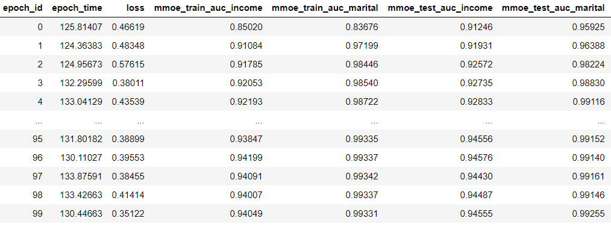

# MMOE

 以下是本例的简要目录结构及说明： 

```
├── README.md            # 文档
├── mmoe_train.py        # mmoe模型脚本
├── utils                # 通用函数
├── args                 # 参数脚本
├── create_data.sh       # 生成训练数据脚本
├── data_preparation.py  # 数据预处理脚本
├── train_gpu.sh		 # gpu训练脚本
├── train_cpu.sh		 # cpu训练脚本
```

## 简介

多任务模型通过学习不同任务的联系和差异，可提高每个任务的学习效率和质量。多任务学习的的框架广泛采用shared-bottom的结构，不同任务间共用底部的隐层。这种结构本质上可以减少过拟合的风险，但是效果上可能受到任务差异和数据分布带来的影响。  论文[Modeling Task Relationships in Multi-task Learning with Multi-gate Mixture-of-Experts]( https://www.kdd.org/kdd2018/accepted-papers/view/modeling-task-relationships-in-multi-task-learning-with-multi-gate-mixture- )中提出了一个Multi-gate Mixture-of-Experts(MMOE)的多任务学习结构。MMOE模型刻画了任务相关性，基于共享表示来学习特定任务的函数，避免了明显增加参数的缺点。 

我们在Paddlepaddle定义MMOE的网络结构，在开源数据集Census-income Data上实现和论文效果对齐。本项目支持GPU和CPU两种单机训练环境。


## 数据下载及预处理

数据地址： [Census-income Data](https://archive.ics.uci.edu/ml/datasets/Census-Income+(KDD) )

数据解压后， 在create_data.sh脚本文件中添加文件的路径，并运行脚本。

```sh
mkdir data/data24913/train_data 		#新建训练数据目录
mkdir data/data24913/test_data			#新建测试数据目录
mkdir data/data24913/validation_data 	#新建验证数据目录

train_path="data/data24913/census-income.data" 			#原始训练数据路径
test_path="data/data24913/census-income.test" 			#原始测试数据路径
train_data_path="data/data24913/train_data/" 			#处理后训练数据路径
test_data_path="data/data24913/test_data/"				#处理后测试数据路径
validation_data_path="data/data24913/validation_data/"	#处理后验证数据路径

python data_preparation.py --train_path ${train_path} \
                           --test_path ${test_path} \
                           --train_data_path ${train_data_path}\
                           --test_data_path ${test_data_path}\
                           --validation_data_path ${validation_data_path}
```

## 环境

 PaddlePaddle 1.7.0 

 python3.7 

## 单机训练

GPU环境

在train_gpu.sh脚本文件中设置好数据路径、参数。

```sh
python train_mmoe.py  --use_gpu True\ #使用gpu训练
                      --train_path data/data24913/train_data/\ #训练数据路径
                      --test_path data/data24913/test_data/	\ #测试数据路径
                      --batch_size 32\ #设置batch_size大小
                      --expert_num 8\ #设置expert数量
                      --gate_num 2\ #设置gate数量
                      --epochs 400 #设置epoch轮次
```

修改脚本的可执行权限并运行

```
./train_gpu.sh
```

CPU环境

在train_cpu.sh脚本文件中设置好数据路径、参数。

```sh
python train_mmoe.py  --use_gpu False\ #使用cpu训练
                      --train_path data/data24913/train_data/\ #训练数据路径
                      --test_path data/data24913/test_data/\ #测试数据路径
                      --batch_size 32\ #设置batch_size大小
                      --expert_num 8\ #设置expert数量
                      --gate_num 2\ #设置gate数量
                      --epochs 400 #设置epoch轮次
```

修改脚本的可执行权限并运行

```
./train_cpu.sh
```


## 预测

本模型训练和预测交替进行，运行train_mmoe.py 即可得到预测结果

## 模型效果

epoch设置为100的训练和测试效果如下：



