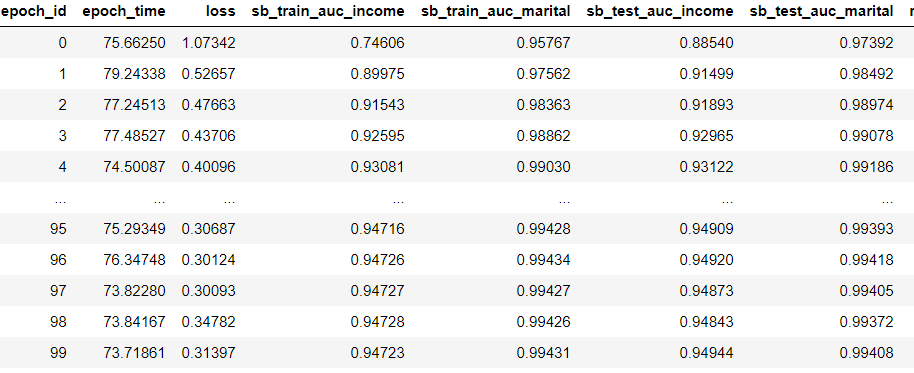
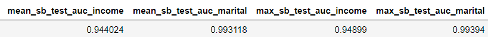

# Share_bottom

 以下是本例的简要目录结构及说明： 

```
├── README.md # 文档
├── share_bottom.py # mmoe模型脚本
├── utils # 通用函数
├── args # 参数脚本
├── create_data.sh # 生成训练数据脚本
├── data_preparation.py # 数据预处理脚本
├── train_gpu.sh # gpu训练脚本
├── train_cpu.sh # cpu训练脚本
```

## 简介

share_bottom是多任务学习的基本框架，其特点是对于不同的任务，底层的参数和网络结构是共享的，这种结构的优点是极大地减少网络的参数数量的情况下也能很好地对多任务进行学习，但缺点也很明显，由于底层的参数和网络结构是完全共享的，因此对于相关性不高的两个任务会导致优化冲突，从而影响模型最终的结果。后续很多Neural-based的多任务模型都是基于share_bottom发展而来的，如MMOE等模型可以改进share_bottom在多任务之间相关性低导致模型效果差的缺点。

我们在Paddlepaddle实现share_bottom网络结构，并在开源数据集Census-income Data上验证模型效果。本项目支持GPU和CPU两种单机训练环境。


## 数据下载及预处理

数据地址： [Census-income Data](https://archive.ics.uci.edu/ml/datasets/Census-Income+(KDD) )

数据解压后， 在create_data.sh脚本文件中添加文件的路径，并运行脚本。

```sh
mkdir data/data24913/train_data 		#新建训练数据目录
mkdir data/data24913/test_data			#新建测试数据目录
mkdir data/data24913/validation_data 	#新建验证数据目录

train_path="data/data24913/census-income.data" 			#原始训练数据路径
test_path="data/data24913/census-income.test" 			#原始测试数据路径
train_data_path="data/data24913/train_data/" 			#处理后训练数据路径
test_data_path="data/data24913/test_data/"				#处理后测试数据路径
validation_data_path="data/data24913/validation_data/"	#处理后验证数据路径

python data_preparation.py --train_path ${train_path} \
                           --test_path ${test_path} \
                           --train_data_path ${train_data_path}\
                           --test_data_path ${test_data_path}\
                           --validation_data_path ${validation_data_path}
```

## 环境

 PaddlePaddle 1.7.0 

 python3.7 

## 单机训练

GPU环境

在train_gpu.sh脚本文件中设置好数据路径、参数。

```sh
python share_bottom.py  --use_gpu True\  #使用gpu训练
                        --train_path data/data24913/train_data/\  #训练数据路径
                        --test_path data/data24913/test_data/\  #测试数据路径
                        --batch_size 32\  #设置batch_size大小
                        --feature_size 499\  #设置特征维度
                        --bottom_size 117\  #设置bottom网络大小
                        --tower_nums 2\  #设置tower数量
                        --tower_size 8\  #设置tower网络大小
                        --epochs 400  #设置epoch轮次
```

修改脚本的可执行权限并运行

```
./train_gpu.sh
```

CPU环境

在train_cpu.sh脚本文件中设置好数据路径、参数。

```sh
python share_bottom.py  --use_gpu False\  #使用cpu训练
                        --train_path data/data24913/train_data/\  #训练数据路径
                        --test_path data/data24913/test_data/\  #测试数据路径
                        --batch_size 32\  #设置batch_size大小
                        --feature_size 499\  #设置特征维度
                        --bottom_size 117\  #设置bottom网络大小
                        --tower_nums 2\  #设置tower数量
                        --tower_size 8\  #设置tower网络大小
                        --epochs 400  #设置epoch轮次
```

修改脚本的可执行权限并运行

```
./train_cpu.sh
```


## 预测

本模型训练和预测交替进行，运行share_bottom.py即可得到预测结果

## 模型效果

epoch设置为100的训练和测试效果如下：



