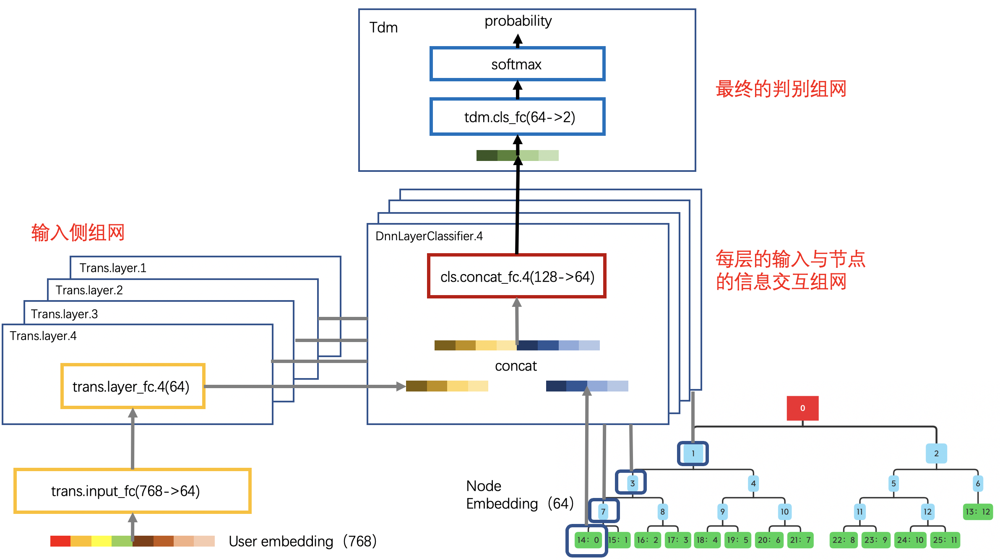
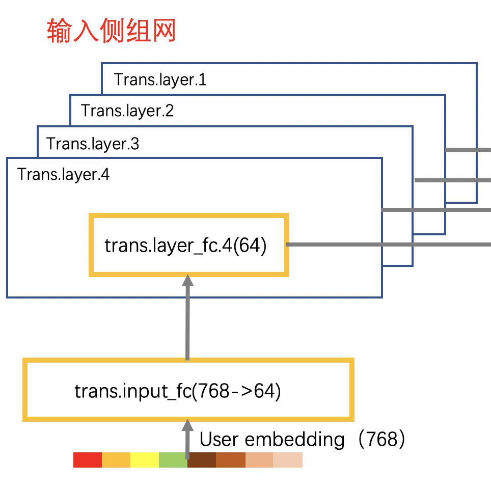
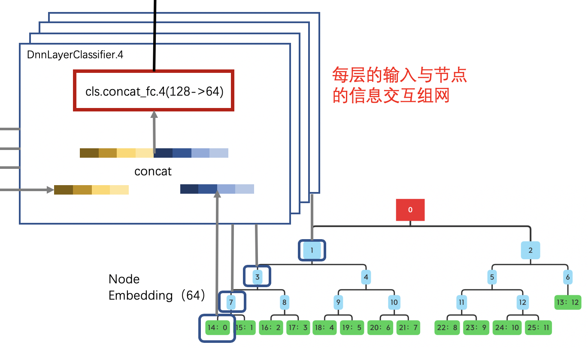

# Paddle-TDM-DEMO

本代码仅作tdm组网示例，使用fake数据集，用于快速调研paddle-tdm。

## 运行环境要求
- 目前仅支持Linux，如：`unbuntu`及`CentOS`
- 目前仅支持python版本`2.7`
- 请确保您的paddle版本高于`1.7.2`，可以利用pip升级您的paddle版本


## 树结构的准备
### 名词概念

为防止概念混淆，让我们明确tdm中名词的概念：

<p align="center">

<p>

- **item**：具有实际物理含义，是我们希望通过tdm检索最后得到的结果，如一个商品，一篇文章，一个关键词等等，在tdm模型中，item位于树的叶子节点。item有其自身的ID，我们姑且称之为 `item_id`。
- **节点(node)**：tdm树的任意节点。我们完成聚类后，会生成一颗树，树的叶子节点对应着item。而非叶子节点，则是一种类别上的概括，从大方向的兴趣，不断细分到小方向的兴趣。我们希望这棵树的结构满足最大堆树的性质。同样，节点也有其自身的ID，我们称之为node_id。如上图，最左下方的节点，它的node_id是14，而对应的item_id是0.
- **Node-Embedding**：注意，此处的Embedding，并非我们已有的item-embedding，而是构建完成的树的节点对应的Embedding，由item-embedding通过规则生成，是我们的网络主要训练的目标。ID范围为所有0->节点数-1。我们同时也需准备一个映射表，来告诉模型，item_id到node_id的映射关系。
- **Travel**：是指叶子节点从root开始直到其自身的遍历路径，如上图，14号节点的Travel：0->1->3->7->14
- **Layer**：指树的层，如上图，共有4层。
  
> Paddle-TDM在训练时，不会改动树的结构，只会改动Node-Embedding。


### 树的准备流程

让我们以上图给出的简单树结构为例，来介绍TDM的模型准备流程。假设我们已经完成了树的聚类，并得到了如上图所示的树结构：

- 问题一：叶子节点的Embedding值是多少？答：叶子节点的node-embedding与对应的item的embedding值一致
- 问题二：非叶子节点的Embedding值是多少？答：非叶子节点的Embedding值初始化目前有两种方案：1、随机初始化。2、使用其子节点的emb均值。
- 问题三：树一定要求二叉树吗？答：没有这样的硬性要求。
- 问题四：若有item不在最后一层，树不平衡怎么办？答：树尽量平衡，不在最后一层也没有关系，我们可以通过其他方式让网络正常训练。
- 问题五：是每个用户都有一棵树，还是所有用户共享一颗树？答：只有一棵树，通过每一层的模型牵引节点的emb，使其尽量满足最大堆性质。

完成以上步骤，我们已经得到了树的结构，与每个节点的全部信息，现在让我们将其转换为Paddle-TDM训练所需的格式。我们需要产出四个数据：
#### Layer_list：记录了每一层都有哪些节点。训练用
```bash
# Layer list
1,2
3,4,5,6
7,8,9,10,11,12,13
14,15,16,17,18,19,20,21,22,23,24,25
```
#### Travel_list：记录每个叶子节点的Travel路径。训练用
```bash
# Travel list
1,3,7,14
1,3,7,15
1,3,8,16
...
2,5,12,25
2,6,13,0
```

#### Tree_Info：记录了每个节点的信息，主要为：是否是item/item_id，所在层级，父节点，子节点。检索用
```bash
# Tree info
0,0,0,1,2
0,1,0,3,4
0,1,0,5,6
0,2,1,7,8
...
10,4,12,0,0
11,4,12,0,0
```

#### Tree_Embedding：记录所有节点的Embedding表，格式如正常表。训练及检索用

以上数据设计的初衷是为了高效，在paddle网络中以Tensor的形式参与训练，运行时，不再需要进行频繁的树的结构的遍历，直接根据已有信息进行快速查找与训练。以上数据可以明文保存，但最终都需要转成ndarray，参与网络的初始化。
结合示例树，数据可以组织如右，下面介绍一些细节：

- Layer list从第2（index=1）层开始即可，因为0号节点不参与训练也不参与检索；
- Travel list的按照item_id的顺序组织，如第一行对应着item_id=0的遍历信息，同样，也不需要包含0号节点；
- Travel_list每行的长度必须相等，遇到不在最后一层的item，需要padding 0 直至长度和其他item一致；
- Tree_info包含了0号节点的信息，主要考量是，当我们拿到node_id查找其信息时，可以根据id在该数据中寻找第id行；
- Tree_info各列的含义是：itme_id（若无则为0），层级Layer，父节点node_id（无则为0），子节点node_id（若无则为0，若子节点数量不满，则需要paddding 0）

## 数据准备
如前所述，若我们关心的是输入一个user emb，得到他所感兴趣的item id，那我们就准备user_emb + 正样本item的格式的数据，负采样会通过paddle的tdm_sampler op得到。数据的准备不涉及树的结构，因而可以快速复用其他任务的训练数据来验证TDM效果。

```bash
# emb(float) \t item_id (int)
-0.9480544328689575 0.8702829480171204 -0.5691063404083252 ...... -0.04391402751207352 -0.5352795124053955 -0.9972627758979797 0.9397293329238892   4690780
```

## TDM网络设计
假设输入数据是 Emb + item_id，下面让我们开始介绍一个最简单的网络设计。

<p align="center">

<p>

上图给出了一个非常简单的TDM示例网络，没有添加任何复杂的逻辑，纯用DNN实现。
TDM的组网，宏观上，可以概括为三个部分
- 第一部分，输入侧的组网，如果想要对user/query进行一些预处理，或者添加Attention结构，通常都是在这一层次实现。
- 第二部分，每层的输入与节点信息交互的组网，这一部分是将user/query的信息与node信息结合，在树的不同层下，进行不同粒度兴趣的学习。通常而言，第一部分与第二部分具有紧密的联系，可以统一为一个部分。
- 第三部分，最终的判别组网，将每层交互得到的信息进行最终的概率判决。但这一层也不是必须的，并不要求所有层的信息都经过一个统一的分类器，可以各层拥有独立的概率判决器。为了逻辑划分更加清晰，我们在示例中添加了这个层次的组网，方便您更加直观的理解tdm网络。
再次强调，该示例组网仅为展示tdm的基本运行逻辑，请基于这个框架，升级改进您自己的网络。

## TDM组网细节

### 训练组网

训练组网中需要重点关注五个部分：
1. 网络输入的定义
2. 网络中输入侧的处理逻辑
3. node的负采样组网
4. input与node的交互网络
5. 判别及loss计算组网


#### 输入的定义

首先简要介绍输入的定义：

**demo模型，假设输入为两个元素：**
> 一、user/query的emb表示，该emb应该来源于特征的组合在某个空间的映射（比如若干特征取emb后concat到一起），或其他预训练模型的处理结果（比如将明文query通过nlp预处理得到emb表示）
    
> 二、item的正样本，是发生了实际点击/购买/浏览等行为的item_id，与输入的user/query emb强相关，是我们之后通过预测想得到的结果。

在paddle组网中，我们这样定义上面两个变量：
```python
def input_data(self):
    """
    指定tdm训练网络的输入变量
    """
    input_emb = fluid.data(
        name="input_emb",
        shape=[None, self.input_embed_size],
        dtype="float32",
    )

    item_label = fluid.data(
        name="item_label",
        shape=[None, 1],
        dtype="int64",
    )

    inputs = [input_emb] + [item_label]
    return inputs
```

#### 输入侧的组网

**输入侧组网由FC层组成**
> 一、`input_fc`，主要功能是input_emb维度的压缩，只需一个fc即可。

> 二、`layer_fc`，主要功能是将input_emb映射到不同的兴趣层空间，和当层的node学习兴趣关系。有多少层，就添加多少个fc。

<p align="center">

<p>

在paddle组网中，我们这样快速实现输入侧组网：
```python
def input_trans_layer(self, input_emb):
    """
    输入侧训练组网
    """
    # 将input压缩到与node相同的维度
    input_fc_out = fluid.layers.fc(
        input=input_emb,
        size=self.node_emb_size,
        act=None,
        param_attr=fluid.ParamAttr(name="trans.input_fc.weight"),
        bias_attr=fluid.ParamAttr(name="trans.input_fc.bias"),
    )

    # 将input_emb映射到各个不同层次的向量表示空间
    input_layer_fc_out = [
        fluid.layers.fc(
            input=input_fc_out,
            size=self.node_emb_size,
            act="tanh",
            param_attr=fluid.ParamAttr(
                name="trans.layer_fc.weight." + str(i)),
            bias_attr=fluid.ParamAttr(name="trans.layer_fc.bias."+str(i)),
        ) for i in range(self.max_layers)
    ]

    return input_layer_fc_out
```

#### node的负采样组网
**tdm 负采样的核心是tdm_sampler OP**

tdm_sampler的运行逻辑如下：

1. 输入item_id，读travel_list，查表，得到该item_id对应的遍历路径（从靠近根节点的第一层一直往下直到存放该item的node）
2. 读layer_list，查表，得到每层都有哪些node
3. 循环：i = 0, 从第i层开始进行负采样
    - 在item遍历路径上的node视为正样本，`positive_node_id`由`travel_list[item_id][i]`给出，其他同层的兄弟节点视为负样本，该层节点列表由`layer_list[i]`给出，如果`positive_node_id`不在`layer_list[i]`中，会提示错误。

    - 在兄弟节点中进行随机采样，采样N个node，N由`neg_sampling_list[i]`的值决定，如果该值大于兄弟节点的数量，会提示错误。 采样结果不会重复，且不会采样到正样本。
    
    - 如果`output_positive=True`，则会同时输出正负样本，否则只输出负采样的结果
    
    - 生成该层`label`，shape与采样结果一致，正样本对应的label=1，负样本的label=0

    - 生成该层`mask`，如果树是不平衡的，则有些item不会位于树的最后一层，所以遍历路径的实际长度会比其他item少，为了tensor维度一致，travel_list中padding了0。当遇到了padding的0时，tdm_sampler也会输出正常维度的采样结果，采样结果与label都为0。为了区分这部分虚拟的采样结果与真实采样结果，会给虚拟采样结果额外设置mask=0，如果是真实采样结果mask=1
    - i += 1, 若i > layer_nums, break
4. 对输出的采样结果、label、mask进行整理：
   - 如果`output_list=False`，则会输出三个tensor(samping_result, label, mask)，shape形如`[batch_size, all_layer_sampling_nums, 1]`；
   - 若`output_list=True`，则会输出三个`list[tensor,...,tensor]`，`sampling_result_list/label_list/mask_list`，`len(list)`等于层数，将采样结果按照分属哪一层进行拆分，每个tensor的shape形如`[batch_size, layer_i_sampling_nums,1]`

```python
# 根据输入的item的正样本在给定的树上进行负采样
# sample_nodes 是采样的node_id的结果，包含正负样本
# sample_label 是采样的node_id对应的正负标签
# sample_mask 是为了保持tensor维度一致，padding部分的标签，若为0，则是padding的虚拟node_id
sample_nodes, sample_label, sample_mask = fluid.contrib.layers.tdm_sampler(
    x=item_label,
    neg_samples_num_list=self.neg_sampling_list,
    layer_node_num_list=self.layer_node_num_list,
    leaf_node_num=self.leaf_node_num,
    tree_travel_attr=fluid.ParamAttr(name="TDM_Tree_Travel"),
    tree_layer_attr=fluid.ParamAttr(name="TDM_Tree_Layer"),
    output_positive=self.output_positive,
    output_list=True,
    seed=0,
    tree_dtype='int64',
    dtype='int64'
)

# 查表得到每个节点的Embedding
sample_nodes_emb = [
    fluid.embedding(
        input=sample_nodes[i],
        is_sparse=True,
        size=[self.node_nums, self.node_emb_size],
        param_attr=fluid.ParamAttr(
            name="TDM_Tree_Emb")
    ) for i in range(self.max_layers)
]

# 此处进行reshape是为了之后层次化的分类器训练
sample_nodes_emb = [
    fluid.layers.reshape(sample_nodes_emb[i],
                            [-1, self.neg_sampling_list[i] +
                                self.output_positive, self.node_emb_size]
                            ) for i in range(self.max_layers)
]

```

#### input与node的交互网络
**交互网络由FC层组成**

主要包含两个流程：
> 一、将输入进行维度上的`expand`，与采样得到的noed数量一致（当然也可以使用其他`broadcast`的网络结构）

> 二、input_emb与node_emb进行`concat`，过FC，计算兴趣上的匹配关系

<p align="center">

<p>

在paddle的组网中，我们这样实现这一部分的逻辑：

```python
def _expand_layer(self, input_layer, node, layer_idx):
    # 扩展input的输入，使数量与node一致，
    # 也可以以其他broadcast的操作进行代替
    # 同时兼容了训练组网与预测组网
    input_layer_unsequeeze = fluid.layers.unsqueeze(
        input=input_layer, axes=[1])
    if self.is_test:
        input_layer_expand = fluid.layers.expand(
            input_layer_unsequeeze, expand_times=[1, node.shape[1], 1])
    else:
        input_layer_expand = fluid.layers.expand(
            input_layer_unsequeeze, expand_times=[1, node[layer_idx].shape[1], 1])
    return input_layer_expand

def classifier_layer(self, input, node):
    # 扩展input，使维度与node匹配
    input_expand = [
        self._expand_layer(input[i], node, i) for i in range(self.max_layers)
    ]

    # 将input_emb与node_emb concat到一起过分类器FC
    input_node_concat = [
        fluid.layers.concat(
            input=[input_expand[i], node[i]],
            axis=2) for i in range(self.max_layers)
    ]

    hidden_states_fc = [
        fluid.layers.fc(
            input=input_node_concat[i],
            size=self.node_emb_size,
            num_flatten_dims=2,
            act="tanh",
            param_attr=fluid.ParamAttr(
                name="cls.concat_fc.weight."+str(i)),
            bias_attr=fluid.ParamAttr(name="cls.concat_fc.bias."+str(i))
        ) for i in range(self.max_layers)
    ]

    # 如果将所有层次的node放到一起计算loss，则需要在此处concat
    # 将分类器结果以batch为准绳concat到一起，而不是layer
    # 维度形如[batch_size, total_node_num, node_emb_size]
    hidden_states_concat = fluid.layers.concat(hidden_states_fc, axis=1)
    return hidden_states_concat
```

#### 判别及loss计算组网

最终的判别组网会将所有层的输出打平放到一起，过`tdm.cls_fc`，再过`softmax_with_cross_entropy`层，计算cost，同时得到softmax的中间结果，计算acc或者auc。

```python
tdm_fc = fluid.layers.fc(input=layer_classifier_res,
                            size=self.label_nums,
                            act=None,
                            num_flatten_dims=2,
                            param_attr=fluid.ParamAttr(
                                name="tdm.cls_fc.weight"),
                            bias_attr=fluid.ParamAttr(name="tdm.cls_fc.bias"))

# 将loss打平，放到一起计算整体网络的loss
tdm_fc_re = fluid.layers.reshape(tdm_fc, [-1, 2])

# 若想对各个层次的loss辅以不同的权重，则在此处无需concat
# 支持各个层次分别计算loss，再乘相应的权重
sample_label = fluid.layers.concat(sample_label, axis=1)
labels_reshape = fluid.layers.reshape(sample_label, [-1, 1])

# 计算整体的loss并得到softmax的输出
cost, softmax_prob = fluid.layers.softmax_with_cross_entropy(
    logits=tdm_fc_re, label=labels_reshape, return_softmax=True)

# 通过mask过滤掉虚拟节点的loss
sample_mask = fluid.layers.concat(sample_mask, axis=1)
mask_reshape = fluid.layers.reshape(sample_mask, [-1, 1])
mask_index = fluid.layers.where(mask_reshape != 0)
mask_cost = fluid.layers.gather_nd(cost, mask_index)

# 计算该batch的均值loss，同时计算acc, 亦可在这里计算auc
avg_cost = fluid.layers.reduce_mean(mask_cost)
acc = fluid.layers.accuracy(input=softmax_prob, label=labels_reshape)
```

### 预测组网

预测的整体流程类似于beamsearch。预测组网中需要重点关注三个部分：
1. 网络输入的定义，及初始检索层的确定
2. 串行的通过各层分类器的流程
3. 每层选出topK及最终选出topK的方法

#### 网络输入

首先考虑这样一个问题，假设树是一颗十层的完全二叉树，我们要取topK=1024的召回结果，那么我们需不需要从树的第一层开始逐层计算fc与topK？答案显然是否定的，我们只需要计算最后一层的1024个节点即可。在开发的实验中，我们得到的结论是，tdm检索时，计算复杂度并不高，时间耗费中OP的调度占据了主要矛盾，通过模型裁剪，树剪枝，模型量化等都可以加快预测速度。

因此infer组网中首先考虑了跳层与剪枝的实现：我们定义了三个变量，`input_emb`,`first_layer_node`,`first_layer_node_mask`作为网络的输入。
- `input_emb`：预测时输入的user/query向量。
- `first_layer_node`：检索时的起始node_id，是变长类型。这样设置的好处是：1、可以输入某一层所有节点node_id，从而在某一层开始进行检索。2、也可以设置为特定node_id，从指定的树分枝开始检索。输入的node_id应该位于同一层。
- `first_layer_node_mask`：维度与`first_layer_node`相同，值一一对应。若node是叶子节点，则mask=1，否则设置mask=0。

在demo网络中，我们设置为从某一层的所有节点开始进行检索。paddle组网对输入定义的实现如下：
```python
def input_data(self):
    input_emb = fluid.layers.data(
        name="input_emb",
        shape=[self.input_embed_size],
        dtype="float32",
    )

    # first_layer 与 first_layer_mask 对应着infer起始的节点
    first_layer = fluid.layers.data(
        name="first_layer_node",
        shape=[1],
        dtype="int64",
        lod_level=1, #支持变长
    )

    first_layer_mask = fluid.layers.data(
        name="first_layer_node_mask",
        shape=[1],
        dtype="int64",
        lod_level=1,
    )

    inputs = [input_emb] + [first_layer] + [first_layer_mask]
    return inputs
```

确定起始层的方式比较简单，比较topK的大小与当层节点数，选取第一个节点数大于等于topK的层作为起始层，取它的节点作为起始节点。代码如下：
```python
def create_first_layer(self, args):
    """decide which layer to start infer"""
    first_layer_id = 0
    for idx, layer_node in args.layer_node_num_list:
        if layer_node >= self.topK:
            first_layer_id = idx
            break
    first_layer_node = self.layer_list[first_layer_id]
    self.first_layer_idx = first_layer_id
    return first_layer_node
```

#### 通过各层分类器的流程

tdm的检索逻辑类似beamsearch，简单来说：在每一层计算打分，得到topK的节点，将这些节点的孩子节点作为下一层的输入，如此循环，得到最终的topK。但仍然有一些需要注意的细节，下面将详细介绍。

- 问题一：怎么处理`input_emb`？
  
  - input_emb过`input_fc`，检索中，只需过一次即可:
  ```python
  nput_trans_emb = self.input_trans_net.input_fc_infer(input_emb)
  ```
  - 在通过每一层的分类器之前，过`layer_fc`，指定`layer_idx`，加载对应层的分类器，将输入映射到不同的兴趣粒度空间
  ```python
  input_fc_out = self.input_trans_net.layer_fc_infer(
                input_trans_emb, layer_idx)
  ```

- 问题二：怎样实现beamsearch？

    我们通过在每一层计算打分，计算topK并拿到对应的孩子节点，for循环这个过程实现beamsearch。
    ```python
    for layer_idx in range(self.first_layer_idx, self.max_layers):
        # 确定当前层的需要计算的节点数
        if layer_idx == self.first_layer_idx:
            current_layer_node_num = len(self.first_layer_node)
        else:
            current_layer_node_num = current_layer_node.shape[1] * \
                current_layer_node.shape[2]

        current_layer_node = fluid.layers.reshape(
            current_layer_node, [self.batch_size, current_layer_node_num])
        current_layer_child_mask = fluid.layers.reshape(
            current_layer_child_mask, [self.batch_size, current_layer_node_num])

        # 查当前层node的emb
        node_emb = fluid.embedding(
            input=current_layer_node,
            size=[self.node_nums, self.node_embed_size],
            param_attr=fluid.ParamAttr(name="tdm.node_emb.weight"))

        input_fc_out = self.input_trans_net.layer_fc_infer(
            input_trans_emb, layer_idx)

        # 过每一层的分类器
        layer_classifier_res = self.layer_classifier.classifier_layer_infer(input_trans_emb, node_emb, layer_idx)

        # 过最终的判别分类器
        tdm_fc = fluid.layers.fc(input=layer_classifier_res,
                                    size=self.label_nums,
                                    act=None,
                                    num_flatten_dims=2,
                                    param_attr=fluid.ParamAttr(
                                        name="tdm.cls_fc.weight"),
                                    bias_attr=fluid.ParamAttr(name="tdm.cls_fc.bias"))

        prob = fluid.layers.softmax(tdm_fc)
        positive_prob = fluid.layers.slice(
            prob, axes=[2], starts=[1], ends=[2])
        prob_re = fluid.layers.reshape(
            positive_prob, [self.batch_size, current_layer_node_num])

        # 过滤掉padding产生的无效节点（node_id=0）
        node_zero_mask = fluid.layers.cast(current_layer_node, 'bool')
        node_zero_mask = fluid.layers.cast(node_zero_mask, 'float')
        prob_re = prob_re * node_zero_mask

        # 在当前层的分类结果中取topK，并将对应的score及node_id保存下来
        k = self.topK
        if current_layer_node_num < self.topK:
            k = current_layer_node_num
        _, topk_i = fluid.layers.topk(prob_re, k)

        # index_sample op根据下标索引tensor对应位置的值
        # 若paddle版本>2.0，调用方式为paddle.index_sample
        top_node = fluid.contrib.layers.index_sample(
            current_layer_node, topk_i)
        prob_re_mask = prob_re * current_layer_child_mask  # 过滤掉非叶子节点
        topk_value = fluid.contrib.layers.index_sample(
            prob_re_mask, topk_i)
        node_score.append(topk_value)
        node_list.append(top_node)

        # 取当前层topK结果的孩子节点，作为下一层的输入
        if layer_idx < self.max_layers - 1:
            # tdm_child op 根据输入返回其 child 及 child_mask
            # 若child是叶子节点，则child_mask=1，否则为0
            current_layer_node, current_layer_child_mask = \
                fluid.contrib.layers.tdm_child(x=top_node,
                                            node_nums=self.node_nums,
                                            child_nums=self.child_nums,
                                            param_attr=fluid.ParamAttr(
                                                    name="TDM_Tree_Info"),
                                            dtype='int64')
    ```

- 问题三：怎样得到最终的topK个叶子节点？

    在过每层分类器的过程中，我们保存了每层的topk节点，并将非叶子节点的打分置为了0，保存在`node_score`与`node_list`中。显然，我们需要召回的是topk个叶子节点，对所有层的叶子节点打分再计算一次topk，拿到结果。

    ```python
    total_node_score = fluid.layers.concat(node_score, axis=1)
    total_node = fluid.layers.concat(node_list, axis=1)

    # 考虑到树可能是不平衡的，计算所有层的叶子节点的topK
    res_score, res_i = fluid.layers.topk(total_node_score, self.topK)
    res_layer_node = fluid.contrib.layers.index_sample(total_node, res_i)
    res_node = fluid.layers.reshape(res_layer_node, [-1, self.topK, 1])
    ```

- 问题四：现在拿到的是node_id，怎么转成item_id？

    如果有额外的映射表，可以将node_id转为item_id，但也有更方便的方法。在生成`tree_info`时，我们保存了每个node_id相应的item_id信息，直接使用它，将node_id对应的tree_info行的数据的第零维的item_id切出来。

    ```python
    # 利用Tree_info信息，将node_id转换为item_id
    tree_info = fluid.default_main_program().global_block().var("TDM_Tree_Info")
    res_node_emb = fluid.layers.gather_nd(tree_info, res_node)

    res_item = fluid.layers.slice(
        res_node_emb, axes=[2], starts=[0], ends=[1])
    res_item_re = fluid.layers.reshape(res_item, [-1, self.topK])
    ```
以上，我们便完成了训练及预测组网的全部部分。

## TDM-Demo运行细节

### 运行流程

tdm-demo是使用paddle组网实现的，运行流程与普通的paddle运行流程一致。分为以下步骤：

1. 组网
2. 定义数据读取方式
3. 设置optimizer
4. 设置执行器
5. 初始化模型参数/加载保存的参数
6. 运行训练网络
7. 保存训练的结果

```python
# 组网
tdm_model = TdmTrainNet(args)
inputs = tdm_model.input_data()
avg_cost, acc = tdm_model.tdm(inputs)

# 定义数据读取方式
dataset = get_dataset(inputs, args)

# 设置optimizer
optimizer = fluid.optimizer.AdamOptimizer(
        learning_rate=args.learning_rate,
        lazy_mode=True)
optimizer.minimize(avg_cost)

# 设置执行器
place = fluid.CPUPlace()
exe = fluid.Executor(place)

# 初始化模型参数/加载保存的参数
exe.run(fluid.default_startup_program())
# args.load_model:
# ......

# 运行训练网络
for epoch in range(args.epoch_num):
    exe.train_from_dataset(
        program=fluid.default_main_program(),
        dataset=dataset,
        fetch_list=[acc, avg_cost],
        fetch_info=["Epoch {} acc".format(
            epoch), "Epoch {} loss".format(epoch)],
        print_period=10,
        debug=False,
    )

# 保存训练结果
model_path = os.path.join(args.model_files_path, "epoch_" + str(epoch))
fluid.io.save_persistables(executor=exe, dirname=model_path)

```


### 模型的加载与保存

我们在建树时，生成了树结构相应的四个文件。它们以明文或者npy的格式保存，在每次debug或训练时，读取的成本极高，可不可以只读取一次？答案是可以的，在第一次运行时，将他们保存为paddle的二进制模型文件，之后直接加载这个初始化的paddle模型即可。开发测试大数据模型时，往往可以将训练启动时间从10分钟以上压缩到1分钟以内。

通过启动命令的`args.load_model`控制是否使用paddle的二进制模型启动：
```python
if args.load_model:
    # 从paddle二进制模型加载参数
    path = args.init_model_files_path
    fluid.io.load_persistables(
        executor=exe,
        dirname=path,
        main_program=fluid.default_main_program())
    lr = fluid.global_scope().find_var("learning_rate_0").get_tensor()
    lr.set(np.array(args.learning_rate).a    stype('float32'), place)
    logger.info("Load persistables from \"{}\"".format(path))
else:
    # 将明文树结构及数据，set到组网中的Variale中
    # 不使用NumpyInitialize方法是考虑到树结构相关数据size过大，有性能风险
    Numpy_model = {}
    Numpy_model['TDM_Tree_Travel'] = tdm_model.tdm_param_prepare_dict['travel_array']
    Numpy_model['TDM_Tree_Layer'] = tdm_model.tdm_param_prepare_dict['layer_array']
    Numpy_model['TDM_Tree_Info'] = tdm_model.tdm_param_prepare_dict['info_array']
    Numpy_model['TDM_Tree_Emb'] = tdm_model.tdm_param_prepare_dict['emb_array']
    for param_name in Numpy_model:
        param_t = fluid.global_scope().find_var(param_name).get_tensor()
        if param_name == 'TDM_Tree_Emb':
            param_t.set(Numpy_model[str(param_name)
                                    ].astype('float32'), place)
        else:
            param_t.set(Numpy_model[str(param_name)
                                    ].astype('int32'), place)

if args.save_init_model or not args.load_model:
    logger.info("Begin Save Init model.")
    model_path = os.path.join(args.model_files_path, "init_model")
    fluid.io.save_persistables(executor=exe, dirname=model_path)
    logger.info("End Save Init model.")
```

> 为什么每次加载模型手动Set `learning rate`？
> 
> 学习率在paddle的组网中，是以一个`persistable=Ture`的长期变量储存在模型的Variable scope里的。每次使用load_persistables加载模型时，也会使用加载的模型的学习率覆盖本地模型的默认学习率，换言之，加载init_model以后，学习率也是保存init_model时的学习率。对模型的调试会产生不必要的影响，为了保证网络训练如预期，需要这样的手动set步骤。

### demo的训练运行方法
- 运行脚本为run_train.sh

    ```bash
    sh run_train.sh
    ```
- 若模型是ndarray(刚完成树的构建)，则将启动命令中的save_init_model设置为1
- 若模型事paddle模型（之前保存过初始化模型），则启动命令load_model应设置为1
- 运行前，需仔细检查：`thirdparty_path`, `train_data_path`,以及模型启动地址是否正确
- 运行前，需仔细检查：模型超参是否匹配，如学习率，线程，batch_size等

### demo的预测运行方法
- 运行脚本为run_infer.sh

    ```bash
    sh run_infer.sh
    ```
- 运行前，需仔细检查：`thirdparty_path`, `test_data_path`,以及模型启动地址是否正确