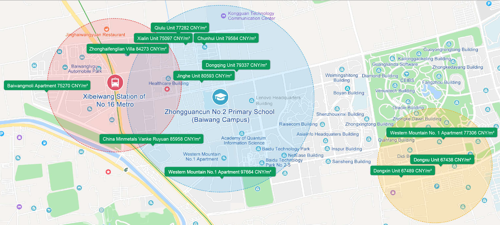
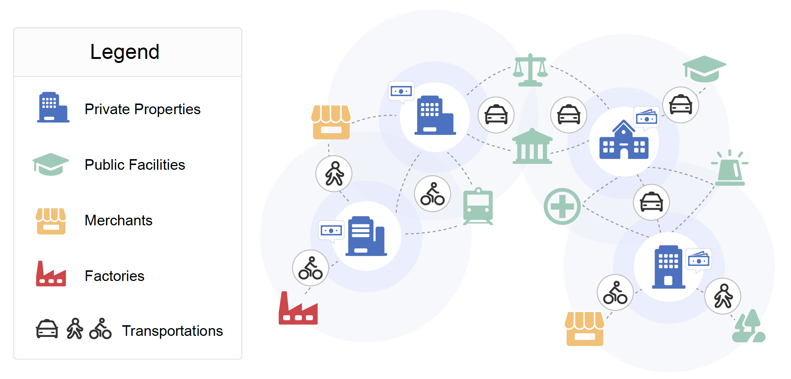

# MONOPOLY

## 任务说明(Introduction)

互联网地图，作为一个经典的时空大数据平台，承载了大量有关固定资产（Point-of-Interest，简称POI)、出行轨迹、用户画像、地点查询等相关信息。



Monopoly是一个实用的POI商业智能算法，能够利用少量的房产价格，对大量其他的固定资产进行价值估计。
该算法全面适配MapReduce的分布式计算框架，能够快速用于工业部署。



这个有趣的想法最初来源于经典的棋盘类游戏“大富翁”，因此我们也以同样的英文名来命名这个算法。

1）Monopoly能够帮助我们发现：各个城市居民对于不同类型公共资产价格评估的偏好，并且给出量化分析。

2）Monopoly能够帮助我们探索：不同城市居民对于私有房价评估的偏好，并且给出量化分析。

3）Monopoly能够帮助我们确定：评估一个固定资产价格需要考虑的空间范围。

The value assessment of private properties is an attractive but challenging task which is widely concerned by a majority of people around the world. A prolonged topic among us is how much is my house worth?. To answer this question, most experienced agencies would like to price a property given the factors of its attributes as well as the demographics and the public facilities around it. However, no one knows the exact prices of these factors, especially the values of public facilities which may help assess private properties.  
We introduce our newly launched project Monopoly (named after a classic board game) in which we propose a distributed approach for revaluing private properties by learning to price public facilities (such as hospitals, schools, and metros) with the large-scale urban data we have accumulated via Baidu Maps. To be specific, our method organizes many points of interest (POIs) into an undirected weighted graph and formulates multiple factors including the virtual prices of surrounding public facilities as adaptive variables to parallelly estimate the housing prices we know. Then the prices of both public facilities and private properties can be iteratively updated according to the loss of prediction until convergence. 
We have conducted extensive experiments with the large-scale urban data of several metropolises in China. Results show that our approach outperforms several mainstream methods with significant margins. Further insights from more in-depth discussions demonstrate that the ''Monopoly'' is an innovative application in the interdisciplinary field of business intelligence and urban computing, and it will be beneficial to tens of millions of our users for investments and to the governments for urban planning as well as taxation. 

## 安装说明(Install Guide)

### 环境准备

1. paddle安装

    本项目依赖于Paddle Fluid 1.6.1 及以上版本，请参考[安装指南](http://www.paddlepaddle.org/#quick-start)进行安装

2. 下载代码

    克隆数据集代码库到本地, 本代码依赖[Paddle-EPEP框架](https://github.com/PaddlePaddle/epep)
    ```
    git clone https://github.com/PaddlePaddle/epep.git
    cd epep
    git clone https://github.com/PaddlePaddle/models.git
    ln -s models/PaddleST/Research/CIKM2019-MONOPOLY/conf/house_price conf/house_price
    ln -s models/PaddleST/Research/CIKM2019-MONOPOLY/datasets/house_price datasets/house_price
    ln -s models/PaddleST/Research/CIKM2019-MONOPOLY/nets/house_price nets/house_price
    ```

3. 环境依赖

    python版本依赖python 2.7


### 实验说明

1. 数据准备

    TODO
    ```
    #script to download 
    ```

2. 模型训练

    ```
    sh run.sh -c conf/house_price/house_price.local.conf -m train [ -g 0 ]
    ```

3. 模型评估
    ```
    c=bj
    sh run.sh -c conf/house_price/house_price.local.conf -m pred > $c.out
    cat $c.out | grep ^qid | python utils/calc_metric.py
    ```

## 论文下载(Paper Download)

Please feel free to review our paper :)

链接(link): [https://dl.acm.org/citation.cfm?id=3357810] (https://dl.acm.org/citation.cfm?id=3357810)


## 引用格式(Paper Citation)

[Miao Fan](https://sites.google.com/view/miao-fan/home), [Jizhou Huang](http://ir.hit.edu.cn/~huangjizhou/), An Zhuo, Ying Li, Ping Li, Haifeng Wang. MONOPOLY: Learning to Price Public Facilities for Revaluing Private Properties with Large-scale Urban Data, The 28th International Conference on Information and Knowledge Management (CIKM'19), pp. 2655-2663. [bib](https://www.google.com/url?q=https%3A%2F%2Fdl.acm.org%2Fdownformats.cfm%3Fid%3D3357810%26parent_id%3D3357384%26expformat%3Dbibtex&sa=D&sntz=1&usg=AFQjCNHOdOf-kL5u6Wugkt2KpcWR_t41Ow)


