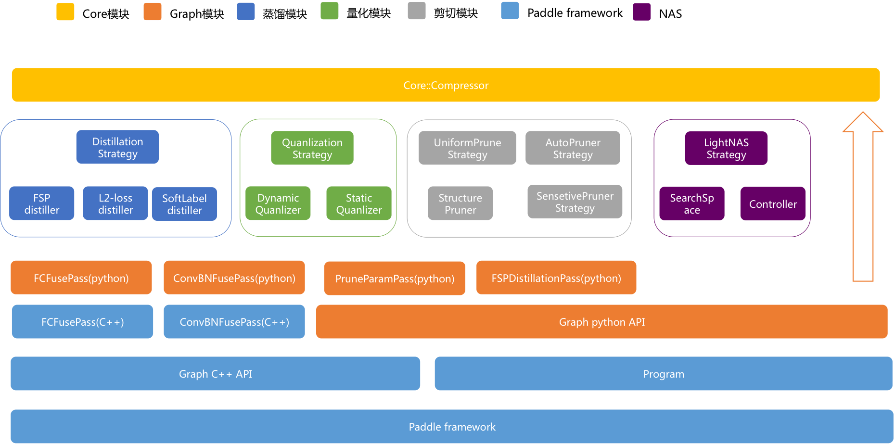

  <h3>
    <a href="docs/tutorial.md">
      算法原理介绍
    </a>
     | 
    <a href="docs/usage.md">
      使用文档
    </a>
     | 
    <a href="docs/demo.md">
      示例文档
    </a>
     | 
    <a href="docs/model_zoo.md">
      Model Zoo
    </a>
  </h3>

---
# PaddleSlim模型压缩工具库

PaddleSlim是PaddlePaddle框架的一个子模块。PaddleSlim首次在PaddlePaddle 1.4版本中发布。在PaddleSlim中，实现了目前主流的网络剪枝、量化、蒸馏三种压缩策略，主要用于压缩图像领域模型。在后续版本中，会添加更多的压缩策略，以及完善对NLP领域模型的支持。

## 目录
- [特色](#特色)
- [架构介绍](#架构介绍)
- [功能列表](#功能列表)
- [实验结果与ModelZoo](#简要实验结果)
- [模型导出格式](#模型导出格式)

## 主要特点

Paddle-Slim工具库有以下特点：

###  接口简单

- 以配置文件方式集中管理可配参数，方便实验管理
- 在普通模型训练脚本上，添加极少代码即可完成模型压缩

详见：[使用示例](docs/demo.md)

### 效果好

- 对于冗余信息较少的MobileNetV1模型，卷积核剪切策略依然可缩减模型大小，并保持尽量少的精度损失。
- 蒸馏压缩策略可明显提升原始模型的精度。
- 量化训练与蒸馏的组合使用，可同时做到缩减模型大小和提升模型精度。

详见：[效果数据与ModelZoo](docs/model_zoo.md)

### 功能更强更灵活

- 剪切压缩过程自动化
- 剪切压缩策略支持更多网络结构
- 蒸馏支持多种方式，用户可自定义组合loss
- 支持快速配置多种压缩策略组合使用

详见：[使用说明](docs/usage.md)

## 架构介绍

这里简要介绍模型压缩工具实现的整体原理，便于理解使用流程。
**图 1**为模型压缩工具的架构图，从上到下为API依赖关系。蒸馏模块、量化模块和剪切模块都间接依赖底层的paddle框架。目前，模型压缩工具作为了PaddlePaddle框架的一部分，所以已经安装普通版本paddle的用户需要重新下载安装支持模型压缩功能的paddle，才能使用压缩功能。

  
<strong>图 1</strong>

如**图 1**所示，最上层的紫色模块为用户接口，在Python脚本中调用模型压缩功能时，只需要构造一个Compressor对象即可，在[使用文档](docs/usage.md)中会有详细说明。

我们将每个压缩算法称为压缩策略，在迭代训练模型的过程中调用用户注册的压缩策略完成模型压缩，如**图2**所示。其中，模型压缩工具封装好了模型训练逻辑，用户只需要提供训练模型需要的网络结构、数据、优化策略（optimizer）等，在[使用文档](docs/usage.md)会对此详细介绍。

  
<strong>图 2</strong>

## 功能列表

### 剪切

- 支持敏感度和uniform两种方式
- 支持VGG、ResNet、MobileNet等各种类型的网络
- 支持用户自定义剪切范围

### 量化训练

- 支持动态和静态两种量化训练方式
  - 动态策略: 在推理过程中，动态统计激活的量化参数。
  - 静态策略: 在推理过程中，对不同的输入，采用相同的从训练数据中统计得到的量化参数。
- 支持对权重全局量化和Channel-Wise量化
- 支持以兼容Paddle Mobile的格式保存模型

### 蒸馏

- 支持在teacher网络和student网络任意层添加组合loss
  - 支持FSP loss
  - 支持L2 loss
  - 支持softmax with cross-entropy loss

### 其它功能

- 支持配置文件管理压缩任务超参数
- 支持多种压缩策略组合使用
- 蒸馏和剪切压缩过程支持checkpoints功能

## 简要实验结果

本节列出了PaddleSlim模型压缩工具库的一些实验结果，更多实验数据和预训练模型的下载，请参考：[详细实验结果与ModelZoo](docs/model_zoo.md)

### 量化训练

评估实验所使用数据集为ImageNet 1000类数据, 量化训练前后模型top-5/top-1准确率对比如下：

| Model | FP32| int8(X:abs_max, W:abs_max) | int8, (X:moving_average_abs_max, W:abs_max) |int8, (X:abs_max, W:channel_wise_abs_max) |
|:---|:---:|:---:|:---:|:---:|
|MobileNetV1|89.54%/70.91%|89.64%/71.01%|89.58%/70.86%|89.75%/71.13%|
|ResNet50|92.80%/76.35%|93.12%/76.77%|93.07%/76.65%|93.15%/76.80%|

量化训练前后，模型大小的变化对比如下：

| Model       | FP32  | int8(A:abs_max, W:abs_max) | int8, (A:moving_average_abs_max, W:abs_max) | int8, (A:abs_max, W:channel_wise_abs_max) |
| :---        | :---: | :---:                      | :---:                                       | :---:                                     |
| MobileNetV1 | 17M   | 4.8M(-71.76%)               | 4.9M(-71.18%)                                | 4.9M(-71.18%)                              |
| ResNet50    | 99M   | 26M(-73.74%)                | 27M(-72.73%)                                 | 27M(-72.73%)                               |

注：abs_max为动态量化，moving_average_abs_max为静态量化, channel_wise_abs_max是对卷积权重进行分channel量化。

### 卷积核剪切

数据：ImageNet 1000类
模型：MobileNetV1
原始模型大小：17M
原始精度（top5/top1）: 89.54% / 70.91%

#### Uniform剪切

| FLOPS |model size| 精度损失（top5/top1）|精度（top5/top1） |
|---|---|---|---|
| -50%|-47.0%(9.0M)|-0.41% / -1.08%|89.13% / 69.83%|
| -60%|-55.9%(7.5M)|-1.34% / -2.67%|88.22% / 68.24%|
| -70%|-65.3%(5.9M)|-2.55% / -4.34%|86.99% / 66.57%|

#### 基于敏感度迭代剪切

| FLOPS |精度（top5/top1）|
|---|---|
| -0%  |89.54% / 70.91% |
| -20% |90.08% / 71.48% |
| -36% |89.62% / 70.83%|
| -50% |88.77% / 69.31%|

### 蒸馏

数据：ImageNet 1000类
模型：MobileNetV1

|- |精度(top5/top1) |收益(top5/top1)|
|---|---|---|
| 单独训| 89.54% / 70.91%| - |
| ResNet50蒸馏训| 90.92% / 71.97%| +1.28% / +1.06%|

### 组合实验

数据：ImageNet 1000类
模型：MobileNetV1

|压缩策略 |精度(top5/top1) |模型大小|
|---|---|---|
| Baseline|89.54% / 70.91%|17.0M|
| ResNet50蒸馏|90.92% / 71.97%|17.0M|
| ResNet50蒸馏训练 + 量化|90.94% / 72.01%|4.8M|
| 剪切-50% FLOPS|89.13% / 69.83%|9.0M|
| 剪切-50% FLOPS + 量化|89.11% / 69.20%|2.3M|

## 模型导出格式

压缩框架支持导出以下格式的模型：

- **Paddle Fluid模型格式：** Paddle Fluid模型格式，可通过Paddle框架加载使用。
- **Paddle Mobile模型格式：** 仅在量化训练策略时使用，兼容[Paddle Mobile](https://github.com/PaddlePaddle/paddle-mobile)的模型格式。
