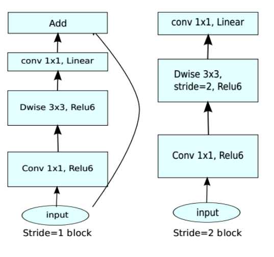

>运行该示例前请安装Paddle1.6或更高版本。本示例中的run.sh脚本仅适用于linux系统，在windows环境下，请参考run.sh内容编写适合windows环境的脚本。

# 分类模型卷积通道剪裁示例

## 概述

该示例使用PaddleSlim提供的[卷积通道剪裁压缩策略](https://github.com/PaddlePaddle/models/blob/develop/PaddleSlim/docs/tutorial.md#2-%E5%8D%B7%E7%A7%AF%E6%A0%B8%E5%89%AA%E8%A3%81%E5%8E%9F%E7%90%86)对分类模型进行压缩。
>本文默认使用ILSVRC2012数据集，数据集存放在`models/PaddleSlim/data/`路径下, 可以参考[数据准备](https://github.com/PaddlePaddle/models/tree/develop/PaddleCV/image_classification#数据准备)在执行训练脚本run.sh前配置好您的数据集

在阅读该示例前，建议您先了解以下内容：

- [分类模型的常规训练方法](https://github.com/PaddlePaddle/models/tree/develop/PaddleCV/image_classification)
- [PaddleSlim使用文档](https://github.com/PaddlePaddle/models/blob/develop/PaddleSlim/docs/usage.md)


## 配置文件说明

关于配置文件如何编写您可以参考：

- [PaddleSlim配置文件编写说明](https://github.com/PaddlePaddle/models/blob/develop/PaddleSlim/docs/usage.md#122-%E9%85%8D%E7%BD%AE%E6%96%87%E4%BB%B6%E7%9A%84%E4%BD%BF%E7%94%A8)
- [裁剪策略配置文件编写说明](https://github.com/PaddlePaddle/models/blob/develop/PaddleSlim/docs/usage.md#22-%E6%A8%A1%E5%9E%8B%E9%80%9A%E9%81%93%E5%89%AA%E8%A3%81)

其中，配置文件中的`pruned_params`需要根据当前模型的网络结构特点设置，它用来指定要裁剪的parameters.

这里以MobileNetV2模型为例，MobileNetV2的主要结构为Inverted residuals, 如图1所示：


<p align="center">
 <br />
<strong>图1</strong>
</p>

PaddleSlim暂时无法对`depthwise convolution`直接进行剪裁， 因为`depthwise convolution`的`channel`的变化会同时影响到前后的卷积层。
另外，`depthwise convolution`的参数（parameters）量占整个模型的比例并不高，所以，我们直接剪裁depthwise convolution的前后相邻的普通卷积层。
通过以下命令观察目标卷积层的参数（parameters）的名称：

```
for param in fluid.default_main_program().global_block().all_parameters():
    if 'weights' in param.name:
        print(param.name, param.shape)
```

结果如下：

```
conv1_1_weights (32L, 3L, 3L, 3L)
conv2_1_expand_weights (32L, 32L, 1L, 1L)
conv2_1_dwise_weights (32L, 1L, 3L, 3L)
conv2_1_linear_weights (16L, 32L, 1L, 1L)
conv3_1_expand_weights (96L, 16L, 1L, 1L)
conv3_1_dwise_weights (96L, 1L, 3L, 3L)
conv3_1_linear_weights (24L, 96L, 1L, 1L)
...
conv8_1_expand_weights (960L, 160L, 1L, 1L)
conv8_1_dwise_weights (960L, 1L, 3L, 3L)
conv8_1_linear_weights (320L, 960L, 1L, 1L)
conv9_weights (1280L, 320L, 1L, 1L)
fc10_weights (1280L, 1000L)
```

观察可知，普通卷积的参数名称为`.*expand_weights`或`.*linear_weights`, 用以下正则表达式`.*[r|d]_weights`对其进行匹配。

综上，我们将MobileNetV2配置文件中的`pruned_params`设置为`.*[r|d]_weights`。

我们可以用上述操作观察MobileNetV1和ResNet34的参数名称规律，然后设置合适的正则表达式来剪裁合适的参数。


## 训练

根据[PaddleCV/image_classification/train.py](https://github.com/PaddlePaddle/models/blob/develop/PaddleCV/image_classification/train.py)编写压缩脚本compress.py。
在该脚本中定义了Compressor对象，用于执行压缩任务。

可以通过命令`python compress.py`用默认参数执行压缩任务，通过`python compress.py --help`查看可配置参数，简述如下：

- use_gpu: 是否使用gpu。如果选择使用GPU，请确保当前环境和Paddle版本支持GPU。默认为True。
- batch_size: 在剪裁之后，对模型进行fine-tune训练时用的batch size。
- model: 要压缩的目标模型，该示例支持'MobileNetV1', 'MobileNetV2'和'ResNet34'。
- pretrained_model: 预训练模型的路径，可以从[这里](https://github.com/PaddlePaddle/models/tree/develop/PaddleCV/image_classification#%E5%B7%B2%E5%8F%91%E5%B8%83%E6%A8%A1%E5%9E%8B%E5%8F%8A%E5%85%B6%E6%80%A7%E8%83%BD)下载。
- config_file: 压缩策略的配置文件。

您可以通过运行脚本`run.sh`运行改示例，请确保已正确下载[pretrained model](https://github.com/PaddlePaddle/models/tree/develop/PaddleCV/image_classification#%E5%B7%B2%E5%8F%91%E5%B8%83%E6%A8%A1%E5%9E%8B%E5%8F%8A%E5%85%B6%E6%80%A7%E8%83%BD)。


### 保存断点（checkpoint）

如果在配置文件中设置了`checkpoint_path`, 则在压缩任务执行过程中会自动保存断点，当任务异常中断时，
重启任务会自动从`checkpoint_path`路径下按数字顺序加载最新的checkpoint文件。如果不想让重启的任务从断点恢复，
需要修改配置文件中的`checkpoint_path`，或者将`checkpoint_path`路径下文件清空。

>注意：配置文件中的信息不会保存在断点中，重启前对配置文件的修改将会生效。


## 评估

如果在配置文件中设置了`checkpoint_path`，则每个epoch会保存一个压缩后的用于评估的模型，
该模型会保存在`${checkpoint_path}/${epoch_id}/eval_model/`路径下，包含`__model__`和`__params__`两个文件。
其中，`__model__`用于保存模型结构信息，`__params__`用于保存参数（parameters）信息。

如果不需要保存评估模型，可以在定义Compressor对象时，将`save_eval_model`选项设置为False（默认为True）。

脚本<a href="../eval.py">PaddleSlim/classification/eval.py</a>中为使用该模型在评估数据集上做评估的示例。

运行命令示例:
```bash
python eval.py \
    --use_gpu True \
    --model_path ${save_path}/eval_model/ \
    --model_name __model__ \
    --params_name __params__

```

## 预测

如果在配置文件中设置了`checkpoint_path`，并且在定义Compressor对象时指定了`prune_infer_model`选项，则每个epoch都会
保存一个`inference model`。该模型是通过删除eval_program中多余的operators而得到的。

该模型会保存在`${checkpoint_path}/${epoch_id}/eval_model/`路径下，包含`__model__.infer`和`__params__`两个文件。
其中，`__model__.infer`用于保存模型结构信息，`__params__`用于保存参数（parameters）信息。

更多关于`prune_infer_model`选项的介绍，请参考：[Compressor介绍](https://github.com/PaddlePaddle/models/blob/develop/PaddleSlim/docs/usage.md#121-%E5%A6%82%E4%BD%95%E6%94%B9%E5%86%99%E6%99%AE%E9%80%9A%E8%AE%AD%E7%BB%83%E8%84%9A%E6%9C%AC)

### python预测

在脚本<a href="../infer.py">PaddleSlim/classification/infer.py</a>中展示了如何使用fluid python API加载使用预测模型进行预测。

运行命令示例:
```bash
python infer.py \
    --use_gpu True \
    --model_path ${save_path}/eval_model/ \
    --model_name __model__.infer \
    --params_name __params__
```

### PaddleLite

该示例中产出的预测（inference）模型可以直接用PaddleLite进行加载使用。
关于PaddleLite如何使用，请参考：[PaddleLite使用文档](https://github.com/PaddlePaddle/Paddle-Lite/wiki#%E4%BD%BF%E7%94%A8)

## 示例结果

>当前release的结果并非超参调优后的最好结果，仅做示例参考，后续我们会优化当前结果。

### MobileNetV1

| FLOPS |top1_acc/top5_acc| model_size |Paddle Fluid inference time(ms)| Paddle Lite inference time(ms)|
|---|---|---|---|---|
|baseline|70.99%/89.68% |19M |- |-|
|-50%|69.66%/88.92% |9M |- |-|

>训练超参
batch size: 256
lr_strategy: piecewise_decay
step_epochs: 30, 60, 90
num_epochs: 120
l2_decay: 3e-5
lr: 0.1

### MobileNetV2

| FLOPS |top1_acc/top5_acc| model_size |Paddle Fluid inference time(ms)| Paddle Lite inference time(ms)|
|---|---|---|---|---|
|baseline|72.15%/90.65% |- |- |-|
|-50%|- |- |- |-|

>训练超参：
batch size: 500
lr_strategy: cosine_decay
num_epochs: 240
l2_decay: 4e-5
lr: 0.1


### ResNet34

| FLOPS |top1_acc/top5_acc| model_size |Paddle Fluid inference time(ms)| Paddle Lite inference time(ms)|
|---|---|---|---|---|
|baseline|76.50%/93.00% |- |- |-|
|-50%|- |- |- |-|

>训练超参
batch size: 256
lr_strategy: cosine_decay
num_epochs: 120
l2_decay: 1e-4
lr: 0.1

## FAQ
