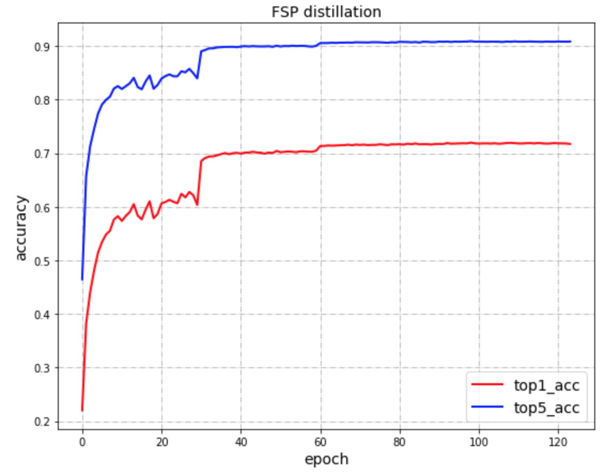
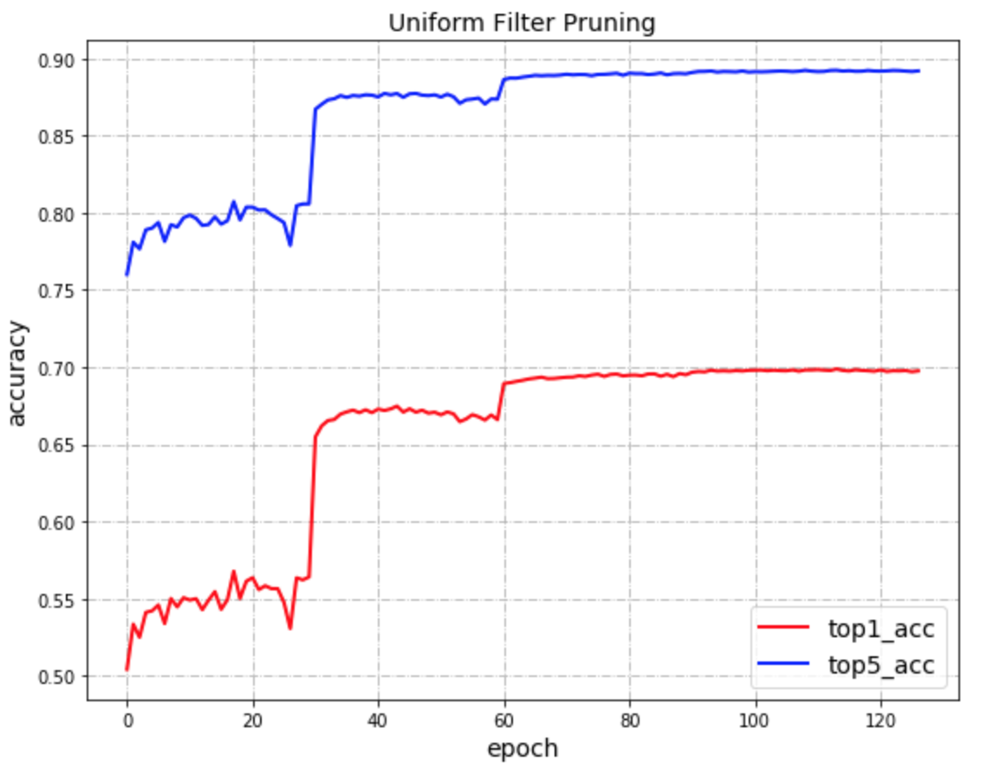
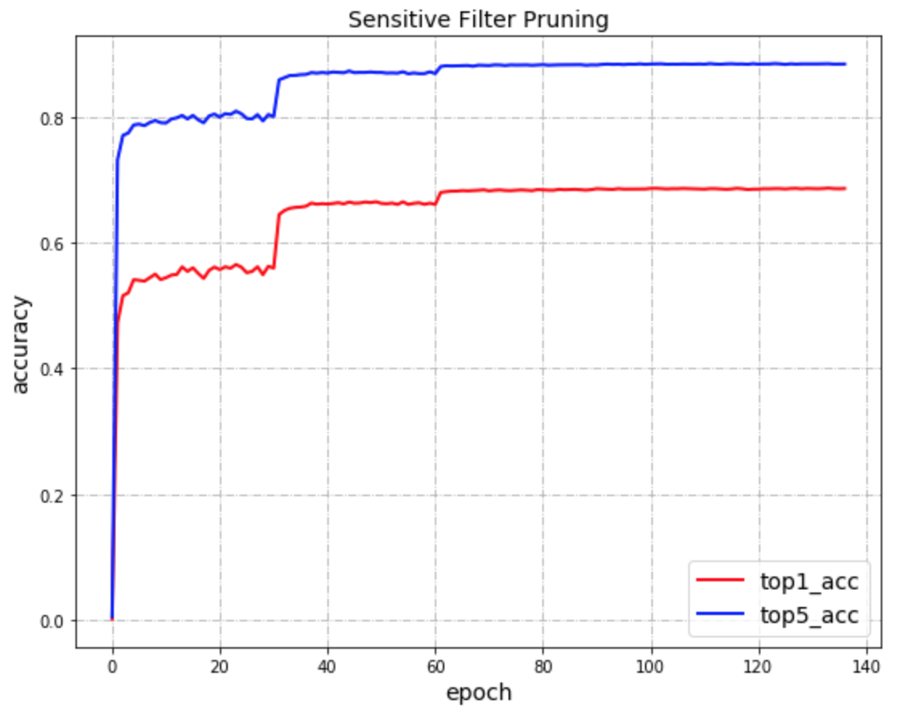

<div align="center">
  <h3>
    <a href="usage.md">
      使用文档
    </a>
    <span> | </span>
    <a href="tutorial.md">
      算法原理介绍
    </a>
    <span> | </span>
    <a href="model_zoo.md">
      Model Zoo
    </a>
  </h3>
</div>


---
# Paddle模型压缩工具库使用示例

## 目录

- [概述](#0-概述)
- [数据准备](#1-数据准备)
- [压缩脚本准备](#2-压缩脚本介绍)
- [蒸馏示例](#31-蒸馏)
- [剪切示例](#32-uniform剪切)
- [量化示例](#35-int8量化训练)
- [蒸馏后量化示例](#36-蒸馏后int8量化)
- [剪切后量化示例](#37-剪切后int8量化)
- [小模型结构搜索示例](#38-小模型结构搜索示例)

## 0. 概述
该示例参考[PaddlePaddle/models/fluid/PaddleCV/image_classification](https://github.com/PaddlePaddle/models/tree/develop/fluid/PaddleCV/image_classification)下代码，分别实现了以下策略：

1. <a href="#31-蒸馏">蒸馏</a>：用ResNet50对MobileNetV1的在ImageNet 1000数据上的蒸馏训练。
2. <a href="#32-uniform剪切">剪切</a>：对预训练好的MobileNetV1进行剪切
3. <a href="#35-int8量化训练">量化</a>：对预训练好的MobileNetV1进行int8量化训练
4. <a href="#36-蒸馏后int8量化">蒸馏量化组合</a>：先用ResNet50对MobileNetV1进行蒸馏，再对蒸馏后得到的模型进行int8量化训练。
5. <a href="#37-剪切后int8量化">剪切量化组合</a>：先用Uniform剪切策略对MobileNetV1进行剪切，再对剪切后的模型进行int8量化训练
5. <a href="#38-小模型结构搜索示例">小模型结构搜索示例</a>: 先用模拟退火策略搜索出一组tokens, 再用该tokens构建网络进行训练。

本示例完整代码链接：https://github.com/PaddlePaddle/models/tree/develop/PaddleSlim

使用方式：
克隆[PaddlePaddle/models](https://github.com/PaddlePaddle/models)到本地，并进入models/fluid/PaddleSlim路径。

**文件结构**

```
/.
 |-configs # 压缩任务的配置文件，包括:蒸馏、int8量化量化、filter剪切和组合策略的配置文件。
 |-data # 存放训练数据和pretrain model
 |-models # MobileNetV1和ResNet50网络结构的定义
 |-quant_low_level_api  # 量化训练的底层API, 用于处理特殊情况，用户可暂时忽略该内容
 |-compress.py # 模型压缩任务主脚本，示例中多个压缩策略共用这一个脚本。定义了压缩任务需要的模型相关的信息。
 |-reader.py # 定义数据处理逻辑
 |-run.sh # 模型压缩任务启动脚本
 |-utility.py # 定义了常用的工具方法
```

本示例中的五个压缩策略使用相同的训练数据和压缩Python脚本`compress.py`，每种策略对应独立的配置文件。

第1章介绍数据准备，第2章介绍脚本compress.py中几个关键步骤。第3章分别介绍了如何执行各种压缩策略的示例。


## 1. 数据准备

### 1.1 训练数据准备
参考[models/fluid/PaddleCV/image_classification](https://github.com/PaddlePaddle/models/tree/develop/fluid/PaddleCV/image_classification#data-preparation)下的数据准备教程准备训练数据，并放入PaddleSlim/data路径下。

### 1.2 预训练模型准备

脚本run.sh会自动从[models/fluid/PaddleCV/image_classification](https://github.com/PaddlePaddle/models/tree/develop/fluid/PaddleCV/image_classification#supported-models-and-performances)下载ResNet50和MobileNetV1的预训练模型，并放入PaddleSlim/pretrain路径下。


## 2. 压缩脚本介绍
在`compress.py`中定义了执行压缩任务需要的所有模型相关的信息，这里对几个关键的步骤进行简要介绍：

### 2.1 目标网络的定义

compress.py的以下代码片段定义了train program, 这里train program只有前向计算操作。
```
out = model.net(input=image, class_dim=args.class_dim)
cost = fluid.layers.cross_entropy(input=out, label=label)
avg_cost = fluid.layers.mean(x=cost)
acc_top1 = fluid.layers.accuracy(input=out, label=label, k=1)
acc_top5 = fluid.layers.accuracy(input=out, label=label, k=5)
```

然后，通过clone方法得到eval_program, 用来在压缩过程中评估模型精度，如下：

```
val_program = fluid.default_main_program().clone()
```

定义完目标网络结构，需要对其初始化，并根据需要加载预训练模型。

### 2.2  定义feed_list和fetch_list
对于train program, 定义train_feed_list用于指定从train data reader中取的数据feed给哪些variable。定义train_fetch_list用于指定在训练时，需要在log中展示的结果。如果需要在训练过程中在log中打印accuracy信心，则将('acc_top1', acc_top1.name)添加到train_fetch_list中即可。
```
train_feed_list = [('image', image.name), ('label', label.name)]
train_fetch_list = [('loss', avg_cost.name)]
```

>注意： 在train_fetch_list里必须有loss这一项。

对于eval program. 同上定义eval_feed_list和train_fetch_list:

```
val_feed_list = [('image', image.name), ('label', label.name)]
val_fetch_list = [('acc_top1', acc_top1.name), ('acc_top5', acc_top5.name)]
```

### 2.3 定义teacher网络

以下代码片段定义了teacher网络，并对其进行了初始化操作。
```
teacher_program = fluid.Program()
startup_program = fluid.Program()
with fluid.program_guard(teacher_program, startup_program):
    img = teacher_program.global_block()._clone_variable(image, force_persistable=False)
    predict = teacher_model.net(img, class_dim=args.class_dim)
exe.run(startup_program)
```
需要注意的是：

- teacher网络只有一个输入，直接clone在train program(fluid.default_main_program) 中定义的image变量即可。
- teacher网络的输出只需要到predict即可，不用加loss和accuracy等操作
- teacher网络需要初始化并加载预训练模型。

>注意： ResNet50和MobileNetV1的fc layer的weight parameter的名称都为‘fc_1.weight’，所以需要到PaddleSlim/models/resnet.py中修改一下ResNet fc layer的名称, 同时，修改ResNet50 pretrain model中响应weight的文件名，使其与resnet.py中的名称保持一致。


## 3. 执行压缩策略示例
所有示例的执行命令都放在`run.sh`文件中，用户可以修改run.sh后，执行不同的压缩策略示例。

### 3.1 蒸馏

在该示例中，用预训练好的ResNet50模型监督训练MobileNetV1模型。
修改run.sh, 执行以下命令，执行蒸馏压缩示例：
```
# for distillation
#--------------------
export CUDA_VISIBLE_DEVICES=0
python compress.py \
--model "MobileNet" \
--teacher_model "ResNet50" \
--teacher_pretrained_model ./data/pretrain/ResNet50_pretrained \
--compress_config ./configs/mobilenetv1_resnet50_distillation.yaml
```
该示例在评估数据集上的准确率结果如下：

|- |精度(top5/top1) |
|---|---|
| ResNet50蒸馏训| 90.92% / 71.97%|

<p align="center">
 <br />
<strong>图1</strong>
</p>


### 3.2 Uniform剪切

在该示例中，将MobileNetV1模型剪掉50%的FLOPS.
修改run.sh, 执行以下命令，执行Uniform卷积核剪切模型压缩示例：

```
# for uniform filter pruning
#---------------------------
export CUDA_VISIBLE_DEVICES=0
python compress.py \
--model "MobileNet" \
--pretrained_model ./data/pretrain/MobileNetV1_pretrained \
--compress_config ./configs/filter_pruning_uniform.yaml
```
该示例在评估数据集上的准确率结果如下：

| FLOPS |模型大小|精度（top5/top1） |
|---|---|---|
| -50%|-47.0%(9.0M) |89.13% / 69.83%|

<p align="center">
 <br />
<strong>图2</strong>
</p>


### 3.3 敏感度剪切

在该示例中，将MobileNetV1模型剪掉50%的FLOPS.
修改run.sh, 执行以下命令，执行敏感度卷积核剪切压缩示例：

```
# for sensitivity filter pruning
#---------------------------
export CUDA_VISIBLE_DEVICES=0
python compress.py \
--model "MobileNet" \
--pretrained_model ./data/pretrain/MobileNetV1_pretrained \
--compress_config ./configs/filter_pruning_sen.yaml
```
该示例在评估数据集上的准确率结果如下：

| FLOPS |模型大小| 精度（top5/top1） |
|---|---|---|
| -50%|-61.2%(6.6M) |88.47% / 68.68%|

<p align="center">
 <br />
<strong>图3</strong>
</p>

### 3.4 剪切率超参搜索

在该示例中，使用模拟退火策略搜索出一组最优的剪切率，将MobileNetV1模型剪掉50%的FLOPS.
修改run.sh, 执行以下命令，搜索一组剪切率：

```

# for auto filter pruning
#---------------------------
export CUDA_VISIBLE_DEVICES=0
python compress.py \
--model "MobileNet" \
--pretrained_model ./pretrain/MobileNetV1_pretrained \
--compress_config ./configs/auto_prune.yaml

```

通过上述步骤，得到一组最优的tokens, 将其按以下方式设置到`auto_prune.yaml`文件中：

```
strategies:
    auto_pruning_strategy:
        class: 'AutoPruneStrategy'
        pruner: 'pruner_1'
        controller: 'sa_controller'
        start_epoch: 0
        end_epoch: 200
        retrain_epoch: 200
        max_ratio: 0.50
        min_ratio: 0.48
        uniform_range: 0.4
        init_tokens: [39, 38, 38, 24, 21, 34, 24, 29, 19, 11, 33, 36, 39]
        pruned_params: '.*_sep_weights'
        metric_name: 'acc_top1'
compressor:
    epoch: 200
    checkpoint_path: './checkpoints_auto_pruning/'
    strategies:
        - auto_pruning_strategy
```

其中，需要修改的选项有：

- end_epoch: 将其修改为200，训练任务共执行200个epochs
- retrain_epoch: 将其修改为200，当前任务的200个epochs全为训练，不做搜索。
- init_tokens: 在auto_pruning_strategy下新增init_tokens, 为上一步骤中搜索出的最优tokens.
- compressor::epoch: 修改为200，整个压缩任务执行200个epochs后退出。


该示例在评估数据集上的准确率结果如下：

| FLOPS |模型大小| 精度（top5/top1） |pruned ratios|
|---|---|---|---|
| -50%|- |88.86% / 69.64%|[0.39, 0.38, 0.38, 0.24, 0.21, 0.34, 0.24, 0.29, 0.19, 0.11, 0.33, 0.36, 0.39]|

>该搜索策略有一定的随机性，用上述搜索参数，不一定能搜索完全一样的结果。

### 3.5 int8量化训练

修改run.sh, 执行以下命令，执行int8量化训练示例：

```
# for quantization
#---------------------------
export CUDA_VISIBLE_DEVICES=0
python compress.py \
--batch_size 64 \
--model "MobileNet" \
--pretrained_model ./pretrain/MobileNetV1_pretrained \
--compress_config ./configs/quantization.yaml
```

该示例结果如下：

| 模型(int8动态量化) | 模型大小 | 精度(top5/top1)|
|---|---|---|
|MobileNetV1|-71.76%(4.8M)|89.64% / 71.01%|


### 3.6 蒸馏后int8量化

本示例先用ResNet50模型对MobileNetV1蒸馏训练120个epochs，然后再对MobileNetV1模型进行动态int8量化训练。
修改run.sh, 执行以下命令，执行蒸馏与int8量化训练结合的模型压缩示例：

```
# for distillation with quantization
#-----------------------------------
export CUDA_VISIBLE_DEVICES=0
python compress.py \
--model "MobileNet" \
--teacher_model "ResNet50" \
--teacher_pretrained_model ./data/pretrain/ResNet50_pretrained \
--compress_config ./configs/quantization_dist.yaml
```

该示例结果如下：

| 模型（ResNet50蒸馏训练+int8量化） | 模型大小 | 精度(top1)     |
| ---                               | ---      | ---            |
| MobileNet v1                      | -71.76%（4.8M）| 72.01% |

### 3.7 剪切后int8量化

本示例先将预训练好的MobileNetV1模型剪掉50% FLOPS, 让后再对其进行动态int8量化训练。
修改run.sh, 执行以下命令，执行剪切与int8量化训练结合的模型压缩示例：

```
# for uniform filter pruning with quantization
#---------------------------------------------
export CUDA_VISIBLE_DEVICES=0
python compress.py \
--model "MobileNet" \
--pretrained_model ./data/pretrain/MobileNetV1_pretrained \
--compress_config ./configs/quantization_pruning.yaml
```

该示例结果如下：

| 模型（剪切FLOPS+动态int8量化） | 模型大小        | 精度(top1) |
| ---                            | ---             | ---        |
| MobileNet v1（剪切FLOPS -50%） | -86.47%（2.3M） | 69.20%     |

### 3.7 小模型结构搜索示例

本示例先用模拟退火策略搜索出一组tokens, 再用搜索出的tokens初始化构建模型进行训练。

step1: 进入路径`PaddlePaddle/models/PaddleSlim/light_nas/`。

step2: 在当前路径下，新建软链接指向上级目录的data: `ln -s ../data data`。

step3: 修改`compress.xml`文件, 将参数server_ip设置为当前机器的ip。

step4: 执行`sh run.sh`, 可根据实际情况修改`run.sh`中的`CUDA_VISIBLE_DEVICES`。

step5: 修改`light_nas_space.py`文件中的`LightNASSpace::init_tokens`, 使其返回step4中搜到的最优tokens。

step6: 修改compress.xml文件，将compressor下的`strategies`去掉。

step7: 执行`sh run.sh`进行训练任务。

该示例两组结果如下：

| - | Light-NAS-model0| Light-NAS-model1 | MobileNetV2 |
|---|---|---|---|
| FLOPS|-3% | -17% | -0% |
| top1 accuracy| 72.45%|  71.84%| 71.90% |
|GPU cost|1.2K GPU hours(V100)|1.2K GPU hours(V100)|-|
|tokens|tokens1|tokens2||


| token name | tokens|
|---|---|
|tokens1|[3, 1, 1, 0, 1, 0, 3, 2, 1, 0, 1, 0, 3, 1, 1, 0, 1, 0, 2, 1, 1, 0, 1, 0, 1, 1, 1, 0, 1, 0]|
|tokens2|[3, 1, 1, 0, 1, 0, 3, 2, 1, 0, 1, 1, 0, 1, 1, 1, 1, 0, 2, 0, 1, 0, 1, 0, 1, 1, 1, 0, 1, 1]|
