

  <h3>
    <a href="usage.md">
      使用文档
    </a>
     | 
    <a href="demo.md">
      示例文档
    </a>
     | 
    <a href="model_zoo.md">
      Model Zoo
    </a>
  </h3>

---
# Paddle模型压缩工具库算法原理介绍

## 目录

- [量化原理介绍](#1-quantization-aware-training量化介绍)
- [剪切原理介绍](#2-卷积核剪切原理)
- [蒸馏原理介绍](#3-蒸馏)

## 1. Quantization Aware Training量化介绍

### 1.1 背景

近年来，定点量化使用更少的比特数（如8-bit、3-bit、2-bit等）表示神经网络的权重和激活已被验证是有效的。定点量化的优点包括低内存带宽、低功耗、低计算资源占用以及低模型存储需求等。

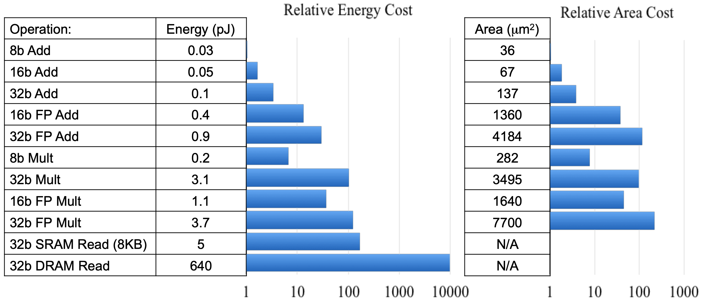  
<strong>表1: 不同类型操作的开销对比</strong>

由表1可知，低精度定点数操作的硬件面积大小及能耗比高精度浮点数要少几个数量级。 使用定点量化可带来4倍的模型压缩、4倍的内存带宽提升，以及更高效的cache利用(很多硬件设备，内存访问是主要能耗)。除此之外，计算速度也会更快(通常具有2x-3x的性能提升)。由表2可知，在很多场景下，定点量化操作对精度并不会造成损失。另外，定点量化对神经网络于嵌入式设备上的推断来说是极其重要的。

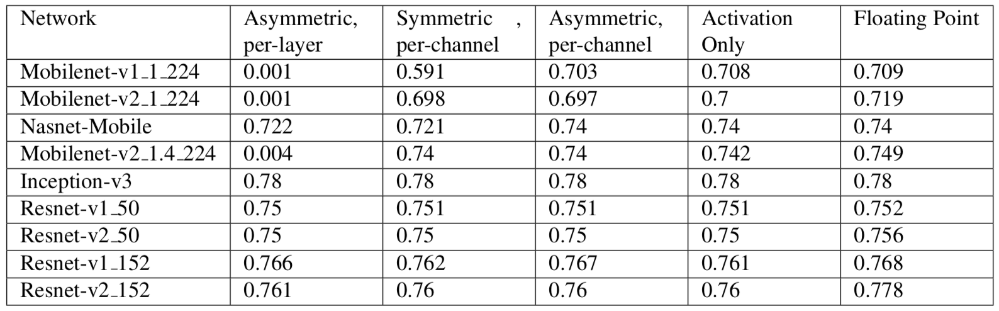  
<strong>表2：模型量化前后精度对比</strong>

目前，学术界主要将量化分为两大类：`Post Training Quantization`和`Quantization Aware Training`。`Post Training Quantization`是指使用KL散度、滑动平均等方法确定量化参数且不需要重新训练的定点量化方法。`Quantization Aware Training`是在训练过程中对量化进行建模以确定量化参数，它与`Post Training Quantization`模式相比可以提供更高的预测精度。本文主要针对`Quantization Aware Training`量化模式进行阐述说明。

### 1.2 量化原理

#### 1.2.1 量化方式
目前，存在着许多方法可以将浮点数量化成定点数。例如：
$$ r = min(max(x, a), b)$$ $$ s = \frac{b - a}{n - 1} $$ $$ q = \left \lfloor \frac{r - a}{s} \right \rceil $$
式中，$x$是待量化的浮点值，$[a, b]$是量化范围，$a$是待量化浮点数中的最小值， $b$ 是待量化浮点数中的最大值。$\left \lfloor \right \rceil$ 表示将结果四舍五入到最近的整数。如果量化级别为$k$，则$n$为$2^k$。例如，若$k$为8，则$n$为256。$q$是量化得到的整数。
PaddleSlim框架中选择的量化方法为最大绝对值量化(`max-abs`)，具体描述如下：
$$ M = max(abs(x)) $$ $$ q = \left \lfloor \frac{x}{M} * (n - 1) \right \rceil $$
式中，$x$是待被量化的浮点值，$M$是待量化浮点数中的绝对值最大值。$\left \lfloor \right \rceil$表示将结果四舍五入到最近的整数。对于8bit量化，PaddleSlim采用`int8_t`，即$n=2^7=128$。$q$是量化得到的整数。
无论是`min-max量化`还是`max-abs量化`，他们都可以表示为如下形式：
$q = scale * r + b$
其中`min-max`和`max-abs`被称为量化参数或者量化比例或者量化范围。

#### 1.2.2 量化训练框架
##### 1.2.2.1 前向传播
前向传播过程采用模拟量化的方式，具体描述如下：

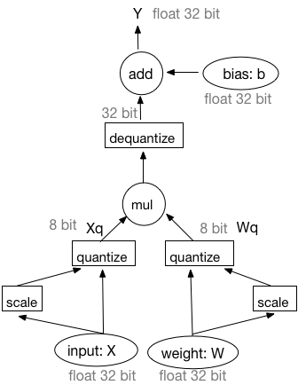  
<strong>图1：基于模拟量化训练的前向过程</strong>

由图1可知，基于模拟量化训练的前向过程可被描述为以下四个部分：
1) 输入和权重均被量化成8-bit整数。
2) 在8-bit整数上执行矩阵乘法或者卷积操作。
3) 反量化矩阵乘法或者卷积操作的输出结果为32-bit浮点型数据。
4) 在32-bit浮点型数据上执行偏置加法操作。此处，偏置并未被量化。
对于通用矩阵乘法(`GEMM`)，输入$X$和权重$W$的量化操作可被表述为如下过程：
$$ X_q = \left \lfloor \frac{X}{X_m} * (n - 1) \right \rceil $$ $$ W_q = \left \lfloor \frac{W}{W_m} * (n - 1) \right \rceil $$
执行通用矩阵乘法：
$$ Y = X_q * W_q $$
反量化$Y$:
$$
\begin{align}
Y_{dq} = \frac{Y}{(n - 1) * (n - 1)} * X_m * W_m \
=\frac{X_q * W_q}{(n - 1) * (n - 1)} * X_m * W_m \
=(\frac{X_q}{n - 1} * X_m) * (\frac{W_q}{n - 1} * W_m) \
\end{align}
$$
上述公式表明反量化操作可以被移动到`GEMM`之前，即先对$Xq$和$Wq$执行反量化操作再做`GEMM`操作。因此，前向传播的工作流亦可表示为如下方式：

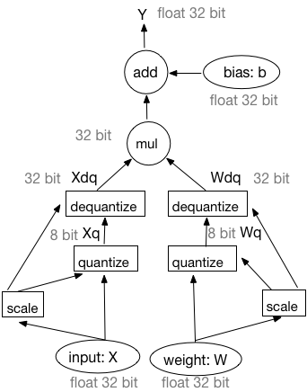  
<strong>图2：基于模拟量化训练前向过程的等价工作流</strong>

训练过程中，PaddleSlim使用图2中所示的等价工作流。在设计中，量化Pass在IrGraph中插入量化op和反量化op。因为在连续的量化、反量化操作之后输入仍然为32-bit浮点型数据。因此，PaddleSlim量化训练框架所采用的量化方式被称为模拟量化。

##### 1.2.2.2 反向传播
由图3可知，权重更新所需的梯度值可以由量化后的权重和量化后的激活求得。反向传播过程中的所有输入和输出均为32-bit浮点型数据。注意，梯度更新操作需要在原始权重上进行，即计算出的梯度将被加到原始权重上而非量化后或反量化后的权重上。

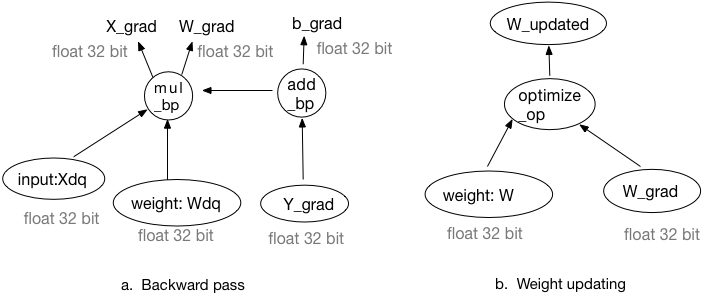  
<strong>图3：基于模拟量化训练的反向传播和权重更新过程</strong>

因此，量化Pass也会改变相应反向算子的某些输入。

#### 1.2.3 确定量化参数
存在着两种策略可以计算求取量化比例系数，即动态策略和静态策略。动态策略会在每次迭代过程中计算量化比例系数的值。静态策略则对不同的输入采用相同的量化比例系数。
对于权重而言，在训练过程中采用动态策略。换句话说，在每次迭代过程中量化比例系数均会被重新计算得到直至训练过程结束。
对于激活而言，可以选择动态策略也可以选择静态策略。若选择使用静态策略，则量化比例系数会在训练过程中被评估求得，且在推断过程中被使用(不同的输入均保持不变)。静态策略中的量化比例系数可于训练过程中通过如下三种方式进行评估：

1. 在一个窗口中计算激活最大绝对值的平均值。

2. 在一个窗口中计算激活最大绝对值的最大值。

3. 在一个窗口中计算激活最大绝对值的滑动平均值，计算公式如下：

$$ Vt = (1 - k) * V + k * V_{t-1} $$

式中，$V$ 是当前batch的最大绝对值， $Vt$是滑动平均值。$k$是一个因子，例如其值可取为0.9。

## 2. 卷积核剪切原理

该策略参考paper: [Pruning Filters for Efficient ConvNets](https://arxiv.org/pdf/1608.08710.pdf)

该策略通过减少卷积层中卷积核的数量，来减小模型大小和降低模型计算复杂度。

### 2.1  剪切卷积核

**剪切注意事项1**
剪切一个conv layer的filter，需要修改后续conv layer的filter. 如**图4**所示，剪掉Xi的一个filter，会导致$X_{i+1}$少一个channel, $X_{i+1}$对应的filter在input_channel纬度上也要减1.

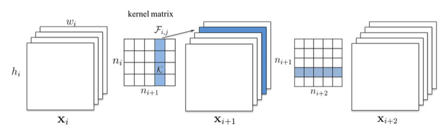  
<strong>图4</strong>

**剪切注意事项2**

如**图5**所示，剪切完$X_i$之后，根据注意事项1我们从$X_{i+1}$的filter中删除了一行（图中蓝色行），在计算$X_{i+1}$的filters的l1_norm(图中绿色一列)的时候，有两种选择：
算上被删除的一行：independent pruning
减去被删除的一行：greedy pruning

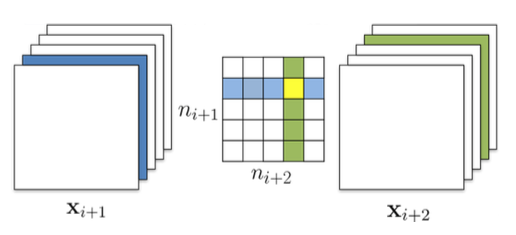  
<strong>图5</strong>

**剪切注意事项3**
在对ResNet等复杂网络剪切的时候，还要考虑到后当前卷积层的修改对上一层卷积层的影响。
如**图6**所示，在对residual block剪切时，$X_{i+1}$层如何剪切取决于project shortcut的剪切结果，因为我们要保证project shortcut的output和$X_{i+1}$的output能被正确的concat.

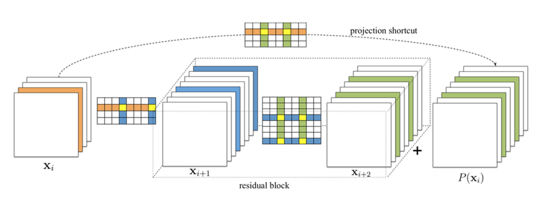  
<strong>图6</strong>

### 2.2 Uniform剪切卷积网络

每层剪切一样比例的卷积核。
在剪切一个卷积核之前，按l1_norm对filter从高到低排序，越靠后的filter越不重要，优先剪掉靠后的filter.

### 2.3 基于敏感度剪切卷积网络

根据每个卷积层敏感度的不同，剪掉不同比例的卷积核。

#### 两个假设

- 在一个conv layer的parameter内部，按l1_norm对filter从高到低排序，越靠后的filter越不重要。
- 两个layer剪切相同的比例的filters，我们称对模型精度影响更大的layer的敏感度相对高。

#### 剪切filter的指导原则

- layer的剪切比例与其敏感度成反比
- 优先剪切layer内l1_norm相对低的filter

#### 敏感度的理解

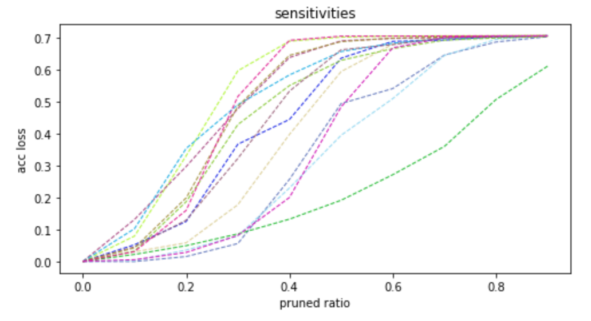  
<strong>图7</strong>

如**图7**所示，横坐标是将filter剪切掉的比例，竖坐标是精度的损失，每条彩色虚线表示的是网络中的一个卷积层。
以不同的剪切比例**单独**剪切一个卷积层，并观察其在验证数据集上的精度损失，并绘出**图7**中的虚线。虚线上升较慢的，对应的卷积层相对不敏感，我们优先剪不敏感的卷积层的filter.

#### 选择最优的剪切率组合

我们将**图7**中的折线拟合为**图8**中的曲线，每在竖坐标轴上选取一个精度损失值，就在横坐标轴上对应着一组剪切率，如**图8**中黑色实线所示。
用户给定一个模型整体的剪切率，我们通过移动**图5**中的黑色实线来找到一组满足条件的且合法的剪切率。

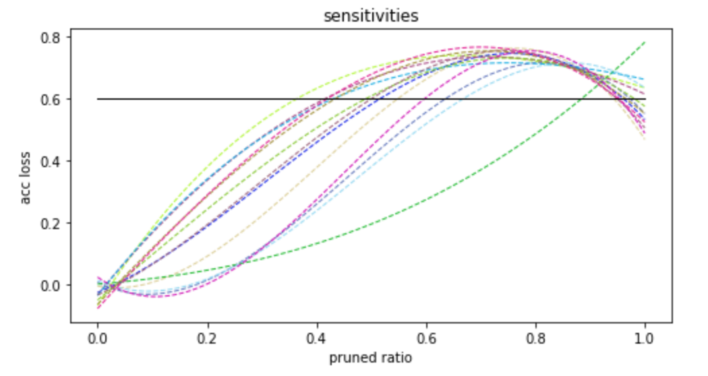  
<strong>图8</strong>

#### 迭代剪切
考虑到多个卷积层间的相关性，一个卷积层的修改可能会影响其它卷积层的敏感度，我们采取了多次剪切的策略，步骤如下：

- step1: 统计各卷积层的敏感度信息
- step2: 根据当前统计的敏感度信息，对每个卷积层剪掉少量filter, 并统计FLOPS，如果FLOPS已满足要求，进入step4，否则进行step3。
- step3: 对网络进行简单的fine-tune，进入step1
- step4: fine-tune训练至收敛

## 3. 蒸馏

   一般情况下，模型参数量越多，结构越复杂，其性能越好，但参数也越允余，运算量和资源消耗也越大；模型蒸馏是将复杂网络中的有用信息将复杂网络中的有用信息提取出来提取出来，迁移到一个更小的网络中去，在我们的工具包中，支持两种蒸馏的方法。
    第一种是传统的蒸馏方法（参考论文：[Distilling the Knowledge in a Neural Network](https://arxiv.org/pdf/1503.02531.pdf)）
   使用复杂的网络作为teacher模型去监督训练一个参数量和运算量更少的student模型。teacher模型可以是一个或者多个提前训练好的高性能模型。student模型的训练有两个目标：一个是原始的目标函数，为student模型输出的类别概率和label的交叉熵，记为hard-target；另一个是student模型输出的类别概率和teacher模型输出的类别概率的交叉熵，记为soft target，这两个loss加权后得到最终的训练loss，共同监督studuent模型的训练。
   第二种是基于FSP的蒸馏方法（参考论文：[A Gift from Knowledge Distillation:
Fast Optimization, Network Minimization and Transfer Learning](http://openaccess.thecvf.com/content_cvpr_2017/papers/Yim_A_Gift_From_CVPR_2017_paper.pdf)）
   相比传统的蒸馏方法直接用小模型去拟合大模型的输出，该方法用小模型去拟合大模型不同层特征之间的转换关系，其用一个FSP矩阵（特征的内积）来表示不同层特征之间的关系，大模型和小模型不同层之间分别获得多个FSP矩阵，然后使用L2 loss让小模型的对应层FSP矩阵和大模型对应层的FSP矩阵尽量一致，具体如下图所示。这种方法的优势，通俗的解释是，比如将蒸馏类比成teacher（大模型）教student（小模型）解决一个问题，传统的蒸馏是直接告诉小模型问题的答案，让小模型学习，而学习FSP矩阵是让小模型学习解决问题的中间过程和方法，因此其学到的信息更多。

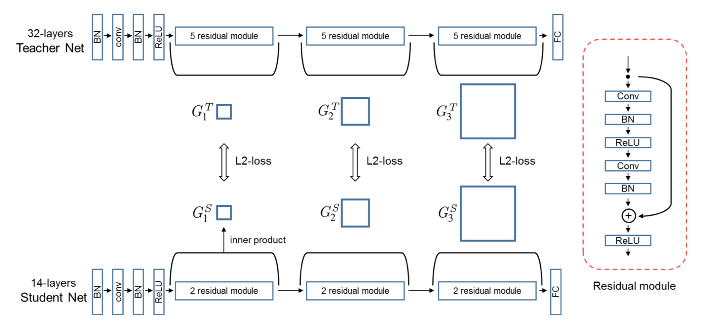  
<strong>图9</strong>

   由于小模型和大模型之间通过L2 loss进行监督，必须保证两个FSP矩阵的维度必须相同，而FSP矩阵的维度为M*N，其中M、N分别为输入和输出特征的channel数，因此大模型和小模型的FSP矩阵需要一一对应。

## 4. 参考文献

1. [High-Performance Hardware for Machine Learning](https://media.nips.cc/Conferences/2015/tutorialslides/Dally-NIPS-Tutorial-2015.pdf)

2. [Quantizing deep convolutional networks for efficient inference: A whitepaper](https://arxiv.org/pdf/1806.08342.pdf)

3. [Pruning Filters for Efficient ConvNets](https://arxiv.org/pdf/1608.08710.pdf)

4. [Distilling the Knowledge in a Neural Network](https://arxiv.org/pdf/1503.02531.pdf)

5. [A Gift from Knowledge Distillation: Fast Optimization, Network Minimization and Transfer Learning](http://openaccess.thecvf.com/content_cvpr_2017/papers/Yim_A_Gift_From_CVPR_2017_paper.pdf)
