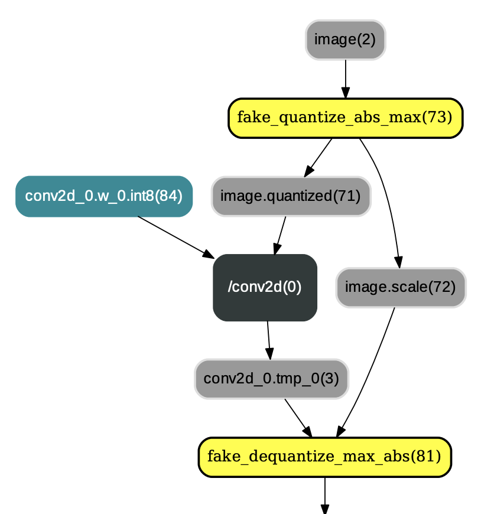

<div align="center">
  <h3>
    <a href="../docs/tutorial.md">
      算法原理介绍
    </a>
    <span> | </span>
    <a href="../docs/usage.md">
      使用文档
    </a>
    <span> | </span>
    <a href="../docs/demo.md">
      示例文档
    </a>
    <span> | </span>
    <a href="../docs/model_zoo.md">
      Model Zoo
    </a>
  </h3>
</div>

---
# 量化训练Low-Level API使用示例

## 目录

- [量化训练Low-Level APIs介绍](#1-量化训练low-level-apis介绍)
- [基于Low-Level API的量化训练](#2-基于low-level-api的量化训练)

## 1. 量化训练Low-Level APIs介绍
量化训练Low-Level APIs主要涉及到PaddlePaddle框架中的四个IrPass，即`QuantizationTransformPass`、`QuantizationFreezePass`、`ConvertToInt8Pass`以及`TransformForMobilePass`。这四个IrPass的具体功能描述如下：

* `QuantizationTransformPass`: QuantizationTransformPass主要负责在IrGraph的`conv2d`、`depthwise_conv2d`、`mul`等算子的各个输入前插入连续的量化op和反量化op，并改变相应反向算子的某些输入，示例如图1：

<p align="center">
 <br />
<strong>图1：应用QuantizationTransformPass后的结果</strong>
</p>

* `QuantizationFreezePass`：QuantizationFreezePass主要用于改变IrGraph中量化op和反量化op的顺序，即将类似图1中的量化op和反量化op顺序改变为图2中的布局。除此之外，QuantizationFreezePass还会将`conv2d`、`depthwise_conv2d`、`mul`等算子的权重离线量化为int8_t范围内的值(但数据类型仍为float32)，以减少预测过程中对权重的量化操作，示例如图2：

<p align="center">
 <br />
<strong>图2：应用QuantizationFreezePass后的结果</strong>
</p>

* `ConvertToInt8Pass`：ConvertToInt8Pass必须在QuantizationFreezePass之后执行，其主要目的是将执行完QuantizationFreezePass后输出的权重类型由`FP32`更改为`INT8`。换言之，用户可以选择将量化后的权重保存为float32类型（不执行ConvertToInt8Pass）或者int8_t类型（执行ConvertToInt8Pass），示例如图3：

<p align="center">
 <br />
<strong>图3：应用ConvertToInt8Pass后的结果</strong>
</p>

* `TransformForMobilePass`：经TransformForMobilePass转换后，用户可得到兼容[paddle-mobile](https://github.com/PaddlePaddle/paddle-mobile)移动端预测库的量化模型。paddle-mobile中的量化op和反量化op的名称分别为`quantize`和`dequantize`。`quantize`算子和PaddlePaddle框架中的`fake_quantize_abs_max`算子簇的功能类似，`dequantize` 算子和PaddlePaddle框架中的`fake_dequantize_max_abs`算子簇的功能相同。若选择paddle-mobile执行量化训练输出的模型，则需要将`fake_quantize_abs_max`等算子改为`quantize`算子以及将`fake_dequantize_max_abs`等算子改为`dequantize`算子，示例如图4：

<p align="center">
 <br />
<strong>图4：应用TransformForMobilePass后的结果</strong>
</p>

## 2. 基于Low-Level API的量化训练
本小节以ResNet50和MobileNetV1为例，介绍了PaddlePaddle量化训练Low-Level API的使用方法，具体如下：

1） 执行如下命令clone [Pddle models repo](https://github.com/PaddlePaddle/models)：
```bash
git clone https://github.com/PaddlePaddle/models.git
```

2） 准备数据集（包括训练数据集和验证数据集）。以ILSVRC2012数据集为例，数据集应包含如下结构：
```bash
data
└──ILSVRC2012
        ├── train
        ├── train_list.txt
        ├── val
        └── val_list.txt
```
3）切换到`models/PaddleSlim/quant_low_level_api`目录下，修改`run_quant.sh`内容，即将**data_dir**设置为第2)步所准备的数据集路径。最后，执行`run_quant.sh`脚本即可进行量化训练。

### 2.1 量化训练Low-Level API使用小结：

* 参照[quant.py](quant.py)文件的内容，总结使用量化训练Low-Level API的方法如下：
```python
#startup_program = fluid.Program()
#train_program = fluid.Program()
#train_cost = build_program(
#    main_prog=train_program,
#    startup_prog=startup_program,
#    is_train=True)
#build_program(
#    main_prog=test_program,
#    startup_prog=startup_program,
#    is_train=False)
#test_program = test_program.clone(for_test=True)
# The above pseudo code is used to build up the model.
# ---------------------------------------------------------------------------------
# The following code are part of Quantization Aware Training logic:
# 0) Convert Programs to IrGraphs.
main_graph = IrGraph(core.Graph(train_program.desc), for_test=False)
test_graph = IrGraph(core.Graph(test_program.desc), for_test=True)
# 1) Make some quantization transforms in the graph before training and testing.
# According to the weight and activation quantization type, the graph will be added
# some fake quantize operators and fake dequantize operators.
transform_pass = QuantizationTransformPass(
        scope=fluid.global_scope(), place=place,
        activation_quantize_type=activation_quant_type,
        weight_quantize_type=weight_quant_type)
transform_pass.apply(main_graph)
transform_pass.apply(test_graph)
# Compile the train_graph for training.
binary = fluid.CompiledProgram(main_graph.graph).with_data_parallel(
    loss_name=train_cost.name, build_strategy=build_strategy)
# Convert the transformed test_graph to test program for testing.
test_prog = test_graph.to_program()
# For training
exe.run(binary, fetch_list=train_fetch_list)
# For testing
exe.run(program=test_prog, fetch_list=test_fetch_list)
# 2) Freeze the graph after training by adjusting the quantize
# operators' order for the inference.
freeze_pass = QuantizationFreezePass(
    scope=fluid.global_scope(),
    place=place,
    weight_quantize_type=weight_quant_type)
freeze_pass.apply(test_graph)
# 3) Convert the weights into int8_t type.
# [This step is optional.]
convert_int8_pass = ConvertToInt8Pass(scope=fluid.global_scope(), place=place)
convert_int8_pass.apply(test_graph)
# 4) Convert the freezed graph for paddle-mobile execution.
# [This step is optional. But, if you execute this step, you must execute the step 3).]
mobile_pass = TransformForMobilePass()
mobile_pass.apply(test_graph)
```
* [run_quant.sh](run_quant.sh)脚本中的命令配置详解：

```bash
   --model：指定量化训练的模型，如MobileNet、ResNet50。
   --pretrained_fp32_model：指定预训练float32模型参数的位置。
   --checkpoint：指定模型断点训练的checkpoint路径。若指定了checkpoint路径，则不应该再指定pretrained_fp32_model路径。
   --use_gpu：选择是否使用GPU训练。
   --data_dir：指定训练数据集和验证数据集的位置。
   --batch_size：设置训练batch size大小。
   --total_images：指定训练数据图像的总数。
   --class_dim：指定类别总数。
   --image_shape：指定图像的尺寸。
   --model_save_dir：指定模型保存的路径。
   --lr_strategy：学习率衰减策略。
   --num_epochs：训练的总epoch数。
   --lr：初始学习率，指定预训练模型参数进行fine-tune时一般设置一个较小的初始学习率。
   --act_quant_type：激活量化类型，可选abs_max,  moving_average_abs_max, range_abs_max。
   --wt_quant_type：权重量化类型，可选abs_max, channel_wise_abs_max。
```

> **备注:** 量化训练结束后，用户可在其指定的模型保存路径下看到float、int8和mobile三个目录。下面对三个目录下保存的模型特点进行解释说明:
> - **float目录:** 参数范围为int8范围但参数数据类型为float32的量化模型。
> - **int8目录:** 参数范围为int8范围且参数数据类型为int8的量化模型。
> - **mobile目录:** 参数特点与int8目录相同且兼容[paddle-mobile](https://github.com/PaddlePaddle/paddle-mobile)的量化模型。
>
> **注意:** 目前PaddlePaddle框架在Server端只支持使用float目录下的量化模型做预测。

