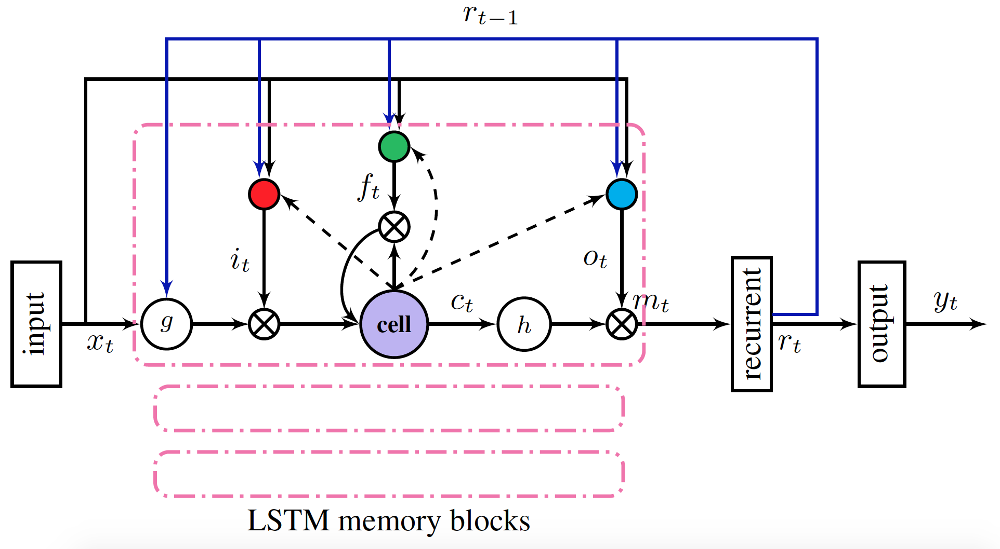
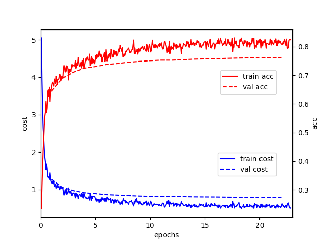

[中文](README_cn.md)

The minimum PaddlePaddle version needed for the code sample in this directory is v1.6.0. If you are on a version of PaddlePaddle earlier than this, [please update your installation](https://www.paddlepaddle.org.cn/documentation/docs/en/beginners_guide/index_en.html).

---

DeepASR (Deep Automatic Speech Recognition) is a speech recognition system based on PaddlePaddle FLuid and Kaldi. It uses the Fluid framework to perform the configuration and training of acoustic models in speech recognition and integrates Kaldi decoder. It is designed to facilitate Kaldi users to implement the rapid and large-scale training of acoustic models, and to use Kaldi to complete complex speech data preprocessing and final decoding processes.

### Content
- [Introduction](#introduction)
- [Installation](#installation)
- [Data reprocessing](#data-reprocessing)
- [Training](#training)
- [Perf profiling](#perf-profiling)
- [Inference and Decoding](#inference-and-decoding)
- [Scoring error rate](#scoring-error-rate)
- [Aishell example](#aishell-example)
- [Question and Contribution](#question-and-contribution)


### Introduction
DeepASR is an acoustic model of a single conv layer and multi-layer stacked LSTMP structure. Convolution is used for preliminary feature extraction, and multi-layer LSTMP is used to model the timing relationship, using cross entropy as the loss function. [LSTMP](https://arxiv.org/abs/1402.1128) (LSTM with recurrent projection layer) is an extension of the traditional LSTM. It adds a projection layer to the LSTM, projecting the hidden layer to the lower dimension and enters to the next time step. This structure greatly improves the performance of the LSTM while greatly reducing the parameter size and computational complexity of the LSTM.

<p align="center">
 <br />
图1 LSTMP topology
</p>

### Installation

#### Kaldi
The decoder depends on [kaldi](https://github.com/kaldi-asr/kaldi), If there is no Kaldi in the environment, please `git clone` its source code and install it by flowing its instructions. Then set the environment variable `KALDI_ROOT`:

```shell
export KALDI_ROOT=<absolute path to kaldi>
```

#### Decoder

Enter the directory where the decoder source is located.

```shell
cd models/fluid/DeepASR/decoder
```
Run the installation script.

```shell
sh setup.sh
```
The decoding process was successfully completed after compilation.

### Data reprocessing
Refer to [Kaldi's data preparation process](http://kaldi-asr.org/doc/data_prep.html) to complete feature extraction and label alignment of audio data.

### Training
You can choose to train models in CPU or GPU, such as training in GPU:

```shell
CUDA_VISIBLE_DEVICES=0,1,2,3 python -u train.py \
                   --train_feature_lst train_feature.lst \
                   --train_label_lst train_label.lst \
                   --val_feature_lst val_feature.lst \
                   --val_label_lst val_label.lst \
                   --mean_var global_mean_var \
                   --parallel
```
where `train_feature.lst` and `train_label.lst` are the feature list file and the label list file of the training data. Similarly, `val_feature.lst` and `val_label.lst` correspond to the list file of the validation data. In the actual training process, important arguments such as LSTMP's hidden unit size and learning rate should be correctly specified. For instructions on these parameters, please run:

```shell
python train.py --help
```
to get more information.

### Perf profiling

Using the performance analysis tool profiler provided by Fluid, you can perform performance analysis on the training process and obtain the execution time of the operator level in the network.

```shell
CUDA_VISIBLE_DEVICES=0 python -u tools/profile.py \
                   --train_feature_lst train_feature.lst \
                   --train_label_lst train_label.lst \
                   --val_feature_lst val_feature.lst \
                   --val_label_lst val_label.lst \
                   --mean_var global_mean_var
```

### Inference and Decoding
After fully training the acoustic model, using the model checkpoint saved in the training process, the input audio data can be decoded and output, and the sound to text recognition result can be obtained.

```
CUDA_VISIBLE_DEVICES=0,1,2,3 python -u infer_by_ckpt.py \
                        --batch_size 96  \
                        --checkpoint deep_asr.pass_1.checkpoint \
                        --infer_feature_lst test_feature.lst  \
                        --infer_label_lst test_label.lst  \
                        --mean_var global_mean_var \
                        --parallel
```

### Scoring error rate
Word Error Rate (WER) and Character Error Rate (CER) are commonly used to evaluate speech recognition systems. Related measurement tools are also implemented in DeepASR.

```
python score_error_rate.py --error_rate_type cer --ref ref.txt --hyp decoding.txt
```

The parameter `error_rate_type` indicates the type of measurement error rate, ie WER or CER; `ref.txt` and `decoding.txt` represent the reference text and the actually decoded text in the same format:

```
key1 text1
key2 text2
key3 text3
...

```

### Aishell example
This section uses the [Aishell dataset](http://www.aishelltech.com/kysjcp) as an example to show how to perform data preprocessing to decoding output. Aishell is an open Chinese Mandarin speech database published by Beijing Shell Shell Technology Co.,Ltd. It is 178 hours long and contains 400 voices from different accent area recorders. The original data can be obtained from [openslr](http://www.openslr.org/33). To simplify the process, here is a data set that has been preprocessed for download:

```
cd examples/aishell
sh prepare_data.sh
```

It includes the training data of the acoustic model and the auxiliary files used in the decoding process. After download data, the training process can be analyzed before starting the training.

```
sh profile.sh
```

Training:

```
sh train.sh
```
The default is to use 4 GPUs for training. In the actual process, the arguments such as batch_size and learning rate can be dynamically adjusted according to the number of available GPUs and the size of the memory. The typical curves for cost and accuracy during training are shown in Figure 2.

<p align="center">
 <br />
图2 The learning curve of the acoustic model on the Aishell dataset
</p>

After training, you can perform infer to identify the text in the test data:

```
sh infer_by_ckpt.sh
```

It includes two important processes: the prediction of the acoustic model and decoding output. The following is an example of the decoded output:

```
...
BAC009S0764W0239 十一 五 期间 我 国 累计 境外 投资 七千亿 美元
BAC009S0765W0140 在 了解 送 方 的 资产 情况 与 需求 之后
BAC009S0915W0291 这 对 苹果 来说 不 是 件 容易 的 事 儿
BAC009S0769W0159 今年 土地 收入 预计 近 四万亿 元
BAC009S0907W0451 由 浦东 商店 作为 掩护
BAC009S0768W0128 土地 交易 可能 随着 供应 淡季 的 到来 而 降温
...
```
Each line corresponds to an output, starting with the keyword of the audio sample, followed by the decoded Chinese text separated by words. Run the script to evaluate the character error rate (CER) after decoding:

```
sh score_cer.sh
```
Its output sample is shown below:

```
Error rate[cer] = 0.101971 (10683/104765),
total 7176 sentences in hyp, 0 not presented in ref.
```

Using an acoustic model trained for about 20 epoch, you can get about 10% of CER recognition results on Aishell test data.

### Question and Contribution
DeepASR currently only has Aishell instances open, and we welcome users to test the complete training process on more data sets and contribute to this project.
