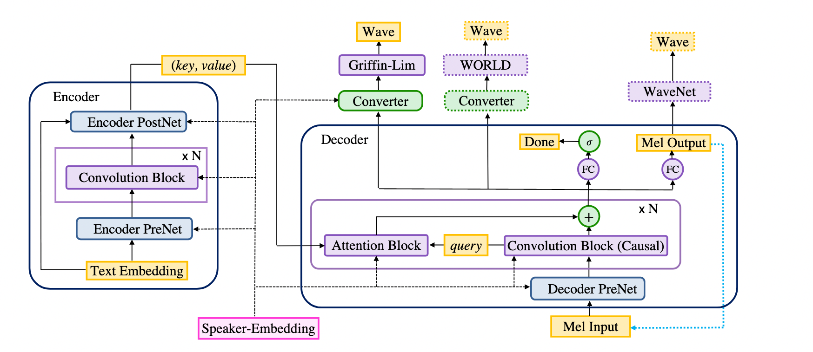

# Deep Voice 3 with Paddle Fluid


Paddle 实现的 Deepvoice3，一个基于卷积神经网络的语音合成 (Text to Speech) 模型。本实现基于 [Deep Voice 3: Scaling Text-to-Speech with Convolutional Sequence Learning](https://arxiv.org/abs/1710.07654) 。

本 Deepvoice3 实现使用 Paddle 动态图模式，这对于灵活的网络结构更为方便。

## 安装

### 安装 paddlepaddle 框架

本实现依赖 paddlepaddle 1.6 版本。用户可以安装编译好的包，也可以选择从源码编译 Paddle。

1. 通过 pip, conda 或者 docker 安装编译好的包。请参考[**安装说明**](https://www.paddlepaddle.org.cn/documentation/docs/zh/beginners_guide/install/index_cn.html)。

2. 从源码编译 Paddle. 参考[**从源码编译**](https://www.paddlepaddle.org.cn/documentation/docs/zh/beginners_guide/install/compile/fromsource.html) 页面。注意，如果你需要使用多卡训练，那么编译前需要设置选项 `-DWITH_DISTRIBUTE=ON`。

### 其他依赖

使用 pip 安装其他依赖。

```bash
pip install -r requirements.txt
```

另外需要下载 nltk 的两个库，因为使用了 `punkt` 对文本进行 tokenization，并且使用了 `cmudict` 来将文本转为音位。

```python
import nltk
nltk.download("punkt")
nltk.download("cmudict")
```

## 模型结构



模型包含 encoder, decoder, converter 几个部分，对于 multispeaker 数据集，还有一个 speaker embedding。其中 encoder 和 decoder 构成 seq2seq 部分，converter 构成 postnet 部分。

## 项目结构

```text
├── audio.py                        # 用于处理处理音频的函数
├── compute_timestamp_ratio.py      # 计算 position rate 的脚本
├── conversion                      # 用于转换 pytorch 实现的参数
├── requirements.txt                # 项目依赖
├── hparams.py                      # DeepVoice3 运行超参数配置类的定义
├── hparam_tf                       # 超参数相关
├── ljspeech.py                     # ljspeech 数据集预处理
├── preprocess.py                   # 通用预处理脚本
├── presets                         # 预设超参数配置
├── deepvoice3_paddle               # DeepVoice3 模型实现的主要文件
├── eval_model.py                   # 模型测评相关函数
├── synthesis.py                    # 用于语音合成的脚本
├── train_model.py                  # 模型训练相关函数
└── train.py                        # 用于模型训练的脚本
```

## 使用方法

根据所使用的模型配置和数据集的不同，有不少超参数需要进行调节。我们提供已知结果较好的超参数设置，详见 `presets` 文件夹。目前我们只提供 LJSpeech 的预设配置 （`deepvoice3_ljspeech.json`）。后续将提供更多模型和数据集的预设配置。

`preprocess.py`，`train.py`，`synthesis.py` 都接受 `--preset` 参数。为了保持一致性，最好在数据预处理，模型训练和语音合成时使用相同的预设配置。

可以通过 `--hparams` 参数来覆盖预设的超参数配置，参数格式是逗号分隔的键值对 `${key}=${value}`，例如 `--hparams="batch_size=8, nepochs=500"`。

部分参数只和训练有关，如 `batch_size`, `checkpoint_interval`, 用户在训练时可以使用不同的值。但部分参数和数据预处理相关，如 `num_mels` 和 `ref_level_db`, 这些参数在数据预处理和训练时候应该保持一致。

关于超参数设置更多细节可以参考 `hparams.py` ，其中定义了 hparams。超参数的优先级序列是：通过命令行参数 `--hparams` 传入的参数优先级高于通过 `--preset` 参数传入的 json 配置文件，高于 `hparams.py` 中的定义。

### 数据集

下载并解压 [LJSpeech](https://keithito.com/LJ-Speech-Dataset/) 数据集。

```bash
wget https://data.keithito.com/data/speech/LJSpeech-1.1.tar.bz2
tar xjvf LJSpeech-1.1.tar.bz2
```

使用 `preprocess.py`进行预处理。

```bash
python preprocess.py \
    --preset=${preset_json_path} \
    --hparams="hyper parameters you want to overwrite" \
    ${name} ${in_dir} ${out_dir}
```

目前 `${name}$` 只支持 `ljspeech`。未来将会支持更多数据集。

假设你使用 `presers/deepvoice3_ljspeech.json` 作为处理 LJSpeech 的预设配置文件，并且解压后的数据集位于  `./data/LJSpeech-1.1`, 那么使用如下的命令进行数据预处理。

```bash
python preprocess.py \
    --preset=presets/deepvoice3_ljspeech.json \
    ljspeech ./data/LJSpeech-1.1/ ./data/ljspeech
```

数据处理完成后，你会在 `./data/ljspeech` 看到提取的特征，包含如下文件。

1. `train.txt`，包含文本和对应的音频特征的文件名。
2. `ljspeech-mel-*.npy`，包含 mel 频谱。
3. `ljspeech-spec-*.npy`，包含线性频谱。

### 使用 GPU 单卡训练

在单个 GPU 上训练整个模型的使用方法如下。

```bash
export CUDA_VISIBLE_DEVICES=0
python train.py --data-root=${data-root} --use-gpu \
    --preset=${preset_json_path} \
    --hparams="parameters you may want to override"
```

用于可以通过 `python train.py --help` 查看 `train.py` 的详细使用方法。

#### 加载保存的模型

用户可以通过 `--checkpoint` 参数加载保存的模型并恢复训练。如果你想要重置优化器的状态，在训练脚本加入 `--reset-optimizer` 参数。

#### 训练模型的一部分

用户可以通过 `--train-seq2seq-only` 或者 `--train-postnet-only` 来实现固定模型的其他部分，只训练需要训练的部分。但当只训练模型的一部分时，其他的部分需要从保存的模型中加载。

当只训练模型的 `seq2seq` 部分或者 `postnet` 部分时，需要使用 `--checkpoint` 加载整个模型并保持相同的配置。注意，当只训练 `postnet` 的时候，需要保证配置中的`use_decoder_state_for_postnet_input=false`，因为在这种情况下，postnet 使用真实的 mel 频谱作为输入。注意，`use_decoder_state_for_postnet_input` 的默认值是 `True`。

示例:

```bash
export CUDA_VISIBLE_DEVICES=0
python train.py --data-root=${data-root} --use-gpu \
    --preset=${preset_json_path} \
    --hparams="parameters you may want to override" \
    --train-seq2seq-only \
    --output=${directory_to_save_results}
```

### 使用 GPU 多卡训练

本模型支持使用多个 GPU 通过数据并行的方式训练。方法是使用 `paddle.distributed.launch` 模块来启动 `train.py`。

```bash
python -m paddle.distributed.launch \
    --started_port ${port_of_the_first_worker} \
    --selected_gpus ${logical_gpu_ids_to_choose} \
    --log_dir ${path_to_write_log} \
    training_script ...
```

paddle.distributed.launch 通过多进程的方式进行并行训练。`--selected_gpus` 指的是选择的 GPU 的逻辑序号，`started_port` 指的是 0 号显卡的使用的端口号，`--log_dir` 是日志保存的目录，每个进程的输出会在这个文件夹中保存为单独的文件。再在后面接上需要启动的脚本文件及其参数即可。这部分和单卡训练的脚本一致，但是需要传入 `--use-data-paralle` 以使用数据并行训练。示例命令如下。

```bash
export CUDA_VISIBLE_DEVICES=2,3,4,5    # The IDs of visible physical devices
python -m paddle.distributed.launch \
    --selected_gpus=0,1,2,3 --log_dir ${multi_gpu_log_dir} \
    train.py --data-root=${data-root} \
    --use-gpu --use-data-parallel \
    --preset=${preset_json_path} \
    --hparams="parameters you may want to override" \
    --output=${directory_to_save_results}
```

上述的示例中，设置了 `2, 3, 4, 5` 号显卡为可见的 GPU。然后 `--selected_gpus=0,1,2,3` 选择的是 GPU 的逻辑序号，分别对应于  `2, 3, 4, 5` 号卡。

模型 (模型参数保存为`*.pdparams` 文件，优化器被保存为 `*.pdopt` 文件)保存在 `${directory_to_save_results}/checkpoints` 文件夹中。多层平均的注意力机制对齐结果被保存为 `.png` 图片，默认保存在 `${directory_to_save_results}/checkpoints/alignment_ave` 中。每一层的注意力机制对齐结果默认被保存在 `${directory_to_save_results}/checkpoints/alignment_layer{attention_layer_num}`文件夹中。默认每 10000 步保存一次用于查看。

对 6 个给定的句子的语音合成结果保存在 `${directory_to_save_results}/checkpoints/eval` 中，包含多层平均平均的注意力机制对齐结果，这被保存为名为  `step{step_num}_text{text_id}_single_alignment.png` 的图片；以及合成的音频文件，保存为名为 `step{step_num}_text{text_id}_single_predicted.wav` 的音频。


### 使用 Tensorboard 查看训练

Tensorboard 训练日志被保存在 `${directory_to_save_results}/log/` 文件夹，可以通过 tensorboard 查看。使用方法如下。

```bash
tensorboard --logdir=${log_dir} --host=$HOSTNAME --port=8888
```

### 从保存的模型合成语音

给定一组文本，使用  `synthesis.py` 从一个训练好的模型来合成语音，使用方法如下。

```bash
python synthesis.py --use-gpu --preset=${preset_json_path} \
    --hparams="parameters you may want to override" \
      ${checkpoint} ${text_list_file} ${dst_dir}
```

示例文本文件如下:

```text
Generative adversarial network or variational auto-encoder.
Once upon a time there was a dear little girl who was loved by every one who looked at her, but most of all by her grandmother, and there was nothing that she would not have given to the child.
A text-to-speech synthesis system typically consists of multiple stages, such as a text analysis frontend, an acoustic model and an audio synthesis module.
```

合成的结果包含注意力机制对齐结果和音频文件，保存于 `${dst_dir}`。

### 计算 position rate

根据 [Deep Voice 3: Scaling Text-to-Speech with Convolutional Sequence Learning](https://arxiv.org/abs/1710.07654), 对于不同的数据集，会有不同的 position rate. 有两个不同的 position rate，一个用于 query 一个用于 key， 这在论文中称为 $\omega_1$ 和 $\omega_2$ ，在预设配置文件中的名字分别为 `query_position_rate` 和 `key_position_rate`。

比如 LJSpeech 数据集的 `query_position_rate` 和 `key_position_rate` 分别为 `1.0` 和 `1.385`。固定 `query_position_rate` 为 1.0，`key_position_rate` 可以使用 `compute_timestamp_ratio.py` 计算，命令如下，其中 `${data_root}` 是预处理后的数据集路径。

```bash
python compute_timestamp_ratio.py --preset=${preset_json_path} \
    --hparams="parameters you may want to override" ${data_root}
```

可以得到如下的结果。

```text
100%|██████████████████████████████████████████████████████████| 13047/13047 [00:12<00:00, 1058.19it/s]
1345587 1863884.0 1.3851828235558161
```

然后在预设配置文件中设置 `key_position_rate=1.385` 以及 `query_position_rate=1.0`。

## 致谢

本实现包含及改写了 r9y9's 的 [deepvoice3_pytorch](https://github.com/r9y9/deepvoice3_pytorch) 中的部分文件，在此表示感谢。
