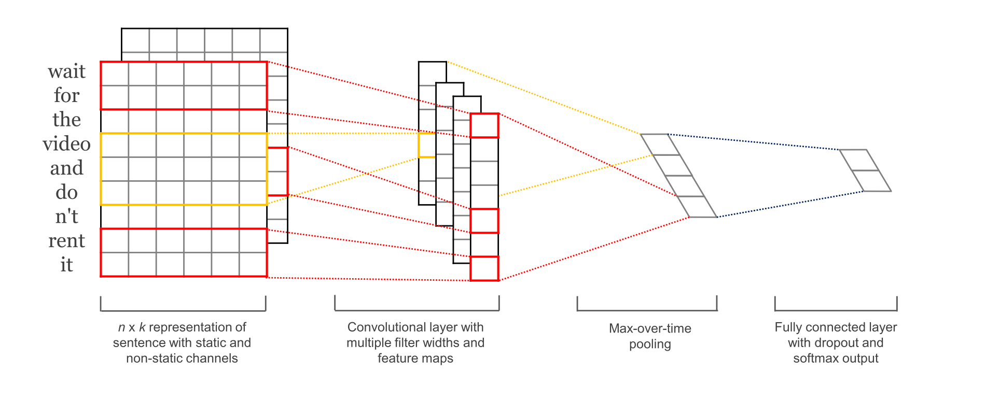

运行本目录下的程序示例需要使用PaddlePaddle v0.10.0 版本。如果您的PaddlePaddle安装版本低于此要求，请按照[安装文档](http://www.paddlepaddle.org/docs/develop/documentation/zh/build_and_install/pip_install_cn.html)中的说明更新PaddlePaddle安装版本。

---

# Convolutional Neural Networks for Sentence Classification 模型复现

以下是本例目录包含的文件以及对应说明:

```
.
├── images              # 说明文档中的图片
│   ├── intro.png
│   └── structure.png
├── infer.py            # 预测脚本
├── network_conf.py     # 论文模型中所涉及的网络结构
├── reader.py           # 读取数据接口
├── README.md           # 说明文档
├── train.py            # 训练脚本
└── utils.py            # 定义通用的函数，例如：打印日志、解析命令行参数、构建字典、加载字典等
```

## 简介
传统的句子分类器一般使用SVM和Naive Bayes。传统方法使用的文本表示方法大多是“词袋模型”。即只考虑文本中词的出现的频率，不考虑词的序列信息。传统方法也可以强行使用N-gram的方法，但是这样会带来稀疏问题，意义不大。

**CNN（卷积神经网络）**，虽然出身于图像处理，但是它的思路，给我们提供了在NLP应用上的参考。**“卷积”**这个术语本身来自于信号处理，简单地说就是一系列的输入信号进来之后，系统也会有一系列的输出。但是并不是某一时刻的输出只对应该时刻的输入，而是根据系统自身的特征，**每一个时刻的输出，都和之前的输入相关**。那么如果文本是一些列输入，我们当然希望考虑词和词的序列特征，比如“Tom 的 手机 ”，使用卷积，系统就会知道“手机是tom”的，而不是仅仅是一个“手机”。
<p align="center">
<br/>
图1. 常见的 CNN 文本分类模型
</p>

或者更直观地理解，在CNN模型中，卷积就是拿**kernel**在图像上移动，每移动一次提取一次特征，组成feature map， 这个提取特征的过程，就是卷积。

这里实现了Yoon Kim的paper[Convolutional Neural Networks for Sentence Classification (EMNLP 2014)](https://link.jianshu.com/?t=http://arxiv.org/abs/1408.5882)中的模型


## 模型详解

`network_conf.py` 中包括以下模型：

`cnn_network`：浅层 CNN 模型，是一个基础的序列模型，能够处理变长的序列输入，提取一个局部区域之内的特征。


**CNN 模型结构如下图所示：**

<p align="center">
<br/>
图2. 论文中的 CNN 文本分类模型
</p>

通过 PaddlePaddle 实现该 CNN 结构的代码见 `network_conf.py` 中的 `convolution_net` 函数，模型主要分为如下几个部分:

- **数据预处理**：对原始数据进行一定的预处理，使之符合模型输入的要求。

```
data = paddle.layer.data("word",
                             paddle.data_type.integer_value_sequence(dict_dim))
    lbl = paddle.layer.data("label", paddle.data_type.integer_value(class_dim))

```

- **词向量层**：将词语转化为固定维度的向量，利用向量之间的距离来表示词之间的语义相关程度。

```
 emb = paddle.layer.embedding(input=data, size=emb_dim)
```

- **卷积层**： 文本分类中的卷积在时间序列上进行，即卷积核的宽度和词向量层产出的矩阵一致，卷积沿着矩阵的高度方向进行。

```
conv_3 = paddle.networks.sequence_conv_pool(
        input=emb, context_len=3, hidden_size=hid_dim)
```

- **最大池化层**: 对卷积得到的各个特征图分别进行最大池化操作。由于特征图本身已经是向量，因此这里的最大池化实际上就是简单地选出各个向量中的最大元素。

```
 conv_4 = paddle.networks.sequence_conv_pool(
        input=emb, context_len=4, hidden_size=hid_dim)
```

- **全连接与输出层**：将最大池化的结果通过全连接层输出:

```
prob = paddle.layer.fc(input=[conv_3, conv_4],
                           size=class_dim,
                           act=paddle.activation.Softmax())
```

## 模型使用

### 训练

在终端中执行 `python train.py --nn_type=cnn --batch_size=64 num_passes=20` 命令， 将以 PaddlePaddle 内置的情感分类数据集：`paddle.dataset.imdb` 直接运行本例，会看到如下输入：

```text
Pass 0, Batch 0, Cost 0.696031, {'__auc_evaluator_0__': 0.47360000014305115, 'classification_error_evaluator': 0.5}
Pass 0, Batch 100, Cost 0.544438, {'__auc_evaluator_0__': 0.839249312877655, 'classification_error_evaluator': 0.30000001192092896}
Pass 0, Batch 200, Cost 0.406581, {'__auc_evaluator_0__': 0.9030032753944397, 'classification_error_evaluator': 0.2199999988079071}
Test at Pass 0, {'__auc_evaluator_0__': 0.9289745092391968, 'classification_error_evaluator': 0.14927999675273895}
```
日志每隔 100 个 batch 输出一次，输出信息包括：

（1）Pass 序号；

（2）Batch 序号；

（3）依次输出当前 Batch 上评估指标的评估结果。评估指标在配置网络拓扑结构时指定，在上面的输出中，输出了训练样本集之的 AUC 以及错误率指标。

### 预测

训练结束后模型默认存储在当前工作目录下，在终端中执行 `python infer.py` ，预测脚本会加载训练好的模型进行预测。

- 默认加载使用 `paddle.data.imdb.train` 训练一个 Pass 产出的 CNN 模型对 `paddle.dataset.imdb.test` 进行测试

会看到如下输出：

```
positive        0.9275 0.0725   previous reviewer <unk> <unk> gave a much better <unk> of the films plot details than i could what i recall mostly is that it was just so beautiful in every sense emotionally visually <unk> just <unk> br if you like movies that are wonderful to look at and also have emotional content to which that beauty is relevant i think you will be glad to have seen this extraordinary and unusual work of <unk> br on a scale of 1 to 10 id give it about an <unk> the only reason i shy away from 9 is that it is a mood piece if you are in the mood for a really artistic very romantic film then its a 10 i definitely think its a mustsee but none of us can be in that mood all the time so overall <unk>
negative        0.0300 0.9700   i love scifi and am willing to put up with a lot scifi <unk> are usually <unk> <unk> and <unk> i tried to like this i really did but it is to good tv scifi as <unk> 5 is to star trek the original silly <unk> cheap cardboard sets stilted dialogues cg that doesnt match the background and painfully onedimensional characters cannot be overcome with a scifi setting im sure there are those of you out there who think <unk> 5 is good scifi tv its not its clichéd and <unk> while us viewers might like emotion and character development scifi is a genre that does not take itself seriously <unk> star trek it may treat important issues yet not as a serious philosophy its really difficult to care about the characters here as they are not simply <unk> just missing a <unk> of life their actions and reactions are wooden and predictable often painful to watch the makers of earth know its rubbish as they have to always say gene <unk> earth otherwise people would not continue watching <unk> <unk> must be turning in their <unk> as this dull cheap poorly edited watching it without <unk> breaks really brings this home <unk> <unk> of a show <unk> into space spoiler so kill off a main character and then bring him back as another actor <unk> <unk> all over again
```

输出日志每一行是对一条样本预测的结果，以 `\t` 分隔，共 3 列，分别是：

（1）预测类别标签；

（2）样本分别属于每一类的概率，内部以空格分隔；

（3）输入文本。