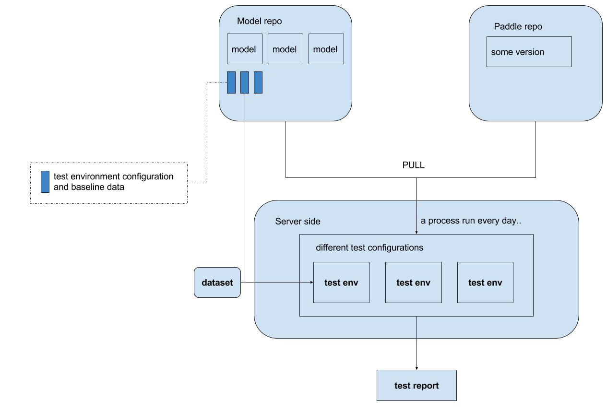

# Models continuous integration

This framework is aim to add continuous integration for official models based on PaddlePaddle.

## Background
Currently, there are two official repos that provide open source models based on PaddlePaddle:

- `PaddlePaddle/book`, provides eight models as a detailed tutorial.
- `PaddlePaddle/models`, offers a bunch of popular models for application.

These models are written in Paddle V2 framework, and will be migrated to fluid framework.

Recently, PaddlePaddle is in rapid development and iteration, 
there might be some effect and perormance gap between different versions, and this will trouble users, and bring risk to their products.

To help find out the unstable PaddlePaddle versions, 
models needs a continuous integration framework which helps to check the status of PaddlePaddle platform in the level of models granularity.

## Goal
This project is aim to build a continuous integration framework for models in `PaddlePaddle/book` and `PaddlePaddle/models`.

It will not stop the merging of pull request in PaddlePaddle repo, but help to highlight which version is unstable.

It will check model status based on the latest version of PaddlePaddle, the status includes

- model effect including training cost and test cost.
- model performance including training cost and test cost.
- memory usage
- CPU usage
- GPU usage(memory and computation)

## Implementation
This project will includes 

- a standard doc describing the rule of utilizing this project for a model.
  - there might be some configurations for the test for each model
  - some baseline effect and performance data should be in the version control.
- a python SDK which helps the test environment configuration
  - the configuration of device
  - learning rate
  - kind of optimizer
  - and all the other configuration that might affect model effect/performance except network structure should be awared by the framework.
- a framework(might be a seperated repo) that implements the testing logic on server side
  - launching the training process
  - collecting log files
  - generating a detailed report

The task lifetime is as follows

  

The server-side test framework will test the models based on the latest version of PaddlePaddle, 
get the logs and check the statis with the baseline data, and produce a report.

Detailed process:

1. periodicly run server-side check
  - pull latest model from repo
  - pull latest PaddlePaddle from repo
  - build
  - for each model
    - for each test-config
      - build a test env container
      - run
      - collect log infomations
      - compare with the baseline records
    - aggregate a report 
2. output the final report
3. if `FAIL`, alert

There are several records in the report:

- whether task is failed
- cost distribution of both training and testing phase.
- commid-ids of model and PaddlePaddle
- test time

If the statis is far from the baseline, this report will alert a `FAIL` signal, 
and developer can rerun the test and check whether there are some bugs in recently merged pull requests.
