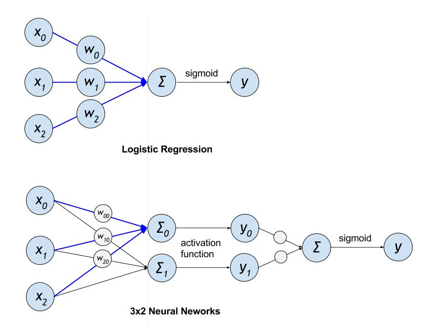
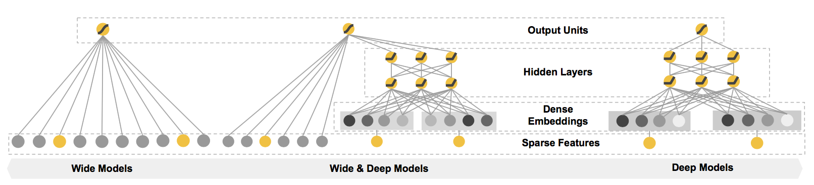

The minimum PaddlePaddle version needed for the code sample in this directory is v0.10.0. If you are on a version of PaddlePaddle earlier than v0.10.0, [please update your installation](http://www.paddlepaddle.org/docs/develop/documentation/en/build_and_install/pip_install_en.html).

---

# Click-Through Rate Prediction

## Introduction

CTR(Click-Through Rate)\[[1](https://en.wikipedia.org/wiki/Click-through_rate)\]
is a prediction of the probability that a user clicks on an advertisement. This model is widely used in the advertisement industry. Accurate click rate estimates are important for maximizing online advertising revenue.

When there are multiple ad slots, CTR estimates are generally used as a baseline for ranking. For example, in a search engine's ad system, when the user enters a query, the system typically performs the following steps to show relevant ads.

1.  Get the ad collection associated with the user's search term.
2.  Business rules and relevance filtering.
3.  Rank by auction mechanism and CTR.
4.  Show ads.

Here，CTR plays a crucial role.

### Brief history
Historically, the CTR prediction model has been evolving as follows.

-   Logistic Regression(LR) / Gradient Boosting Decision Trees (GBDT) + feature engineering
-   LR + Deep Neural Network (DNN)
-   DNN + feature engineering

In the early stages of development LR dominated, but the recent years DNN based models are mainly used.


### LR vs DNN

The following figure shows the structure of LR and DNN model:

<p align="center">
 <br/>
Figure 1.  LR and DNN model structure comparison
</p>

We can see, LR and CNN have some common structures. However, DNN can have non-linear relation between input and output values by adding activation unit and further layers. This enables DNN to achieve better learning results in CTR estimates.

In the following, we demonstrate how to use PaddlePaddle to learn to predict CTR.

## Data and Model formation

Here `click` is the learning objective. There are several ways to learn the objectives.

1.  Direct learning click, 0,1 for binary classification
2.  Learning to rank, pairwise rank or listwise rank
3.  Measure the ad click rate of each ad, then rank by the click rate.

In this example, we use the first method.

We use the Kaggle `Click-through rate prediction` task \[[2](https://www.kaggle.com/c/avazu-ctr-prediction/data)\].

Please see the [data process](./dataset.md) for pre-processing data.

The input data format for the demo model in this tutorial is as follows:

```
# <dnn input ids> \t <lr input sparse values> \t click
1 23 190 \t 230:0.12 3421:0.9 23451:0.12 \t 0
23 231 \t 1230:0.12 13421:0.9 \t 1
```

Description：

- `dnn input ids` one-hot coding.
- `lr input sparse values` Use `ID:VALUE` , values are preferaly scaled to the range `[-1, 1]`。

此外，模型训练时需要传入一个文件描述 dnn 和 lr两个子模型的输入维度，文件的格式如下：

```
dnn_input_dim: <int>
lr_input_dim: <int>
```

<int> represents an integer value.

`avazu_data_processor.py` can be used to download the data set \[[2](#参考文档)\]and pre-process the data.

```
usage: avazu_data_processer.py [-h] --data_path DATA_PATH --output_dir
                               OUTPUT_DIR
                               [--num_lines_to_detect NUM_LINES_TO_DETECT]
                               [--test_set_size TEST_SET_SIZE]
                               [--train_size TRAIN_SIZE]

PaddlePaddle CTR example

optional arguments:
  -h, --help            show this help message and exit
  --data_path DATA_PATH
                        path of the Avazu dataset
  --output_dir OUTPUT_DIR
                        directory to output
  --num_lines_to_detect NUM_LINES_TO_DETECT
                        number of records to detect dataset's meta info
  --test_set_size TEST_SET_SIZE
                        size of the validation dataset(default: 10000)
  --train_size TRAIN_SIZE
                        size of the trainset (default: 100000)
```

- `data_path` The data path to be processed
- `output_dir` The output path of the data
- `num_lines_to_detect` The number of generated IDs
- `test_set_size` The number of rows for the test set
- `train_size` The number of rows of training set

## Wide & Deep Learning Model

Google proposed a model framework for Wide & Deep Learning to integrate the advantages of both DNNs suitable for learning abstract features and LR models for large sparse features.


### Introduction to the model

Wide & Deep Learning Model\[[3](#References)\] is a relatively mature model, but this model is still being used in the CTR predicting task. Here we demonstrate the use of this model to complete the CTR predicting task.

The model structure is as follows:

<p align="center">
 <br/>
Figure 2. Wide & Deep Model
</p>

The wide part of the top side of the model can accommodate large-scale coefficient features and has some memory for some specific information (such as ID); and the Deep part of the bottom side of the model can learn the implicit relationship between features.


### Model Input

The model has three inputs as follows.

-   `dnn_input` ，the Deep part of the input
-   `lr_input` ，the wide part of the input
-   `click` ， click on or not

```python
dnn_merged_input = layer.data(
    name='dnn_input',
    type=paddle.data_type.sparse_binary_vector(self.dnn_input_dim))

lr_merged_input = layer.data(
    name='lr_input',
    type=paddle.data_type.sparse_vector(self.lr_input_dim))

click = paddle.layer.data(name='click', type=dtype.dense_vector(1))
```

### Wide part

Wide part uses of the LR model, but the activation function changed to `RELU` for speed.

```python
def build_lr_submodel():
    fc = layer.fc(
        input=lr_merged_input, size=1, name='lr', act=paddle.activation.Relu())
    return fc
```

### Deep part

The Deep part uses a standard multi-layer DNN.

```python
def build_dnn_submodel(dnn_layer_dims):
    dnn_embedding = layer.fc(input=dnn_merged_input, size=dnn_layer_dims[0])
    _input_layer = dnn_embedding
    for i, dim in enumerate(dnn_layer_dims[1:]):
        fc = layer.fc(
            input=_input_layer,
            size=dim,
            act=paddle.activation.Relu(),
            name='dnn-fc-%d' % i)
        _input_layer = fc
    return _input_layer
```

### Combine

The output section uses `sigmoid` function to output (0,1) as the prediction value.

```python
# conbine DNN and LR submodels
def combine_submodels(dnn, lr):
    merge_layer = layer.concat(input=[dnn, lr])
    fc = layer.fc(
        input=merge_layer,
        size=1,
        name='output',
        # use sigmoid function to approximate ctr, wihch is a float value between 0 and 1.
        act=paddle.activation.Sigmoid())
    return fc
```

### Training
```python
dnn = build_dnn_submodel(dnn_layer_dims)
lr = build_lr_submodel()
output = combine_submodels(dnn, lr)

# ==============================================================================
#                   cost and train period
# ==============================================================================
classification_cost = paddle.layer.multi_binary_label_cross_entropy_cost(
    input=output, label=click)


paddle.init(use_gpu=False, trainer_count=11)

params = paddle.parameters.create(classification_cost)

optimizer = paddle.optimizer.Momentum(momentum=0)

trainer = paddle.trainer.SGD(
    cost=classification_cost, parameters=params, update_equation=optimizer)

dataset = AvazuDataset(train_data_path, n_records_as_test=test_set_size)

def event_handler(event):
    if isinstance(event, paddle.event.EndIteration):
        if event.batch_id % 100 == 0:
            logging.warning("Pass %d, Samples %d, Cost %f" % (
                event.pass_id, event.batch_id * batch_size, event.cost))

        if event.batch_id % 1000 == 0:
            result = trainer.test(
                reader=paddle.batch(dataset.test, batch_size=1000),
                feeding=field_index)
            logging.warning("Test %d-%d, Cost %f" % (event.pass_id, event.batch_id,
                                           result.cost))


trainer.train(
    reader=paddle.batch(
        paddle.reader.shuffle(dataset.train, buf_size=500),
        batch_size=batch_size),
    feeding=field_index,
    event_handler=event_handler,
    num_passes=100)
```

## Run training and testing
The model go through the following steps:

1. Prepare training data
    1. Download train.gz from [Kaggle CTR](https://www.kaggle.com/c/avazu-ctr-prediction/data) .
    2. Unzip train.gz to get train.txt
    3. `mkdir -p output; python avazu_data_processer.py --data_path train.txt --output_dir output --num_lines_to_detect 1000 --test_set_size 100` 生成演示数据
2. Execute `python train.py --train_data_path ./output/train.txt --test_data_path ./output/test.txt --data_meta_file ./output/data.meta.txt --model_type=0`. Start training.

The argument options for `train.py` are as follows.

```
usage: train.py [-h] --train_data_path TRAIN_DATA_PATH
                [--test_data_path TEST_DATA_PATH] [--batch_size BATCH_SIZE]
                [--num_passes NUM_PASSES]
                [--model_output_prefix MODEL_OUTPUT_PREFIX] --data_meta_file
                DATA_META_FILE --model_type MODEL_TYPE

PaddlePaddle CTR example

optional arguments:
  -h, --help            show this help message and exit
  --train_data_path TRAIN_DATA_PATH
                        path of training dataset
  --test_data_path TEST_DATA_PATH
                        path of testing dataset
  --batch_size BATCH_SIZE
                        size of mini-batch (default:10000)
  --num_passes NUM_PASSES
                        number of passes to train
  --model_output_prefix MODEL_OUTPUT_PREFIX
                        prefix of path for model to store (default:
                        ./ctr_models)
  --data_meta_file DATA_META_FILE
                        path of data meta info file
  --model_type MODEL_TYPE
                        model type, classification: 0, regression 1 (default
                        classification)
```

- `train_data_path` ：  The path of the training set
- `test_data_path` : The path of the testing set
- `num_passes`: number of rounds of model training
- `data_meta_file`: Please refer to [数据和任务抽象](### 数据和任务抽象)的描述。
- `model_type`:  Model classification or regressio


## Use the training model for prediction
The training model can be used to predict new data, and the format of the forecast data is as follows.


```
# <dnn input ids> \t <lr input sparse values>
1 23 190 \t 230:0.12 3421:0.9 23451:0.12
23 231 \t 1230:0.12 13421:0.9
```

Here the only difference to the training data is that there is no label (i.e. `click` values).

We now can use `infer.py` to perform inference.

```
usage: infer.py [-h] --model_gz_path MODEL_GZ_PATH --data_path DATA_PATH
                --prediction_output_path PREDICTION_OUTPUT_PATH
                [--data_meta_path DATA_META_PATH] --model_type MODEL_TYPE

PaddlePaddle CTR example

optional arguments:
  -h, --help            show this help message and exit
  --model_gz_path MODEL_GZ_PATH
                        path of model parameters gz file
  --data_path DATA_PATH
                        path of the dataset to infer
  --prediction_output_path PREDICTION_OUTPUT_PATH
                        path to output the prediction
  --data_meta_path DATA_META_PATH
                        path of trainset's meta info, default is ./data.meta
  --model_type MODEL_TYPE
                        model type, classification: 0, regression 1 (default
                        classification)
```

- `model_gz_path_model`：path for `gz` compressed data.
- `data_path` ：
- `prediction_output_patj`：path for the predicted values s
- `data_meta_file` ：Please refer to [数据和任务抽象](### 数据和任务抽象)。
- `model_type` ：Classification or regression

The sample data can be predicted with the following command

```
python infer.py --model_gz_path <model_path> --data_path output/infer.txt --prediction_output_path predictions.txt --data_meta_path data.meta.txt
```

The final prediction is written in  `predictions.txt`。

## References
1. <https://en.wikipedia.org/wiki/Click-through_rate>
2. <https://www.kaggle.com/c/avazu-ctr-prediction/data>
3. Cheng H T, Koc L, Harmsen J, et al. [Wide & deep learning for recommender systems](https://arxiv.org/pdf/1606.07792.pdf)[C]//Proceedings of the 1st Workshop on Deep Learning for Recommender Systems. ACM, 2016: 7-10.
