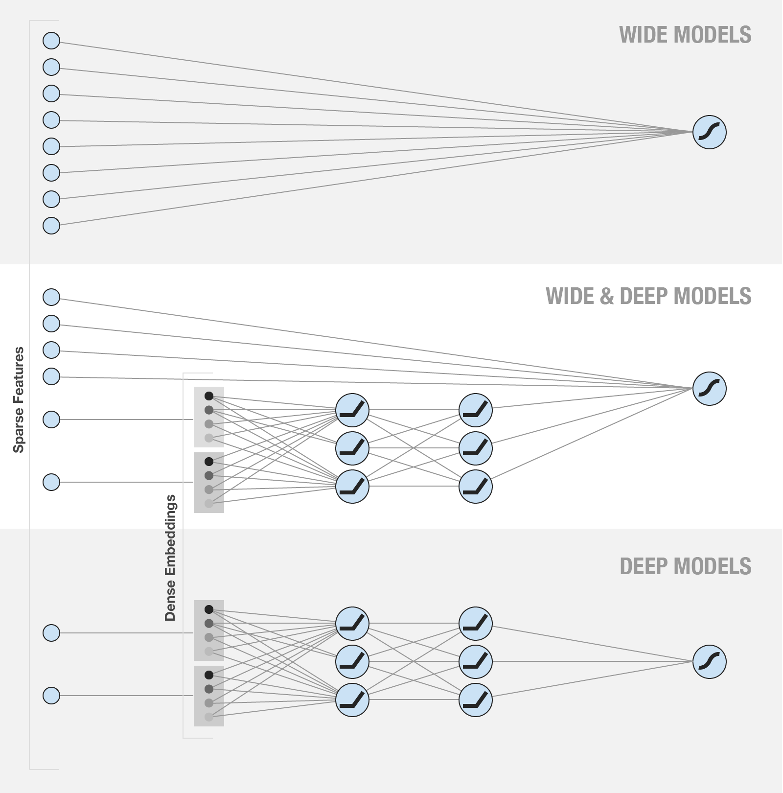

# CTR预估

## 背景介绍

CTR(Click-Through Rate)\[[1](https://en.wikipedia.org/wiki/Click-through_rate)\] 是用来表示用户点击一个特定链接的概率，
通常被用来衡量一个在线广告系统的有效性。

当有多个广告位时，CTR 预估一般会作为排序的基准。
比如在搜索引擎的广告系统里，当用户输入一个带商业价值的搜索词（query）时，系统大体上会执行下列步骤来展示广告：

1.  召回满足 query 的广告集合
2.  业务规则和相关性过滤
3.  根据拍卖机制和 CTR 排序
4.  展出广告

可以看到，CTR 在最终排序中起到了很重要的作用。
### 发展阶段
在业内，CTR 模型经历了如下的发展阶段：

-   Logistic Regression(LR) / GBDT + 特征工程
-   LR + DNN 特征
-   DNN + 特征工程

在发展早期时 LR 一统天下，但最近 DNN 模型由于其强大的学习能力和逐渐成熟的性能优化，
逐渐地接过 CTR 预估任务的大旗。


### LR vs DNN

下图展示了 LR 和一个 \(3x2\) 的 DNN 模型的结构：

<p align="center">
 <br/>
Figure 1. LR 和 DNN 模型结构对比
</p>

LR 的蓝色箭头部分可以直接类比到 DNN 中对应的结构，可以看到 LR 和 DNN 有一些共通之处（比如权重累加），
但前者的模型复杂度在相同输入维度下比后者可能低很多（从某方面讲，模型越复杂，越有潜力学习到更复杂的信息）。

如果 LR 要达到匹敌 DNN 的学习能力，必须增加输入的维度，也就是增加特征的数量，
这也就是为何 LR 和大规模的特征工程必须绑定在一起的原因。

LR 对于 DNN 模型的优势是对大规模稀疏特征的容纳能力，包括内存和计算量等方面，工业界都有非常成熟的优化方法。

而 DNN 模型具有自己学习新特征的能力，一定程度上能够提升特征使用的效率，
这使得 DNN 模型在同样规模特征的情况下，更有可能达到更好的学习效果。

本文后面的章节会演示如何使用 PaddlePaddle 编写一个结合两者优点的模型。


## 数据和任务抽象

我们可以将 `click` 作为学习目标，任务可以有以下几种方案：

1.  直接学习 click，0,1 作二元分类
2.  Learning to rank, 具体用 pairwise rank（标签 1>0）或者 listwise rank
3.  统计每个广告的点击率，将同一个 query 下的广告两两组合，点击率高的>点击率低的，做 rank 或者分类

我们直接使用第一种方法做分类任务。

我们使用 Kaggle 上 `Click-through rate prediction` 任务的数据集\[[2](https://www.kaggle.com/c/avazu-ctr-prediction/data)\] 来演示模型。

具体的特征处理方法参看 [data process](./dataset.md)


## Wide & Deep Learning Model

谷歌在 16 年提出了 Wide & Deep Learning 的模型框架，用于融合适合学习抽象特征的 DNN 和 适用于大规模稀疏特征的 LR 两种模型的优点。


### 模型简介

Wide & Deep Learning Model\[[3](#参考文献)\] 可以作为一种相对成熟的模型框架使用，
在 CTR 预估的任务中工业界也有一定的应用，因此本文将演示使用此模型来完成 CTR 预估的任务。

模型结构如下：

<p align="center">
 <br/>
Figure 2. Wide & Deep Model
</p>

模型左边的 Wide 部分，可以容纳大规模系数特征，并且对一些特定的信息（比如 ID）有一定的记忆能力；
而模型右边的 Deep 部分，能够学习特征间的隐含关系，在相同数量的特征下有更好的学习和推导能力。


### 编写模型输入

模型只接受 3 个输入，分别是

-   `dnn_input` ，也就是 Deep 部分的输入
-   `lr_input` ，也就是 Wide 部分的输入
-   `click` ， 点击与否，作为二分类模型学习的标签

```python
dnn_merged_input = layer.data(
    name='dnn_input',
    type=paddle.data_type.sparse_binary_vector(data_meta_info['dnn_input']))

lr_merged_input = layer.data(
    name='lr_input',
    type=paddle.data_type.sparse_binary_vector(data_meta_info['lr_input']))

click = paddle.layer.data(name='click', type=dtype.dense_vector(1))
```

### 编写 Wide 部分

Wide 部分直接使用了 LR 模型，但激活函数改成了 `RELU` 来加速

```python
def build_lr_submodel():
    fc = layer.fc(
        input=lr_merged_input, size=1, name='lr', act=paddle.activation.Relu())
    return fc
```

### 编写 Deep 部分

Deep 部分使用了标准的多层前向传导的 DNN 模型

```python
def build_dnn_submodel(dnn_layer_dims):
    dnn_embedding = layer.fc(input=dnn_merged_input, size=dnn_layer_dims[0])
    _input_layer = dnn_embedding
    for i, dim in enumerate(dnn_layer_dims[1:]):
        fc = layer.fc(
            input=_input_layer,
            size=dim,
            act=paddle.activation.Relu(),
            name='dnn-fc-%d' % i)
        _input_layer = fc
    return _input_layer
```

### 两者融合

两个 submodel 的最上层输出加权求和得到整个模型的输出，输出部分使用 `sigmoid` 作为激活函数，得到区间 (0,1) 的预测值，
来逼近训练数据中二元类别的分布，并最终作为 CTR 预估的值使用。

```python
# conbine DNN and LR submodels
def combine_submodels(dnn, lr):
    merge_layer = layer.concat(input=[dnn, lr])
    fc = layer.fc(
        input=merge_layer,
        size=1,
        name='output',
        # use sigmoid function to approximate ctr, wihch is a float value between 0 and 1.
        act=paddle.activation.Sigmoid())
    return fc
```

### 训练任务的定义
```python
dnn = build_dnn_submodel(dnn_layer_dims)
lr = build_lr_submodel()
output = combine_submodels(dnn, lr)

# ==============================================================================
#                   cost and train period
# ==============================================================================
classification_cost = paddle.layer.multi_binary_label_cross_entropy_cost(
    input=output, label=click)


paddle.init(use_gpu=False, trainer_count=11)

params = paddle.parameters.create(classification_cost)

optimizer = paddle.optimizer.Momentum(momentum=0)

trainer = paddle.trainer.SGD(
    cost=classification_cost, parameters=params, update_equation=optimizer)

dataset = AvazuDataset(train_data_path, n_records_as_test=test_set_size)

def event_handler(event):
    if isinstance(event, paddle.event.EndIteration):
        if event.batch_id % 100 == 0:
            logging.warning("Pass %d, Samples %d, Cost %f" % (
                event.pass_id, event.batch_id * batch_size, event.cost))

        if event.batch_id % 1000 == 0:
            result = trainer.test(
                reader=paddle.batch(dataset.test, batch_size=1000),
                feeding=field_index)
            logging.warning("Test %d-%d, Cost %f" % (event.pass_id, event.batch_id,
                                           result.cost))


trainer.train(
    reader=paddle.batch(
        paddle.reader.shuffle(dataset.train, buf_size=500),
        batch_size=batch_size),
    feeding=field_index,
    event_handler=event_handler,
    num_passes=100)
```
## 运行训练和测试
训练模型需要如下步骤：

1. 下载训练数据，可以使用 Kaggle 上 CTR 比赛的数据\[[2](#参考文献)\]
2. 将训练数据的路径传给 `train.py` ，开始训练

上面第2个步骤可以为 `train.py` 填充命令行参数来定制模型的训练过程，具体的命令行参数及用法如下

```
usage: train.py [-h] --train_data_path TRAIN_DATA_PATH
                [--batch_size BATCH_SIZE] [--test_set_size TEST_SET_SIZE]
                [--num_passes NUM_PASSES]
                [--num_lines_to_detact NUM_LINES_TO_DETACT]

PaddlePaddle CTR example

optional arguments:
  -h, --help            show this help message and exit
  --train_data_path TRAIN_DATA_PATH
                        path of training dataset
  --batch_size BATCH_SIZE
                        size of mini-batch (default:10000)
  --test_set_size TEST_SET_SIZE
                        size of the validation dataset(default: 10000)
  --num_passes NUM_PASSES
                        number of passes to train
  --num_lines_to_detact NUM_LINES_TO_DETACT
                        number of records to detect dataset's meta info
```
比如执行 `python train.py --train_data_path ./train.txt` 来对目录下的 `train.txt` 建立训练任务。

## 参考文献
1. <https://en.wikipedia.org/wiki/Click-through_rate>
2. <https://www.kaggle.com/c/avazu-ctr-prediction/data>
3. Cheng H T, Koc L, Harmsen J, et al. [Wide & deep learning for recommender systems](https://arxiv.org/pdf/1606.07792.pdf)[C]//Proceedings of the 1st Workshop on Deep Learning for Recommender Systems. ACM, 2016: 7-10.
