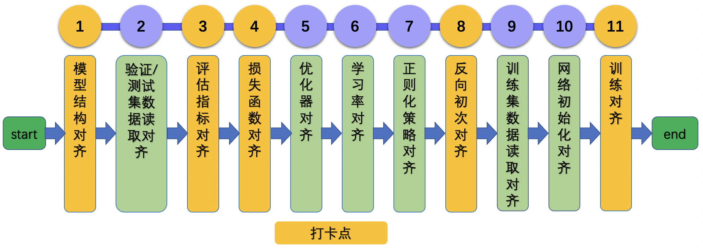

# 论文复现赛指南

## 1. 总览

### 1.1 背景

* 以深度学习为核心的人工智能技术仍在高速的渗透（AI+行业）和创新（AI+科学计算），复现论文是为了更好的掌握第二步能力。
* 在论文复现的过程中，开发者也可以获得
    * 自我能力提升
    * 成果被千万开发者使用的成就
    * 对科研或工作有所帮助和启发
    * 奖金

### 1.2 前序工作

基于本文规范复现论文过程中，建议开发者准备以下内容。

* 了解该模型输入输出格式。以AlexNet图像分类任务为例，通过阅读论文与参考代码，了解到模型输入为`[batch_size, 3, 224, 244]`的tensor，类型为`float32`或者`float16`，label为`[batch, ]`的label，类型为`int64`。
* 准备好训练/验证数据集，用于模型训练与评估
* 准备好fake input data以及label，与模型输入shape、type等保持一致，用于后续模型前向对齐。
    * 在对齐模型前向过程中，我们不需要考虑数据集模块等其他模块，此时使用fake data是将模型结构和数据部分解耦非常合适的一种方式。
    * 将fake data以文件的形式存储下来，也可以保证PaddlePaddle与参考代码的模型结构输入是完全一致的，更便于排查问题。
    * 在该步骤中，以AlexNet为例，生成fake data的脚本可以参考：[gen_fake_data.py](https://github.com/littletomatodonkey/AlexNet-Prod/blob/master/pipeline/fake_data/gen_fake_data.py)。
* 在特定设备(CPU/GPU)上，跑通参考代码的预测过程(前向)以及至少2轮(iteration)迭代过程，保证后续基于PaddlePaddle复现论文过程中可对比。
* 本文档基于 `AlexNet-Prod` 代码以及`reprod_log` whl包进行说明与测试。如果希望体验，建议参考[AlexNet-Reprod文档](https://github.com/littletomatodonkey/AlexNet-Prod/blob/master/README.md)进行安装与测试。


## 2. 整体框图

### 2.1 流程概览

基于通用的计算机视觉任务，论文复现整体流程图如下所示。




总共包含11个步骤，为了高效复现论文，设置了5个验收节点。如上图中黄色框所示。对应地，第3章到第5章的内容安排如下：

* 第3章：介绍11个复现步骤的理论知识以及操作方法
* 第4章：介绍5个验收节点的自查与验收方法
* 第5章：针对第3章在复现流程过程中可能出现的问题，在第5章会进行详细介绍。如果还是不能解决问题的话，可以进交流群讨论


### 2.2 reprod_log whl包使用说明

`reprod_log`是用于论文复现赛自动化测试和验收的工具，源代码地址在：[https://github.com/WenmuZhou/reprod_log](https://github.com/WenmuZhou/reprod_log)。主要功能包括：

* 存取指定节点的输入输出tensor
* 基于文件的tensor读写
* 2个字典的对比验证
* 对比结果的输出与记录

在论文复现赛中，主要用到的reprod_log类如下所示。

* ReprodLogger
    * 功能：记录和保存复现过程中的中间变量，用于后续的diff排查
    * 初始化参数：无
    * 方法
        * add(key, val)
            * 功能：向logger中添加key-val pair
            * 输入
                * key (str) : PaddlePaddle中的key与参考代码中保存的key应该完全相同，否则会提示报错
                * value (numpy.ndarray) : key对应的值
            * 返回: None
        * remove(key)
            * 功能：移除logger中的关键字段key及其value
            * 输入
                * key (str) : 关键字段
                * value (numpy.ndarray) : key对应的值
            * 返回: None
        * clear()
            * 功能：清空logger中的关键字段key及其value
            * 输入: None
            * 返回: None
        * save(path)
            * 功能：将logger中的所有的key-value信息保存到文件中
            * 输入:
                * path (str): 路径
            * 返回: None
* ReprodDiffHelper
    * 功能：对`ReprodLogger`保存的日志文件进行解析，打印与记录diff
    * 初始化参数：无
    * 方法
        * load_info(path)
            * 功能：加载
            * 输入:
                * path (str): 日志文件路径
            * 返回: dict信息，key为str，value为numpy.ndarray
        * compare_info(info1, info2)
            * 功能：计算两个字典对于相同key的value的diff，具体计算方法为`diff = np.abs(info1[key] - np.abs(info[key]))`
            * 输入:
                * info1/info2 (dict): PaddlePaddle与参考代码保存的文件信息
            * 返回: diff的dict信息
        * report(diff_method="mean", diff_threshold=1e-6, path="./diff.txt")
            * 功能：可视化diff，保存到文件或者到屏幕
            * 参数
                * diff_method (str): diff计算方法，包括`mean`、`min`、`max`、`all`，默认为`mean`
                * diff_threshold (float): 阈值，如果diff大于该阈值，则核验失败，默认为`1e-6`
                * path (str): 日志保存的路径，默认为`./diff.txt`

### 2.3 使用demo

下面基于代码：[https://github.com/littletomatodonkey/AlexNet-Prod/tree/master/pipeline/reprod_log_demo](https://github.com/littletomatodonkey/AlexNet-Prod/tree/master/pipeline/reprod_log_demo)，给出详细的工具包API使用功能。

文件夹中包含`write_log.py`和`check_log_diff.py`文件，其中`write_log.py`中给出了`ReprodLogger`类的使用方法，`check_log_diff.py`给出了`ReprodDiffHelper`类的使用方法，依次运行两个python文件，使用下面的方式运行代码。

```shell
# 进入文件夹
cd pipeline/reprod_log_demo
# 随机生成矩阵，写入文件中
python3.7 write_log.py
# 进行文件对比，输出日志
python3.7 check_log_diff.py
```

最终会输出以下内容

```
2021-09-28 01:07:44,832 - reprod_log.utils - INFO - demo_test_1:
2021-09-28 01:07:44,832 - reprod_log.utils - INFO -     mean diff: check passed: True, value: 0.0
2021-09-28 01:07:44,832 - reprod_log.utils - INFO - demo_test_2:
2021-09-28 01:07:44,832 - reprod_log.utils - INFO -     mean diff: check passed: False, value: 0.3336232304573059
2021-09-28 01:07:44,832 - reprod_log.utils - INFO - diff check failed
```

可以看出：对于key为`demo_test_1`的矩阵，由于diff为0，小于设置的阈值`1e-6`，核验成功；对于key为`demo_test_2`的矩阵，由于diff为0.33，大于设置的阈值`1e-6`，核验失败。

### 2.4 论文复现赛自动化测试

假设基于上述工具的结果记录模块，产出下面若干文件
```
log_reprod
├── forward_paddle.npy
├── forward_torch.npy    # 与forward_paddle.npy作为一并核查的文件对
├── metric_paddle.npy
├── metric_torch.npy     # 与metric_paddle.npy作为一并核查的文件对
├── loss_paddle.npy
├── loss_torch.npy       # 与loss_paddle.npy作为一并核查的文件对
├── bp_align_paddle.npy
├── bp_align_torch.npy   # 与bp_align_paddle.npy作为一并核查的文件对
├── train_align_paddle.npy
├── train_align_benchmark.npy # PaddlePaddle提供的参考评估指标
```

使用该工具中的`ReprodDiffHelper`模块，产出下面的日志文件。

```
├── forward_diff.log     # forward_paddle.npy与forward_torch.npy生成的diff结果文件
├── metric_diff.log      # metric_paddle.npy与metric_torch.npy生成的diff结果文件
├── loss_diff.log          # loss_paddle.npy与loss_torch.npy生成的diff结果文件
├── bp_align_diff.log    # bp_align_paddle.npy与bp_align_torch.npy生成的diff结果文件
├── train_align_diff.log # train_align_paddle.npy与train_align_benchmark.npy生成的diff结果文件
```

5个结果文件中，会显示基于`repod_log`的检查结果。

下面以后续的前向对齐为例，介绍下基于`repord_log`工具对齐的检查流程。其中与`reprod_log`工具有关的部分都是需要开发者需要去添加的部分。

具体代码地址为：[https://github.com/littletomatodonkey/AlexNet-Prod/blob/master/pipeline/Step1/AlexNet_paddle/forward_alexnet.py](https://github.com/littletomatodonkey/AlexNet-Prod/blob/master/pipeline/Step1/AlexNet_paddle/forward_alexnet.py)。

下载代码后，按照下面的步骤运行脚本。

```shell
# 进入文件夹
cd pipeline/Step1/
# 下载预训练模型
wget -P ../weights https://paddle-model-ecology.bj.bcebos.com/model/alexnet_reprod/alexnet_paddle.pdparams
wget -P ../weights https://paddle-model-ecology.bj.bcebos.com/model/alexnet_reprod/alexnet-owt-7be5be79.pth

# 生成paddle的前向数据
cd AlexNet_paddle/ && python3.7 forward_alexnet.py
# 生成torch的前向数据
cd ../AlexNet_torch && python3.7 forward_alexnet.py
# 对比生成log
cd ..
python3.7 check_step1.py
```

以PaddlePaddle为例，`forward_alexnet.py`的具体代码如下所示。

```python
import numpy as np
import paddle
# 导入模型
from paddlevision.models.alexnet import alexnet
# 导入reprod_log中的ReprodLogger类
from reprod_log import ReprodLogger

reprod_logger = ReprodLogger()
# 组网并初始化
model = alexnet(pretrained="../../weights/alexnet_paddle.pdparams" num_classes=1000)
model.eval()
# 读入fake data并转换为tensor，这里也可以固定seed在线生成fake data
fake_data = np.load("../../fake_data/fake_data.npy")
fake_data = paddle.to_tensor(fake_data)
# 模型前向
out = model(fake_data)
# 保存前向结果，对于不同的任务，需要开发者添加。
reprod_logger.add("logits", fake_data.cpu().detach().numpy())
reprod_logger.save("forward_paddle.npy")
```

diff检查的代码可以参考：[check_step1.py](https://github.com/littletomatodonkey/AlexNet-Prod/blob/master/pipeline/Step1/check_step1.py)，具体代码如下所示。

```python
# https://github.com/littletomatodonkey/AlexNet-Prod/blob/master/pipeline/Step1/check_step1.py
# 使用reprod_log排查diff
from reprod_log import ReprodDiffHelper
if __name__ == "__main__":
    diff_helper = ReprodDiffHelper()
    torch_info = diff_helper.load_info("AlexNet_torch/forward_torch.npy")
    paddle_info = diff_helper.load_info("AlexNet_paddle/forward_paddle.npy")
    diff_helper.compare_info(torch_info, paddle_info)
    diff_helper.report(path="forward_diff.log")
```

产出日志如下。

```
2021-09-27 10:35:46,172 - reprod_log.utils - INFO - logits:
2021-09-27 10:35:46,173 - reprod_log.utils - INFO -     mean diff: check passed: True, value: 0.0
2021-09-27 10:35:46,173 - reprod_log.utils - INFO - diff check passed
```

平均绝对误差为0，测试通过。

## 3. 论文复现赛操作流程规范

### 3.1 模型结构对齐

对齐模型结构时，一般有3个主要步骤：

* 网络结构代码转换
* 权重转换
* 给定完全相同输入，生成tensor，验证模型的正确性

下面详细介绍这3个部分。

#### 3.1.1 网络结构代码转换

由于PyTorch的API和PaddlePaddle的API非常相似，所以组网部分代码直接手动转换即可。如果是PaddlePaddle没有的API，可以尝试用多种API来组合，高优的API如果希望获得支持，也可以提给PaddlePaddle团队提[ISSUE](https://github.com/PaddlePaddle/Paddle/issues)。API对应的列表也可以参考：[PyTorch-PaddlePaddle API映射表](https://www.paddlepaddle.org.cn/documentation/docs/zh/guides/08_api_mapping/pytorch_api_mapping_cn.html)。

对于AlexNet，PyTorch实现为: [alexnet-pytorch](https://github.com/littletomatodonkey/AlexNet-Prod/blob/master/AlexNet-torch/torchvision/models/alexnet.py)， 复现的PaddlePaddle实现为: [alexnet-paddle](https://github.com/littletomatodonkey/AlexNet-Prod/blob/master/AlexNet-paddle/paddlevision/models/alexnet.py)。

#### 3.1.2 权重转换

组网代码转换完成之后，需要对模型权重进行转换，如果PyTorch repo中已经提供权重，那么可以直接下载并进行后续的转换；如果没有提供，则可以基于PyTorch代码，随机生成一个初始化权重(定义完model以后，使用`torch.save()` API保存模型权重)，然后进行权重转换。

AlexNet的代码转换脚本可以在这里查看：[https://github.com/littletomatodonkey/AlexNet-Prod/blob/master/pipeline/weights/torch2paddle.py](https://github.com/littletomatodonkey/AlexNet-Prod/blob/master/pipeline/weights/torch2paddle.py)，核心函数如下所示。

注：运行该代码需要首先下载PyTorch的AlexNet预训练模型到该目录下，下载地址为：[https://download.pytorch.org/models/alexnet-owt-7be5be79.pth](https://download.pytorch.org/models/alexnet-owt-7be5be79.pth)

```python
# https://github.com/littletomatodonkey/AlexNet-Prod/blob/d7b1977c2043a346b3fee0039949d5334fb990a3/pipeline/weights/torch2paddle.py#L6

import numpy as np
import torch
import paddle

def transfer():
    input_fp = "alexnet-owt-7be5be79.pth"
    output_fp = "alexnet_paddle.pdparams"
    torch_dict = torch.load(input_fp)
    paddle_dict = {}
    fc_names = [
        "classifier.1.weight", "classifier.4.weight", "classifier.6.weight"
    ]
    for key in torch_dict:
        weight = torch_dict[key].cpu().detach().numpy()
        flag = [i in key for i in fc_names]
        if any(flag):
            print("weight {} need to be trans".format(key))
            weight = weight.transpose()
        paddle_dict[key] = weight
    paddle.save(paddle_dict, output_fp)

transfer()
```

运行完成之后，会在这里生成`alexnet_paddle.pdparams`文件，为PaddlePaddle的预训练模型。

在权重转换的时候，需要注意`paddle.nn.Linear`以及`paddle.nn.BatchNorm2D`等API的权重保存格式和名称等与PyTorch稍有diff，具体内容可以参考`5.1章节`。


#### 3.1.3 模型组网正确性验证

* 操作流程
    * 定义PyTorch模型，加载权重，固定seed，基于numpy生成随机数，转换为PyTorch可以处理的tensor，送入网络，获取输出，使用reprod_log保存结果。
    * 定义PaddlePaddle模型，加载权重，固定seed，基于numpy生成随机数，转换为PaddlePaddle可以处理的tensor，送入网络，获取输出，使用reprod_log保存结果。
    *  使用reprod_log排查diff，小于阈值，即可完成自测。
* 注意事项
    * 模型在前向对齐验证时，需要调用`model.eval()`方法，保证组网中的随机量被关闭，比如BatchNorm、Dropout等。
    * 给定相同的输入数据，为保证可复现性，建议随机数生成时，固定seed进行生成。
    * 输出diff可以使用`np.mean(np.abs(o1 - o2))`进行计算，一般小于1e-6的话，可以认为前向没有问题。
    * 如果最终输出结果diff较大，可以使用二分的方法进行排查，比如说ResNet50，包含1个stem、4个res-stage、global avg-pooling以及最后的fc层，那么完成模型组网和权重转换之后，如果模型输出没有对齐，可以尝试输出中间某一个res-stage的tensor进行对比，如果相同，则向后进行排查；如果不同，则继续向前进行排查，以此类推，直到找到导致没有对齐的操作。


### 3.2 验证/测试集数据读取对齐


#### 3.2.1 数据集类Dataset复现方法

对于一个数据集，一般有以下一些信息需要重点关注

* 数据集名称、下载地址
* 训练集/验证集/测试集图像数量、类别数量、分辨率等
* 数据集标注格式、标注信息
* 数据集通用的预处理方法

PaddlePaddle中数据集类为`paddle.io.Dataset`，PyTorch中对应为`torch.utils.data.Dataset`，二者功能一致，在绝大多数情况下，可以使用该类构建数据集。它是描述Dataset方法和行为的抽象类，在具体实现的时候，需要继承这个基类，实现其中的`__getitem__`和`__len__`方法。更多使用细节可以参考论文中的说明。

论文中一般会提供数据集的名称以及基本信息。复现过程中，我们在下载完数据之后，建议先检查下是否和论文中描述一致，否则可能存在的问题有：

* 数据集年份不同，比如论文中使用了MS-COCO2014数据集，但是我们下载的是MS-COCO2017数据集，如果不对其进行检查，可能会导致我们最终训练的数据量等与论文中有diff
* 数据集使用方式不同，有些论文中，可能只是抽取了该数据集的子集进行方法验证，此时需要注意抽取方法，需要保证抽取出的子集完全相同

构建数据集时，也会涉及到一些预处理方法，以CV领域为例，PaddlePaddle提供了一些现成的视觉类操作api，具体可以参考：[paddle.vision类API](https://www.paddlepaddle.org.cn/documentation/docs/zh/api/paddle/vision/Overview_cn.html)。对应地，PyTorch中的数据处理api可以参考：[torchvision.transforms类API](https://pytorch.org/vision/stable/transforms.html)。对于其中之一，可以找到另一个平台的实现。

在这里也需要注意：
* 有些自定义的数据处理方法，如果不涉及到深度学习框架的部分，可以直接复用。
* 对于特定任务中的数据预处理方法，比如说图像分类、检测、分割等，如果没有现成的API可以调用，可以参考官方模型套件中的一些实现方法，比如PaddleClas、PaddleDetection、PaddleSeg等。

#### 3.2.2 数据加载器Dataloader复现方法

复现完Dataset之后，可以构建Dataloader，对数据进行组batch、批处理，送进网络进行计算。

`paddle.io.DataLoader`可以进行数据加载，将数据分成批数据，并提供加载过程中的采样。PyTorch对应的实现为`torch.utils.data.DataLoader`，二者在功能上一致，只是在参数方面稍有diff：（1）PaddlePaddle缺少对`pin_memory`等参数的支持；（2）PaddlePaddle增加了`use_shared_memory`参数来选择是否使用共享内存加速数据加载过程。

在评估指标对齐时，我们可以固定batch size，关闭Dataloader的shuffle操作。

#### 3.2.3 demo

关于dataset与dataloader的检查demo可以参考代码: [https://github.com/littletomatodonkey/AlexNet-Prod/blob/master/pipeline/Step2/test_data.py](https://github.com/littletomatodonkey/AlexNet-Prod/blob/master/pipeline/Step2/test_data.py)

核心代码如下，构建dataset与dataloader，并使用reprod_log工具进行检查。

```python
def test_data_pipeline():
    diff_helper = ReprodDiffHelper()
    paddle_dataset, paddle_dataloader = build_paddle_data_pipeline()
    torch_dataset, torch_dataloader = build_torch_data_pipeline()

    logger_paddle_data = ReprodLogger()
    logger_torch_data = ReprodLogger()

    logger_paddle_data.add("length", np.array(len(paddle_dataset)))
    logger_torch_data.add("length", np.array(len(torch_dataset)))

    # random choose 5 images and check
    for idx in range(5):
        rnd_idx = np.random.randint(0, len(paddle_dataset))
        logger_paddle_data.add(f"dataset_{idx}",
                               paddle_dataset[rnd_idx][0].numpy())
        logger_torch_data.add(f"dataset_{idx}",
                              torch_dataset[rnd_idx][0].detach().cpu().numpy())

    for idx, (paddle_batch, torch_batch
              ) in enumerate(zip(paddle_dataloader, torch_dataloader)):
        if idx >= 5:
            break
        logger_paddle_data.add(f"dataloader_{idx}", paddle_batch[0].numpy())
        logger_torch_data.add(f"dataloader_{idx}",
                              torch_batch[0].detach().cpu().numpy())

    diff_helper.compare_info(logger_paddle_data.data, logger_torch_data.data)
    diff_helper.report()
```

最后产出日志如下，检查成功。

```
INFO:reprod_log.utils:length:
INFO:reprod_log.utils:  mean diff: check passed: True, value: 0.0
INFO:reprod_log.utils:dataset_0:
INFO:reprod_log.utils:  mean diff: check passed: True, value: 0.0
INFO:reprod_log.utils:dataset_1:
INFO:reprod_log.utils:  mean diff: check passed: True, value: 0.0
INFO:reprod_log.utils:dataset_2:
INFO:reprod_log.utils:  mean diff: check passed: True, value: 0.0
INFO:reprod_log.utils:dataset_3:
INFO:reprod_log.utils:  mean diff: check passed: True, value: 0.0
INFO:reprod_log.utils:dataset_4:
INFO:reprod_log.utils:  mean diff: check passed: True, value: 0.0
INFO:reprod_log.utils:dataloader_0:
INFO:reprod_log.utils:  mean diff: check passed: True, value: 0.0
INFO:reprod_log.utils:dataloader_1:
INFO:reprod_log.utils:  mean diff: check passed: True, value: 0.0
INFO:reprod_log.utils:dataloader_2:
INFO:reprod_log.utils:  mean diff: check passed: True, value: 0.0
INFO:reprod_log.utils:dataloader_3:
INFO:reprod_log.utils:  mean diff: check passed: True, value: 0.0
INFO:reprod_log.utils:dataloader_4:
INFO:reprod_log.utils:  mean diff: check passed: True, value: 0.0
INFO:reprod_log.utils:diff check passed
```


### 3.3 评估指标对齐

#### 3.3.1 复现方法

PaddlePaddle提供了一系列Metric计算类，比如说`Accuracy`, `Auc`, `Precision`, `Recall`等，而PyTorch中，目前可以通过组合的方式实现metric计算，或者调用[torchmetrics](https://torchmetrics.readthedocs.io/en/latest/)，在论文复现的过程中，需要注意保证对于该模块，给定相同的输入，二者输出完全一致。

* 操作流程
    * 定义PyTorch模型，加载训练好的权重（需要是官网repo提供好的），获取评估结果，使用reprod_log保存结果。
    * 定义PaddlePaddle模型，加载训练好的权重（需要是从PyTorch转换得到），获取评估结果，使用reprod_log保存结果。
    *  使用reprod_log排查diff，小于阈值，即可完成自测。

#### 3.3.2 准确率评估指标代码

Pytorch准确率评估指标代码如下。

```python
# https://github.com/littletomatodonkey/AlexNet-Prod/blob/ea49142949e891e2523d5c44e01539900d5b6e70/pipeline/Step2/AlexNet_torch/utils.py#L162
def accuracy(output, target, topk=(1, )):
    """Computes the accuracy over the k top predictions for the specified values of k"""
    with torch.no_grad():
        maxk = max(topk)
        batch_size = target.size(0)

        _, pred = output.topk(maxk, 1, True, True)
        pred = pred.t()
        correct = pred.eq(target[None])

        res = []
        for k in topk:
            correct_k = correct[:k].flatten().sum(dtype=torch.float32)
            res.append(correct_k * (100.0 / batch_size))
        return res
```

对应地，PaddlePaddle评估指标代码如下

```python
# https://github.com/littletomatodonkey/AlexNet-Prod/blob/master/pipeline/Step2/AlexNet_paddle/utils.py#L145
def accuracy(output, target, topk=(1, )):
    """Computes the accuracy over the k top predictions for the specified values of k"""
    with paddle.no_grad():
        maxk = max(topk)
        batch_size = target.shape[0]

        _, pred = output.topk(maxk, 1, True, True)
        pred = pred.t()
        correct = pred.equal(target)

        res = []
        for k in topk:
            correct_k = correct.astype(paddle.int32)[:k].flatten().sum(
                dtype='float32')
            res.append(correct_k * (100.0 / batch_size))
        return res
```

#### 3.3.3  demo

* 测试demo地址：[https://github.com/littletomatodonkey/AlexNet-Prod/blob/master/pipeline/Step2/README.md](https://github.com/littletomatodonkey/AlexNet-Prod/blob/master/pipeline/Step2/README.md)

具体地，对于AlexNet复现，找到其中的预测评估逻辑，在评估完成之后获取返回值，记录在`metric_paddle.npy`文件中。

```python
...
def main(args):
    if args.test_only:
        top1 = evaluate(model, criterion, data_loader_test, device=device)
        return top1
...
# 打开main test-only选项，仅测试评估流程
if __name__ == "__main__":
    args = get_args_parser().parse_args()
    top1 = main(args)
    reprod_logger = ReprodLogger()
    reprod_logger.add("top1", np.array([top1]))
    reprod_logger.save("metric_paddle.npy")
```

PyTorch操作同理。获取评估指标之后，使用`reprod_log`工具进行diff自查。本部分检查方法可以参考文档：[评估指标对齐检查方法文档](https://github.com/littletomatodonkey/AlexNet-Prod/blob/master/pipeline/Step2/README.md)

```python
# https://github.com/littletomatodonkey/AlexNet-Prod/blob/master/pipeline/Step2/check_step2.py
from reprod_log import ReprodDiffHelper

if __name__ == "__main__":
    diff_helper = ReprodDiffHelper()
    torch_info = diff_helper.load_info("AlexNet_torch/metric_torch.npy")
    paddle_info = diff_helper.load_info("AlexNet_paddle/metric_paddle.npy")

    diff_helper.compare_info(torch_info, paddle_info)

    diff_helper.report(path="metric_diff.log")
```

输出如下

```
2021-09-27 11:19:48,955 - reprod_log.utils - INFO - top1:
2021-09-27 11:19:48,955 - reprod_log.utils - INFO -     mean diff: check passed: True, value: 0.0
2021-09-27 11:19:48,955 - reprod_log.utils - INFO - diff check passed
```

check通过。

### 3.4 损失函数对齐

#### 3.4.1 复现方法

PaddlePaddle与PyTorch均提供了很多loss function，用于模型训练，具体的API映射表可以参考：[Loss类API映射列表](https://www.paddlepaddle.org.cn/documentation/docs/zh/guides/08_api_mapping/pytorch_api_mapping_cn.html#lossapi)。以CrossEntropyLoss为例，主要区别为：
* PaddlePaddle提供了对软标签、指定softmax计算纬度的支持。

如果论文中使用的loss function没有指定的API，则可以尝试通过组合API的方式，实现自定义的loss function。

* 操作流程
    * 定义PyTorch模型，加载权重，固定seed，基于numpy生成随机数，转换为PyTorch可以处理的tensor，送入网络，获取loss结果，使用reprod_log保存结果。
    * 定义PaddlePaddle模型，加载权重，固定seed，基于numpy生成随机数，转换为PaddlePaddle可以处理的tensor，送入网络，获取loss结果，使用reprod_log保存结果。
    *  使用reprod_log排查diff，小于阈值，即可完成自测。

#### 3.4.2 demo

* 测试demo地址：[https://github.com/littletomatodonkey/AlexNet-Prod/blob/master/pipeline/Step3/README.md](https://github.com/littletomatodonkey/AlexNet-Prod/blob/master/pipeline/Step3/README.md)

按照README文档中操作，记录loss并返回。

```
2021-09-27 11:29:40,692 - reprod_log.utils - INFO - loss:
2021-09-27 11:29:40,692 - reprod_log.utils - INFO -     mean diff: check passed: True, value: 9.5367431640625e-07
2021-09-27 11:29:40,692 - reprod_log.utils - INFO - diff check passed
```

### 3.5 优化器对齐

PaddlePaddle中的optimizer有`paddle.optimizer`等一系列实现，PyTorch中则有`torch.Optim`等一系列实现。具体地，以SGD为例，区别主要如下。

* PaddlePaddle在优化器中增加了对梯度裁剪的支持，在训练GAN或者一些NLP、多模态任务中，这个用到的比较多。
* PaddlePaddle的SGD不支持动量更新、动量衰减和Nesterov动量，这里需要使用`paddle.optimizer.Momentum` API实现这些功能。


### 3.6 学习率对齐

* 学习率策略主要用于指定训练过程中的学习率变化曲线，这里可以将定义好的学习率策略，不断step，即可得到对应的学习率值，绘制二者的变化曲线即可进行排查是否对齐。下面给出lr与optimizer的使用方式。
* 注意
    * PaddlePaddle中，需要首先构建学习率策略，再传入优化器对象中；对于PyTorch，如果希望使用更丰富的学习率策略，需要先构建优化器，再传入学习率策略类API。下面给出了一个示例demo。


```python
linear_paddle = paddle.nn.Linear(10, 10)
lr_sch_paddle = paddle.optimizer.lr.StepDecay(
    0.1,
    step_size=1,
    gamma=0.1)
opt_paddle = paddle.optimizer.Momentum(
    learning_rate=lr_sch_paddle,
    parameters=linear_paddle.parameters(),
    weight_decay=0.01)
linear_torch = torch.nn.Linear(10, 10)
opt_torch = torch.optim.SGD(
    linear_torch.parameters(),
    lr=0.1,
    momentum=0.9,
    weight_decay=0.1)
lr_sch_torch = torch.optim.lr_scheduler.StepLR(
    opt_torch,
    step_size=1, gamma=0.1)
for idx in range(1, 4):
    lr_sch_paddle.step()
    lr_sch_torch.step()
    print("step {}, paddle lr: {:.6f}, torch lr: {:.6f}".format(
        idx,
        lr_sch_paddle.get_lr(),
        lr_sch_torch.get_lr()[0]))
```

如果希望基于`reprod_log`工具测试学习率设置是否正确，可以参考代码：[https://github.com/littletomatodonkey/AlexNet-Prod/blob/master/pipeline/Step4/test_lr.py](https://github.com/littletomatodonkey/AlexNet-Prod/blob/master/pipeline/Step4/test_lr.py)。

### 3.7 正则化策略对齐

L2正则化策略用于模型训练，可以防止模型对训练数据过拟合，L1正则化可以用于得到稀疏化的权重矩阵，PaddlePaddle中有`paddle.regularizer.L1Decay`与`paddle.regularizer.L2Decay` API。PyTorch中，torch.optim集成的优化器只有L2正则化方法，直接在构建optimizer的时候，传入`weight_decay`参数即可。

优化器、学习率和正则化策略是模型训练中比较重要的部分，有以下一些需要注意的地方

* PaddlePaddle的optimizer中支持weight_decay
* PyTorch的optimizer支持不同参数列表的学习率分别设置，params传入字典即可，而PaddlePaddle目前尚未支持这种行为，可以通过设置`ParamAttr`的`learning_rate`参数，来确定相对学习率倍数，使用链接可以参考：[PaddleClas-ResNet model](https://github.com/PaddlePaddle/PaddleClas/blob/d67a352fcacc49ae6bbc7d1c7158e2c65f8e06d9/ppcls/arch/backbone/legendary_models/resnet.py#L121)。
* 本部分内容建议结合反向对齐一并排查。

### 3.8 反向对齐

#### 3.8.1 基本步骤

模型前向对齐之后，复现完优化器、损失函数等模块之后，需要进行模型反向对齐。

此处可以通过numpy生成假的数据和label（推荐），也可以准备固定的真实数据。

* 操作流程：
    * 检查两个代码的训练超参数全部一致，如优化器及其超参数、学习率、BatchNorm/LayerNorm中的eps等。
    * 将PaddlePaddle与PyTorch网络中涉及的所有随机操作全部关闭，如dropout、drop_path等，推荐将模型设置为eval模式（`model.eval()`）
    * 加载相同的weight dict（可以通过PyTorch来存储随机的权重），将准备好的数据分别传入网络并迭代，观察二者loss是否一致（此处batch-size要一致，如果使用多个真实数据，要保证传入网络的顺序一致）
    * 如果经过2轮以上，loss均可以对齐，则基本可以认为反向对齐。
* 注意：
    * 如果第一轮loss就没有对齐，则需要仔细排查一下模型前向部分。
    * 如果第二轮开始，loss开始无法对齐，则首先需要排查下超参数的差异，没问题的话，在`model.backward()`方法之后，使用`tensor.grad`获取梯度值，二分的方法查找diff，定位出PaddlePaddle与PyTorch梯度无法对齐的API或者操作，然后进一步验证并反馈。

#### 3.8.2 demo

* 测试demo地址：[https://github.com/littletomatodonkey/AlexNet-Prod/blob/master/pipeline/Step4/README.md](https://github.com/littletomatodonkey/AlexNet-Prod/blob/master/pipeline/Step4/README.md)。

按照READM文档进行操作，记录多轮的loss并返回，使用`reprod_log`进行diff比较，日志如下所示。

```
2021-09-27 11:32:53,460 - reprod_log.utils - INFO - loss_0:
2021-09-27 11:32:53,460 - reprod_log.utils - INFO -     mean diff: check passed: True, value: 9.5367431640625e-07
2021-09-27 11:32:53,460 - reprod_log.utils - INFO - loss_1:
2021-09-27 11:32:53,460 - reprod_log.utils - INFO -     mean diff: check passed: True, value: 4.76837158203125e-07
2021-09-27 11:32:53,460 - reprod_log.utils - INFO - loss_2:
2021-09-27 11:32:53,460 - reprod_log.utils - INFO -     mean diff: check passed: True, value: 0.0
2021-09-27 11:32:53,461 - reprod_log.utils - INFO - loss_3:
2021-09-27 11:32:53,461 - reprod_log.utils - INFO -     mean diff: check passed: True, value: 1.1548399925231934e-07
2021-09-27 11:32:53,461 - reprod_log.utils - INFO - loss_4:
2021-09-27 11:32:53,461 - reprod_log.utils - INFO -     mean diff: check passed: True, value: 3.7834979593753815e-10
2021-09-27 11:32:53,461 - reprod_log.utils - INFO - diff check passed
```

在基于假数据的5次迭代中，PaddlePaddle与参考代码的loss diff使用在期望范围内，check通过。

### 3.9 训练集数据读取对齐

该部分内容与3.2节内容基本一致，参考PyTorch的代码，实现训练集数据读取与预处理模块即可。

该部分内容，可以参考3.8节的自测方法，将输入的`fake data & label`替换为训练的dataloader，但是需要注意的是：
* 在使用train dataloader的时候，建议设置random seed，对于PyTorch来说

```python
#initialize random seed
torch.manual_seed(config.SEED)
torch.cuda.manual_seed_all(config.SEED)
np.random.seed(config.SEED)
random.seed(config.SEED)
```

对于PaddlePaddle来说

```python
paddle.seed(config.SEED)
np.random.seed(config.SEED)
random.seed(config.SEED)
```

### 3.10 网络初始化对齐

* 下面给出了部分初始化API的映射表。

|PaddlePaddle API | PyTorch API |
|---|---|
| paddle.nn.initializer.KaimingNormal | torch.nn.init.kaiming_normal_ |
| paddle.nn.initializer.KaimingUniform | torch.nn.init.kaiming_uniform_ |
| paddle.nn.initializer.XavierNormal | torch.nn.init.xavier_normal_ |
| paddle.nn.initializer.XavierUniform | torch.nn.init.xavier_uniform_ |


* 更多初始化API可以参考[PyTorch初始化API文档](https://pytorch.org/docs/stable/nn.init.html)以及[PaddlePaddle初始化API文档](https://www.paddlepaddle.org.cn/documentation/docs/zh/api/paddle/nn/Overview_cn.html#chushihuaxiangguan)


### 3.11 模型训练对齐

完成前面的步骤之后，就可以开始全量数据的训练对齐任务了。

* 操作流程
    * 准备train/eval data, loader, model
    * 对model按照论文所述进行初始化(如果论文中提到加载pretrain，则按需加载pretrained model)
    * 加载配置，开始训练，迭代得到最终模型与评估指标，将评估指标使用reprod_log保存到文件中。
    * 将PaddlePaddle提供的参考指标使用reprod_log提交到另一个文件中。
    * 使用reprod_log排查diff，小于阈值，即可完成自测。

### 3.12 单机多卡训练

如果希望使用单机多卡提升训练效率，可以从以下几个过程对代码进行修改。

#### 3.12.1 数据读取

对于PaddlePaddle来说，多卡数据读取这块主要的变化在sampler

对于单机单卡，sampler实现方式如下所示。

```python
train_sampler = paddle.io.RandomSampler(dataset)
train_batch_sampler = paddle.io.BatchSampler(
    sampler=train_sampler, batch_size=args.batch_size)
```

对于单机多卡任务，sampler实现方式如下所示。

```python
train_batch_sampler = paddle.io.DistributedBatchSampler(
        dataset=dataset,
        batch_size=args.batch_size,
        shuffle=True,
        drop_last=False
    )
```

注意：在这种情况下，单机多卡的代码仍然能够以单机单卡的方式运行，因此建议以这种sampler方式进行论文复现。


#### 3.12.2 多卡模型初始化

如果以多卡的方式运行，需要初始化并行训练环境，代码如下所示。

```python
if paddle.distributed.get_world_size() > 1:
        paddle.distributed.init_parallel_env()
```

在模型组网并初始化参数之后，需要使用`paddle.DataParallel()`对模型进行封装，使得模型可以通过数据并行的模式被执行。代码如下所示。

```python
if paddle.distributed.get_world_size() > 1:
    model = paddle.DataParallel(model)
```


#### 3.12.3 模型保存、日志保存等其他模块

以模型保存为例，我们只需要在0号卡上保存即可，否则多个trainer同时保存的话，可能会造成写冲突，导致最终保存的模型不可用。


#### 3.12.4 程序启动方式

对于单机单卡，启动脚本如下所示。

```shell
export CUDA_VISIBLE_DEVICES=0
python3.7 train.py \
    --data-path /paddle/data/ILSVRC2012_torch \
    --lr 0.00125 \
    --batch-size 32 \
    --output-dir "./output/"
```


对于单机多卡（示例中为8卡训练），启动脚本如下所示。

```shell
export CUDA_VISIBLE_DEVICES=0,1,2,3,4,5,6,7

python3.7 -m paddle.distributed.launch \
    --gpus="0,1,2,3,4,5,6,7" \
    train.py \
    --data-path /paddle/data/ILSVRC2012_torch \
    --lr 0.01 \
    --batch-size 32 \
    --output-dir "./output/"
```

注意：这里8卡训练时，虽然单卡的batch size没有变化(32)，但是总卡的batch size相当于是单卡的8倍，因此学习率也设置为了单卡时的8倍。


## 4. 验收点与验收方法

### 4.1 模型结构对齐验收方法

* 输入：fake data
    * 固定种子，生成numpy随机矩阵，转化tensor
    * 使用参考代码的dataloader，生成一个batch的数据，保存下来，在前向对齐时，直接从文件中读入。
* 输出：
    * PaddlePaddle/PyTorch：dict，key为tensor的name（自定义），value为tensor的值。最后将dict保存到文件中。建议命名为`forward_paddle.npy`和`forward_pytorch.npy`。
* 自测：使用reprod_log加载2个文件，使用report功能，记录结果到日志文件中，建议命名为`forward_diff_log.txt`，观察diff，二者diff小于特定的阈值即可。
* 注意
    * PaddlePaddle与PyTorch保存的dict的key需要保持相同，否则report过程可能会提示key无法对应，从而导致report失败，下同。
    * 建议将fake data保存到dict中，方便check 参考代码和PaddlePaddle的输入是否一致。


### 4.2 评估指标对齐验收方法

* 输入：dataloader, model
* 输出：
    * PaddlePaddle/PyTorch：dict，key为tensor的name（自定义），value为具体评估指标的值。最后将dict使用reprod_log保存到各自的文件中，建议命名为`metric_paddle.npy`和`metric_pytorch.npy`。
    * 自测：使用reprod_log加载2个文件，使用report功能，记录结果到日志文件中，建议命名为`metric_diff_log.txt`，观察diff，二者diff小于特定的阈值即可。
* 注意：
    * 数据需要是真实数据
    * 需要检查论文是否只是抽取了验证集/测试集中的部分文件，如果是的话，则需要保证PaddlePaddle和参考代码中dataset使用的数据集一致。

### 4.3 损失函数对齐验收方法

* 输入：fake data & label
* 输出：
    * PaddlePaddle/PyTorch：dict，key为tensor的name（自定义），value为具体评估指标的值。最后将dict使用reprod_log保存到各自的文件中，建议命名为`loss_paddle.npy`和`loss_pytorch.npy`。
* 自测：使用reprod_log加载2个文件，使用report功能，记录结果到日志文件中，建议命名为`loss_diff_log.txt`，观察diff，二者diff小于特定的阈值即可。
* 注意：
    * 这里需要将fake_data与fake_label也同时保存到文件中，方便check参考代码与PaddlePaddle的输入数据是否完全相同


### 4.4 反向对齐验收方法

构建符合该模型的假数据，使用假数据进行训练，连续**2轮或者以上loss**相同，即可认为模型反向没有问题。

* 输入：fake data & label
* 输出：
    * PaddlePaddle/PyTorch：dict，key为tensor的name（自定义），value为具体loss的值。最后将dict使用reprod_log保存到各自的文件中，建议命名为`bp_align_paddle.npy`和`bp_align_pytorch.npy`。
* 自测：使用reprod_log加载2个文件，使用report功能，记录结果到日志文件中，建议命名为`bp_align_diff_log.txt`，观察diff，二者diff小于特定的阈值即可。
* 注意：
    * 这里需要将`fake_data`与`fake_label`也同时保存到文件中，方便确认输入数据是否完全相同
    * loss需要保存至少2轮以上
    * 在迭代的过程中，需要保证模型的batch size等超参数完全相同
    * 在迭代的过程中，需要设置`model.eval()`，使用固定的假数据，同时加载相同权重的预训练模型，保证二者完全相同


### 4.5 训练对齐验收方法

* 输入：train/eval dataloader, model
* 输出：
    * PaddlePaddle：dict，key为保存值的name（自定义），value为具体评估指标的值。最后将dict使用reprod_log保存到文件中，建议命名为`train_align_paddle.npy`。
    * benchmark：dict，key为保存值的name（自定义），value为论文复现赛的评估指标要求的值。最后将dict使用reprod_log保存到文件中，建议命名为`train_align_benchmark.npy`。
* 自测：使用reprod_log加载2个文件，使用report功能，记录结果到日志文件中，建议命名为`train_align_diff_log.txt`，观察diff，二者diff小于特定的阈值即可。
* 注意：
    * 全量数据训练时，需要打开网络(Dropout, Droppath)和数据加载(shuffle, augmentation)的随机量，防止模型过拟合
    * 如果有条件，可以跑一下PyTorch的全量数据训练任务，对比二者的收敛曲线，最初由于随机抖动，可能有些波动，在一段时间之后，如果相差较大，则需要进一步排查优化器、学习率等超参。
    * 不同数据集以及任务对于指标的波动范围要求不一样，比如说ImageNet1k分类任务上0.15%的diff可以接受，在COCO2017检测数据集上0.2%以内的mAP diff可以接受。需要具体情况具体分析。
    * 如果前面的步骤全部对齐，这一步最终没有能够对齐，那么需要重点关注train模式下，数据集的预处理方法、网络初始化、网络的dropout、droppath、batchnorm等与eval模式不同的操作。


## 5. 论文复现注意事项与FAQ

本部分主要总结大家在论文复现赛过程中遇到的问题，如果本章内容没有能够解决你的问题，欢迎在群里提问讨论。

### 5.1 模型结构对齐

* 对于`nn.Linear`层的weight参数，PaddlePaddle与PyTorch的保存方式不同，在转换时需要进行转置
* paddle.nn.BatchNorm2D包含4个参数`weight`, `bias`, `_mean`, `_variance`，torch.nn.BatchNorm2d包含4个参数`weight`,  `bias`, `running_mean`, `running_var`, `num_batches_tracked`，`num_batches_tracked`在PaddlePaddle中没有用到，剩下4个的对应关系为
    * `weight` -> `weight`
    * `bias` -> `bias`
    * `_variance` -> `running_var`
    * `_mean` -> `running_mean`


### 5.2 验证/测试集数据读取对齐

* 如果使用PaddlePaddle提供的数据集API，比如说`paddle.vision.datasets.Cifar10`等，可能无法完全与参考代码在数据顺序上保持一致，但是这些数据集的实现都是经过广泛验证的，可以使用。此时对数据预处理和后处理进行排查就好。`数据集+数据处理`的部分可以通过评估指标对齐完成自查。

### 5.3 评估指标对齐


### 5.4 损失函数对齐


### 5.5 优化器对齐

* 在某些任务中，比如说深度学习可视化、可解释性等任务中，一般只要求模型前向过程，不需要训练，此时优化器、学习率等用于模型训练的模块对于该类论文复现是不需要的。

### 5.6 学习率对齐

### 5.7 正则化策略对齐

### 5.8 反向对齐

### 5.9 训练集数据读取对齐

### 5.10 网络初始化对齐

* 对于不同的深度学习框架，网络初始化在大多情况下，即使值的分布完全一致，也无法保证值完全一致，这里也是论文复现中不确定性比较大的地方。
* CNN对于模型初始化相对来说没有那么敏感，在迭代轮数与数据集足够的情况下，最终精度指标基本接近；而transformer系列模型对于初始化比较敏感，在transformer系列模型训练对齐过程中，建议对这一块进行重点检查。

### 5.11 模型训练对齐
* 小数据上指标波动可能比较大，时间允许的话，可以跑多次实验，取平均值。
