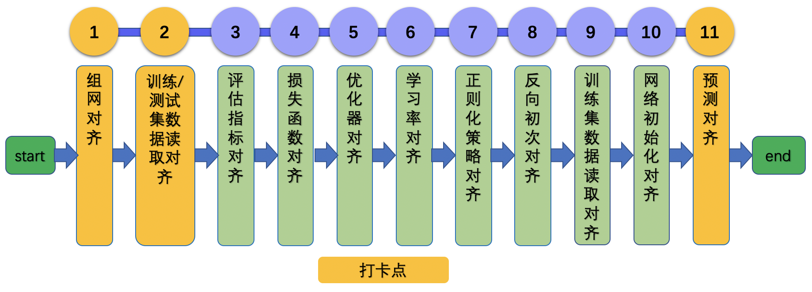

# 论文复现指南

## 目录

- [1. 总览](#1)
    - [1.1 背景](#1.1)
    - [1.2 前序工作](#1.2)
- [2. 整体框图](#2)
    - [2.1 流程概览](#2.1)
    - [2.2 reprod_log whl包](#2.2)
- [3. 论文复现理论知识](#3)
    - [3.1 模型结构对齐](#3.1)
    - [3.2 验证/测试集数据读取对齐](#3.2)
    - [3.3 评估指标对齐](#3.3)
    - [3.4 损失函数对齐](#3.4)
    - [3.5 优化器对齐](#3.5)
    - [3.6 学习率对齐](#3.6)
    - [3.7 正则化策略对齐](#3.7)
    - [3.8 反向对齐](#3.8)
    - [3.9 训练集数据读取对齐](#3.9)
    - [3.10 网络初始化对齐](#3.10)
    - [3.11 模型训练对齐](#3.11)
- [4. 论文复现注意事项与FAQ](#4)
    - [4.1 通用注意事项](#4.0)

<a name="1"></a>
## 1. 总览

<a name="1.1"></a>
### 1.1 背景

* 以深度学习为核心的人工智能技术仍在高速发展，通过论文复现，开发者可以获得
    * 学习成长：自我能力提升
    * 技术积累：对科研或工作有所帮助和启发
    * 社区荣誉：成果被开发者广泛使用

<a name="1.2"></a>
### 1.2 前序工作

基于本指南复现论文过程中，建议开发者准备以下内容。

* 熟悉paddle
    * 文档和API
        * 80%以上的API在功能上与pytorch相同
        * [PaddlePaddle文档链接](https://www.paddlepaddle.org.cn/documentation/docs/zh/guides/index_cn.html)
        * [Pytorch-Paddlepaddle API映射表](https://www.paddlepaddle.org.cn/documentation/docs/zh/guides/08_api_mapping/pytorch_api_mapping_cn.html)
    * [10分钟快速上手飞浆](https://www.paddlepaddle.org.cn/documentation/docs/zh/guides/02_paddle2.0_develop/01_quick_start_cn.html)
    * 数据处理[DataLoader](https://www.paddlepaddle.org.cn/documentation/docs/zh/develop/api/paddle/io/DataLoader_cn.html)
* 了解该数据格式。以Criteo数据集为例，该数据包含了13个连续特征和26个离散特征；还有一个标签，点击用1表示，未点击用0表示。
* 准备好训练/验证数据集，用于模型训练与评估
* 准备好fake input data以及label，与模型输入shape、type等保持一致，用于后续模型前向对齐。
    * 在对齐模型前向过程中，我们不需要考虑数据集模块等其他模块，此时使用fake data是将模型结构和数据部分解耦非常合适的一种方式。
    * 将fake data以文件的形式存储下来，也可以保证PaddlePaddle与参考代码的模型结构输入是完全一致的，更便于排查问题。
    * 在该步骤中，以AlexNet为例，生成fake data的脚本可以参考：[gen_fake_data.py](https://github.com/littletomatodonkey/AlexNet-Prod/blob/master/pipeline/fake_data/gen_fake_data.py)。
* 在特定设备(CPU/GPU)上，跑通参考代码的预测过程(前向)以及至少2轮(iteration)迭代过程，保证后续基于PaddlePaddle复现论文过程中可对比。
* 在复现的过程中，只需要将PaddlePaddle的复现代码以及打卡日志上传至github，不能在其中添加参考代码的实现，在验收通过之后，需要删除打卡日志。建议在初期复现的时候，就将复现代码与参考代码分成2个文件夹进行管理。


<a name="2"></a>
## 2. 整体框图

<a name="2.1"></a>
### 2.1 流程概览

复现论文的整体流程如下图所示。



我们会依照打卡点进行验收，当选手未一次性对齐时，可按流程图分析问题出现在1-11哪个环节，具体内容安排如下：

* 第3章：介绍11个复现步骤的具体内容。
* 第4章：针对复现流程过程中每个步骤可能出现的问题，本章会进行详细介绍。如果还是不能解决问题，可以提ISSUE进行讨论，提ISSUE地址：[https://github.com/PaddlePaddle/Paddle/issues/new/choose](https://github.com/PaddlePaddle/Paddle/issues/new/choose)

<a name="2.2"></a>
### 2.2 reprod_log whl包

#### 2.2.1 reprod_log工具简介
`reprod_log`是用于论文复现赛中辅助自查工具。该工具源代码地址在：[https://github.com/WenmuZhou/reprod_log](https://github.com/WenmuZhou/reprod_log)。主要功能如下：

* 存取指定节点的输入输出tensor
* 基于文件的tensor读写
* 2个字典的对比验证
* 对比结果的输出与记录

更多API与使用方法可以参考：[reprod_log API使用说明](https://github.com/WenmuZhou/reprod_log/blob/master/README.md)。

#### 2.2.2 reprod_log使用demo

下面基于代码：[https://github.com/littletomatodonkey/AlexNet-Prod/tree/master/pipeline/reprod_log_demo](https://github.com/littletomatodonkey/AlexNet-Prod/tree/master/pipeline/reprod_log_demo)，给出如何使用该工具。

文件夹中包含`write_log.py`和`check_log_diff.py`文件，其中`write_log.py`中给出了`ReprodLogger`类的使用方法，`check_log_diff.py`给出了`ReprodDiffHelper`类的使用方法，依次运行两个python文件，使用下面的方式运行代码。

```shell
# 进入文件夹
cd pipeline/reprod_log_demo
# 随机生成矩阵，写入文件中
python3.7 write_log.py
# 进行文件对比，输出日志
python3.7 check_log_diff.py
```

最终会输出以下内容

```
2021-09-28 01:07:44,832 - reprod_log.utils - INFO - demo_test_1:
2021-09-28 01:07:44,832 - reprod_log.utils - INFO -     mean diff: check passed: True, value: 0.0
2021-09-28 01:07:44,832 - reprod_log.utils - INFO - demo_test_2:
2021-09-28 01:07:44,832 - reprod_log.utils - INFO -     mean diff: check passed: False, value: 0.3336232304573059
2021-09-28 01:07:44,832 - reprod_log.utils - INFO - diff check failed
```

可以看出：对于key为`demo_test_1`的矩阵，由于diff为0，小于设置的阈值`1e-6`，核验成功；对于key为`demo_test_2`的矩阵，由于diff为0.33，大于设置的阈值`1e-6`，核验失败。

#### 2.2.3 reprod_log在论文复现中应用

在论文复现中，基于reprod_log的结果记录模块，产出下面若干文件
```
log_reprod
├── forward_paddle.npy
├── forward_torch.npy    # 与forward_paddle.npy作为一并核查的文件对
├── metric_paddle.npy
├── metric_torch.npy     # 与metric_paddle.npy作为一并核查的文件对
├── loss_paddle.npy
├── loss_torch.npy       # 与loss_paddle.npy作为一并核查的文件对
├── bp_align_paddle.npy
├── bp_align_torch.npy   # 与bp_align_paddle.npy作为一并核查的文件对
├── train_align_paddle.npy
├── train_align_benchmark.npy # PaddlePaddle提供的参考评估指标
```

基于reprod_log的`ReprodDiffHelper`模块，产出下面5个日志文件。

```
├── forward_diff.log     # forward_paddle.npy与forward_torch.npy生成的diff结果文件
├── metric_diff.log      # metric_paddle.npy与metric_torch.npy生成的diff结果文件
├── loss_diff.log          # loss_paddle.npy与loss_torch.npy生成的diff结果文件
├── bp_align_diff.log    # bp_align_paddle.npy与bp_align_torch.npy生成的diff结果文件
├── train_align_diff.log # train_align_paddle.npy与train_align_benchmark.npy生成的diff结果文件
```

每个文件夹中的README.md文档提供了使用说明。

<a name="3"></a>
## 3. 论文复现理论知识

<a name="3.1"></a>
### 3.1 模型结构对齐

对齐模型结构时，一般有2个主要步骤：

* 网络结构代码转换
* 模型组网正确性验证

下面详细介绍这3个部分。

#### 3.1.1 网络结构代码转换

**【基本流程】**

由于PyTorch的API和PaddlePaddle的API非常相似，可以参考[PyTorch-PaddlePaddle API映射表](https://www.paddlepaddle.org.cn/documentation/docs/zh/guides/08_api_mapping/pytorch_api_mapping_cn.html)
，组网部分代码直接进行手动转换即可。

**【注意事项】**

如果遇到PaddlePaddle没有的API，可以尝试用多种API来组合，也可以给PaddlePaddle团队提[ISSUE](https://github.com/PaddlePaddle/Paddle/issues)，获得支持。


#### 3.1.2 模型组网正确性验证

**【基本流程】**

1. 定义PyTorch模型，加载权重，固定seed，基于numpy生成随机数，转换为PyTorch可以处理的tensor，送入网络，获取输出，使用reprod_log保存结果。
2. 定义PaddlePaddle模型，加载权重，固定seed，基于numpy生成随机数，转换为PaddlePaddle可以处理的tensor，送入网络，获取输出，使用reprod_log保存结果。
3.  使用reprod_log排查diff，小于阈值，即可完成自测。

**【注意事项】**

* 模型在前向对齐验证时，需要调用`model.eval()`方法，保证组网中的随机量被关闭，比如BatchNorm、Dropout等。
* 给定相同的输入数据，为保证可复现性，如果有随机数生成，固定相关的随机种子。
* 输出diff可以使用`np.mean(np.abs(o1 - o2))`进行计算，一般小于1e-6的话，可以认为前向没有问题。如果最终输出结果diff较大，可以使用二分的方法进行排查，比如说ResNet50，包含1个stem、4个res-stage、global avg-pooling以及最后的fc层，那么完成模型组网和权重转换之后，如果模型输出没有对齐，可以尝试输出中间某一个res-stage的tensor进行对比，如果相同，则向后进行排查；如果不同，则继续向前进行排查，以此类推，直到找到导致没有对齐的操作。

<a name="3.2"></a>
### 3.2 验证/测试集数据读取对齐

**【基本流程】**

对于一个数据集，一般有以下一些信息需要重点关注

* 数据集名称、下载地址
* 数据集通用的预处理方法

PaddlePaddle中数据集相关的API为`paddle.io.Dataset`，PyTorch中对应为`torch.utils.data.Dataset`，二者功能一致，在绝大多数情况下，可以使用该类构建数据集。它是描述Dataset方法和行为的抽象类，在具体实现的时候，需要继承这个基类，实现其中的`__getitem__`和`__len__`方法。除了参考代码中相关实现，也可以参考待复现论文中的说明。

复现完Dataset之后，可以构建Dataloader，对数据进行组batch、批处理，送进网络进行计算。

`paddle.io.DataLoader`可以进行数据加载，将数据分成批数据，并提供加载过程中的采样。PyTorch对应的实现为`torch.utils.data.DataLoader`，二者在功能上一致，只是在参数方面稍有diff：（1）PaddlePaddle缺少对`pin_memory`等参数的支持；（2）PaddlePaddle增加了`use_shared_memory`参数来选择是否使用共享内存加速数据加载过程。

**【注意事项】**

论文中一般会提供数据集的名称以及基本信息。复现过程中，我们在下载完数据之后，建议先检查下是否和论文中描述一致，否则可能存在的问题有：

* 数据集年份或者大小不同，比如论文中使用了MovieLens25M数据集，但是我们下载的是MovieLens10M数据集，如果不对其进行检查，可能会导致我们最终训练的数据量等与论文中有diff。
* 数据集使用方式不同，有些论文中，可能只是抽取了该数据集的子集进行方法验证，此时需要注意抽取方法，需要保证抽取出的子集完全相同。
* 在评估指标对齐时，我们可以固定batch size，关闭Dataloader的shuffle操作。

此外，
* 有些自定义的数据处理方法，如果不涉及到深度学习框架的部分，可以直接复用。
* 对于特定任务中的数据预处理方法，如果没有现成的API可以调用，可以参考PaddleRec官方模型套件中的一些实现方法。


<a name="3.3"></a>
### 3.3 评估指标对齐

**【基本流程】**

PaddlePaddle提供了一系列Metric计算类，比如说`Accuracy`, `Auc`, `Precision`, `Recall`等，而PyTorch中，目前可以通过组合的方式实现metric计算，或者调用[torchmetrics](https://torchmetrics.readthedocs.io/en/latest/)，在论文复现的过程中，需要注意保证对于该模块，给定相同的输入，二者输出完全一致。具体流程如下。

1. 定义PyTorch模型，加载训练好的权重（需要是官网repo提供好的），获取评估结果，使用reprod_log保存结果。
2. 定义PaddlePaddle模型，加载训练好的权重（需要是从PyTorch转换得到），获取评估结果，使用reprod_log保存结果。
3. 使用reprod_log排查diff，小于阈值，即可完成自测。

**【注意事项】**

在评估指标对齐之前，需要注意保证对于该模块，给定相同的输入，二者输出完全一致。


<a name="3.4"></a>
### 3.4 损失函数对齐

**【基本流程】**

PaddlePaddle与PyTorch均提供了很多loss function，用于模型训练，具体的API映射表可以参考：[Loss类API映射列表](https://www.paddlepaddle.org.cn/documentation/docs/zh/guides/08_api_mapping/pytorch_api_mapping_cn.html#lossapi)。以CrossEntropyLoss为例，主要区别为：
* PaddlePaddle提供了对软标签、指定softmax计算纬度的支持。

如果论文中使用的loss function没有指定的API，则可以尝试通过组合API的方式，实现自定义的loss function。

具体流程如下。

1. 定义PyTorch模型，加载权重，加载fake data 和 fake label（或者固定seed，基于numpy生成随机数），转换为PyTorch可以处理的tensor，送入网络，获取loss结果，使用reprod_log保存结果。
2. 定义PaddlePaddle模型，加载fake data 和 fake label（或者固定seed，基于numpy生成随机数），转换为PaddlePaddle可以处理的tensor，送入网络，获取loss结果，使用reprod_log保存结果。
3. 使用reprod_log排查diff，小于阈值，即可完成自测。

**【注意事项】**

* 计算loss的时候，建议设置`model.eval()`，避免模型中随机量的问题。

<a name="3.5"></a>
### 3.5 优化器对齐

**【基本流程】**

PaddlePaddle中的optimizer有`paddle.optimizer`等一系列实现，PyTorch中则有`torch.Optim`等一系列实现。

**【注意事项】**

以SGD等优化器为例，PaddlePaddle与Pytorch的优化器区别主要如下。

* PaddlePaddle在优化器中增加了对梯度裁剪的支持，在训练GAN或者一些NLP、多模态任务中，这个用到的比较多。
* PaddlePaddle的SGD不支持动量更新、动量衰减和Nesterov动量，这里需要使用`paddle.optimizer.Momentum` API实现这些功能。


本部分对齐建议对照[PaddlePaddle优化器API文档](https://www.paddlepaddle.org.cn/documentation/docs/zh/api/paddle/optimizer/Overview_cn.html)与参考代码的优化器实现进行对齐，用之后的反向对齐统一验证该模块的正确性。


<a name="3.6"></a>
### 3.6 学习率对齐

**【基本流程】**

* 学习率策略主要用于指定训练过程中的学习率变化曲线，这里可以将定义好的学习率策略，不断step，即可得到对应的学习率值，可以将学习率值保存在列表或者矩阵中，使用`reprod_log`工具判断二者是否对齐。

**【注意事项】**

PaddlePaddle中，需要首先构建学习率策略，再传入优化器对象中；对于PyTorch，如果希望使用更丰富的学习率策略，需要先构建优化器，再传入学习率策略类API。


<a name="3.7"></a>
### 3.7 正则化策略对齐

**【基本流程】**

L2正则化策略用于模型训练，可以防止模型对训练数据过拟合，L1正则化可以用于得到稀疏化的权重矩阵，PaddlePaddle中有`paddle.regularizer.L1Decay`与`paddle.regularizer.L2Decay` API。PyTorch中，torch.optim集成的优化器只有L2正则化方法，直接在构建optimizer的时候，传入`weight_decay`参数即可。

**【注意事项】**

* PaddlePaddle的optimizer中支持L1Decat/L2Decay。
* PyTorch的optimizer支持不同参数列表的学习率分别设置，params传入字典即可，而PaddlePaddle目前尚未支持这种行为，可以通过设置`ParamAttr`的`learning_rate`参数，来确定相对学习率倍数，使用链接可以参考：[PaddleClas-ResNet model](https://github.com/PaddlePaddle/PaddleClas/blob/d67a352fcacc49ae6bbc7d1c7158e2c65f8e06d9/ppcls/arch/backbone/legendary_models/resnet.py#L121)。


<a name="3.8"></a>
### 3.8 反向对齐

**【基本流程】**

此处可以通过numpy生成假的数据和label（推荐），也可以准备固定的真实数据。具体流程如下。

1. 检查两个代码的训练超参数全部一致，如优化器及其超参数、学习率、BatchNorm/LayerNorm中的eps等。
2. 将PaddlePaddle与PyTorch网络中涉及的所有随机操作全部关闭，如dropout、drop_path等，推荐将模型设置为eval模式（`model.eval()`）
3. 加载相同的weight dict（可以通过PyTorch来存储随机的权重），将准备好的数据分别传入网络并迭代，观察二者loss是否一致（此处batch-size要一致，如果使用多个真实数据，要保证传入网络的顺序一致）
4. 如果经过2轮以上，loss均可以对齐，则基本可以认为反向对齐。


**【注意事项】**

* 如果第一轮loss就没有对齐，则需要仔细排查一下模型前向部分。
* 如果第二轮开始，loss开始无法对齐，则首先需要排查下超参数的差异，没问题的话，在`loss.backward()`方法之后，使用`tensor.grad`获取梯度值，二分的方法查找diff，定位出PaddlePaddle与PyTorch梯度无法对齐的API或者操作，然后进一步验证并反馈。

梯度的打印方法示例代码如下所示，注释掉的内容即为打印网络中所有参数的梯度shape。

```python
    # 代码地址：https://github.com/littletomatodonkey/AlexNet-Prod/blob/63184b258eda650e7a8b7f2610b55f4337246630/pipeline/Step4/AlexNet_paddle/train.py#L93
    loss_list = []
    for idx in range(max_iter):
        image = paddle.to_tensor(fake_data)
        target = paddle.to_tensor(fake_label)

        output = model(image)
        loss = criterion(output, target)
        loss.backward()
        # for name, tensor in model.named_parameters():
        #     grad = tensor.grad
        #     print(name, tensor.grad.shape)
        #     break
        optimizer.step()
        optimizer.clear_grad()
        loss_list.append(loss)
```


<a name="3.9"></a>
### 3.9 训练集数据读取对齐

**【基本流程】**

该部分内容与3.2节内容基本一致，参考PyTorch的代码，实现训练集数据读取与预处理模块即可。

**【注意事项】**

该部分内容，可以参考3.8节的自测方法，将输入的`fake data & label`替换为训练的dataloader，但是需要注意的是：
* 在使用train dataloader的时候，建议设置random seed，对于PyTorch来说

```python
#initialize random seed
torch.manual_seed(config.SEED)
torch.cuda.manual_seed_all(config.SEED)
np.random.seed(config.SEED)
random.seed(config.SEED)
```

对于PaddlePaddle来说

```python
paddle.seed(config.SEED)
np.random.seed(config.SEED)
random.seed(config.SEED)
```

<a name="3.10"></a>
### 3.10 网络初始化对齐

**【基本流程】**

* 下面给出了部分初始化API的映射表。

|PaddlePaddle API | PyTorch API |
|---|---|
| paddle.nn.initializer.KaimingNormal | torch.nn.init.kaiming_normal_ |
| paddle.nn.initializer.KaimingUniform | torch.nn.init.kaiming_uniform_ |
| paddle.nn.initializer.XavierNormal | torch.nn.init.xavier_normal_ |
| paddle.nn.initializer.XavierUniform | torch.nn.init.xavier_uniform_ |

**【注意事项】**

* 更多初始化API可以参考[PyTorch初始化API文档](https://pytorch.org/docs/stable/nn.init.html)以及[PaddlePaddle初始化API文档](https://www.paddlepaddle.org.cn/documentation/docs/zh/api/paddle/nn/Overview_cn.html#chushihuaxiangguan)。


<a name="3.11"></a>
### 3.11 模型训练对齐

**【基本流程】**

完成前面的步骤之后，就可以开始全量数据的训练对齐任务了。按照下面的步骤进行训练对齐。

1. 准备train/eval data, loader, model
2. 对model按照论文所述进行初始化(如果论文中提到加载pretrain，则按需加载pretrained model)
3. 加载配置，开始训练，迭代得到最终模型与评估指标，将评估指标使用reprod_log保存到文件中。
4. 将PaddlePaddle提供的参考指标使用reprod_log提交到另一个文件中。
5. 使用reprod_log排查diff，小于阈值，即可完成自测。

**【注意事项】**

* 【强烈】建议先做完反向对齐之后再进行模型训练对齐，二者之间的不确定量包括：数据集、PaddlePaddle与参考代码在模型training mode下的区别，初始化参数。
* 在训练对齐过程中，受到较多随机量的影响，精度有少量diff是正常的, 这里可以根据不同的任务，适当调整对齐检查的阈值(`ReprodDiffHelper.report`函数中的`diff_threshold`参数)。
* 训练过程中的波动是正常的，如果最终收敛结果不一致，可以
    * 仔细排查Dropout、BatchNorm以及其他组网模块及超参是否无误。
    * 基于参考代码随机生成一份预训练模型，转化为PaddlePaddle的模型，并使用PaddlePaddle加载训练，对比二者的收敛曲线与最终结果，排查初始化影响。
    * 使用参考代码的Dataloader生成的数据，进行模型训练，排查train dataloader的影响。


<a name="4"></a>
## 4. 论文复现注意事项与FAQ

本部分主要总结大家在论文复现赛过程中遇到的问题，如果本章内容没有能够解决你的问题，欢迎给该文档提出优化建议或者给Paddle提[ISSUE](https://github.com/PaddlePaddle/Paddle/issues/new/choose)。

<a name="4.0"></a>
### 4.1 通用注意事项

* 常见问题和误区
    * 不要主动调参，目的是复现而不是提升精度
    * 不要加论文中没提到的模型结构
    * 数据和指标先行对齐
* 数据集获取
    * PaddleRec提供了大量推荐数据集，可优先从[这里查找](https://github.com/PaddlePaddle/PaddleRec/tree/master/datasets)
