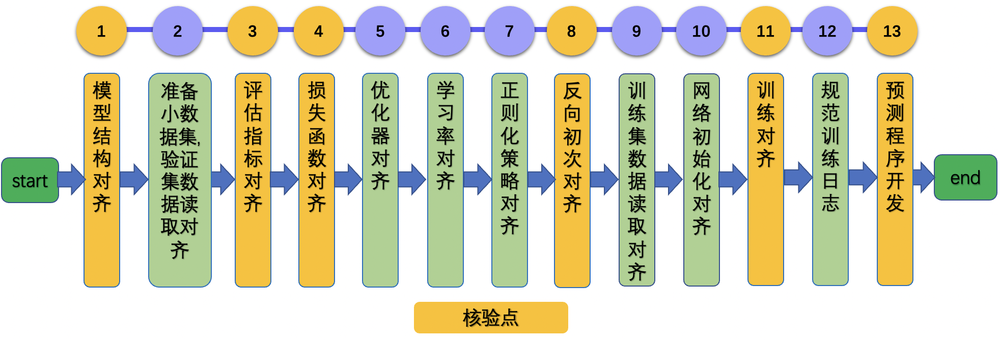

# 论文复现赛指南

- [1. 背景](#1)
- [2. 复现赛过程](#2)
    - [2.1 论文复现](#2.1)
    - [2.2 TIPC基础链条](#2.2)

## 1. 背景

以深度学习为核心的人工智能技术仍在高速发展，通过论文复现，开发者可以获得

1. 学习成长：自我能力提升
2. 技术积累：对科研或工作有所帮助和启发
3. 社区荣誉：成果被开发者广泛使用

飞桨训推一体全流程（TIPC) 是一个针对飞桨模型的测试工具，方便用户查阅每种模型的训练推理部署打通情况，并可以进行一键测试。论文训练对齐之后，需要为代码接入`TIPC基础链条测试文档与代码`，关于TIPC基础链条测试接入规范的文档可以参考`2.2节`相关内容。

基于上述背景，百度举办了飞桨论文复现赛（第五期）。在论文复现赛中，需要完成2个任务。

1. 论文复现
2. 训推一体全流程（下面简称TIPC）中的基础链条部分

## 2. 复现赛过程

### 2.1 论文复现

如果您对于论文复现过程已经非常熟悉，在复现过程中可以按照自己的复现方法进行复现。

如果您在论文复现方面经验较少或者遇到一些问题，强烈建议您按照论文复现指南进行操作。以CV任务为例，复现指南将论文复现分为11个步骤，如下所示。

更加具体地：

* 如果希望查阅 `CV` 方向的复现指南，可以参考：[CV方向论文复现赛指南](./ArticleReproduction_CV.md)
* 如果希望查阅 `NLP` 方向的复现指南，可以参考：[NLP方向论文复现赛指南](./ArticleReproduction_NLP.md)
* 如果希望查阅 `推荐` 方向的复现指南，可以参考：[推荐方向论文复现赛指南](./ArticleReproduction_REC.md)

### 2.2 TIPC基础链条

TIPC基础链条添加包含7个步骤，如下所示。

更加具体地：

- 主要内容可以参考：[TIPC基础链条添加指南(coming soon)]()。
- 示例代码可以参考：[AlexNet添加TIPC基础链条(coming soon)]()。

**注意：**

* 接入过程中，需要依赖于inference模型，因此建议首先提供模型导出和基于inference模型的预测脚本，之后再接入TIPC测试代码与文档。
* 接入过程中，只需要完成`少量数据训练模型，少量数据预测`(`lite_train_lite_infer`)的模式即可，用于测试TIPC流程的少量数据需要放在当前repo中。建议将少量用于测试的数据打包(`tar -zcf lite_data.tar data/`)，放在data目录下，后续在进行环境准备的时候，直接解压该压缩包即可。
* 接入过程中，如果需要在AiStudio中进行TensorRT预测，可以参考：[AiStudio中使用TensorRT进行预测教程](https://aistudio.baidu.com/aistudio/projectdetail/3027768)。
