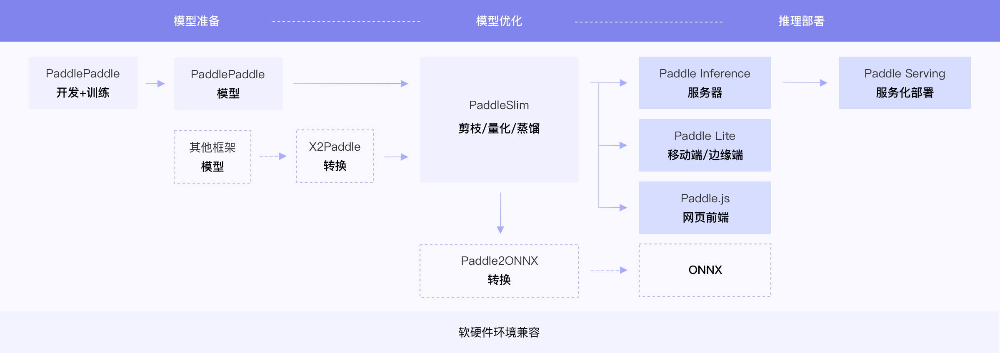

#  模型工程落地赛指南

- [1. 背景](#1)
- [2. 系统框图](#2)
    - [2.1 任务概览](#2.1)
- [3. 模型合入官方套件](#3)
    - [3.1 简介](#3.1)
    - [3.3 具体内容](#3.2)
    - [3.3 验收方法](#3.3)
- [4. 模型工程落地赛](#4)
    - [4.1 增加TIPC基础链条支持](#4.1)
    - [4.2 Paddle Serving服务化部署](#4.2)
    - [4.3 模型轻量化骨干网络验证](#4.3)
- [5. 模型工程落地赛FAQ](#5)
    - [5.1 通用问题](#5.1)
    - [5.2 模型合入官方套件](#5.2)
    - [5.3 TIPC基础链条预测](5.3)
    - [5.4 Paddle Serving服务化部署](#5.4)
    - [5.5 轻量化骨干网络验证](5.5)


<a name="1"></a>

## 1. 背景

飞桨除了基本的模型训练和预测，还提供了支持多端多平台的高性能推理部署工具。希望通过模型工程落地赛指南，完成以下2个目标。

* 保证飞桨训推一体这样一个复杂系统工程的可靠性：软件环境、硬件版本复杂多变，通过训推一体链条基础链条，保证模型基础训练预测功能的可靠性。
* 保证飞桨训推一体功能完备性：作为产业级深度学习平台，PaddlePaddle希望模型可以被更多的开发者在实际的使用场景中使用。提供了训推一体的pipeline，方便用户查询部署支持情况：python、C++、lite、serving、各种硬件，进而可以选择合适的部署方案。

<div align="center">

</div>


官网链接：[飞桨训练推理部署导航](https://www.paddlepaddle.org.cn/wholechain)

<a name="2"></a>

## 2. 系统框图

<a name="2.1"></a>

### 2.1 任务概览

工程落地赛包含以下2种方式。

1. 合入官方套件：按照规范，将模型合入官方套件。
2. 模型工程落地赛：需要完成下面3个任务中的若干项。
    * 增加TIPC基础链条支持。
    * PaddleServing服务化部署。
    * 轻量化骨干网络验证。

对于每篇论文，需要根据特定要求的步骤完成要求的过程。

<a name="3"></a>

## 3. 模型合入官方套件

<a name="3.1"></a>

### 3.1 简介

将开发者经过整理且符合规范的代码合入到官方套件，可以进一步提升个人影响力以及代码文档的规范性，同时也可以增加官方套件的丰富性。

<a name="3.2"></a>

### 3.2 具体内容

按照官方套件的代码规范，将复现的论文适配到对应的套件中。各个repo的代码贡献指南以及参考PR如下所示。

| 官方套件 | 贡献代码指南 | 示例代码链接 |
|:---:|:---:|:---:|
| [PaddleClas](https://github.com/PaddlePaddle/PaddleClas)  | [贡献指南](https://github.com/PaddlePaddle/PaddleClas/blob/develop/docs/zh_CN/advanced_tutorials/how_to_contribute.md) |  [Swin Transformer PR](https://github.com/PaddlePaddle/PaddleClas/pull/685) |
| [PaddleDetection](https://github.com/PaddlePaddle/PaddleDetection) | PaddleDetection源码解析[1](https://aistudio.baidu.com/aistudio/projectdetail/1327454), [2](https://aistudio.baidu.com/aistudio/projectdetail/1422393), [3](https://aistudio.baidu.com/aistudio/projectdetail/1422430)  |  [CenterNet PR](https://github.com/PaddlePaddle/PaddleDetection/pull/4098) |
| [PaddleSeg](https://github.com/PaddlePaddle/PaddleSeg) | [PaddleSeg模型开发文档](https://github.com/PaddlePaddle/PaddleSeg/blob/release/2.3/docs/pr/pr/style_cn.md)，[PaddleSeg代码提交流程与规范](https://github.com/PaddlePaddle/PaddleSeg/blob/release/2.3/docs/pr/pr/pr.md)  |  [SegNet PR](https://github.com/PaddlePaddle/PaddleSeg/pull/1416) |
| [PaddleOCR](https://github.com/PaddlePaddle/PaddleOCR) | [如何新增算法](https://github.com/PaddlePaddle/PaddleOCR/blob/dygraph/doc/doc_ch/add_new_algorithm.md) | [PseNet PR](https://github.com/PaddlePaddle/PaddleOCR/pull/3376/files) |
| [PaddleVideo](https://github.com/PaddlePaddle/PaddleVideo) | -  |  [PP-TSN PR](https://github.com/PaddlePaddle/PaddleVideo/pull/162) |
| [PaddleGAN](https://github.com/PaddlePaddle/PaddleGAN) | [贡献指南](https://github.com/PaddlePaddle/PaddleGAN/blob/develop/docs/en_US/contribute.md)  |  [PAN PR](https://github.com/PaddlePaddle/PaddleGAN/pull/426) |
| [PaddleRec](https://github.com/PaddlePaddle/PaddleRec) | [贡献指南](https://github.com/PaddlePaddle/PaddleRec/blob/master/doc/contribute.md)  |  [DeepFM PR](https://github.com/PaddlePaddle/PaddleRec/pull/321) |


<a name="3.3"></a>

### 3.3 验收方法

按照官方套件的代码贡献指南，提交代码，提供PR链接，由Paddle官方同学review，选手根据review意见进行修改与完善。代码合入后即认为验收通过。

<a name="4"></a>

## 4. 模型工程落地赛

<a name="4.1"></a>

### 4.1 增加TIPC基础链条支持

#### 4.1.1 简介

飞桨除了基本的模型训练和预测，还提供了支持多端多平台的高性能推理部署工具。本文档以Arcface为例，展示了 PaddlePaddle 模型的飞桨训推一体认证 (Training and Inference Pipeline Certification(TIPC)) 信息和测试工具，方便用户查阅每种模型的训练推理部署打通情况，并可以进行一键测试。

#### 4.1.2 具体内容

* 完成模型的训练、评估、预测、导出inference、基于PaddleInference的推理过程的文档与代码。参考链接：
    * [insightface训练预测使用文档](https://github.com/deepinsight/insightface/blob/master/recognition/arcface_paddle/README_cn.md)
    * [PaddleInference使用文档](https://www.paddlepaddle.org.cn/documentation/docs/zh/guides/05_inference_deployment/inference/inference_cn.html)
* 基于[TIPC基础链条测试接入规范](https://github.com/PaddlePaddle/models/blob/tipc/docs/tipc_test/development_specification_docs/train_infer_python.md)，完成该模型的TIPC基础链条开发以及测试文档/脚本，目录为`test_tipc`，测试脚本名称为`test_train_inference_python.sh`，该任务中只需要完成`lite_train_lite_infer`模式即可，用于测试TIPC流程的少量数据需要放在当前repo中，同时明确注明来源。参考链接：
    * [insightface TIPC基础链条测试开发文档](https://github.com/deepinsight/insightface/blob/master/recognition/arcface_paddle/test_tipc/readme.md)


#### 4.1.3 验收方法

* 根据文档流程，基于模型的训练、预测、评估、模型预测、导出inference、基于PaddleInference的推理过程，代码可执行。具体地，要求
    * 按照文档操作步骤，训练可以跑通，前100轮loss收敛正常，并在`test_log`目录下提供`log_train.txt`的日志文件。
    * 基于提供的模型，评估指标可以达到文档中所述精度，在README文档中给出模型评估方法和说明。
    * 提供真实测试图像，基于预训练模型的预测与基于导出的inference模型的推理结果完全一致，并在README文档中给出二者的`使用说明、脚本、预测、推理结果`。
* TIPC基础链条测试文档清晰，`test_train_inference_python.sh`脚本可以成功执行并返回正确结果。

<a name="4.2"></a>

### 4.2 Paddle Serving服务化部署

#### 4.2.1 简介

Paddle Serving 旨在帮助深度学习开发者轻易部署在线预测服务。目标是：当用户使用 Paddle 训练了一个深度神经网络，就同时拥有了该模型的预测服务。

#### 4.2.2 具体内容

* 完成基于该模型的Paddle Serving模型部署，提供相应的说明文档。参考链接：
    * [PaddleServing官方文档](https://www.paddlepaddle.org.cn/tutorials/projectdetail/1975340)
    * [InsightFace Paddle Serving部署教程](https://github.com/deepinsight/insightface/blob/master/recognition/arcface_paddle/deploy/pdserving/README_CN.md)
* 将Paddle Serving的功能添加到文件夹`test_tipc`中，编写`test_serving.sh`脚本文件与相应的Paddle Serving测试开发规范文档。参考链接：
    * [Paddle Serving测试开发文档](https://github.com/PaddlePaddle/PaddleOCR/blob/dygraph/test_tipc/docs/test_serving.md)


#### 4.2.3 验收方法

* 该模型基于Paddle Serving的部署文档清晰可读，根据文档说明流程，可以成功完成：`启动服务`，`发送服务请求`，`获取返回结果`，返回结果与`章节4.1.3`中的模型推理结果完全相同。
* Paddle Serving测试开发规范文档清晰可读，`test_serving.sh`脚本可成功执行。

<a name="4.3"></a>

### 4.3 模型轻量化骨干网络验证

#### 4.3.1 简介

作为产业结合的深度学习框架，PaddlePaddle希望被更多用户在实际的场景中应用，但是大部分论文都是基于相对较大的骨干网络进行实验，如VGG、ResNet等，本部分希望通过更换骨干网络，让模型轻量化，方便实际部署过程。

#### 4.3.2 具体内容

* 更换骨干网络，进行模型训练，记录精度、预训练模型，保存日志文件。
* 将更换了骨干网络部分产出的模型接入`TIPC基础链条`，并将测试文档和测试脚本放置在`test_tipc`目录中。

#### 4.3.3 轻量化网络选型和特征抽取选型

* 网络选型

按照轻量化网络的性能和模型大小，选取了下面的4个轻量化网络，

|网络 | ImageNet TOP1 ACC | 模型大小 |
|:---:|:---:|:---:|
| MobileNetV1_x1_0 | 0.7099 | 24MB |
| MobileNetV3_large_x1_0 | 0.7530 | 32MB |
| MobileNetV3_small_x1_0 | 0.6820 | 17MB |
| ShuffleNetV2_x1_0 | 0.6880 | 12MB |

* 特征图抽取
对于检测，分割等CV任务，在backbone阶段一般输出`3~4`个特征图，分别在backbone输出shape为输入shape的`1/4`, `1/8`, `1/16` 和 `1/32` 处，在进行接入时，可以逐层打印网络的输出shape。
如PaddleDetection里MobileNetV3_large_x1_0，当输入为 `[1,3,640,640]` 时，输出的shape如下。

```
idx: 2 shape [1, 16, 320, 320]
idx: 3 shape [1, 24, 160, 160]
idx: 4 shape [1, 24, 160, 160]
idx: 5 shape [1, 40, 80, 80]
idx: 6 shape [1, 40, 80, 80]
idx: 7 shape [1, 40, 80, 80]
idx: 8 shape [1, 80, 40, 40]
idx: 9 shape [1, 80, 40, 40]
idx: 10 shape [1, 80, 40, 40]
idx: 11 shape [1, 80, 40, 40]
idx: 12 shape [1, 112, 40, 40]
idx: 13 shape [1, 112, 40, 40]
idx: 14 shape [1, 160, 20, 20]
idx: 15 shape [1, 160, 20, 20]
idx: 16 shape [1, 160, 20, 20]
```

各个阶段特征图和idx对应关系如下，各个特征图大小对应的idx分别有很多个，通常取最后一个idx即为传入网络的idx，这里为[4, 7, 13, 16]。

|特征图大小| 对应的idx |
|:---:|:---:|
|1/4 | [3,4] |
|1/8 | [5,6,7] |
|1/16|[8,9,10,11,12,13]  |
|1/32 | [14,15,16] |

示例代码：[PaddleDetection CenterNet文档和配置](https://github.com/PaddlePaddle/PaddleDetection/blob/develop/configs/centernet/README_cn.md)

#### 4.3.4 验收方法

* 更换骨干网络，填写上表中详细内容，提交训练代码、不同骨干网络下的训练日志以及结果表格。

|骨干网络 | 模型指标 | 模型训练超参(有变化时需要说明) |
|:---:|:---:|:---:|
| 原始论文 | 37.4 | - |
| MobileNetV1_x1_0 | 28.2 | batchsize=32 |
| MobileNetV3_large_x1_0 | 27.1 | batchsize=32 |
| MobileNetV3_small_x1_0 | `coming soon` | batchsize=32 |
| ShuffleNetV2_x1_0 | 23.8| batchsize=32 |

* 文件夹`test_tipc`目录中，将不同骨干网络对应的模型接入基础链条测试规范并验证通过。


<a name="5"></a>

## 5. 模型工程落地赛注意事项与FAQ

<a name="5.1"></a>

### 5.1 通用问题

* 如果在任何阶段，报错信息提示为Paddle导致，可以给Paddle提[ISSUE](https://github.com/PaddlePaddle/Paddle/issues/new/choose)，获得研发同学高优支持。

<a name="5.2"></a>

### 5.2 模型合入官方套件

* 合入的过程中，如果有代码方面的问题，可以在对应模型套件的repo下面新建ISSUE，注明目前的具体问题，标题中补充`【工程落地赛】`。

<a name="5.3"></a>

### 5.3 TIPC基础链条预测

* 动转静遇到问题时的调试方法：[动态图转静态图调试方法教程](https://www.paddlepaddle.org.cn/documentation/docs/zh/develop/guides/04_dygraph_to_static/debugging_cn.html)

<a name="5.3"></a>

### 5.4 Paddle Serving服务化部署

* 如果发送请求后没有结果返回或者提示输出解码报错，可能是因为：
    * 启动服务和发送请求时不能设置代理，可以在启动服务前和发送请求前关闭代理，关闭代理的命令是：

    ```
    unset https_proxy
    unset http_proxy
    ```

<a name="5.4"></a>


### 5.5 轻量化骨干网络验证

* 该工程落地项主要是为验证CV任务中的骨干网络，下面一些任务不需要验证该项。
    * NLP任务
    * 图像分类任务
    * 非模型训练任务（模型可视化等）
    * 对抗攻击网络
    * 更多...
* 骨干网络的实现与预训练模型可以从[PaddleClas](https://github.com/PaddlePaddle/PaddleClas)中获得。
