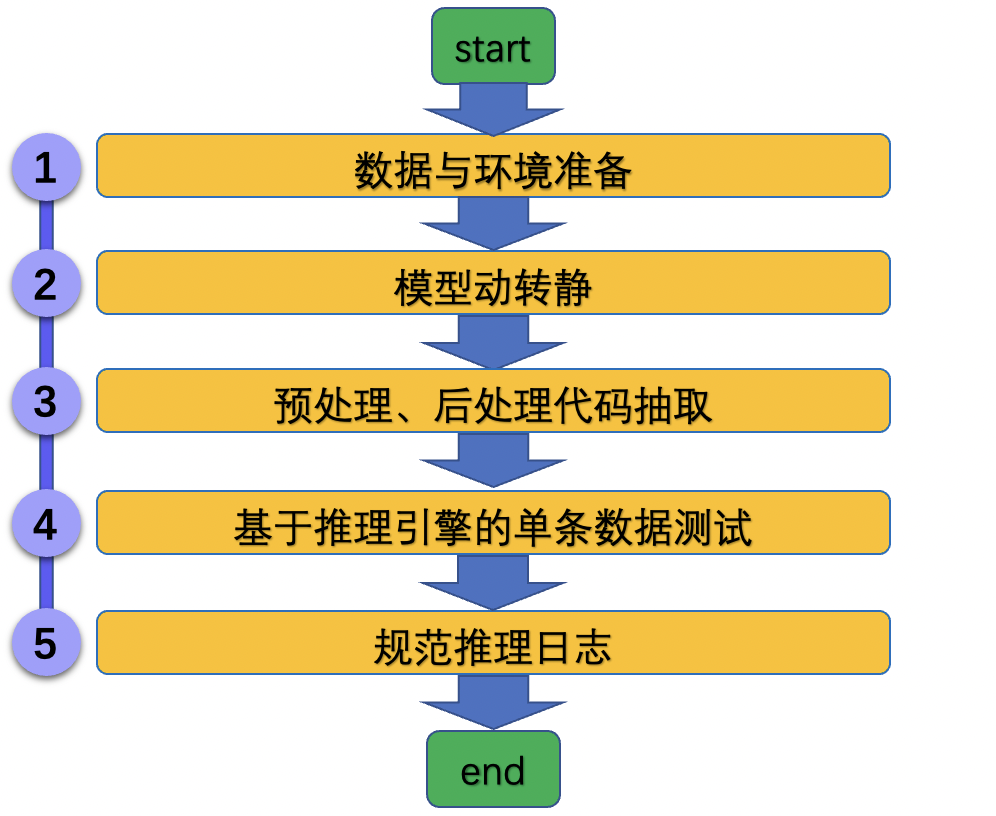

# 模型推理开发规范

## 1. 背景

Paddle Inference 是飞桨的原生推理库， 作用于服务器端和云端，提供高性能的推理能力。相比于直接基于预训练模型进行预测，Paddle Inference可使用MKLDNN、CUDNN、TensorRT进行预测加速，从而实现更优的推理性能。

更多关于Paddle Inference推理引擎的介绍，可以参考[Paddle Inference官网教程](https://www.paddlepaddle.org.cn/documentation/docs/zh/guides/05_inference_deployment/inference/inference_cn.html)。

* 模型开发规范

## 2. 流程

为方便大家快速使用Paddle Inference进行预测推理，将模型推理过程分为5个步骤，如下图所示。

<div align="center">
    
</div>

其中设置了两个验收点，分别为

* `模型动转静`生成模型结构文件和参数文件
* 基于训练引擎和预测引擎的预测结果相同。

### 2.1 数据与环境准备

**【数据】**

从验证集或者测试集中抽出至少一张图像，用于后续推理过程验证。

**【环境】**

* 安装好PaddlePaddle的whl包之后，便可以直接体验Paddle的Inference推理功能。
* 如果希望体验基于Paddle Inference的TensorRT推理，可以参考：[Paddle Inference TensorRT推理教程](https://paddle-inference.readthedocs.io/en/latest/optimize/paddle_trt.html)。

### 2.2 模型动转静

#### 2.2.1 定义模型

**【基本流程】**

在模型导出之前，首先需要定义好模型结构，模型结构与训练时的模型结构相同。


首先需要定义模型，

**【注意事项】**

* 模型组网建议直接参考预测代码中的组网部分。

**【实战】**

AlexNet中模型定义与组网如下所示，参考链接：[export_model.py](https://github.com/littletomatodonkey/AlexNet-Prod/blob/tipc/pipeline/Step5/AlexNet_paddle/tools/export_model.py)。

```python
    model = paddlevision.models.__dict__[args.model](
        pretrained=args.pretrained, num_classes=args.num_classes)
    model = nn.Sequential(model, nn.Softmax())
    model.eval()
```

#### 2.2.2 模型动转静(`jit.to_static`)

**【基本流程】**

`paddle.jit.to_static`接口是完全模型动转静的唯一接口，需要使用该接口对模型进行装饰。

**【注意事项】**

* 如果有多个输入，则在`input_spec`接口中定义多个`InputSpec`对象即可。
* `batch_size`维度建议使用`None`。
* 如果希望使用TensorRT进行预测，需要保证导出时设置的尺度与最终实际预测时的尺度保持一致。

**【实战】**

AlexNet中模型动转静代码如下所示，参考链接：[export_model.py](https://github.com/littletomatodonkey/AlexNet-Prod/blob/tipc/pipeline/Step5/AlexNet_paddle/tools/export_model.py)。


```python
    model = paddle.jit.to_static(
        model,
        input_spec=[
            InputSpec(
                shape=[None, 3, args.img_size, args.img_size], dtype='float32')
        ])
```

#### 2.2.3 保存模型(`jit.save`)

**【基本流程】**

对于装饰后的模型，可以使用`paddle.jit.save` API完成模型保存。

**【注意事项】**

* 保存过程中遇到的问题可以参考[动转静报错调试教程](https://www.paddlepaddle.org.cn/documentation/docs/zh/guides/04_dygraph_to_static/debugging_cn.html)。

**【实战】**

AlexNet中模型保存代码如下所示，参考链接：[export_model.py](https://github.com/littletomatodonkey/AlexNet-Prod/blob/tipc/pipeline/Step5/AlexNet_paddle/tools/export_model.py)。

```python
    paddle.jit.save(model, os.path.join(args.save_inference_dir, "inference"))
```

**【验收】**

保存路径下面会生成3个文件，如下所示，其中在Inference推理中用到的为`inference.pdiparams`与`inference.pdmodel`。

```
inference.pdiparams     : 模型参数文件
inference.pdmodel       : 模型结构文件
inference.pdiparams.info: 模型参数信息文件
```

#### 2.3 预处理、后处理代码抽取

**【基本流程】**

抽取出`基于预训练模型的预测脚本`中的预处理和后处理方法，将其应用在推理过程中，保证基于训练引擎和预测引擎的预测结果相同。

**【注意事项】**

* 在模型评估过程中，为了保证数据可以组batch，我们一般会使用resize/crop/padding等方法去保持尺度的一致性，在预测推理过程中，需要注意crop是否合适，比如OCR识别任务中，crop的操作会导致识别结果不全。

**【实战】**

AlexNet预处理包含`ResizeImage`, `CenterCropImage`, `NormalizeImage`, `ToCHW` 4个步骤，后处理为`argmax`，示例代码如下所示。参考链接：[infer.py](https://github.com/littletomatodonkey/AlexNet-Prod/blob/tipc/pipeline/Step5/AlexNet_paddle/deploy/pdinference/infer.py)。

```python
    # 预处理
    eval_transforms = Compose([
        ResizeImage(args.resize_size), CenterCropImage(args.crop_size),
        NormalizeImage(), ToCHW()
    ])
    # ...
    # 后处理
    output = output.flatten()
    class_id = output.argmax()
```

### 2.4 推理引擎单条数据测试

**【基本流程】**

主要步骤有：

1. 初始化预测引擎；
2. 读入数据，进行预处理；
3. 拷贝数据到预测引擎，完成预测；
4. 将数据从预测引擎拷贝出，后处理，得到最终结果。

**【注意事项】**

* 预测引擎支持快速配置`MKLDNN`, `GPU`, `TensorRT`等预测方式，这里可以参考下面的初始化预测引擎的代码。

**【实战】**

AlexNet基于Paddle Inference的预测代码如下所示。参考链接：[infer.py](https://github.com/littletomatodonkey/AlexNet-Prod/blob/tipc/pipeline/Step5/AlexNet_paddle/deploy/pdinference/infer.py)。

```python
def predict(args):
    predictor, config = load_predictor(
        os.path.join(args.model_dir, "inference.pdmodel"),
        os.path.join(args.model_dir, "inference.pdiparams"), args)

    input_names = predictor.get_input_names()
    input_tensor = predictor.get_input_handle(input_names[0])

    output_names = predictor.get_output_names()
    output_tensor = predictor.get_output_handle(output_names[0])

    eval_transforms = Compose([
        ResizeImage(args.resize_size), CenterCropImage(args.crop_size),
        NormalizeImage(), ToCHW()
    ])

    # inference
    with open(args.img_path, "rb") as f:
        img = Image.open(f)
        img = img.convert("RGB")

    img = eval_transforms(img)
    img = np.expand_dims(img, axis=0)
    input_tensor.copy_from_cpu(img)

    predictor.run()
    output = output_tensor.copy_to_cpu()

    output = output.flatten()
    class_id = output.argmax()

    prob = output[class_id]
    print(f"image_name: {args.img_path}, class_id: {class_id}, prob: {prob}")
```

**【验收】**

* 基于训练引擎和预测引擎的推理结果相同。参考链接：[check_inference.py](https://github.com/littletomatodonkey/AlexNet-Prod/blob/tipc/pipeline/Step5/check_inference.py)。


### 2.5 规范推理日志

**【背景】**

推理过程一般包含预处理、预测引擎运行、后处理三个步骤，对这三个步骤的预测耗时进行记录，可以帮助我们更好地分析模型推理的耗时瓶颈，有助于后续的模型性能优化。

**【基本流程】**

在训练代码中添加日志统计信息，对推理中的信息进行统计。推荐使用`AutoLog`工具。

基于`AutoLog`工具规范化推理日志的过程包括：初始化、在每个节点的、输出日志。

**【注意事项】**

* 使用下面的方法安装`AutoLog`工具，更多使用方法可以参考[AutoLog](https://github.com/LDOUBLEV/AutoLog)。

**【实战】**

AlexNet推理脚本中，打开`benchmark`选项，即可输出规范化的推理日志，可以参考：[infer.py](https://github.com/littletomatodonkey/AlexNet-Prod/blob/tipc/pipeline/Step5/AlexNet_paddle/deploy/pdinference/infer.py)。

## 3. FAQ
