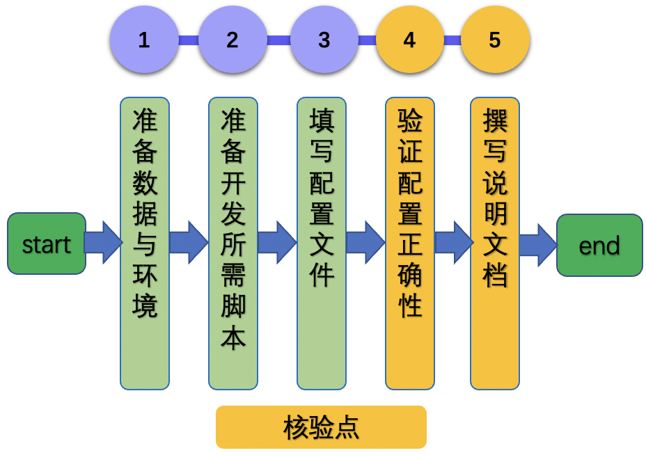

# Linux GPU/CPU 基础训练推理测试开发文档

# 目录

- [1. 简介](#1)
- [2. 命令解析](#2)
- [3. 测试功能开发](#2)
    - [2.1 准备数据与环境](#.21)
    - [2.2 准备开发所需脚本](#2.2)
    - [2.3 填写配置文件](#2.3)
    - [2.4 验证配置正确性](#2.4)
    - [2.5 撰写说明文档](#2.5)
- [4. 附录](#4)
    - [4.1 `train_infer_python.txt`配置文件说明](#4.1)

<a name="1"></a>

## 1. 简介

本文档主要介绍飞桨模型在 Linux GPU/CPU 下服务化部署能力的测试开发过程。主要内容为

1. 在基于训练引擎预测的基础上，完成基于Paddle Inference的推理过程开发。

在此之前，您需要完成下面的内容。

1. 参考 [《模型复现指南》](../../lwfx/ArticleReproduction_CV.md)，完成模型的训练与基于训练引擎的预测过程。

2. 参考 [《Linux GPU/CPU 基础训练推理开发文档》](../linux_train_infer_python/README.md)，完成模型的训练和基于Paddle Inference的模型推理开发。


具体地，本文档主要关注Linux GPU/CPU 下模型的基础训练推理全流程测试，具体测试点如下：

- 模型训练方面：单机单卡/多卡训练跑通
- 飞桨模型转换：保存静态图模型
- Paddle Inference 推理过程跑通

<a name="2"></a>

## 2. 命令解析

运行模型训练、动转静、推理过程的命令差别很大，但是都可以拆解为3个部分：

```
python   run_script    set_configs
```

例如：

* 对于通过配置文件传参的场景来说，`python3.7 train.py -c config.yaml -o epoch_num=120`
    * `python`部分为`python3.7`
    * `run_script`部分为`train.py`
    * `set_configs`部分为`-c config.yaml -o epoch_num=120`
* 对于通过argparse传参的场景来说，`python3.7 train.py --lr=0.1, --output=./output`
    * `python`部分为`python3.7`
    * `run_script`部分为`train.py`
    * `set_configs`部分为`--lr=0.1, --output=./output`

其中，可修改参数`set_configs`一般通过`=`进行分隔，`=`前面的内容可以认为是key，后面的内容可以认为是value，那么通过给定配置文件模板，解析配置，得到其中的key和value，结合`python`和`run_script`，便可以拼凑出一条完整的命令。

<a name="3"></a>

## 3. 测试功能开发

基础训练推理测试开发过程主要分为以下5个步骤。

<div align="center">
    
</div>

其中设置了2个核验点。下面进行详细介绍。

<a name="3.1"></a>

### 3.1 准备小数据集与环境

**【基本内容】**

1. 数据集：为方便快速验证训练/评估/推理过程，需要准备一个小数据集（训练集和验证集各8~16张图像即可，压缩后数据大小建议在`20M`以内），放在`lite_data`文件夹下。

    相关文档可以参考[论文复现赛指南3.2章节](../lwfx/ArticleReproduction_CV.md)，代码可以参考`基于ImageNet准备小数据集的脚本`：[prepare.py](https://github.com/littletomatodonkey/AlexNet-Prod/blob/tipc/pipeline/Step2/prepare.py)。

2. 环境：安装好PaddlePaddle即可进行基础训练推理测试开发


**【注意事项】**

* 为方便管理，建议在上传至github前，首先将lite_data文件夹压缩为tar包，直接上传tar包即可，在测试训练评估与推理过程时，可以首先对数据进行解压。
    * 压缩命令： `tar -zcf lite_data.tar lite_data`
    * 解压命令： `tar -xf lite_data.tar`

<a name="=3.2"></a>

### 3.2 准备开发所需脚本

**【基本内容】**

在repo中新建`test_tipc`目录，将文件 [common_func.sh](template/test/common_func.sh) 和 [test_train_inference_python.sh](template/test/test_train_inference_python.sh) 分别拷贝到`test_tipc`目录中。


**【注意事项】**

* 上述2个脚本文件无需改动，在实际使用时，直接修改配置文件即可。

<a name="3.3"></a>

### 3.3 填写配置文件

**【基本内容】**

在repo的`test_tipc/`目录中新建`configs/model_name`，将文件 [template/test/train_infer_python.txt](template/test/train_infer_python.txt) 拷贝到该目录中，其中`model_name`需要修改为您自己的模型名称。

**【注意事项】**


**【实战】**

配置文件的含义解析可以参考 [4.1章节配置文件解析](#4.1) 部分。

AlexNet的测试开发配置文件可以参考：[train_infer_python.txt](https://github.com/littletomatodonkey/AlexNet-Prod/blob/tipc/pipeline/Step5/AlexNet_paddle/test_tipc/configs/AlexNet/train_infer_python.txt)。

<a name="3.4"></a>

### 3.4 验证配置正确性

**【基本内容】**

基于修改完的配置，运行

```bash
bash test_tipc/test_train_inference_python.sh ${your_params_file} lite_train_lite_infer
```

**【注意事项】**

如果运行失败，会输出具体的报错命令，可以根据输出的报错命令排查下配置文件的问题并修改，示例报错如下所示，通过报错信息可知`pretrained`参数没有添加`.pdparams`后缀，因此直接修改后面的配置文件即可。

```
Run failed with command - python3.7 tools/export_model.py --model=alexnet --pretrained=./test_tipc/output/norm_train_gpus_0_autocast_null/latest --save-inference-dir=./test_tipc/output/norm_train_gpus_0_autocast_null!
```

**【实战】**

AlexNet中验证配置正确性的脚本：[Linux端基础训练推理功能测试文档](https://github.com/littletomatodonkey/AlexNet-Prod/blob/tipc/pipeline/Step5/AlexNet_paddle/test_tipc/docs/test_train_inference_python.md#23-%E5%8A%9F%E8%83%BD%E6%B5%8B%E8%AF%95)。


**【核验】**

基于修改后的配置文件，测试通过，全部命令成功

<a name="3.5"></a>

### 3.5 撰写说明文档

**【基本内容】**

撰写TIPC功能总览和测试流程说明文档，分别为

1. TIPC功能总览文档：test_tipc/README.md
2. Linux GPU/CPU 基础训练推理测试说明文：test_tipc/docs/test_train_infer_python.md

2个文档模板分别位于，可以直接拷贝到自己的repo中，根据自己的模型进行修改。

1. [./template/test/doc/README.md](./template/test/doc/README.md)
2. [./template/test/doc/test_train_inference_python.md](./template/test/doc/test_train_inference_python.md)

**【实战】**

AlexNet中`test_tipc`文档如下所示。

1. TIPC功能总览文档：https://github.com/littletomatodonkey/AlexNet-Prod/blob/tipc/pipeline/Step5/AlexNet_paddle/test_tipc/README.md
2. Linux GPU/CPU 基础训练推理测试说明文档：https://github.com/littletomatodonkey/AlexNet-Prod/blob/tipc/pipeline/Step5/AlexNet_paddle/test_tipc/docs/test_train_inference_python.md

**【核验】**

repo中最终目录结构如下所示。

```
test_tipc
    |--configs                              # 配置目录
    |    |--model_name                      # 您的模型名称
    |           |--train_infer_python.txt   # 基础训练推理测试配置文件
    |--docs                                 # 文档目录
    |   |--test_train_inference_python.md   # 基础训练推理测试说明文档
    |----README.md                          # TIPC说明文档
    |----test_train_inference_python.sh     # TIPC基础训练推理测试解析脚本，无需改动
    |----common_func.sh                     # TIPC基础训练推理测试常用函数，无需改动
```

基于`test_train_inference_python.md`文档，跑通`Linux GPU/CPU 基础训练推理测试`流程。

<a name="4"></a>

## 4. 附录

<a name="4.1"></a>

### 4.1 `train_infer_python.txt`配置文件说明

完整的`train_infer_python.txt`配置文件共有51行，包含5个方面的内容。

* 训练参数：第1~14行
* 训练脚本配置：第15~22行
* 评估脚本和配置：第23~26行（本部分无需关注，这里不再展开介绍）
* 模型导出脚本和配置：第27~36行
* 模型Inference推理：第37~51行

具体内容见[train_infer_python.txt](template/test/train_infer_python.txt)。

文本文件中主要有以下3种类型字段。

* 一行内容以冒号为分隔符：该行可以被解析为`key:value`的格式，需要根据实际的含义修改该行内容，下面进行详细说明。
* 一行内容为`======xxxxx=====`：该行内容表示，无需修改。
* 一行内容为`##`：该行内容表示段落分隔符，没有实际意义，无需修改。

#### 4.1.1 训练配置参数

在配置文件中，可以通过下面的方式配置一些常用的输出文件，如：是否使用GPU、迭代轮数、batch size、预训练模型路径等，下面给出了常用的配置以及需要修改的内容。


| 行号 | 参考内容                                | 含义            | key是否需要修改 | value是否需要修改 | 修改内容                             |
|----|-------------------------------------|---------------|-----------|-------------|----------------------------------|
| 2  | model_name:alexnet                  | 模型名字          | 否         | 是           | value修改为自己的模型名字                  |
| 3  | python:python3.7                    | python环境      | 否         | 是           | value修改为自己的python环境              |
| 4  | gpu_list:0                          | gpu id        | 否         | 是           | value修改为自己的GPU ID                |
| 5  | use_gpu:True                        | 是否使用GPU       | 是         | 是           | key修改为设置GPU使用的内容，value修改         |
| 6  | auto_cast:null                      | 是否使用混合精度      | 否         | 否           | -                                |
| 7  | epoch_num:lite_train_infer=1        | 迭代的epoch数目    | 是         | 否           | key修改为可以设置代码中epoch数量的内容          |
| 8  | output_dir:./output/                | 输出目录          | 是         | 否           | key修改为代码中可以设置输出路径的内容             |
| 9  | train_batch_size:lite_train_infer=1 | 训练的batch size | 是         | 否           | key修改为可以设置代码中batch size的内容       |
| 10 | pretrained_model:null               | 预训练模型         | 是         | 是           | 如果训练时指定了预训练模型，则需要key和value需要对应修改 |
| 11 | train_model_name:latest             | 训练结果的模型名字     | 否         | 是           | value需要修改为训练完成之后保存的模型名称，用于后续的动转静 |
| 12 | null:null                           | 预留字段          | 否         | 否           | -                                |
| 13 | null:null                           | 预留字段          | 否         | 否           | -                                |


#### 4.1.2 训练命令配置

| 行号 | 参考内容                                        | 含义              | key是否需要修改 | value是否需要修改 |  修改内容                 |
|----|---------------------------------------------|-----------------|-----------|-------------|-------------------|
| 15 | trainer:norm_train                          | 训练方法            | 否         | 否           | -                 |
| 16 | norm_train:tools/train.py -c config.yaml -o | norm_train的训练脚本 | 否         | 是           | value可以修改为自己的训练命令 |
| 17 | pact_train:null                             | 量化训练脚本配置        |           | 否           | -                 |
| 18 | fpgm_train:null                             | 裁剪训练脚本配置        | 否         | 否           | -                 |
| 19 | distill_train:null                          | 蒸馏训练脚本配置        | 否         | 否           | -                 |
| 20 | null:null                                   | 预留字段            | 否         | 否           | -                 |
| 21 | null:null                                   | 预留字段            | 否         | 否           | -                 |


#### 4.1.3 模型导出配置参数

| 行号 | 参考内容                 | 含义        | key是否需要修改 | value是否需要修改 | 修改内容                    |
|----|------------------|-----------|-----------|-------------|-------------------------|
| 28 | save_dir:./output/                                  | 输出目录      | 是         | 否           | key修改为代码中可以设置输出目录的内容    |
| 29 | pretrained_model:                                   | 训练模型路径    | 是         | 否           | key修改为代码中可以设置预训练模型路径的内容 |
| 30 | norm_export:tools/export_model.py -c config.yaml -o | 模型        | 否         | 是           | value修改为实际的动转静导出命令      |
| 31 | quant_export:null                                   | 量化模型动转静   | 否         | 否           | -                       |
| 32 | fpgm_export:null                                    | 裁剪模型动转静   | 否         | 否           | -                       |
| 33 | distill_export:null                                 | 蒸馏模型动转静脚本 | 否         | 否           | -                       |
| 34 | null:null                                           | 预留字段      | 否         | 否           | -                       |
| 35 | null:null                                           | 预留字段      | 否         | 否           | -                       |


#### 4.1.4 模型推理配置


| 行号 | 参考内容             | 含义     | key是否需要修改 | value是否需要修改 | 修改内容        |
|----|------------------|-----------------|-----------|-------------|-------------|
| 37 | infer_model:null                                     | 推理模型保存路径        | 否         | 否           |                                   |
| 38 | infer_export:tools/export_model.py -c config.yaml -o | 推理前是否需要导出       | 否         | 是           | value修改为和30行内容一致即可                |
| 39 | infer_quant:False                                    | 是否量化推理          | 否         | 否           | -                                 |
| 40 | inference:infer.py                                   | 推理脚本            | 否         | 是           | value修改为自己的推理脚本                   |
| 41 | --use_gpu:True|False                                 | 是否使用GPU         | 是         | 是           | key和value修改为GPU设置的参数和值            |
| 42 | --use_mkldnn:True|False                              | 是否使用MKLDNN      | 是         | 是           | key和value修改为MKLNN设置的参数和值          |
| 43 | --cpu_threads:1|6                                    | 开启MKLDNN时使用的线程数 | 是         | 是           | key和value修改为CPU线程数设置的参数和值         |
| 44 | --batch_size:1                                       | 推理batch size    | 是         | 否           | key修改为代码中可以修改为batch size的内容       |
| 45 | --use_tensorrt:null                                  | 是否开启TensorRT预测  | 否         | 否           | 不对该项进行测试                          |
| 46 | --precision:null                                     | 精度范围            | 否         | 否           | 不对该项进行测试                          |
| 47 | --model_dir:./infer                                  | 模型目录            | 是         | 否           | key修改为代码中可以设置inference model目录的内容 |
| 48 | --image_dir:./lite_data/1.jpg                        | 图片路径或者图片文件夹路径   | 是         | 否           | key和value修改为自己的CPU线程数设置参数和值       |
| 49 | --save_log_path:null                                 | 推理日志输出路径        | 否         | 否           | -                                 |
| 50 | --benchmark:False                                    | 是否使用            | 是         | 是           | key和value修改为规范化推理日志输出设置的参数和值      |
| 51 | null:null                                            | 预留字段            | 否         | 否           | -                                 |
