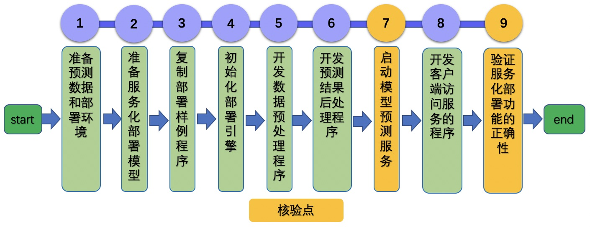

# Linux GPU/CPU 服务化部署开发规范

# 目录

- [1. 简介](#1)
- [2. 服务化部署开发规范](#2)
    - [2.1 开发流程](#2.1)
    - [2.2 核验点](#2.2)
- [3. 服务化部署测试开发规范](#3)
    - [3.1 开发流程](#3.1)
    - [3.2 核验点](#3.2)

<a name="1"></a>

## 1. 简介

该系列文档主要介绍飞桨模型在 Linux GPU/CPU 下服务化部署能力的开发规范。主要包含3个步骤：

（1）参考 [《Linux GPU/CPU 基础训练推理开发文档》](../train_infer_python/README.md)，完成模型的训练和基于Paddle Inference的模型推理开发。

（2）参考[《Linux GPU/CPU 服务化部署功能开发文档》](./serving.md)，在Paddle Inference的模型推理基础上，完成服务化部署能力的开发。

（3） 参考[《Linux GPU/CPU 服务化部署测试开发文档》](./test_serving.md)，完成 TIPC 服务化部署测试开发。


<a name="2"></a>

## 2. 服务化部署开发规范

<a name="2.1"></a>

### 2.1 开发流程

服务化部署开发流程如下图所示。

<div align="center">
    
</div>

更多内容请参考：[服务化部署开发文档](./serving.md)。

<a name="2.2"></a>

### 2.2 核验点

在开发过程中，至少需要产出下面的内容。

#### 2.2.1 模型服务部署成功

* 成功启动模型预测服务，并在客户端完成访问。

#### 2.2.2 服务化部署结果正确性

* 返回结果与基于Paddle Inference的模型推理结果完全一致。

#### 2.2.3 说明文档

* 参考[AlexNet Serving部署文档](https://github.com/littletomatodonkey/AlexNet-Prod/blob/tipc/pipeline/Step5/AlexNet_paddle/deploy/serving)。

* 文档中给出服务化部署的数据、环境准备、启动服务、访问服务的具体命令说明。

<a name="3"></a>

## 3. 服务化部署测试开发规范

<a name="3.1"></a>

### 3.1 开发流程

服务化部署测试开发流程如下所示。

<div align="center">
    
</div>

更多的介绍可以参考：[服务化部署测试开发文档](./test_serving.md)。

<a name="3.2"></a>

### 3.2 核验点

#### 3.2.1 目录结构

在repo根目录下面新建`test_tipc`文件夹，目录结构如下所示。

```
test_tipc
    |--configs                              # 配置目录
    |    |--model_name                      # 您的模型名称
    |          |--model_linux_gpu_normal_normal_serving_python_linux_gpu_cpu.txt   # Serving配置文件
    |--docs                                 # 文档目录
    |   |--test_serving.md                  # Serving测试说明文档
    |----README.md                          # TIPC 说明文档
    |----test_serving.sh                    # TIPC Serving测试解析脚本，无需改动
    |----common_func.sh                     # TIPC基础训练推理测试常用函数，无需改动
```

#### 3.2.2 配置文件和测试文档

* `test_tipc/README.md` 文档中对该模型支持的的部署功能进行总体介绍。
* `test_tipc/docs/test_serving.md` 文档中对**Linux GPU/CPU Serving部署**的功能支持情况进行介绍。
* 根据测试文档，基于配置文件，跑通Serving部署测试过程，在文档中记录`运行成功的输出日志`。
