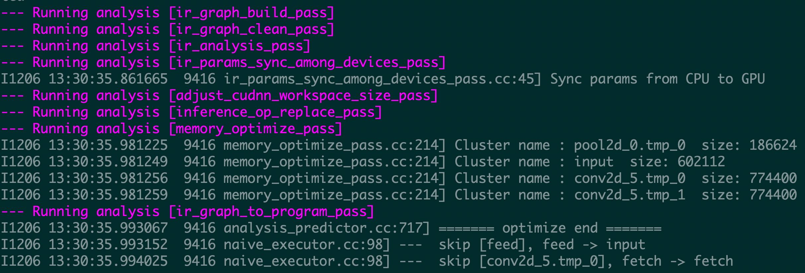
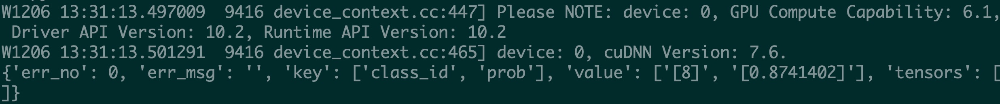

# Linux GPU/CPU 服务化部署开发文档
- [1 简介](#1---)
- [2 服务化部署开发](#2---)
  * [2.1 准备测试数据和部署环境](#21---)
  * [2.2 准备服务化部署模型](#22---)
  * [2.3 复制部署样例程序](#23---)
  * [2.4 初始化部署引擎](#24---)
  * [2.5 开发数据预处理程序](#25---)
  * [2.6 开发预测结果后处理程序](#26---)
  * [2.7 启动模型预测服务](#27---)
  * [2.8 开发客户端访问服务的程序](#28---)
  * [2.9 验证服务化部署功能的正确性](#29---)
- [3 FAQ](#3---)

<a name="1---"></a>

## 1 简介

Paddle Serving依托深度学习框架PaddlePaddle旨在帮助深度学习开发者和企业提供高性能、灵活易用的工业级在线推理服务。Paddle Serving支持RESTful、gRPC、bRPC等多种协议，提供多种异构硬件和多种操作系统环境下推理解决方案，和多种经典预训练模型示例。

本文档主要介绍飞桨模型在 Linux GPU/CPU 下服务化部署能力的开发。主要包含三个步骤：

（1）参考 [《Linux GPU/CPU 基础训练推理开发文档》](待补充) 完成模型的训练和基于Paddle Inference的模型推理开发。

（2）在Paddle Inference的模型推理基础上，完成服务化部署能力的开发（本文档第二章）。

（3）完成TIPC 服务化部署测试开发（本文档第三章）。

<a name="2---"></a>
## 2 服务化部署能力开发

一个模型的服务化部署开发流程如下图所示，一般包含9个步骤。


其中核验点如图黄色区域所示，具体如下：
- 第7步：启动模型预测服务
- 第9步：验证服务化部署能力的正确性

<a name="21---"></a>
### 2.1 准备测试数据和部署环境

【基本流程】

**（1）准备测试数据：** 从验证集或者测试集中抽出至少一张图像，用于后续推理过程验证。

**（2）准备部署环境**

首先准备docker环境，AIStudio环境已经安装了合适的docker。如果是非AIStudio环境，请[参考文档](https://github.com/PaddlePaddle/PaddleOCR/blob/release/2.3/doc/doc_ch/environment.md#2)中的 "1.3.2 Docker环境配置" 安装docker环境。

然后安装Paddle Serving三个安装包，paddle-serving-server，paddle-serving-client 和 paddle-serving-app。

```
wget https://paddle-serving.bj.bcebos.com/test-dev/whl/paddle_serving_server_gpu-0.7.0.post102-py3-none-any.whl
pip3 install paddle_serving_server_gpu-0.7.0.post102-py3-none-any.whl

wget https://paddle-serving.bj.bcebos.com/test-dev/whl/paddle_serving_client-0.7.0-cp37-none-any.whl
pip3 install paddle_serving_client-0.7.0-cp37-none-any.whl

wget https://paddle-serving.bj.bcebos.com/test-dev/whl/paddle_serving_app-0.7.0-py3-none-any.whl
pip3 install paddle_serving_app-0.7.0-py3-none-any.whl
```

Paddle Serving Server更多不同运行环境的whl包下载地址，请参考：[下载页面](https://github.com/PaddlePaddle/Serving/blob/v0.7.0/doc/Latest_Packages_CN.md)

<a name="22---"></a>
### 2.2 准备服务化部署模型

【基本流程】

为了便于模型服务化部署，需要将jit.save保存的静态图模型（具体参考[《Linux GPU/CPU 基础训练推理开发文档》](待补充)中2.2章节）使用paddle_serving_client.convert按如下命令转换为服务化部署模型：

```
python3 -m paddle_serving_client.convert --dirname {静态图模型路径} --model_filename {模型结构文件} --params_filename {模型参数文件} --serving_server {转换后的服务器端模型和配置文件存储路径} --serving_client {转换后的客户端模型和配置文件存储路径}
```
上面命令中 "转换后的服务器端模型和配置文件" 将用于后续服务化部署。

【实战】

针对AlexNet网络，将静态图模型（[模型下载地址，待补充]）转换为服务化部署模型的示例命令如下，转换完后在本地生成serving_server和serving_client两个文件夹。本教程后续主要使用serving_server文件夹中的模型。

```python
python3 -m paddle_serving_client.convert --dirname ./alexnet_infer/ --model_filename inference.pdmodel --params_filename inference.pdiparams --serving_server serving_server --serving_client serving_client
```

<a name="23---"></a>
### 2.3 复制部署样例程序

【基本流程】

服务化部署的样例程序的目录地址为：[tipc/py_serving/template/code/, 待补充地址]
该目录下面包含3个文件，具体如下：

- web_service.py：用于开发服务端模型预测相关程序。由于使用多卡或者多机部署预测服务，设计高效的服务调度策略比较复杂，Paddle Serving将网络预测进行了封装，在这个程序里面开发者只需要关心部署服务引擎的初始化，模型预测的前处理和后处理开发，不用关心模型预测调度问题。

- config.yml：服务端模型预测相关配置文件，里面有各参数的详细说明。开发者只需要关注如下配置：http_port（服务的http端口），model_config（服务化部署模型的路径），device_type（计算硬件类型），devices（计算硬件ID）。

- pipeline_http_client.py：用于客户端访问服务的程序，开发者需要设置url（服务地址）、logid（日志ID）和测试图像。

【实战】

如果服务化部署AlexNet网络，需要拷贝上述三个文件到运行目录。

<a name="24---"></a>
### 2.4 初始化部署引擎

【基本流程】

针对模型名称，修改web_service.py中类TIPCExampleService、TIPCExampleOp的名称，以及这些类初始化中任务名称name，同时通过uci_service.prepare_pipeline_config设置配置参数。

同时修改服务配置文件中的配置：OP名称，http_port（服务的http端口），model_config（服务化部署模型的路径），device_type（计算硬件类型），devices（计算硬件ID）

【实战】

针对AlexNet网络，（1）修改web_service.py文件后的代码如下：

```
from paddle_serving_server.web_service import WebService, Op

class AlexNetOp(Op):
    def init_op(self):
        pass

    def preprocess(self, input_dicts, data_id, log_id):
        pass

    def postprocess(self, input_dicts, fetch_dict, data_id, log_id):
        pass


class AlexNetService(WebService):
    def get_pipeline_response(self, read_op):
        alexnet_op = AlexNetOp(name="alexnet", input_ops=[read_op])
        return alexnet_op

uci_service = AlexNetService(name="alexnet")
uci_service.prepare_pipeline_config("config.yml")
uci_service.run_service()
```

（2）修改服务配置文件config.yml。
- http_port：使用默认的端口号18080
- OP名称：第14行更新为alexnet
- model_config：与2.2转换后服务化部署模型文件夹路径一致，这里使用默认配置 "./serving_server"
- device_type：使用默认配置1，基于GPU预测
- devices：使用默认配置"0"，0号卡预测

<a name="25---"></a>
### 2.5 开发数据预处理程序

【基本流程】

web_service.py文件中的TIPCExampleOp类的preprocess函数用于开发数据预处理程序，包含输入、处理流程和输出三部分。

**（1）输入：** 一般开发者使用时，只需要关心input_dicts和log_id两个输入参数。这两个参数与客户端访问服务程序tipc_pipeline_http_client.py中的请求参数相对应，即：
```
    data = {"key": ["image"], "value": [image], "logid":logid}
```
其中key和value的数据类型都是列表，并且一一对应。input_dicts是一个字典，它的key和value和data中的key和value是一致的。log_id和data中的logid一致。

**（2）处理流程：** 数据预处理流程和基于Paddle Inference的模型预处理流程相同。

**（3）输出：** 需要返回四个参数，一般开发者使用时只关心第一个返回值，网络输入字典，其余返回值使用默认的即可。

```
{"input": input_imgs}, False, None, ""
```
上述网络输入字典的key可以通过服务化模型配置文件serving_server/serving_server_conf.prototxt中的feed_var字典的name字段获取。

【实战】

针对AlexNet网络的数据预处理开发，需要将[Paddle Inference中的preprocess_ops.py, 待补充文件路径] 复制到Paddle Serving的目录下，修改alex_web_service.py文件中代码如下：

添加头文件：

```py
import numpy as np
import sys
import base64
from PIL import Image
import io
from preprocess_ops import ResizeImage, CenterCropImage, NormalizeImage, ToCHW, Compose
```
修改AlexNetOp中的init_op和preprocess函数相关代码：

```py
class AlexNetOp(Op):
    def init_op(self):
        self.eval_transforms = Compose([
            ResizeImage(256), CenterCropImage(224),
            NormalizeImage(), ToCHW()])

    def preprocess(self, input_dicts, data_id, log_id):
        (_, input_dict), = input_dicts.items()
        batch_size = len(input_dict.keys())
        imgs = []
        for key in input_dict.keys():
            data = base64.b64decode(input_dict[key].encode('utf8'))
            byte_stream = io.BytesIO(data)
            img = Image.open(byte_stream)
            img = img.convert("RGB")
            img = self.eval_transforms(img)
            imgs.append(img[np.newaxis, :].copy())
        input_imgs = np.concatenate(imgs, axis=0)
        return {"input": input_imgs}, False, None, ""
```

<a name="26---"></a>
### 2.6 开发预测结果后处理程序

【基本流程】

web_service.py文件中的TIPCExampleOp类的 postprocess 函数用于开发预测结果后处理程序，包含输入、处理流程和输出三部分。

**（1）输入：** 包含四个参数，其中参数input_dicts、log_id和数据预处理函数preprocess中一样，data_id可忽略，fetch_dict 是网络预测输出字典，其中输出的key可以通过服务化模型配置文件serving_server/serving_server_conf.prototxt中的fetch_var字典的name字段获取。

**（2）处理流程：** 数据预处理流程和基于Paddle Inference的预测结果后处理一致。

**（3）输出：** 需要返回三个参数，一般开发者使用时只关心第一个返回值，预测结果字典，其余返回值使用默认的即可。

```
result, None, ""
```

【实战】

针对AlexNet网络的预测结果后处理开发，修改web_service.py文件中AlexNetOp中的postprocess函数相关代码如下：

```
    def postprocess(self, input_dicts, fetch_dict, data_id, log_id):
        score_list = fetch_dict["save_infer_model/scale_0.tmp_1"]
        result = {"class_id": [], "prob": []}
        for score in score_list:
            score = score.flatten()
            class_id = score.argmax()
            prob = score[class_id]
            result["class_id"].append(class_id)
            result["prob"].append(prob)
        result["class_id"] = str(result["class_id"])
        result["prob"] = str(result["prob"])
        return result, None, ""
```

<a name="27---"></a>
### 2.7 启动模型预测服务

【基本流程】

当完成服务化部署引擎初始化、数据预处理和预测结果后处理开发，则可以按如下命令启动模型预测服务：

```bash
python3 web_service.py &
```

【实战】

针对AlexNet网络, 启动成功的界面如下：



<a name="28---"></a>
### 2.8 开发客户端访问服务的程序

【基本流程】

当成功启动了模型预测服务，可以修改pipeline_http_client.py程序，访问该服务。主要设置url（服务地址）、logid（日志ID）和测试图像。其中服务地址的url的样式为 "http://127.0.0.1:18080/tipc_example/prediction" ，url的设置需要将url中的tipc_example更新为TIPCExampleService类初始化的name。

【实战】

针对AlexNet网络, 修改pipeline_http_client.py程序中的url（服务地址）、logid（日志ID）和测试图像地址，其中url改为：

```
url = "http://127.0.0.1:18080/alexnet/prediction"
```

客户端访问服务的命令如下：

```
python3 pipeline_http_client.py
```

访问成功的界面如下：



【注意事项】
如果访问不成功，可能设置了代理影响的，可以用下面命令取消代理设置。

```
unset http_proxy
unset https_proxy
```

<a name="29---"></a>
### 2.9 验证服务化部署功能的正确性（[待若愚完善]）

```
python3 infer.py --model-dir ../alexnet_infer/ --benchmark False --img-path ../pdserving/demo.jpg --use-gpu True
```
运行结果为：
```
image_name: ../pdserving/demo.jpg, class_id: 8, prob: 0.874140202999115
```

<a name="3---"></a>
## 3 FAQ
