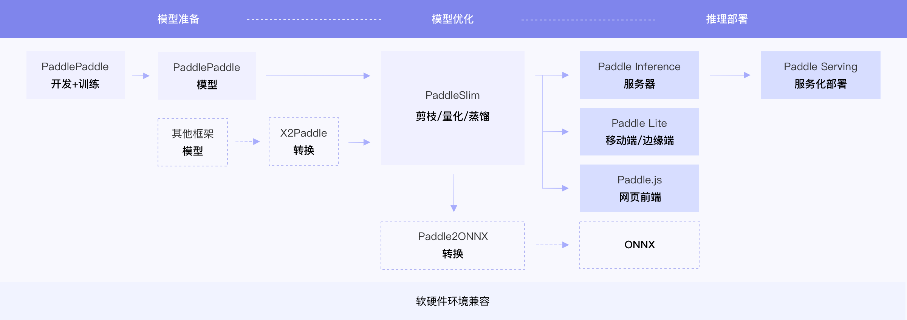

# 飞桨训推一体全流程（TIPC）开发文档

## 1. TIPC简介

飞桨除了基本的模型训练和预测，还提供了支持多端多平台的高性能推理部署工具。飞桨训推一体全流程（Training and Inference Pipeline Criterion(TIPC)）旨在建立模型从学术研究到产业落地的桥梁，方便模型更广泛的使用。

    

## 2. 不同环境不同训练推理方式的开发文档 

- 基础开发规范
    - [Linux GPU/CPU 基础训练推理开发规范](./development_specification_docs/train_infer_python.md)
      
      (2) Linux XPU2 基础训练推理测试开发规范 (coming soon)
      
      (3) Linux DCU 基础训练推理测试开发规范 (coming soon)
      
      (4) Linux NPU 基础训练推理测试开发规范 (coming soon)
      
      (5) [Windows GPU 基础训练推理测试开发规范](./development_specification_docs/Windows_train_infer_python.md)
      
      (6) [MacOS CPU 基础训练推理测试开发规范](./development_specification_docs/Mac_train_infer_python.md)  
          
    - 更多训练方式测试开发规范

      (1) [Linux GPU 多机多卡训练推理测试开发规范](./development_specification_docs/fleet_train_infer_python.md)
      
      (2) [Linux GPU 混合精度训练推理测试开发规范](./development_specification_docs/amp_train_infer_python.md)
    
    - 更多部署方式测试开发规范 

      (1) [Linux GPU/CPU C++ 推理测试开发规范](./development_specification_docs/inference_cpp.md)
      
      (2) [Linux GPU/CPU 服务化部署测试开发规范](./development_specification_docs/serving.md)
      
      (3) Paddle.js 部署测试开发规范 (coming soon)
      
      (4) [Paddle2ONNX 测试开发规范](./development_specification_docs/paddle2onnx.md)
      
      (5) [ARM CPU 部署测试开发规范](./development_specification_docs/Lite_arm_cpu_cpp_infer.md)
      
      (6) [OpenCL ARM GPU 部署测试开发规范](./development_specification_docs/Lite_arm_gpu_opencl_cpp_infer.md)

      (7) Metal ARM GPU 部署测试开发规范 (coming soon)
      
      (8) [Jetson 部署测试开发规范](./development_specification_docs/Jeston_infer_python.md)
      
      (9) XPU 部署测试开发规范 (coming soon)
      
