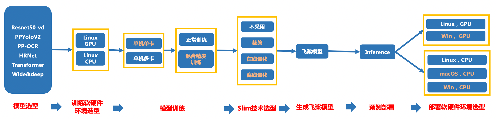

# Jetson 部署测试开发规范

- [1. 总览](#1---)
  * [1.1 背景](#11----)
  * [1.2 TIPC自动化测试](#12-tipc-----)
  * [1.3 文本检测样板间概览](#13----------)
- [2. TIPC规范接入流程](#2-tipc------)
- [3. Jeston 端TIPC参数配置](#3-jeston--tipc----)
  * [3.1 Jeston端TIPC预测参数配置](#31-jeston-tipc------)
- [4. 其他说明](#4-----)

<a name="1---"></a>
# 1. 总览

飞桨除了基本的模型训练和预测，还提供了支持多端多平台的高性能推理部署工具。本文档提供了飞桨训推一体全流程（Training and Inference Pipeline Criterion(TIPC)）信息和测试工具，方便用户查阅每种模型的训练推理部署打通情况，并可以进行一键测试。

<a name="11----"></a>
## 1.1 背景

创建一个自动化测试CI机制，监控框架代码更新可能导致的**模型训练、预测报错、性能下降**等问题。

主要监控的内容有：

 - 框架更新后，套件模型的正常训练，量化训练、裁剪训练、评估、动转静、推理预测是否能正常走通；（比如API的不兼容升级）
 - 框架更新后，套件模型的预测速度是否合理；
 - 框架更新后，套件模型训练的精度是否达标，或训练的loss出现nan等。
 - 其他
为了能监控上述问题，希望把套件模型的训练、预测TIPC加到框架的CI和CE中，提升PR合入的质量。因此，需要在套件中加入运行脚本（不影响套件正常运行），完成模型的自动化测试。

Jeston产品是Nvidia推出的开发者套件，用于部署AI模型。Jeston系列的产品有Jeston Nano, TX，NX等等。本节以PaddleOCR检测模型和JestonNX为例，介绍如何在Jeston上接入TIPC预测推理的测试。

Jeston的CPU性能远差于笔记本或者台式机，因此在Jeston上，只需要测试GPU上预测相关的链条即可，包括GPU预测，GPU+TensorRT(fp32)，GPU+TensorRT(fp16)预测。

可以建立的CI/CE机制包括：

 1. **不训练，全量数据走通开源模型评估、预测，并验证模型预测速度和精度是否符合设定预期；(whole_infer)（单模型30分钟内)**
	 a. 保证训练后模型动转静→inference预测跑通，预测结果正确，预测速度符合预期，预测资源占用合理（监控显存内存）


注：由于CI有时间限制，所以在测试的时候需要限制运行时间，所以需要构建一个很小的数据集完成测试。

<a name="12-tipc-----"></a>
## 1.2 TIPC自动化测试

本规范测试的链条如下（其中相邻两个模块之间是两两组合关系），可以根据模型开发规范适当删减链条。


上图各模块在Jeston端具体测试点如下：

- Paddle inference 预测部署方面：
	- Jeston端 GPU上不同batchsize，是否开启TensorRT的运行状态（**必选**）


<a name="13----------"></a>
## 1.3 文本检测样板间概览

以PaddleOCR文本检测模型为例，提供了本规范的样板间，可以跑通1.2章节提到的**所有测试链条**，完成1.1背景部分提到的1种CI/CE机制。

脚本位于PaddleOCR dygraph分支下的test_tipc文件夹：https://github.com/PaddlePaddle/PaddleOCR/tree/dygraph/test_tipc

test_tipc文件夹下与本规范相关的文件分别是：
```
test_tipc/
｜- configs/  自动化测试需要的配置文件和参数文件
	├── ppocr_det_mobile/                #  ppocr检测模型mobile版本的配置文件和参数文件夹
		├── det_mv3_db.yml               # 测试mobile版ppocr检测模型训练的yml文件
		├── model_linux_gpu_normal_normal_infer_python_jetson.txt     # Mac端测试mobile版ppocr检测模型的参数配置文件
｜- prepare.sh   以ppocr_det_mobile_params.txt 为参数配置，完成数据、预训练模型、预测模型的自动下载。
｜- test_train_inference_python.sh   自动化测试脚本，以ppocr_det_mobile_params.txt 为参数配置，组建出不同的运行命令，完成不同参数配置下的所有链条运行。
｜- readme.md  该代码库测试脚本运行说明
```


<a name="2-tipc------"></a>
# 2. TIPC规范接入流程

TIPC规范接入包含如下三个步骤：
 - 准备数据
 - 规范化输出日志
 - 编写自动化测试代码

该部分同Linux端基础链条接入规范，可以参考[文档](./train_infer_python.md)。

<a name="3-jeston--tipc----"></a>
# 3. Jeston 端TIPC参数配置

由于Jeston端不支持训练，仅需要测试CPU inference预测链条即可。

<a name="31-jeston-tipc------"></a>
## 3.1 Jeston端TIPC预测参数配置

```
===========================infer_params===========================
model_name:ocr_det
python:python
infer_model:./inference/ch_ppocr_mobile_v2.0_det_infer
infer_export:null
infer_quant:False
inference:tools/infer/predict_det.py
--use_gpu:True|False
--enable_mkldnn:False
--cpu_threads:1|6
--rec_batch_num:1
--use_tensorrt:False|True
--precision:fp16|fp32
--det_model_dir:
--image_dir:./inference/ch_det_data_50/all-sum-510/
null:null
--benchmark:True
null:null
```
可以发现上图中第4行参数infer_export参数设置为null，表示不执行动转静的逻辑，同样在执行预测参数的选择上，做如下配置：
```
--use_gpu:True|False
--enable_mkldnn:False
--cpu_threads:1|6
--rec_batch_num:1
--use_tensorrt:False|True
--precision:fp16|fp32
```
在Jeston CPU上执行预测时，仅测试CPU不同线程数的情况，由于jeston机器上的CPU不支持开启mlkdnn，所以设置参数--enable_mkldnn为False。
在Jeston GPU上，需要测试开启TensorRT在不同精度（fp32, fp16）下的预测情况。所以设置--use_tensorrt:False|True， --precision:fp16|fp32。

<a name="4-----"></a>
# 4. 其他说明
Jeston端TIPC测试方法同Linux端，仅仅根据不同硬件环境调整了部分参数，有关TIPC接入详细说明请参考[Linux端基础链条测试规范](./train_infer_python.md)。


