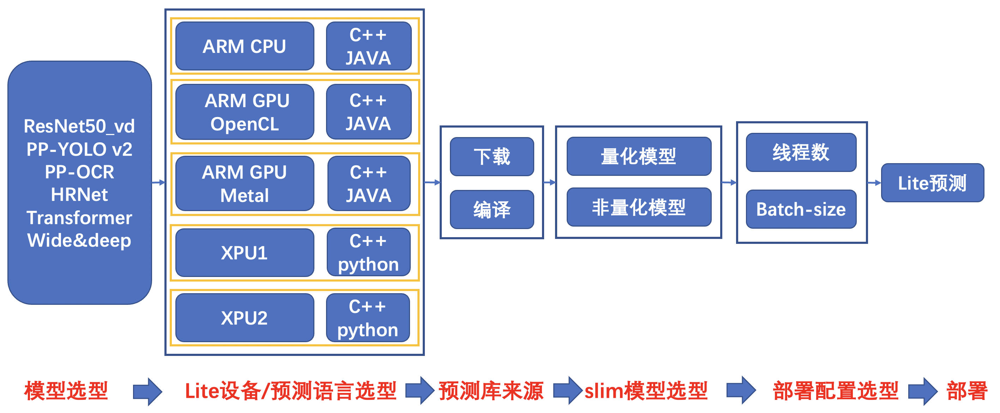
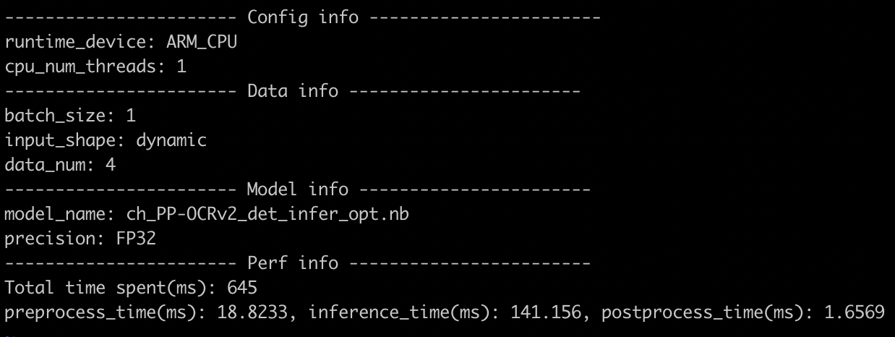
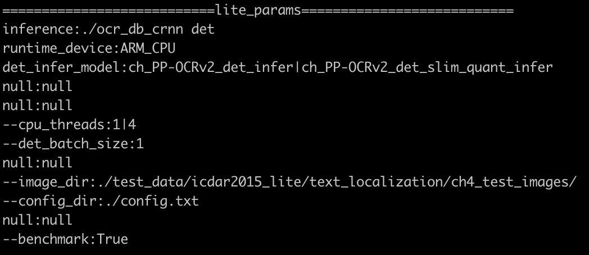

# 目录

- [1.概述](#概述)
- [2.总览](#总览)
    - [2.1 训推一体自动化测试](#训推一体自动化测试)
    - [2.2 文本检测样板间概览](#文本检测样板间概览)
- [3.Lite端ARM_CPU预测接入TIPC流程](#Lite端ARM_CPU预测接入TIPC流程)
    - [3.1 准备数据和环境](#准备数据和环境)
    - [3.2 规范化输出预测日志](#规范化输出预测日志)
        - [3.2.1 日志规范](#日志规范)
        - [3.2.2 接入步骤](#接入步骤)
    - [3.3 编写自动化测试代码](#编写自动化测试代码)
- [4.附录](#附录)
    - [4.1 自动化测试脚本test_arm_cpp.sh函数介绍](#自动化测试脚本函数介绍)
    - [4.2 注意事项](#注意事项)

<a name="概述"></a>
# 1.概述

训推一体认证（TIPC）旨在监控框架代码更新可能导致的模型训练、预测报错、性能下降等问题。本文主要介绍TIPC中基于ARM_CPU设备的Lite预测cpp测试的接入规范和监测点，是在基础测试上针对Lite测试的补充说明。

主要监控的内容有：

- 飞桨框架更新后，代码仓库模型基于ARM_CPU的Lite预测cpp测试是否能正常走通；（比如API的不兼容升级）

- 飞桨框架更新后，代码仓库模型基于ARM_CPU的的Lite预测cpp测试速度是否合理；

为了能监控上述问题，希望把代码仓库模型的Lite预测测试加到飞桨框架的CI和CE中，提升PR合入的质量。因此，需要在代码仓库中加入运行脚本（不影响套件正常运行），完成模型的自动化测试。

可以建立的CI/CE机制包括：

**全量数据走通开源模型Lite预测，并验证模型预测速度和精度是否符合设定预期；（单模型30分钟内)**

    a. 保证预测结果正确，预测速度符合预期（QA添加中）

**注:** 由于CI有时间限制，所以在测试的时候需要限制运行时间，所以需要构建一个很小的数据集完成测试。

<a name="总览"></a>
# 2.总览

<a name="训推一体自动化测试"></a>
## 2.1 训推一体自动化测试

本规范最终的测试的链条如下，可以根据模型开发规范和代码仓库需要，适当删减链条。

上图所示为Lite端的链条，共288条。其中，本文档主要介绍其中基于ARM_CPU的cpp测试链条。

<a name="文本检测样板间概览"></a>
## 2.2 文本检测样板间概览

在PaddleOCR中，以文本检测为例，提供了本规范的样板间，可以完成概述部分提到的1种CI/CE机制。

Lite预测测试工具位于PaddleOCR dygraph分支下的test_tipc目录，与Lite预测ARM_CPU样板间相关的主要文件如下：

```
test_tipc/
├── common_func.sh
├── configs # 配置文件目录
│   ├── ppocr_det_mobile
│   │   ├── model_linux_gpu_normal_normal_lite_cpp_arm_cpu.txt
│   │   ├── ...
│   ├── ...
│   ├── ppocr_system_mobile
│   │   ├── model_linux_gpu_normal_normal_lite_cpp_arm_cpu.txt
│   │   └── ...
├── prepare_lite_cpp.sh # 完成test_cpu_cpp.sh运行所需要的数据和模型下载
├── test_lite_arm_cpp.sh # lite测试主程序
```

不同代码仓库的`configs`目录下的内容可根据实际情况进行调整, 配置文件`model_linux_gpu_normal_normal_lite_cpp_arm_cpu.txt`需满足[TIPC配置文件命名规范](https://github.com/PaddlePaddle/PaddleOCR/tree/dygraph/test_tipc#%E9%85%8D%E7%BD%AE%E6%96%87%E4%BB%B6%E5%91%BD%E5%90%8D%E8%A7%84%E8%8C%83)。

<a name="Lite端ARM_CPU预测接入TIPC流程"></a>
# 3.Lite端ARM_CPU预测接入TIPC流程

Lite端ARM_CPU预测接入TIPC包含如下三个步骤，接下来将依次介绍这三个部分。

- 准备数据和环境
- 规范化输出预测日志
- 编写自动化测试代码

<a name="准备数据和环境"></a>  
## 3.1 准备数据和环境

同标准TIPC测试流程一样，在`prepare_lite_arm_cpp.sh`中准备好所需数据和环境，包括：

- 少量预测数据
- inference模型
- 运行Lite所需要的可执行文件

以PaddleOCR文本检测模型为例，使用方式：

```               
bash test_tipc/prepare_lite_arm_cpp.sh test_tipc/configs/ppocr_det_mobile/model_linux_gpu_normal_normal_lite_cpp_arm_cpu.txt
```   
`prepare_lite_arm_cpp.sh`具体内容：

1.解析`model_linux_gpu_normal_normal_lite_cpp_arm_cpu.txt`部分用于预测的参数字段，方便后续预测。

```
source ./test_tipc/common_func.sh
FILENAME=$1
dataline=$(cat ${FILENAME})
# parser params
IFS=$'\n'
lines=(${dataline})
IFS=$'\n'

inference_cmd=$(func_parser_value "${lines[1]}")
DEVICE=$(func_parser_value "${lines[2]}")
det_lite_model_list=$(func_parser_value "${lines[3]}")
rec_lite_model_list=$(func_parser_value "${lines[4]}")
cls_lite_model_list=$(func_parser_value "${lines[5]}")
```

2.转换`infernce model`到Lite预测的`.nb`模型
   
```
# prepare lite .nb model
if [[ $inference_cmd =~ "det" ]];then
    lite_model_list=${det_lite_model_list}
elif [[ $inference_cmd =~ "rec" ]];then
    lite_model_list=(${rec_lite_model_list[*]} ${cls_lite_model_list[*]})
elif [[ $inference_cmd =~ "system" ]];then
    lite_model_list=(${det_lite_model_list[*]} ${rec_lite_model_list[*]} ${cls_lite_model_list[*]})
else
    echo "inference_cmd is wrong, please check."
    exit 1
fi

for model in ${lite_model_list[*]}; do
    if [[ $model =~ "PP-OCRv2" ]];then
        inference_model_url=https://paddleocr.bj.bcebos.com/PP-OCRv2/chinese/${model}.tar
    elif [[ $model =~ "v2.0" ]];then
        inference_model_url=https://paddleocr.bj.bcebos.com/dygraph_v2.0/ch/${model}.tar
    else
        echo "Model is wrong, please check."
        exit 3
    fi
    inference_model=${inference_model_url##*/}
    wget -nc  -P ${model_path} ${inference_model_url}
    cd ${model_path} && tar -xf ${inference_model} && cd ../
    model_dir=${model_path}/${inference_model%.*}
    model_file=${model_dir}/inference.pdmodel
    param_file=${model_dir}/inference.pdiparams
    paddle_lite_opt --model_dir=${model_dir} --model_file=${model_file} --param_file=${param_file} --valid_targets=${valid_targets} --optimize_out=${model_dir}_opt
done
```

3.准备测试数据

```
data_url=https://paddleocr.bj.bcebos.com/dygraph_v2.0/test/icdar2015_lite.tar
model_path=./inference_models
inference_model=${inference_model_url##*/}
data_file=${data_url##*/}
wget -nc  -P ./inference_models ${inference_model_url}
wget -nc  -P ./test_data ${data_url}
cd ./inference_models && tar -xf ${inference_model} && cd ../
cd ./test_data && tar -xf ${data_file} && rm ${data_file} && cd ../
```

4.准备Lite预测环境，此处需要下载或者编译Paddle-Lite预测库。

```
# prepare lite env
paddlelite_zipfile=$(echo $paddlelite_url | awk -F "/" '{print $NF}')
paddlelite_file=${paddlelite_zipfile:0:${end_index}}
wget ${paddlelite_url} && tar -xf ${paddlelite_zipfile}
mkdir -p  ${paddlelite_file}/demo/cxx/ocr/test_lite
cp -r ${model_path}/*_opt.nb test_data ${paddlelite_file}/demo/cxx/ocr/test_lite
cp ppocr/utils/ppocr_keys_v1.txt deploy/lite/config.txt ${paddlelite_file}/demo/cxx/ocr/test_lite
cp -r ./deploy/lite/* ${paddlelite_file}/demo/cxx/ocr/
cp ${paddlelite_file}/cxx/lib/libpaddle_light_api_shared.so ${paddlelite_file}/demo/cxx/ocr/test_lite
cp ${FILENAME} test_tipc/test_lite_arm_cpp.sh test_tipc/common_func.sh ${paddlelite_file}/demo/cxx/ocr/test_lite
cd ${paddlelite_file}/demo/cxx/ocr/
git clone https://github.com/cuicheng01/AutoLog.git
```

5.交叉编译获得在手机上的可以运行的可执行文件

```
make -j
sleep 1
make -j
cp ocr_db_crnn test_lite && cp test_lite/libpaddle_light_api_shared.so test_lite/libc++_shared.so
tar -cf test_lite.tar ./test_lite && cp test_lite.tar ${current_dir} && cd ${current_dir}
rm -rf ${paddlelite_file}* && rm -rf ${model_path}
```

运行结果会在当前目录上生成test_lite.tar，里边的内容大致如下：
``` 
├── common_func.sh # 通用函数，如解析参数等
├── config.txt # 文本检测、识别的配置文件
├── libc++_shared.so 
├── libpaddle_light_api_shared.so
├── models # 模型
│   ├── ch_ppocr_mobile_v2.0_det_opt.nb
│   └── ch_ppocr_mobile_v2.0_det_slim_opt.nb
├── ocr_db_crnn //可执行文件
├── model_linux_gpu_normal_normal_lite_cpp_arm_cpu.txt # 参数配置
├── ppocr_keys_v1.txt # 文本识别对应的字典文件
├── test_data # 测试数据
│   └── icdar2015_lite
│       └── text_localization
│           ├── ch4_test_images
│           │   ├── img_233.jpg
│           │   ├── img_603.jpg
│           │   ├── img_612.jpg
│           │   └── img_61.jpg
│           ├── icdar_c4_train_imgs
│           │   ├── img_233.jpg
│           │   ├── img_603.jpg
│           │   ├── img_612.jpg
│           │   └── img_61.jpg
│           ├── test_icdar2015_label.txt
│           └── train_icdar2015_label.txt
└── test_lite_arm_cpp.sh # 测试脚本
```
<a name="规范化输出预测日志"></a>
## 3.2 规范化输出预测日志

<a name="日志规范"></a>
### 3.2.1 日志规范

类似于python、C++预测等基础测试链条，Lite预测链条也需要规范不同套件中预测输出的格式，方便QA统一自动化测试。针对Lite的预测log规范输出工具也已集成到AutoLog工具包。

Lite测试要求规范输出预测结果及以下信息：

- 运行的硬件：如ARM_CPU、ARM_GPU_OPENCL
- 运行的模型名称： 如ch_PP-OCRv2_det_infer
- 进程数量：如1或者4
- batch_size: 如1或者4
- 性能信息，基于Lite预测的各阶段平均预测时间（包括前处理时间、inference时间、后处理时间）
- 模型类型：FP32或者INT8

<a name="接入步骤"></a>
### 3.2.2 接入步骤

代码修改主要有以下两步：预测耗时打点和打印输出信息。下面分别介绍：

1.添加预测耗时打点
（1）在模型预测中，统计前处理，预测，后处理时间，可参考[代码](https://github.com/PaddlePaddle/PaddleOCR/blob/dygraph/deploy/lite/ocr_db_crnn.cc#L567)。
（2）使用autolog工具打印日志，参考[代码](https://github.com/PaddlePaddle/PaddleOCR/blob/dygraph/deploy/lite/ocr_db_crnn.cc#L572)。主要包括：

- 在样板间克隆AutoLog代码库：git clone https://github.com/cuicheng01/AutoLog.git
-  引入头文件：
```
#include "AutoLog/auto_log/autolog.h"
```
- 调用AutoLogger类打印日志：
``` 
if (strcmp(argv[9], "True") == 0) {
  AutoLogger autolog(det_model_file, 
                     runtime_device,
                     std::stoi(num_threads),
                     std::stoi(batchsize), 
                     "dynamic", 
                     precision, 
                     time_info, 
                     cv_all_img_names.size());
  autolog.report();
} 
```    

2.输出日志格式如下：


<a name="编写自动化测试代码"></a>
## 3.3 编写自动化测试代码

自动化测试脚本包括三个部分，分别是运行脚本`test_lite_arm_cpp.sh`，参数文件`params.txt`，在OCR文本检测的Lite测试ARM_CPU样板间中，该参数文件为`model_linux_gpu_normal_normal_lite_cpp_arm_cpu.txt`,数据模型准备脚本`prepare_lite_cpp.sh`。
按如下方式在参数文件`model_linux_gpu_normal_normal_lite_cpp_arm_cpu.txt`中添加Lite预测部分参数：


参数说明：

| 参数 | 参数介绍  |
| :------------------------------------------ | :------------------------------------------------------- |
| inference: ./ocr_db_crnn det | Lite预测命令 |
| det_infer_model:ch_PP-OCRv2_det_infer\|ch_PP-OCRv2_det_slim_quant_infer | 模型名称 |
| runtime_device:ARM_CPU | 运行设备名称 |
| –cpu_threads:1｜4 | 设置ARM线程数，如果要测试ARM上不同线程下的预测速度和精度，可以设置多个值，不同值用｜隔开 |
| –det_batch_size: 1 | 设置batch_size 的参数，暂时只支持1 |
| –image_dir:./test_data/icdar2015_lite/text_localization/ch4_test_images/ | 设置预测的数据路径 |
| –config_dir:./config.txt  | 设置预测的数据路径 |
| –benchmark:True | 设置是否开启AutoLog的参数  |

<a name="附录"></a>
# 4.附录

<a name="自动化测试脚本函数介绍"></a>
## 4.1 自动化测试脚本test_lite_arm_cpp.sh函数介绍

Lite预测核心函数：

func_lite_rec() ：执行文本识别模型的Lite预测函数，根据不同的输入配置完成相应配置的预测

func_lite_det() ：执行文本检测模型的Lite预测函数，根据不同的输入配置完成相应配置的预测

func_lite_system() ：执行端到端文本识别的Lite预测函数，根据不同的输入配置完成相应配置的预测

func_parser_value() ：解析`params.txt`中`:`后的部分

status_check() ：状态检查函数，获取上条指令运行的状态，如果是0，则运行成功，如果是其他则运行失败，失败和成功的指令都会存放在`results.log`文件中

<a name="注意事项"></a>
## 4.2 注意事项

所有的Lite环境和模型数据等都是在docker中生成，后将相关的可执行文件、测试图片、模型等上传手机，通过`test_arm_cpp.sh`来完成多种链条的测试。


