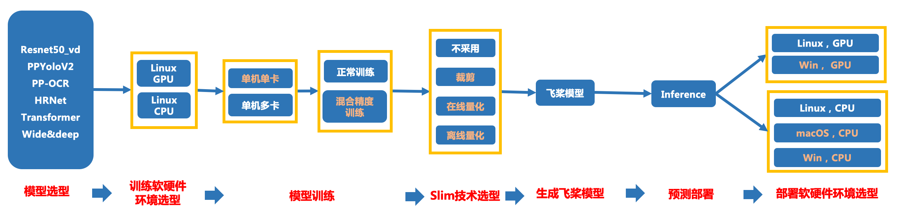

# MAC端TIPC测试开发规范

- [1、总览](#1---)
  * [1.1 背景：](#11----)
  * [1.2 TIPC自动化测试](#12-tipc-----)
  * [1.3 文本检测样板间概览](#13----------)
- [2. TIPC规范接入流程](#2-tipc------)
- [3. MAC 端TIPC参数配置](#3-mac--tipc----)
  * [3.1 MAC 端TIPC训练参数配置](#31-mac--tipc------)
  * [3.2 MAC 端TIPC预测参数配置](#32-mac--tipc------)
- [4. 其他说明](#4-----)

<a name="1---"></a>
# 1、总览

飞桨除了基本的模型训练和预测，还提供了支持多端多平台的高性能推理部署工具。本文档提供了飞桨训推一体认证 (Training and Inference Pipeline Certification(TIPC)) 信息和测试工具，方便用户查阅每种模型的训练推理部署打通情况，并可以进行一键测试。

<a name="11----"></a>
## 1.1 背景：
创建一个自动化测试CI机制，监控框架代码更新可能导致的**模型训练、预测报错、性能下降**等问题。

主要监控的内容有：

 - 框架更新后，套件模型的正常训练，量化训练、裁剪训练、评估、动转静、推理预测是否能正常走通；（比如API的不兼容升级）
 - 框架更新后，套件模型的预测速度是否合理；
 - 框架更新后，套件模型训练的精度是否达标，或训练的loss出现nan等。
 - 其他
为了能监控上述问题，希望把套件模型的训练、预测TIPC加到框架的CI和CE中，提升PR合入的质量。因此，需要在套件中加入运行脚本（不影响套件正常运行），完成模型的自动化测试。

可以建立的CI/CE机制包括：

 1. **少量数据训练模型，少量数据预测，走通训练到预测链条，保证各模块输出符合预期。(lite_train_lite_infer)（单模型15分钟内）**
	 a. 保证训练跑通；训练速度正常（监控batch_cost）
	 b. 训练资源占用合理（显存）
	 c. 保证训练可复现，loss曲线收敛正常（固定seed后loss一致）
	 d. 保证训练后模型动转静→inference预测跑通，预测资源占用合理（监控显存内存）
 2. **少量数据训练模型，全量数据预测，验证预测速度；(lite_train_whole_infer)（单模型30分钟内）**
	 a. 保证训练跑通；训练速度正常（监控batch_cost）
	 b. 训练资源占用合理（显存）
	 c. 保证训练可复现，loss曲线收敛正常（固定seed后loss一致）
	 d. 保证训练后模型动转静→inference预测跑通，预测速度符合预期，预测资源占用合理（监控显存内存）
	
 3. **全量数据训练预测，验证训练模型精度和速度；(whole_train_whole_infer)（周级别）**
	 a. 保证训练跑通；训练速度正常（监控batch_cost），训练精度达到既定值
	 b. 训练资源占用合理（显存）
	 c. 保证训练可复现，loss曲线收敛正常（固定seed后loss一致）
	 d. 保证训练后模型动转静→inference预测跑通，预测结果正确，预测速度符合预期，预测资源占用合理（监控显存内存）
 
 4. **不训练，全量数据走通开源模型评估、预测，并验证模型预测速度和精度是否符合设定预期；(whole_infer)（单模型30分钟内)**
	 a. 保证训练后模型动转静→inference预测跑通，预测结果正确，预测速度符合预期，预测资源占用合理（监控显存内存）


注：由于CI有时间限制，所以在测试的时候需要限制运行时间，所以需要构建一个很小的数据集完成测试。

<a name="12-tipc-----"></a>
## 1.2 TIPC自动化测试

本规范测试的链条如下（其中相邻两个模块之间是两两组合关系），可以根据模型开发规范适当删减链条。


上图各模块具体测试点如下：

- 模型训练方面（MAC CPU训练）：
	- CPU训练（**必选**）

- 模型压缩方面（MAC CPU训练）：
	- 裁剪训练（可选）
	- 在线量化训练（可选）
	- 离线量化（可选）
	
- 飞桨模型转换，即动转静功能（**必选**）
- Paddle inference 预测部署方面：
	- MAC CPU上不同batchsize，不同CPU线程数的运行状态（**必选**）


<a name="13----------"></a>
## 1.3 文本检测样板间概览

以PaddleOCR文本检测模型为例，提供了本规范的样板间，可以跑通1.2章节提到的**所有测试链条**，完成1.1背景部分提到的4种CI/CE机制。

脚本位于PaddleOCR dygraph分支下的test_tipc文件夹：https://github.com/PaddlePaddle/PaddleOCR/tree/dygraph/test_tipc

test_tipc文件夹下与本规范相关的文件分别是：
```
test_tipc/
｜- configs/  自动化测试需要的配置文件和参数文件
	├── ppocr_det_mobile/                #  ppocr检测模型mobile版本的配置文件和参数文件夹
		├── det_mv3_db.yml               # 测试mobile版ppocr检测模型训练的yml文件
		├── train_linux_cpu_normal_normal_infer_python_mac.txt     # Mac端测试mobile版ppocr检测模型的参数配置文件
｜- prepare.sh   以ppocr_det_mobile_params.txt 为参数配置，完成数据、预训练模型、预测模型的自动下载。
｜- test_train_inference_python.sh   自动化测试脚本，以ppocr_det_mobile_params.txt 为参数配置，组建出不同的运行命令，完成不同参数配置下的所有链条运行。
｜- readme.md  该代码库测试脚本运行说明
```


<a name="2-tipc------"></a>
# 2. TIPC规范接入流程

TIPC规范接入包含如下三个步骤：
 - 准备数据
 - 规范化输出日志
 - 编写自动化测试代码

该部分同Linux端基础链条接入规范，可以参考[文档](./train_infer_python.md)。

<a name="3-MAC--tipc----"></a>
# 3. MAC 端TIPC参数配置

由于MAC端不支持GPU训练，并且CPU不支持开启mkldnn进行预测。MAC端仅需要走通CPU训练和CPU inference预测链条即可。

<a name="31-MAC-tipc------"></a>
## 3.1 MAC 端TIPC训练参数配置

以PaddleOCR检测模型为例，MAC端TIPC训练链条参数配置如下：
```
===========================train_params===========================
model_name:ocr_det
python:python
gpu_list:-1
Global.use_gpu:False
Global.auto_cast:null
Global.epoch_num:lite_train_lite_infer=1|whole_train_whole_infer=300
Global.save_model_dir:./output/
Train.loader.batch_size_per_card:lite_train_lite_infer=2|whole_train_whole_infer=4
Global.pretrained_model:null
train_model_name:latest
train_infer_img_dir:./train_data/icdar2015/text_localization/ch4_test_images/
null:null
##
trainer:norm_train|pact_train|fpgm_train
norm_train:tools/train.py -c test_tipc/configs/det_mv3_db.yml -o Global.pretrained_model=./pretrain_models/MobileNetV3_large_x0_5_pretrained
pact_train:deploy/slim/quantization/quant.py -c test_tipc/configs/det_mv3_db.yml -o
fpgm_train:deploy/slim/prune/sensitivity_anal.py -c test_tipc/configs/det_mv3_db.yml -o Global.pretrained_model=./pretrain_models/det_mv3_db_v2.0_train/best_accuracy
distill_train:null
null:null
null:null
##
===========================eval_params=========================== 
eval:null
null:null
##
```
gpu_list 参数设置为-1，use_gpu参数设置为False，表示在CPU上运行，其他参数与Linux端的参数配置保持一致。

<a name="31-MAC-tipc------"></a>
## 3.2 MAC 端TIPC预测参数配置

以PaddleOCR检测模型为例，MAC端TIPC预测链条参数配置如下：
```

===========================infer_params===========================
Global.save_inference_dir:./output/
Global.pretrained_model:
norm_export:tools/export_model.py -c test_tipc/configs/det_mv3_db.yml -o 
quant_export:deploy/slim/quantization/export_model.py -c test_tipc/configs/det_mv3_db.yml -o 
fpgm_export:deploy/slim/prune/export_prune_model.py -c test_tipc/configs/det_mv3_db.yml -o 
distill_export:null
export1:null
export2:null
inference_dir:null
train_model:./inference/ch_ppocr_mobile_v2.0_det_train/best_accuracy
infer_export:tools/export_model.py -c configs/det/ch_ppocr_v2.0/ch_det_mv3_db_v2.0.yml -o
infer_quant:False
inference:tools/infer/predict_det.py
--use_gpu:False
--enable_mkldnn:False
--cpu_threads:1|6
--rec_batch_num:1
--use_tensorrt:False
--precision:fp32
--det_model_dir:
--image_dir:./inference/ch_det_data_50/all-sum-510/
null:null
--benchmark:True
null:null

```

在参数文件中，将tensorrt，mkldnn相关的参数--use_tensortt 、--enable_mkldnn均设置为False。

<a name="4-----"></a>
# 4. 其他说明
MAC端TIPC测试方法同Linux端，仅仅根据不同硬件环境调整了部分参数，有关TIPC接入详细说明请参考[Linux端基础链条测试规范](./train_infer_python.md)。。


