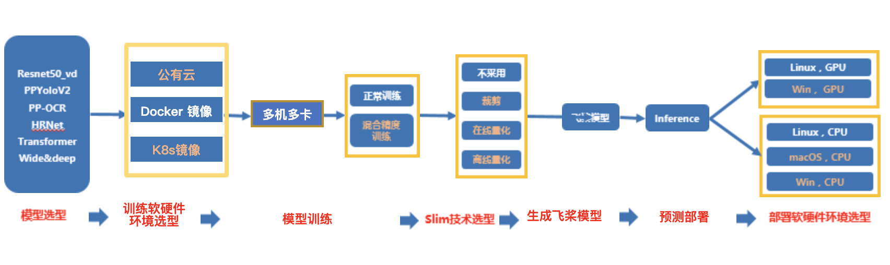

# 多机多卡训练推理测试开发规范

## 目录
- [1.总览](#总览)
    - [1.1 背景](#背景)
    - [1.2 TIPC自动化测试](#TIPC自动化测试)
    - [1.3 文本检测样板间概览](#文本检测样板间概览)
- [2.TIPC规范接入多机多卡流程](#TIPC规范接入多机多卡流程)
    - [2.1 准备数据和环境](#准备数据和环境)
    - [2.2 规范化输出日志](#规范化输出日志)
    - [2.3 编写自动化测试代码](#编写自动化测试代码)

<a name="概述"></a>
# 1. 总览

<a name="背景"></a>
## 1.1 背景
训推一体认证（TIPC），旨在监控框架代码更新可能导致的**模型训练、预测报错、性能下降**等问题。本文主要介绍TIPC中**多机多卡训练推理链条**的接入规范和监测点，是在[基础链条](./train_infer_python.md)上针对多机多卡训练推理链条的补充说明。

主要监控的内容有：

- 框架更新后，套件模型的多机多卡训练功能是否能正常走通；（比如API的不兼容升级）
- 框架更新后，套件模型在两种模式(Parameter Server和Collective)下的多机通信、训练速度是否正常；

为了能监控上述问题，希望把套件模型的多机多卡训练链条加到框架的CI和CE中，提升PR合入的质量。因此，需要在套件中加入运行脚本（不影响套件正常运行），完成模型的自动化测试。

需要建立的CI/CE机制如下：

1. **少量数据训练模型，少量数据预测，走通训练到预测TIPC，保证各模块输出符合预期。（单模型15分钟内）**
- 保证多机之间可以正常通信，训练跑通；训练速度正常（监控batch_cost）（QA添加中)
- 训练资源占用合理（显存）（QA添加中）
- 保证训练可复现，loss曲线收敛正常（固定seed后loss一致）（QA添加中）
- 保证训练后模型动转静→inference预测跑通，预测资源占用合理（监控显存内存）（QA添加中）

2. **全量数据训练预测，验证训练模型精度和速度。（周级别）**
- 保证多机之间可以正常通信，训练跑通；训练速度正常（监控batch_cost），训练精度达到既定值
- 训练资源占用合理（显存）（QA添加中）
- 保证训练可复现，loss曲线收敛正常（固定seed后loss一致）（QA添加中）
- 保证训练后模型动转静→inference预测跑通，预测结果正确，预测速度符合预期，预测资源占用合理（监控显存内存）（QA添加中）

**注**：由于CI有时间限制，所以在测试的时候需要限制运行时间，所以需要构建一个很小的数据集完成测试。

<a name="TIPC自动化测试"></a>
## 1.2 TIPC自动化测试

本规范测试的链条如下（其中相邻两个模块之间是两两组合关系），可以根据模型开发规范和套件需要，适当删减链条。


- 模型训练方面: (只需要考虑Linux GPU)
    - Docker镜像（**必选**）
    - 分布式镜像 （可选）
    - k8s镜像 (可选)
- 模型压缩方面:
    - 裁剪训练（可选）
    - 在线量化训练（可选）
    - 离线量化（可选）
- 飞桨模型转换，即动转静功能(**必选**)
- Paddle inference 预测部署方面：
    - Linux GPU上不同batchsize，是否开启TensorRT，不同预测精度（FP32，FP16，INT8）的运行状态(**必选**)
    - Linux CPU上不同batchsize，是否开启MKLDNN，不同预测精度（FP32，FP16，INT8）的运行状态(**必选**)

<a name="文本检测样板间概览"></a>
## 1.3 文本检测样板间概览

在PaddleOCR中，以文本检测为例，提供了本规范的样板间，可以跑通1.2章节提到的**所有测试链条**，完成1.1背景部分提到的2种CI/CE机制。

多机多卡链条测试工具已与基础链条测试集成到一起，位于PaddleOCR dygraph分支下的[test_tipc目录](https://github.com/PaddlePaddle/PaddleOCR/tree/dygraph/test_tipc)，其结构如下：
```
test_tipc/
├── configs/  # 配置文件目录
    ├── ppocr_det_mobile             # ppocr_det_mobile模型的测试配置文件目录
        ├── det_mv3_db.yml           # 测试mobile版ppocr检测模型训练的yml文件
        ├── train_linux_gpu_fleet_amp_infer_python_linux_gpu_cpu.txt   # 测试Linux上多机多卡训练和python预测的配置文件
        ├── ...  
    ├── ...  
├── results/   # 预先保存的预测结果，用于和实际预测结果进行精读比对
    ├── python_ppocr_det_mobile_results_fp32.txt           # 预存的mobile版ppocr检测模型python预测fp32精度的结果
    ├── ...
├── prepare.sh                        # 完成test_*.sh运行所需要的数据和模型下载
├── test_train_inference_python.sh    # 测试python训练预测的主程序
├── compare_results.py                # 用于对比log中的预测结果与results中的预存结果精度误差是否在限定范围内
└── readme.md                         # 使用文档
```

<a name="TIPC规范接入多机多卡流程"></a>
# 2. TIPC规范接入多机多卡流程
TIPC规范接入包含如下三个步骤，接下来将依次介绍这三个部分。  

 - 准备数据和环境
 - 规范化输出日志
 - 编写自动化测试代码

<a name="准备数据和环境"></a>
## 2.1 准备数据和环境

同标准TIPC测试流程一样，在prepare.sh中准备好所需数据和环境，包括：

- 准备多机训练环境:  **需要准备至少两台相互可以ping通的机器，后续步骤均需要在两台机器上同时操作**。

- 少量训练和预测数据: 用于完成1.1背景部分提到的第一种CI/CE机制

- 全量训练数据:  用于完成1.2背景部分提到的第二种CI/CE机制

- 准备编译或者编译好的第三方库等

prepare.sh的代码内容如下，[参考链接](https://github.com/PaddlePaddle/PaddleOCR/blob/dygraph/test_tipc/prepare.sh)
```
if [ ${MODE} = "lite_train_lite_infer" ];then
    # pretrain lite train data
    wget -nc -P  ./pretrain_models/ https://paddle-imagenet-models-name.bj.bcebos.com/dygraph/MobileNetV3_large_x0_5_pretrained.pdparams  --no-check-certificate
    wget -nc -P ./pretrain_models/  https://paddleocr.bj.bcebos.com/dygraph_v2.0/en/det_mv3_db_v2.0_train.tar  --no-check-certificate
    if [ ${model_name} == "PPOCRv2_ocr_det" ]; then
        wget -nc -P ./pretrain_models/ https://paddleocr.bj.bcebos.com/PP-OCRv2/chinese/ch_PP-OCRv2_det_distill_train.tar --no-check-certificate
        cd ./pretrain_models/ && tar xf ch_PP-OCRv2_det_distill_train.tar && cd ../
    fi
    cd ./pretrain_models/ && tar xf det_mv3_db_v2.0_train.tar && cd ../
    rm -rf ./train_data/icdar2015
    rm -rf ./train_data/ic15_data
    wget -nc -P ./train_data/ https://paddleocr.bj.bcebos.com/dygraph_v2.0/test/icdar2015_lite.tar --no-check-certificate
    wget -nc -P ./train_data/ https://paddleocr.bj.bcebos.com/dygraph_v2.0/test/ic15_data.tar --no-check-certificate
    wget -nc  -P ./inference https://paddleocr.bj.bcebos.com/dygraph_v2.0/test/rec_inference.tar --no-check-certificate
    wget -nc -P ./deploy/slim/prune https://paddleocr.bj.bcebos.com/dygraph_v2.0/test/sen.pickle --no-check-certificate

    cd ./train_data/ && tar xf icdar2015_lite.tar && tar xf ic15_data.tar
    ln -s ./icdar2015_lite ./icdar2015
    cd ../
    cd ./inference && tar xf rec_inference.tar && cd ../
```

prepare.sh的使用方式为：
```
bash test_tipc/prepare.sh  配置文件路径   运行模式
```
以PaddleOCR中的文本检测为例，具体运行命令如下：
```
bash test_tipc/prepare.sh ./test_tipc/configs/ppocr_det_mobile/train_infer_python.txt 'lite_train_lite_infer'
```

基础链条的运行模式一共有7种，在多机多卡训练推理测试规范中，只需要覆盖如下两种：
```
lite_train_lite_infer:    少量数据集训练、预测打通验证
whole_train_whole_infer:  全量数据训练，全量数据预测，验证模型训练精度，训来速度; 预测精度，预测速度
```

<a name="规范化输出日志"></a>
## 2.2 规范化输出日志

### 2.2.1 训练日志规范
类似于单机训练等基础测试链条，多机多卡训练链条也需要规范不同套件中paddle训练输出的格式，方便QA统一自动化测试。

多机多卡训练推理日志规范除了需要满足基础链条的输出规范之外，还需要额外输出以下信息：

- 各节点的IP
- GPU的型号
- 安装的Paddle版本
- 训练的模型名称
- 运行的数据信息，包括节点所处状态，batch_size,  ips等

### 2.2.2 接入步骤
该部分参照[基础链条](./train_infer_python.md)接入步骤。

<a name="编写自动化测试代码"></a>
## 2.3 编写自动化测试代码
如果已经完成基础训练预测链条的接入，那么多机多卡训练预测的接入只需要按照如下三个步骤进行：

 1. 复制一份基础训练预测配置文件，并重命名为`train_linux_gpu_fleet_amp_infer_python_linux_gpu_cpu.txt`
 2.  修改gpu_list:   修改为`gpu_list: xx.xx.xx.xx,yy.yy.yy.yy;0,1`
`注意`: 测试时，需要将gpu_list中的ip地址修改为实际运行的机器的地址，查看ip地址命令为: `ifconfig`
 3.  修改Global.auto_cast:    修改为`Global.auto_cast:fp32|amp`.  
 `注意`: 多机多卡训练预测链条，覆盖了混合精度训练模式。因此，在混合精度训练预测配置文件中，不再包含多机多卡的配置项。

自动化测试脚本包括三个部分，分别是运行脚本`test_train_inference_python.sh`，参数文件`configs/ppocr_det_mobile/train_linux_gpu_fleet_amp_infer_python_linux_gpu_cpu.txt`，数据模型准备脚本`prepare.sh`。理论上只需要修改`configs/xxxx/train_linux_gpu_fleet_amp_infer_python_linux_gpu_cpu.txt`和`prepare.sh`就可以完成自动化测试。
