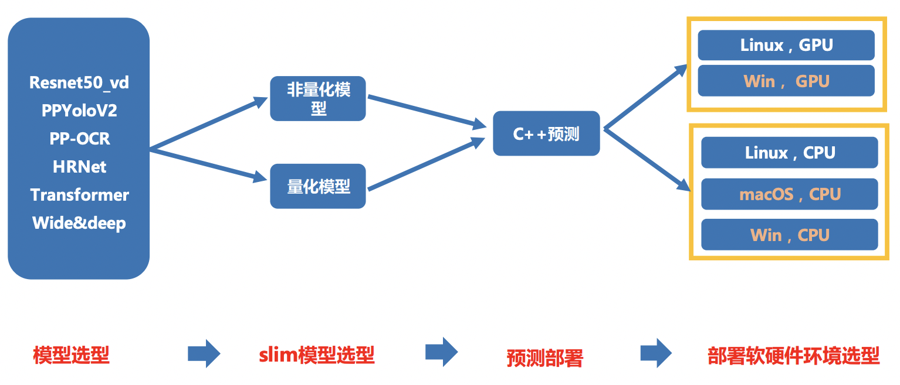
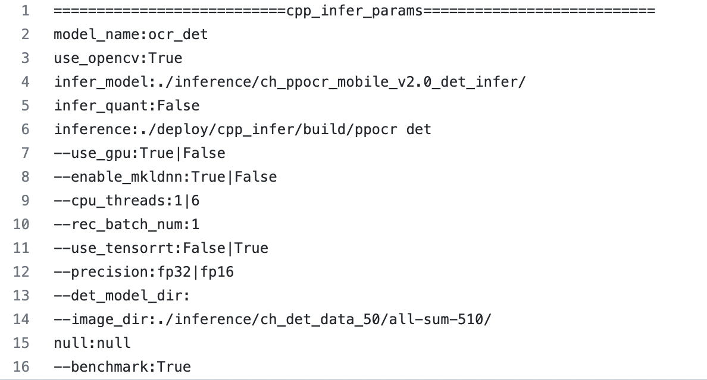

# Linux GPU/CPU C++ 推理测试开发规范

- [0.概述](#概述)
- [1.总览](#总览)
	- [1.1 全链条自动化测试](#全链条自动化测试)
	- [1.2 文本检测样板间概览](#文本检测样板间概览)
- [2.C++预测接入TIPC流程](#C++预测接入TIPC流程)
	- [2.1 规范化输出预测日志](#规范化输出预测日志)
	- [2.2 准备测试模型和数据](#准备测试模型和数据)
	- [2.3 编写自动化测试代码](#编写自动化测试代码)
- [3.附录：自动化测试脚本test_inference_cpp.sh 函数介绍](#附录)

<a name="概述"></a>
## 0. 概述
训推一体全流程（TIPC）旨在监控框架代码更新可能导致的**模型训练、预测报错、性能下降**等问题。本文主要介绍TIPC中**C++预测测试**的接入规范和监测点，是在[Linux GPU/CPU 基础训练推理测试开发规范](train_infer_python.md)上针对C++测试的补充说明。

主要监控的内容有：

- 飞桨框架更新后，代码仓库模型的C++预测是否能正常走通；（比如API的不兼容升级）
- 飞桨框架更新后，代码仓库模型的C++预测速度是否合理；

为了能监控上述问题，希望把代码仓库模型的C++预测测试加到飞桨框架的CI和CE中，提升PR合入的质量。因此，需要在代码仓库中加入运行脚本（不影响代码仓库正常运行），完成模型的自动化测试。

可以建立的CI/CE机制包括：

 1. **全量数据走通开源模型C++预测，并验证模型预测速度和精度是否符合设定预期；（单模型30分钟内)**
	 a. 保证预测结果正确，预测速度符合预期（QA添加中）

注：由于CI有时间限制，所以在测试的时候需要限制运行时间，所以需要构建一个很小的数据集完成测试。

<a name="总览"></a>
## 1. 总览

<a name="全链条自动化测试"></a>
### 1.1 全链条自动化测试

本规范测试的链条如下（其中相邻两个模块之间是两两组合关系），可以根据代码仓库需要，适当删减链条。


上图各模块具体测试点如下：

- slim模型选型方面：
	- **非量化模型（必选）**
	- 量化模型（可选）
- Paddle C++ inference 预测部署方面：
	- **Linux GPU上不同batchsize，是否开启TensorRT，不同预测精度（FP32，FP16，INT8）的运行状态（必选）**
	- **Linux CPU上不同batchsize，是否开启MKLDNN，不同预测精度（FP32，FP16，INT8）的运行状态（必选）**
	- Win GPU，macOS CPU和Win CPU（可选）

<a name="文本检测样板间概览"></a>
### 1.2 文本检测样板间概览

在PaddleOCR中，以文本检测为例，提供了本规范的样板间，可以完成概述部分提到的1种CI/CE机制。

C++预测测试工具位于PaddleOCR dygraph分支下的[test_tipc目录](https://github.com/PaddlePaddle/PaddleOCR/tree/dygraph/test_tipc)，与C++预测样板间相关的主要文件如下：

```
test_tipc/
├── configs/  # 配置文件目录
    ├── ch_ppocr_mobile_v2.0_det      # ch_ppocr_mobile_v2.0_det模型的测试配置文件目录
        ├── model_linux_gpu_normal_normal_infer_cpp_linux_gpu_cpu.txt     # 测试Linux上c++预测的配置文件
├── results/   # 预先保存的预测结果，用于和实际预测结果进行精读比对
    ├── cpp_ppocr_det_mobile_results_fp32.txt       # 预存的mobile版ppocr检测模型c++预测的fp32精度的结果
    ├── cpp_ppocr_det_mobile_results_fp16.txt       # 预存的mobile版ppocr检测模型c++预测的fp16精度的结果
├── prepare.sh                        # 完成test_*.sh运行所需要的数据和模型下载
├── test_inference_cpp.sh             # 测试c++预测的主程序
├── compare_results.py                # 用于对比log中的预测结果与results中的预存结果精度误差是否在限定范围内
└── readme.md                         # 使用文档
```

不同代码仓库的`configs`和`results`目录下的内容可根据实际情况进行调整。

配置文件`model_linux_gpu_normal_normal_infer_cpp_linux_gpu_cpu.txt`需满足[TIPC配置文件命名规范](https://github.com/PaddlePaddle/PaddleOCR/tree/dygraph/test_tipc#%E9%85%8D%E7%BD%AE%E6%96%87%E4%BB%B6%E5%91%BD%E5%90%8D%E8%A7%84%E8%8C%83)。

<a name="C++预测接入TIPC流程"></a>
## 2. C++预测接入TIPC流程
C++预测接入TIPC包含如下三个步骤，接下来将依次介绍这三个部分。  

 - 规范化输出预测日志
 - 准备测试模型和数据
 - 编写自动化测试代码


<a name="规范化输出预测日志"></a>
### 2.1 规范化输出预测日志
类似于python预测等基础测试，C++预测测试也需要规范不同代码仓库中Paddle Inference预测输出的格式，方便QA统一自动化测试。针对C++的预测log规范输出工具也已集成到[AutoLog工具包](https://github.com/LDOUBLEV/AutoLog)。

C++测试要求规范输出预测结果及以下信息：

- 运行的硬件，CPU还是GPU
- 运行配置信息，是否开启了IR 优化、TRT、MKLDNN，以及具体使用的线程数
- 运行的模型名称
- 运行的数据信息，包括batch size，数据量
- 性能信息，inference 各阶段平均预测时间
- 单张图片的预测结果

代码主要修改有三步：编译中引入auto_log类，预测耗时打点和打印输出信息。

1.在`external-cmake`目录中引入日志打印工具[`autolog`](https://github.com/LDOUBLEV/AutoLog/blob/main/auto_log/autolog.h)，并在`CMakeLists.txt`中进行配置。

`external-cmake/auto-log.cmake`内容如下，[查看完整源码](https://github.com/PaddlePaddle/PaddleOCR/blob/dygraph/deploy/cpp_infer/external-cmake/auto-log.cmake)：
```
find_package(Git REQUIRED)
include(FetchContent)

set(FETCHCONTENT_BASE_DIR "${CMAKE_CURRENT_BINARY_DIR}/third-party")

FetchContent_Declare(
  extern_Autolog
  PREFIX autolog
  GIT_REPOSITORY https://github.com/LDOUBLEV/AutoLog.git
  GIT_TAG        main
)
FetchContent_MakeAvailable(extern_Autolog)
```

在`CMakeLists.txt`中进行配置，[查看完整源码](https://github.com/PaddlePaddle/PaddleOCR/blob/dygraph/deploy/cpp_infer/CMakeLists.txt#L210)：
```
include(FetchContent)
include(external-cmake/auto-log.cmake)
include_directories(${FETCHCONTENT_BASE_DIR}/extern_autolog-src)
```

2.添加预测耗时打点：

（1）在模型预测中，统计前处理，预测，后处理时间，可参考[代码](https://github.com/PaddlePaddle/PaddleOCR/blob/dygraph/deploy/cpp_infer/src/ocr_det.cpp#L171)。
（2）在main函数中使用autolog工具打印日志，参考[代码](https://github.com/PaddlePaddle/PaddleOCR/blob/dygraph/deploy/cpp_infer/src/main.cpp#L122)。主要包括：

- 引入头文件：
```
#include "auto_log/autolog.h"
```

- 调用AutoLogger类打印日志：
```
    if (FLAGS_benchmark) {
        AutoLogger autolog("ocr_det", 
                           FLAGS_use_gpu,
                           FLAGS_use_tensorrt,
                           FLAGS_enable_mkldnn,
                           FLAGS_cpu_threads,
                           1, 
                           "dynamic", 
                           FLAGS_precision, 
                           time_info, 
                           cv_all_img_names.size());
        autolog.report();
    }
```

3.打印输出信息：
按照上述两步添加预测耗时打点和日志打印工具后，运行程序可打印出如下格式日志：


4.预测结果格式规范化：  
（1）预先保存预测结果，作为校验预测结果是否正确的groundtruth。预测结果可以保存为两个，分别是FP32精度下预测的输入，和FP16预测精度下的输出结果。以OCR 为例，在`PaddleOCR/test_tipc/results`文件夹下存放了两个txt文件，分别是：
```
cpp_ppocr_det_mobile_results_fp32.txt
cpp_ppocr_det_mobile_results_fp16.txt
```
里面按行存储每张测试图片的预测结果，格式如下：


（2）在运行日志中打印预测结果，或者保存在txt文件中，确保可以用python加载到输出并和预先保存的预测的结果进行对比。以PP-OCR检测为例，日志中的预测结果打印格式如下：


（3）预测精度比对。分别读取预测日志文件中的预测结果和预先保存在txt文件中的预测结果，验证两个结果是否是一致的。【验证是否一致的步骤可以在QA测试时完成，但是线下需要自测通过】

结果对比脚本可以参考代码：https://github.com/PaddlePaddle/PaddleOCR/blob/dygraph/test_tipc/compare_results.py

<a name="准备测试模型和数据"></a>
### 2.2 准备测试模型和数据
与python训练预测等基础测试方式类似，使用脚本`prepare.sh`可以下载测试所需推理模型和数据（可以直接使用python预测所准备的数据集）。`prepare.sh` 根据不同的运行模式，配合从配置文件中解析得到的模型区别性名称，下载不同的数据和训练模型用于完成后续测试。


<a name="编写自动化测试代码"></a>
### 2.3 编写自动化测试代码
C++预测的自动化测试代码在脚本[test_inference_cpp.sh](https://github.com/PaddlePaddle/PaddleOCR/blob/dygraph/test_tipc/test_inference_cpp.sh)中，其中包含`编译opencv(可选)`、`编译可执行文件`、`运行测试`三个部分。

C++预测自动化测试的运行命令如下：
```shell
bash test_tipc/test_inference_cpp.sh test_tipc/configs/ch_ppocr_mobile_v2.0_det/model_linux_gpu_normal_normal_infer_cpp_linux_gpu_cpu.txt
```

理论上只需要修改配置文件和`prepare.sh`就可以完成自动化测试，本节将详细介绍如何修改配置文件，完成C++预测测试。运行脚本`test_inference_cpp.sh`将会在附录中详细介绍。

按如下方式在参数文件`model_linux_gpu_normal_normal_infer_cpp_linux_gpu_cpu.txt`中添加C++预测部分参数：


参数说明：

|行号 | 参数 | 参数介绍 | 
|---|---|---|
|2 | model_name: ocr_det | 模型名称，该参数会在prepare.sh脚本中用到|
|3 | use_opencv: True/False | 表示是否使用use_opencv，如果代码仓库没有这个参数，可以设置为null。不需要opencv时，会跳过编译opencv的步骤|
|4 | infer_model: ./inference/ch_ppocr_mobile_v2.0_det_infer/ | 模型路径 |
|5 | infer_quant: True/False | 54行设置的模型路径是否是量化模型 |
|6 | inference: ./deploy/cpp_infer/build/ppocr det| C++预测命令|
|7 | --use_gpu:True｜False | 设置GPU的参数，其他代码仓库可能是device参数，用于设置不同硬件的参数，作用类似。设置多个配置时，中间用｜隔开，会分别运行不同配置下的预测 | --device:cpu｜gpu| 
|8 | --enable_mkldnn:True｜False | 设置是否开启mkldnn | 
|9 | --cpu_threads:1｜6 | 设置CPU线程数，如果要测试CPU上不同线程下的预测速度和精度，可以设置多个值，不同值用｜隔开 |
|10 | --rec_batch_num:1 | 设置batch_size 的参数 |
|11 | --use_tensorrt:False｜True | 设置开启TRT的参数 |
|12 | --precision:fp32｜fp16| 设置开启TRT后预测精度的参数 | --precision:fp32｜int8｜fp16 | 
|13 | --det_model_dir: | 设置加载inference模型路径的参数，无需设置:后的部分 | null： | 
|14 | --image_dir:./inference/ch_det_data_50/all-sum-510/ | 设置预测的数据路径 | 
|15 | null:null | 预留位置，无需理会 | null:null:null | 
|16 | --benchmark:True | 设置是否开启AutoLog的参数 | 

<a name="附录"></a>
## 3. 附录：C++预测自动化测试脚本test_inference_cpp.sh 函数介绍
[C++预测核心函数](https://github.com/PaddlePaddle/PaddleOCR/blob/dygraph/test_tipc/test_inference_cpp.sh#L43)：

- func_cpp_inference() ：执行C++预测的函数，如果是GPU上，会测试是否开启TensorRT和不同精度，不同batch_size下的情况；如果是CPU，会测试是否开启mkldnn，不同CPU线程数，不同batch_size下的情况。另外，如果是量化模型，则仅测试CPU+mkldnn和GPU+TensorRT+int8的组合。

[编译opencv](https://github.com/PaddlePaddle/PaddleOCR/blob/dygraph/test_tipc/test_inference_cpp.sh#L116)：

- 如果不需要opencv，如语音或nlp任务，删除本段代码即可。
- 需要编译opencv时，首先检查是否已经存在指定版本的opencv，比较md5，如果已有，则跳过编译，避免多次测试时重复下载和编译。

[编译可执行文件](https://github.com/PaddlePaddle/PaddleOCR/blob/dygraph/test_tipc/test_inference_cpp.sh#L158)：

- 可根据实际任务调整编译选项。


