# 基础链条测试接入规范

# 目录
- [1. 总览](#1---)
  * [1.1 背景](#11----)
  * [1.2 TIPC自动化测试](#12-tipc-----)
  * [1.3 文本检测样板间概览](#13----------)
- [2. TIPC规范接入流程](#2-tipc------)
  * [2.1 准备数据](#21-----)
  * [2.2 规范化输出日志](#22--------)
    + [2.2.1 训练日志规范](#221-------)
    + [2.2.2 inference日志规范](#222-inference----)
  * [3 编写自动化测试代码](#3----------)
    + [3.1 训练接入自动化测试](#31----------)
    + [3.2 评估接入自动化测试](#32----------)
    + [3.3 inference预测接入自动化测试](#33-inference---------)
- [4. 附录](#4---)
  * [4.1 common_func.sh 函数介绍](#41-common-funcsh-----)
  * [4.2 params.txt参数介绍汇总](#42-paramstxt------)


<a name="1---"></a>
# 1. 总览

飞桨除了基本的模型训练和预测，还提供了支持多端多平台的高性能推理部署工具。本文档提供了飞桨训推一体认证 (Training and Inference Pipeline Certification(TIPC)) 信息和测试工具，方便用户查阅每种模型的训练推理部署打通情况，并可以进行一键测试。

<a name="11----"></a>
## 1.1 背景
创建一个自动化测试CI机制，监控框架代码更新可能导致的**模型训练、预测报错、性能下降**等问题。

主要监控的内容有：

 - 框架更新后，飞桨模型仓库的正常训练，量化训练、裁剪训练、评估、动转静、推理预测是否能正常走通；（比如API的不兼容升级）
 - 框架更新后，飞桨模型仓库的预测速度是否合理；
 - 框架更新后，飞桨模型仓库训练的精度是否达标，或训练的loss出现nan等。
 - 其他
为了能监控上述问题，希望把飞桨模型仓库中模型的训练、预测TIPC加到框架的CI和CE中，提升PR合入的质量。因此，需要在模型中加入运行脚本（不影响模型正常运行），完成模型的自动化测试。

可以建立的CI/CE机制包括：

 1. **少量数据训练模型，少量数据预测，走通训练到预测链条，保证各模块输出符合预期。(lite_train_lite_infer)（单模型15分钟内）**
	 a. 保证训练跑通；训练速度正常（监控batch_cost）
	 b. 训练资源占用合理（显存）
	 c. 保证训练可复现，loss曲线收敛正常（固定seed后loss一致）
	 d. 保证训练后模型动转静→inference预测跑通，预测资源占用合理（监控显存内存）
 2. **少量数据训练模型，全量数据预测，验证预测速度；(lite_train_whole_infer)（单模型30分钟内）**
	 a. 保证训练跑通；训练速度正常（监控batch_cost）
	 b. 训练资源占用合理（显存）
	 c. 保证训练可复现，loss曲线收敛正常（固定seed后loss一致）
	 d. 保证训练后模型动转静→inference预测跑通，预测速度符合预期，预测资源占用合理（监控显存内存）
	
 3. **全量数据训练预测，验证训练模型精度和速度；(whole_train_whole_infer)（周级别）**
	 a. 保证训练跑通；训练速度正常（监控batch_cost），训练精度达到既定值
	 b. 训练资源占用合理（显存）
	 c. 保证训练可复现，loss曲线收敛正常（固定seed后loss一致）
	 d. 保证训练后模型动转静 → inference预测跑通，预测结果正确，预测速度符合预期，预测资源占用合理（监控显存内存）
 
 4. **不训练，全量数据走通开源模型评估、预测，并验证模型预测速度和精度是否符合设定预期；(whole_infer)（单模型30分钟内)**
	 a. 保证训练后模型动转静 → inference预测跑通，预测结果正确，预测速度符合预期，预测资源占用合理（监控显存内存）


注：由于CI有时间限制，所以在测试的时候需要限制运行时间，所以需要构建一个很小的数据集完成测试。

<a name="12-tipc-----"></a>
## 1.2 TIPC自动化测试

本规范测试的链条如下（其中相邻两个模块之间是两两组合关系），可以根据模型需要，适当删减链条。


上图各模块具体测试点如下：

- 模型训练方面（Linux GPU 和 Linux CPU都需要验证）：
	- 单机单卡（**必选**）
	- 单机多卡（**必选**）

- 模型压缩方面（Linux GPU 和 Linux CPU都需要验证）：
	- 裁剪训练（可选）
	- 在线量化训练（可选）
	- 离线量化（可选）
	
- 飞桨模型转换，即动转静功能（必选）
- Paddle inference 预测部署方面：
	- Linux GPU上不同batchsize，是否开启TensorRT，不同预测精度（FP32，FP16，INT8）的运行状态（**必选**）
	- Linux CPU上不同batchsize，是否开启MKLDNN，不同预测精度（FP32，FP16，INT8）的运行状态（**必选**）

<a name="13----------"></a>
## 1.3 文本检测样板间概览

以飞桨PaddleOCR模型仓库的文本检测模型为例，提供了本规范的样板间，可以跑通1.2章节提到的**所有测试链条**，完成1.1背景部分提到的4种CI/CE机制。

脚本位于PaddleOCR dygraph分支下的test_tipc文件夹：https://github.com/PaddlePaddle/PaddleOCR/tree/dygraph/test_tipc

test_tipc文件夹下与本规范相关的文件分别是：
```
test_tipc/
test_tipc/
├── configs/  # 配置文件目录
	├── ppocr_det_mobile/                #  ppocr检测模型mobile版本的配置文件和参数文件夹
		├── det_mv3_db.yml               # 测试mobile版ppocr检测模型训练的yml文件
		├── train_infer_python.txt.      # 测试mobile版ppocr检测模型训练+预测的参数配置文件
		├── train_linux_cpu_normal_normal_infer_python_mac.txt     # Mac端测试mobile版ppocr检测模型的参数配置文件
		├── train_linux_gpu_normal_normal_infer_python_windows.txt     # Windows端测试mobile版ppocr检测模型的参数配置文件
		├── model_linux_gpu_normal_normal_infer_python_jetson.txt   # Jeston端测试mobile版ppocr检测模型的参数配置文件
		├── ...                                
｜- test_train_inference_python.sh   自动化测试脚本，以ppocr_det_mobile_params.txt 为参数配置，组建出不同的运行命令，完成不同参数配置下的所有链条运行。
｜- prepare.sh   以ppocr_det_mobile_params.txt 为参数配置，完成数据、预训练模型、预测模型的自动下载，方便TIPC测试脚本自动运行和QA同学测试。
｜- readme.md  该代码库测试脚本运行说明
```

<a name="2-tipc------"></a>
# 2. TIPC规范接入流程
TIPC规范接入包含如下三个步骤，接下来将依次介绍这三个部分。

 - 准备数据
 - 规范化输出日志
 - 编写自动化测试代码

<a name="21-----"></a>
## 2.1 准备数据
由于不同模型所需要的训练、预测数据、预训练模型不同，所以需要一个自动化下载训练数据、预训练模型的脚本，即是prepare.sh 。
prepare.sh完成命令运行前准备工作，根据不同的运行模式和测试的模型，完成以下功能：

 - 预训练模型下载并解压
 - 训练、预测数据下载并解压
 - 准备编译或者编译好的第三方库等

prepare.sh的代码内容如下，参考链接https://github.com/PaddlePaddle/PaddleOCR/blob/dygraph/test_tipc/prepare.sh：
```
if [ ${MODE} = "lite_train_lite_infer" ];then
    # pretrain lite train data
    wget -nc -P  ./pretrain_models/ https://paddle-imagenet-models-name.bj.bcebos.com/dygraph/MobileNetV3_large_x0_5_pretrained.pdparams  --no-check-certificate
    wget -nc -P ./pretrain_models/  https://paddleocr.bj.bcebos.com/dygraph_v2.0/en/det_mv3_db_v2.0_train.tar  --no-check-certificate
    if [ ${model_name} == "PPOCRv2_ocr_det" ]; then
        wget -nc -P ./pretrain_models/ https://paddleocr.bj.bcebos.com/PP-OCRv2/chinese/ch_PP-OCRv2_det_distill_train.tar --no-check-certificate
        cd ./pretrain_models/ && tar xf ch_PP-OCRv2_det_distill_train.tar && cd ../
    fi
    cd ./pretrain_models/ && tar xf det_mv3_db_v2.0_train.tar && cd ../
    rm -rf ./train_data/icdar2015
    rm -rf ./train_data/ic15_data
    wget -nc -P ./train_data/ https://paddleocr.bj.bcebos.com/dygraph_v2.0/test/icdar2015_lite.tar --no-check-certificate
    wget -nc -P ./train_data/ https://paddleocr.bj.bcebos.com/dygraph_v2.0/test/ic15_data.tar --no-check-certificate
    wget -nc  -P ./inference https://paddleocr.bj.bcebos.com/dygraph_v2.0/test/rec_inference.tar --no-check-certificate
    wget -nc -P ./deploy/slim/prune https://paddleocr.bj.bcebos.com/dygraph_v2.0/test/sen.pickle --no-check-certificate
    
    cd ./train_data/ && tar xf icdar2015_lite.tar && tar xf ic15_data.tar
    ln -s ./icdar2015_lite ./icdar2015
    cd ../
    cd ./inference && tar xf rec_inference.tar && cd ../
```

prepare.sh的使用方式为：
```
bash test_tipc/prepare.sh  配置文件路径   运行模式
```
具体运行命令如下：
```
bash test_tipc/prepare.sh ./test_tipc/configs/ppocr_det_mobile/train_infer_python.txt 'lite_train_lite_infer'
```
运行模式一共有7种，分别是：
```
# 训练 预测相关测试
lite_train_lite_infer:    少量数据集训练、预测打通验证
lite_train_whole_infer:         少量数据训练，全量数据预测，验证训练模型预测速度是否合理
whole_infer：              不训练， 全量数据预测，走通开源模型评估、动转静，检查inference model预测时间和精度
whole_train_whole_infer:   全量数据训练，全量数据预测，验证模型训练精度，预测精度，预测速度

# cpp_infer 预测相关
cpp_infer：  测试cpp  inference的逻辑，不训练，全量数据预测，检查inference model预测时间和精度
server_infer： 测试 Paddle Server 部署inference的能力，不训练，全量数据预测

# 离线量化相关
klquant_infer： 测试测试离线量化功能和量化inference model的预测速度
```
**prepare.sh 根据不同的运行模式，配合从配置文件中解析得到的模型区别性名称，下载不同的数据和训练模型用于完成后续测试。**

**Tips：**

（1）shell脚本（prepare.sh）如何解析配置文件（ppocr_det_mobile_params.txt ）的参数可以参看附录。

（2）由于测试某个模型CI CE有多种模式，不同模式的区别在于训练和测试数据不同，所以在自动下载某个模式的数据时，如果不同数据文件名字不一致，可以通过ln -s 创建软链，确保训练时可以通过配置文件里的默认数据路径加载到数据。例如文本检测样板间中，在whole_train_infer模式下，先删除本地数据集，然后重新下载新的数据集icdar2015.tar 并完成解压。

（3）在接入TIPC时，prepare.sh中的model_name 判断条件以及下载内容的代码需要自行修改，以便在自己的模型代码中测试。在文本检测样板间中，在infer 模式下，会从配置文件中解析到模型名称，根据不同的模型名称选择下载不同的数据，比如，model_name为ocr_det时，选择下载ch_det_data_50.tar 和 ch_ppocr_mobile_v2.0_det_infer.tar 。

下图是文本检测样本间部分片段代码。
```
elif [ ${MODE} = "whole_infer" ];then
    # 根据不同模型名字下载不同的模型和数据
    if [ ${model_name} = "ocr_det" ]; then
        eval_model_name="ch_ppocr_mobile_v2.0_det_train"
        rm -rf ./train_data/icdar2015
        wget -nc -P ./inference https://paddleocr.bj.bcebos.com/dygraph_v2.0/test/ch_det_data_50.tar --no-check-certificate
        wget -nc  -P ./inference https://paddleocr.bj.bcebos.com/dygraph_v2.0/ch/ch_ppocr_mobile_v2.0_det_train.tar --no-check-certificate
        wget -nc  -P ./inference https://paddleocr.bj.bcebos.com/dygraph_v2.0/ch/ch_ppocr_mobile_v2.0_det_infer.tar --no-check-certificate
        cd ./inference && tar xf ${eval_model_name}.tar && tar xf ch_det_data_50.tar && tar xf ch_ppocr_mobile_v2.0_det_infer.tar && cd ../
```

<a name="22--------"></a>
## 2.2 规范化输出日志

<a name="221-------"></a>
### 2.2.1 训练日志规范

训练日志中，除了打印loss、精度等信息，还需要有以下信息：

- reader_cost：1个Step数据加载用时，单位：秒(sec)。
	1). N个Step打印1条日志时，reader_cost为N个Step数据加载用时的平均值
	2). 建议(但不强制)使用DataLoader，而非DataFeeder
- batch_cost：1个Step训练用时，单位：秒(sec)。batch_cost = reader_cost + model.forward()（训练）时间。
- ips：单卡每秒处理的样本数，单位如：images/sec、sequences/sec、tokens/sec、words/sec、frames/sec等。
- samples。 对于每个Step样本数可能不同的模型（大多为NLP模型），需要计算samples。samples代表上次打印到本次打印，新完成训练的样本数量。

加入reader时间统计，有助于开发和测试人员快速发现模型慢的原因，是模型计算慢还是读数据慢。

（1）训练日志格式化输出

- 最终打印期望格式如下：
```
..., ... , loss: 0.12345, avg_reader_cost: 0.12345 sec, avg_batch_cost: 0.12345 sec, avg_samples: 100, avg_ips: 0.12345 images/sec
```
- avg_reader_cost、avg_batch_cost、avg_samples、avg_ips算法如下：
假如，模型每N个Step打印1次日志，每Step reader用时为：`R1, R2,...Rn`，每Step训练用时：`T1, T2,...Tn`，每Step **单卡BatchSize** 为`S1, S2,...Sn`。
`avg_reader_cost = sum(R1, R2,...Rn) / N`
`avg_batch_cost = avg_reader_cost + sum(T1, T2,...Tn) / N`
`avg_samples = sum(S1, S2,...Sn) / N`
`avg_ips = samples / batch_cost `
ips 单位如：images/sec、sequences/sec、tokens/sec、words/sec、frames/sec等。

- 训练日志规范代码示例，或可参考[PaddleOCR代码示例](https://github.com/PaddlePaddle/PaddleOCR/blob/790b5b0b22c2389f10e4f0f6bc828a207be95209/tools/program.py?_pjax=%23js-repo-pjax-container%2C%20div%5Bitemtype%3D%22http%3A%2F%2Fschema.org%2FSoftwareSourceCode%22%5D%20main%2C%20%5Bdata-pjax-container%5D#L286)
```
for epoch in range(epochs):
	...
	train_reader_cost = 0.0
	train_run_cost = 0.0
	total_samples = 0
	reader_start = time.time()
	for data in dataloader():
		train_reader_cost += time.time() - reader_start
		do_something_else()
		train_start = time.time()
		outs = exe.run()
		train_run_cost += time.time() - train_start
		total_samples += batch_size
		if batch_id % args.print_step == 0:
			print("avg_reader_cost: %.5f sec, avg_batch_cost: %.5f sec, avg_samples: %.5f, ips: %.5f images/sec" % 
			( train_reader_cost / args.print_step, 
			(train_reader_cost + train_run_cost) / args.print_step, 
			total_samples / args.print_step, 
			total_samples / (train_reader_cost + train_run_cost) ))
			train_reader_cost = 0.0
			train_run_cost = 0.0
			total_samples = 0
		do_something_else2()
		reader_start = time.time()
```

<a name="222-inference----"></a>
### 2.2.2 inference日志规范
（1）背景
不同飞桨模型中paddle inference预测输出的格式均不相同，并且inference输出的信息不够完善，在自动化测试的时候，希望有一套规范且完善的信息格式输出。

要求规范输出的信息中除了预测结果输出，还包括以下信息：

- 当前paddle版本号以及具体commit
- 运行的硬件，CPU还是GPU
- 运行配置信息，是否开启了IR 优化、TRT、MKLDNN，以及具体使用的线程数
- 运行的模型名称
- 运行的数据信息，包括batch size，数据量
- 性能信息，CPU占用内存，GPU显存、利用率信息，inference 各阶段平均预测时间
- 输入数据的FP32 和FP16的预测结果，用于校验inference结果的正确性

（2）预测格式化输出

为了方便格式化输出inference预测log、统计预测过程中内存显存等信息，并且统一标准和减少对代码的改动，开发了AutoLog工具包，用于统计以上信息和格式化输出。
auto_log安装方式参考https://github.com/LDOUBLEV/AutoLog
```
git clone https://github.com/LDOUBLEV/AutoLog
pip3 install -r requirements.txt
python3 setup.py bdist_wheel
pip3 install ./dist/auto_log-1.0.0-py3-none-any.whl
```

使用AutoLog 实现自动化日志输出的功能可以参考PR：https://github.com/PaddlePaddle/PaddleOCR/pull/3182

代码修改有四步，分别是：
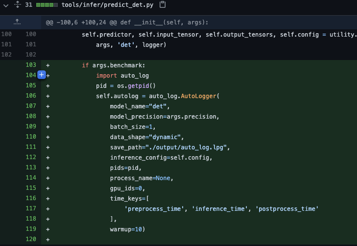
1). 初始化auto_log类：如上图代码所示（参考[PR](https://github.com/PaddlePaddle/PaddleOCR/pull/3182)），调用了auto_log 实现，初始化一个AutoLogger类，传入参数有模型名称、模型精度，batch_size, 输入shape，日志保存路径，inference配置（self.config），pid号和进程名字可选或设置为None，GPU号gpuid；
AutoLogger的初始化参数：
```
model_name,     # string 模型名称
model_precision,   # string 模型精度，fp32, fp16 或者int8
batch_size,         # int  预测的batch_size，
data_shape,       # array | list 输入shape, 动态shape的可以设置为dynamic_shape
save_path,         # string 日志保存路径，可以设置为None，默认为None
inference_config=None,     # Paddle.inference.Config, 用于获取enable_mkldnn, enable_tensorrt等信息；
pids=None,       # list,  当前进程的PID号，为None则会自动获取当前运行进程的PID，
process_name=None, # string  用于根据进程名获取进程PID，比如"Python"，默认为None，自动获取当前进程的PID
gpu_ids=None   # string  使用的GPU id
time_keys:  # list 设置时间戳，默认为'preprocess_time', 'inference_time', 'postprocess_time'
warmup: # int  设置warmup的次数，预测的前warmup次数内，不会统计预测时间
logger: # 用于打印日志的logger，如果设置为None，在类中会自动创建一个logger，默认为None。该参数没有体现在上述PR中，可以参考链接：https://github.com/PaddlePaddle/PaddleOCR/pull/3333/files#diff-8f5279ac130e64d3da88334d137ee2af3356ac06f5a73bee72591945427104ef
```
2). 预测耗时打点：在模型预测中，统计前处理，预测，后处理时间，传入AutoLogger的preprocess_time, inference_time, postprocess_time中；

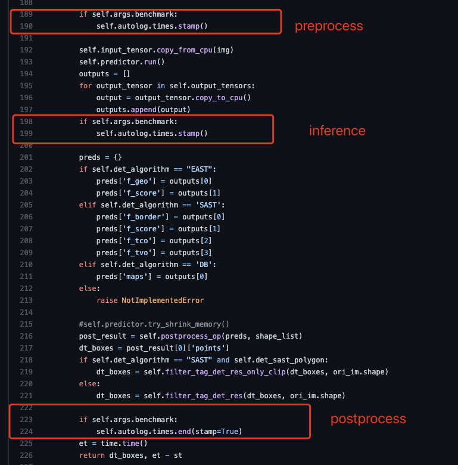


3). 打印输出信息：在完成循环预测后，调用AutoLogger的report函数输出log信息。report函数是必须要调用的，否则，统计内存和显存占用的子进程不会关闭。
其中，text_detector.auto_log.report()实际调用了AutoLogger.report()函数，根据输入的model信息和统计的时间、内存占用信息，规范化输出日志，输入日志格式如下：

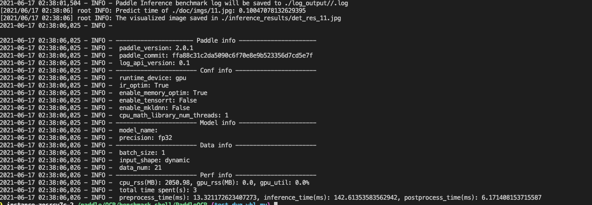

4). 预测结果正确性校验

预测日志中，除了打印环境信息、内存显存占用信息，和预测时间等，还可以打印每个预测样本的预测结果。用于校验inference预测的是否正确。预测结果可以保存为两个，分别是FP32精度下预测的输入，和FP16预测精度下的输出结果。

预测可以打印在运行日志中，或者保存在TXT文件中，确保可以用python加载到输出并和当前预测的结果进行对比。

以OCR 为例，在PaddleOCR/test_tipc/results文件夹下存放了两个python预测结果的txt文件，分别是：
```
python_ppocr_det_mobile_results_fp16.txt
python_ppocr_det_mobile_results_fp32.txt
```
假设在不同配置下可以得到一系列日志文件：
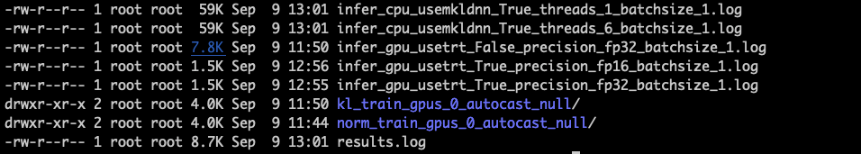

配置文件中存放的有不同输入的预测结果：
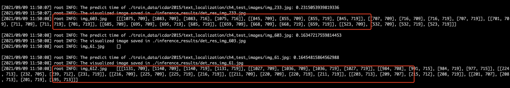

因此，可以分别读取预测日志文件中的预测结果和保存在txt文件中的预测结果，验证两个结果是否是一致的。

预测结果精度校验可以参考代码：https://github.com/PaddlePaddle/PaddleOCR/blob/dygraph/test_tipc/compare_results.py
在compare_results.py 分别读取了txt中保存的预测结果，和日志文件中保存的结果，通过对比验证二者是否一致或者误差符合预期。

注：如果是fp32精度的预测结果，无论是CPU还是GPU，都不允许有太大的误差。但是如果是fp16精度预测，CPU开mkldnn+fp16精度预测的结果和GPU+tensorrt+fp16预测的结果可能不同。原因是，半精度会导致预测结果的不稳定，甚至导致预测精度下降，在测试半精度的误差时，可以预留更合理的误差范围。

<a name="3----------"></a>
## 3 编写自动化测试代码

上文提到，自动化测试脚本包括三个部分，分别是运行脚本test_train_inference_python.sh，参数文件txt文件，数据模型准备脚本prepare.sh。

```
｜- configs/ppocr_det_mobile/train_infer_python.txt  参数配置文件，用于配置测试哪些功能；
｜- test_train_inference_python.sh   自动化测试脚本，以train_infer_python.txt为参数配置，组建出不同的运行命令，完成不同参数配置下的所有链条运行。
｜- prepare.sh   以train_infer_python.txt为参数配置，完成数据、预训练模型、预测模型的自动下载。
```
三个文件各司其职，*.txt是参数配置文件，用于设置测试哪些功能，比如训练部分测试分布式训练和混合精度训练等，
prepare.sh 负责完成测试前的准备工作，包括完成数据、预训练模型、预测模型的自动下载等等。
test_train_inference_python.sh则是自动化测试的运行脚本，根据params.txt中的参数配置，组合出不同的运行指令并执行指令。

本节将详细介绍如何修改txt参数文件，完成模型训练、评估和测试。运行脚本test_train_inference_python.sh将会在附录中详细介绍。

<a name="31----------"></a>
### 3.1 训练接入自动化测试
test_train_inference_python.sh在运行的时候，会依次解析ppocr_det_mobile_params.txt中的参数，根据ppocr_det_mobile_params.txt参数配置完成命令组合，举例如下：

PaddleOCR 文本检测模型的训练运行命令是：

```
python3.7 tools/train.py -c configs/det/det_mv3_db.yml -o Global.pretrained_model=./pretrain_models/  Global.use_gpu=True Global.auto_cast=False Global.epoch_num=10 Global.save_model_dir=./test/output/
```
虽然不同模型的训练运行方式差异较大，但是都可以拆分为三个部分：
```
python   run_script    set_configs
```
对应到上述运行命令，python即是python3.7
```
run_script 即是 tools/train.py -c configs/det/det_mv3_db.yml -o 
set_configs 即是 Global.pretrained_model=./pretrain_models/  Global.use_gpu=True  Global.auto_cast=False  Global.epoch_num=10  Global.save_model_dir=./test/output/ 
```
因此，可以把上述三个部分参数化，如下格式：
```
python版本    运行脚本和配置文件    参数1    参数2    参数3    参数4   参数5 
```
所有模型的运行方式都可以按照上述格式组建出一条完整的运行命令。完成命令组建后，在shell脚本中通过eval $cmd 指令即可完成指令的运行。

实际上，params.txt 中完成以上参数的设置，test_train_inference_python.sh 脚本根据params.txt中的配置组建出一条完整的运行命令。

以文本检测样板间[ppocr_det_mobile/train_infer_python.txt](https://github.com/PaddlePaddle/PaddleOCR/blob/dygraph/test_tipc/configs/ppocr_det_mobile_params.txt)为例，文件中前22行为训练相关的参数，如下图：
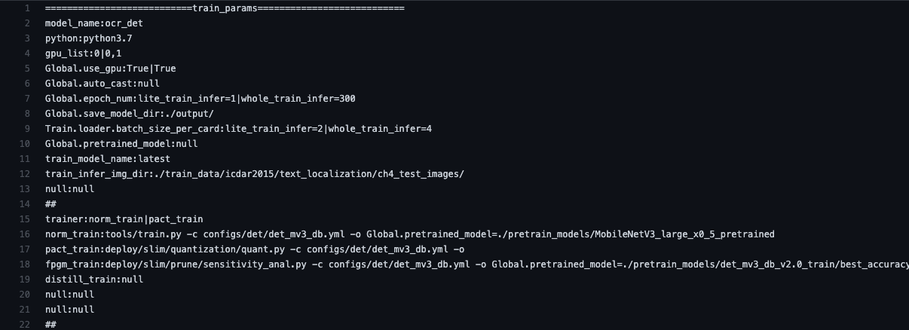

|行号 | 参数 | 参数介绍 | 对应PaddleSeg参数设置 | 
|---|---|---|---|
|2 | model_name:ocr_det | 定义了model_name: ocr_det ，ocr_det也是prepare.sh中用于区分其他模型的名称 | model_name:hrnetw18_small_v1 | 
|3 | python:python3.7 | 定义了python版本： 默认使用python3.7，也可以改为python3, python3.6等等 | python:python3.7 | 
|4 | gpu_list:0｜0,1 | 第4行定义了GPU列表：0表示用0号GPU，0，1表示用0卡和1卡分布式训练，不同配置中间用｜分割开；如果在3，4卡运行，可以设置为 gpu_list:3，4 | gpu_list:0｜0,1 | 
|5 | Global.use_gpu:True｜True | 定义了参数设置：根据gpu_list的配置设置是否使用GPU，如果模型没有这个参数，可以设置为null，当前行的null数量和第四行的配置数量相同，比如null｜null; | Global.use_gpu:null|null | 
|6 | Global.auto_cast:null | 定义了混合精度训练参数设置：如果测试混合精度训练和非混合精度训练，可以设置为True｜False，如果没有这个参数，可以设置为null，让该参数不生效； |  Global.auto_cast:null| 
|7 | Global.epoch_num:lite_train_lite_infer=1｜whole_train_whole_infer=300 | 定义了epoch 设置参数：设置epoch数量，有的模型可能是设置iter数量，都是一个意思，由于不同模式需要的epoch或iter数量不一致，需要设置不同模式下的epoch数；量，:lite_train_lite_infer=2｜whole_train_whole_infer=300表示lite_train_lite_infer模式下是2，whole_train_whole_infer模式下设置为300，不设置的话，默认用配置文件里的参数； | --iters:lite_train_lite_infer=50|lite_train_whole_infer=50|whole_train_whole_infer=1000 | 
|8 | Global.save_model_dir:./output/ | 定义了保存模型设置参数：需要修改:之前的关键字 | --save_dir: | 
|9 | Train.loader.batch_size_per_card:lite_train_lite_infer=2｜whole_train_whole_infer=4 | 定义batch_size设置参数：同第7行使用方式相同； | --batch_size:lite_train_lite_infer=2｜whole_train_whole_infer=8 | 
|10 | Global.pretrained_model:null | 定义了加载预训练模型 设置参数：如果不需要加载预训练模型，可以不用修改，：后可以设置为null | Global.pretrained_model:null | 
|11 | train_model_name:latest | 定义了保存模型的名字，目前不同模型保存的模型名字五花八门，为了保证能正确加载到模型，需要这个参数指定到具体的参数名称 | train_model_name:best_model/model.pdparams | 
|12 | train_infer_img_dir:./train_data/icdar2015/text_localization/ch4_test_images/ | 定义了训练后执行预测的数据路径，不需要设置数据路径的话，value部分设置为null； | train_infer_img_dir:test_tipc/data/mini_supervisely/test.txt | 
|13 | null:null | 为预留的参数位置，如果需要设置其他参数，可以按照格式 params_key:params_value 修改为想要的参数； | null:null | 
| 14| ## | 占位符 | ## | 
|15 | trainer:norm_train｜pact_train | 要测试的trainer；norm_train｜pact_train表示测试第16行和第17行的部分，如果不测试pact训练，此处设置为trainer:norm_train|trainer:norm | 
| 16| norm_train:tools/train.py -c configs/det/det_mv3_db.yml -o  | 设置正常训练的train 运行脚本：OCR检测模型的运行脚本为tools/train.py -c configs/det/det_mv3_db.yml -o | norm_train:train.py --config test_tipc/fcn_hrnetw18_small_v1_humanseg_192x192_mini_supervisely.yml --do_eval --save_interval 100 --seed 100 | 
|17|pact_train:deploy/slim/quantization/quant.py -c configs/det/det_mv3_db.yml -o|量化训练的train 运行脚本：使用方法同第16行；不测试量化功能可以设置为null；|pact_train:null|
|18|fpgm_train:deploy/slim/prune/sensitivity_anal.py -c configs/det/det_mv3_db.yml -o Global.pretrained_model=./pretrain_models/det_mv3_db_v2.0_train/best_accuracy|裁剪训练的train 运行脚本：使用方法同第16行；不测试量化功能可以设置为null；|fpgm_train:null|
|19|distill_train:null|蒸馏训练的train 运行脚本：使用方法同第16行；不测试量化功能可以设置为null；|distill_train:null|
|20|null: null|预留行，为以后扩展功能做准备|null: null|
|21|null: null|预留行，为以后扩展功能做准备|null: null|
|22|##|占位符|##|

params.txt中的参数都是可以修改的，可以修改的内容包括：

- ':'前后的部分均可修改，根据不同模型的运行命令对应修改
- 无需设置的参数设置为null:null，设置为null的参数不会生效
- ===train_params==该行无需修改

注：其他模型接入TIPC时，注意:前后不要随意加空格，如果params.txt中的训练参数行数不足以组建运行命令，可以考虑一些参数放在默认训练的配置文件中。如果仍需要添加新的参数，可以考虑扩展null:null的参数行成为新的参数行，或者自行修改test_train_inference_python.sh的代码完成训练配置。

<a name="32----------"></a>
### 3.2 评估接入自动化测试
该部分用于评估模型的训练精度。模型训练后可以执行模型评估，如果要评估模型，可以在txt参数文件的第23-26行设置，

需要说明的是，评估是顺接训练后进行的，因此，设置训练的参数等对评估也是生效的，所以在评估阶段不需要额外设置其他参数。同时也不需要设置评估所需要的模型，因为评估的模型会自动加载训练后的模型。

如果不希望进行模型评估，可以设置为null，如下设置：
```
===========================eval_params=========================== 
eval:null
null:null
##
```

<a name="33-inference---------"></a>
### 3.3 inference预测接入自动化测试
inference 相关的参数在params.txt中的第27行到51行，如下图：
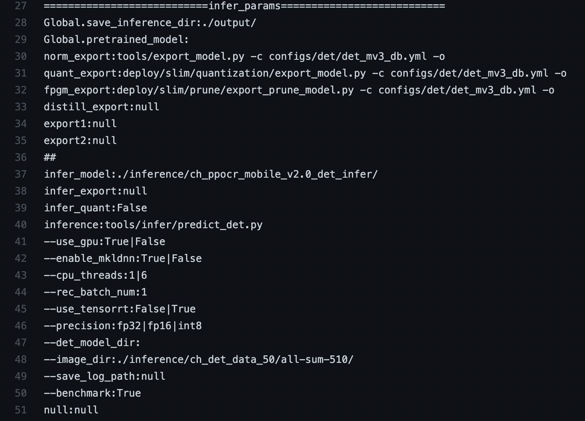


各行参数介绍和修改方式如下：
|行号 | 参数 | 参数介绍 | 对应PaddleSeg参数设置 | 
|---|---|---|---|
|28 | Global.save_inference_dir:./output/ | 保存导出inference model的参数，主要设置参数名字，后面的路径可以不设置或者设置为null |  | 
|29 | Global.pretrained_model: | 导出模型时加载模型的参数，主要设置参数名字 |  | 
| 30| norm_export:tools/export_model.py -c configs/det/det_mv3_db.yml -o  | 正常训练模型导出的运行脚本运行方式 | norm_export:export.py --config test_tipc/fcn_hrnetw18_small_v1_humanseg_192x192_mini_supervisely.yml | 
| 31| quant_export:deploy/slim/quantization/export_model.py -c configs/det/det_mv3_db.yml -o | 量化训练的模型导出运行方式 | quant_export:null | 
| 32| fpgm_export:deploy/slim/prune/export_prune_model.py -c configs/det/det_mv3_db.yml -o  | 裁剪训练的模型导出方式 | fpgm_export:null | 
|33 | distill_export:null | 蒸馏训练的模型导出方式 | distill_export:null | 
|34 | export1:null | 预留位置，无需理会 | export1:null | 
| 35| export2:null | 预留位置，无需理会 | export2:null | 
|36 |  ##| 占位符 |  ##| 
| 37| infer_model:./inference/ch_ppocr_mobile_v2.0_det_infer/ |  infer 模式下加载模型的路径| infer_model:./test_tipc/output/norm_gpus_0_autocast_null/model.pdparams | 
|38 | infer_export:null | 是否执行37行设置的模型执行动转静，null表示不执行 | infer_export:export.py --config test_tipc/fcn_hrnetw18_small_v1_humanseg_192x192_mini_supervisely.yml | 
|39 | infer_quant:False | 37行设置的模型路径是否是量化模型 | infer_quant:False | 
|40 | inference:tools/infer/predict_det.py | inference执行的脚本 | inference:deploy/python/infer.py | 
| 41| --use_gpu:True｜False | 设置GPU的参数，其他模型可能是device参数，用于设置不同硬件的参数，作用类似。设置多个配置时，中间用｜隔开，会分别运行不同配置下的预测 | --device:cpu｜gpu| 
|42|--enable_mkldnn:True｜False | 设置是否开启mkldnn，使用方式同41行 | --enable_mkldnn:True｜False |  
|43|--cpu_threads:1｜6 | 设置CPU线程数，如果要测试CPU上不同线程下的预测速度和精度，可以设置多个值，不同值用｜隔开 | --cpu_threads:1｜6 |  
| 44| --rec_batch_num:1 | 设置batch_size 的参数，使用方法同43行 | --batch_size:1 | 
| 45| --use_tensorrt:False｜True | 设置开启TRT的参数，使用方法同41 | --use_trt:False｜True | 
| 46| --precision:fp32｜fp16｜int8 | 设置开启TRT后预测精度的参数，使用方法同41 | --precision:fp32｜int8｜fp16 | 
|47 | --det_model_dir: | 设置加载inference模型路径的参数，无需设置:后的部分 | null： | 
|48 | --image_dir:./inference/ch_det_data_50/all-sum-510/ | 设置infer 模式下预测的数据路径 | --image_path:./test_tipc/data/mini_supervisely/test.txt | 
|49 | --save_log_path:null | 设置Autolog保存日志的路径参数；目前默认在test_train_inference_python.sh中用重定向的方式保存运行日志，该参数可以不用设置或者设置为null:null | --save_log_path:null | 
| 50| --benchmark:True | 设置是否开启AutoLog的参数，使用参考[链接](https://github.com/PaddlePaddle/PaddleOCR/blob/073a591ceeadc41f7bc67ea829dd7d7698a8215b/tools/infer/predict_det.py#L101) | --save_log_path:null | 
| 51| null:null | 扩展参数，如果以上参数不满足需求，可以在此处设置参数，params_key:params_value 格式即可 | null:null | 

**注意：上表中由于格式原因，参数名字前的`—` 实际上应该是`--`。`｜`是英文输入下的	`|`.** 


inference预测大多都是通过arg parse传入参数的方式，并且不模型预测的超参数命名也不尽相同。

文本检测样板间执行预测的命令格式是：
```
python3.7 tools/infer/predict_det.py --use_gpu=True --use_tensorrt=False --precision=fp32 --det_model_dir=./test/output/infer --rec_batch_num=1 --image_dir=./ch_det_data_50/all-sum-510  --save_log_path=./test/output
```
可以明显发现 `tools/infer/predict_det.py` 对应到40行参数设置的值，`--use_gpu ...  --use_tensorrt `等参数可以通过41-50行的参数分别进行设置。另外，可以发现以下参数有多个参数值：
```
--use_gpu:True|False
--enable_mkldnn:True|False
--cpu_threads:1|6
--rec_batch_num:1
--use_tensorrt:False|True
--precision:fp32|fp16
```
原因是，在自动化测试的时候，希望测试覆盖的链条更加全面，比如CPU上开启mkldnn，设置不同的线程数和batch_size大小，预测速度也会有很大变化，因此，可以根据参数的选项组合出更多的测试情况，如：
```
python3.7 tools/infer/predict_det.py --enable_mkldnn=True --cpu_threads=1 --rec_batch_num=1 # 开启mkldnn + 1线程+ 1 batchsize
python3.7 tools/infer/predict_det.py --enable_mkldnn=True --cpu_threads=6 --rec_batch_num=1 # 开启mkldnn + 6线程+ 1 batchsize
python3.7 tools/infer/predict_det.py --use_gpu=True --use_tensorrt=True --precision=fp16 # GPU运行 + 开启TRT+ fp16精度预测
```


**Tips：调试技巧**

为了快速解决接入自动化测试遇到的问题，一些调试技巧列举如下：

 - test_train_inference_python.sh中的 eval 改为echo，即不运行指令而是打印要运行的指令；
 
 - 功能测试时，可以先单独运行命令是否能正常运行，确保功能正常;
 
 - shell中对空格的使用非常严格，= 前后不要加空格

<a name="4---"></a>
# 4. 附录
<a name="41-common-funcsh-----"></a>
## 4.1 common_func.sh 函数介绍

common_func.sh 中包含了5个函数，会被test_train_inference_python.sh 等执行脚本调用，分别是：
```
func_parser_key() 解析params.txt中：前的部分

func_parser_value() 解析params.txt中：后的部分

func_set_params()  会反馈key=value的字符串，用与组建参数命令，如果key或者value为null，则返回空字符，即这个参数不会生效

func_parser_params() 为了解析和测试模式MODE相关的参数，目前只用来解析epoch和batch size参数

status_check() 状态检查函数，获取上条指令运行的状态，如果是0，则运行成功，如果是其他则运行失败，失败和成功的指令都会存放在results.log文件中
```
同一个模型要测试的组合可以通过一个txt文件管理，如下，构建了一个test_tipc/configs/ppocr_det_mobile/train_infer_python.txt文件 用于管理训练配置。

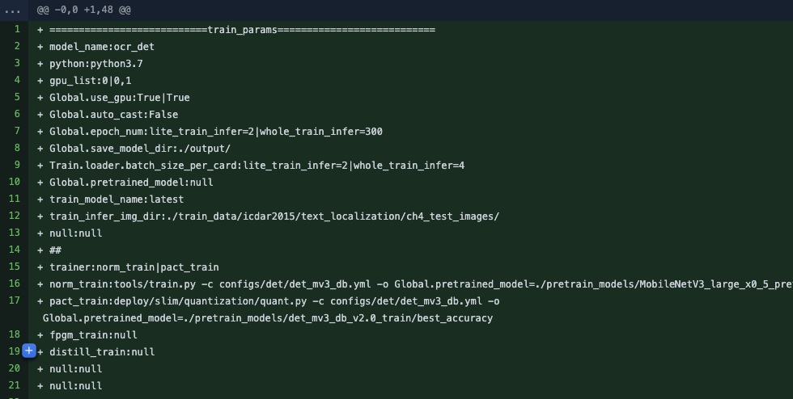
上述部分是test_train_inference_python.sh运行所需要的参数部分，包含正常训练脚本（第16行），量化训练执行脚本（17行），训练所需配置的参数（第4-10行）

在执行test_train_inference_python.sh脚本执行的时候，会解析对应行的参数，如下：
```
dataline=$(awk 'NR==1, NR==51{print}'  $FILENAME)
```
首先，FILENAME变量传入的是参数文件，从参数文件中获取到params.txt中的所有参数，如果是lite_train_lite_infer模式下，获取FILENAME参数文件第1行到51行的参数。

参数解析格式通过func_parser_params和func_parser_value函数完成，如下：
```
# The training params
model_name=$(func_parser_value "${lines[1]}")
python=$(func_parser_value "${lines[2]}")
gpu_list=$(func_parser_value "${lines[3]}")
train_use_gpu_key=$(func_parser_key "${lines[4]}")
train_use_gpu_value=$(func_parser_value "${lines[4]}")
autocast_list=$(func_parser_value "${lines[5]}")
autocast_key=$(func_parser_key "${lines[5]}")
epoch_key=$(func_parser_key "${lines[6]}")
epoch_num=$(func_parser_params "${lines[6]}")
save_model_key=$(func_parser_key "${lines[7]}")
train_batch_key=$(func_parser_key "${lines[8]}")
train_batch_value=$(func_parser_params "${lines[8]}")
pretrain_model_key=$(func_parser_key "${lines[9]}")
pretrain_model_value=$(func_parser_value "${lines[9]}")
train_model_name=$(func_parser_value "${lines[10]}")
train_infer_img_dir=$(func_parser_value "${lines[11]}")
train_param_key1=$(func_parser_key "${lines[12]}")
train_param_value1=$(func_parser_value "${lines[12]}")
```

解析到的训练参数在test_train_inference_python.sh中的第263-269行，通过`func_set_params`完成参数配置，`func_set_params`有两个输入分别是key value，最终返回的格式为key=value，比如：
```
# case1
cpp_batch_size_key="batch_size"
batch_size="10"
set_batchsize=$(func_set_params "${cpp_batch_size_key}" "${batch_size}")

echo $set_batchsize
# batch_size=10 # 输出结果是字符串batch_size=10

# case2
cpp_batch_size_key="batch_size"
batch_size="null"
set_batchsize=$(func_set_params "${cpp_batch_size_key}" "${batch_size}")
echo $set_batchsize
#  # 输出结果是空字符
```
如果value为空格，或者null，则`func_set_params`返回的结果为空格，在组建命令的时候，这个参数就不会生效，因此，如果不希望设置某个参数，可以把参数设置为null。

最终，所有参数可以组合出一个完整的命令，组合方式：
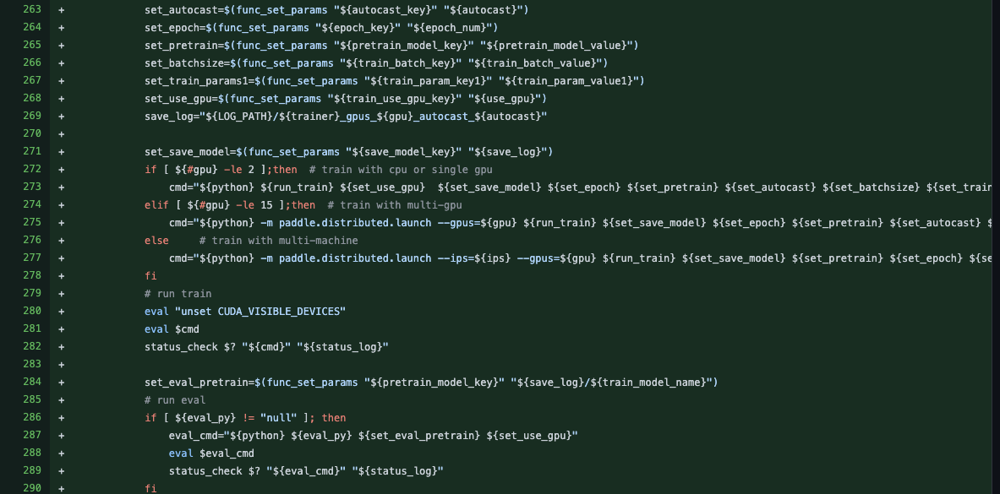
上图中273行即是组合出的命令，python对应python3.7,  run_train  可以是`ppocr_det_mobile_params.txt`中的`norm_train`，`quant_train`参数后的执行脚本，即要执行正常训练的脚本还是执行量化训练的脚本等等。

<a name="42-paramstxt------"></a>
## 4.2 params.txt参数介绍汇总
文件链接 https://github.com/PaddlePaddle/PaddleOCR/blob/dygraph/test_tipc/configs/ppocr_det_mobile_params.txt
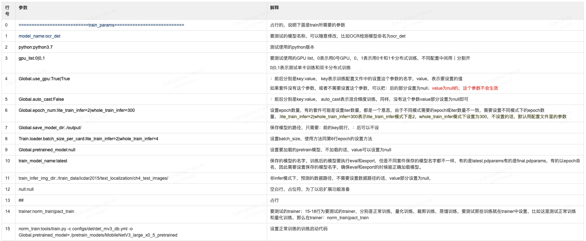
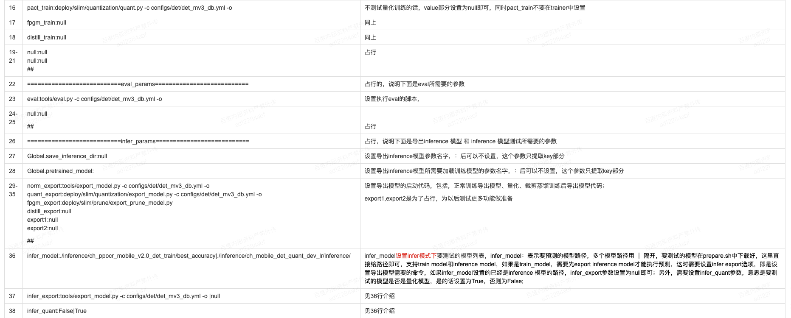
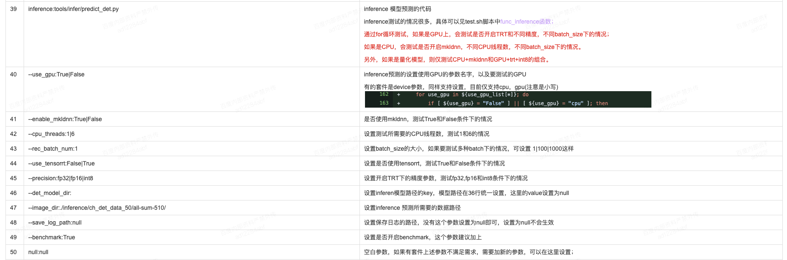


