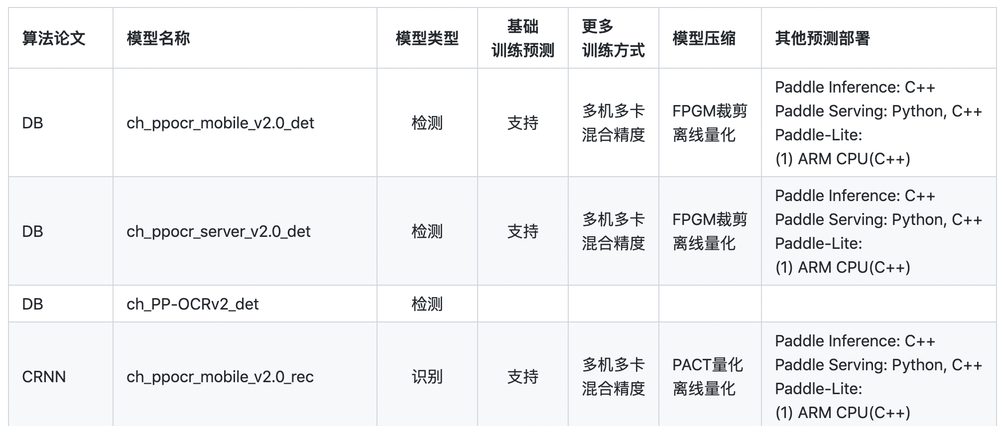
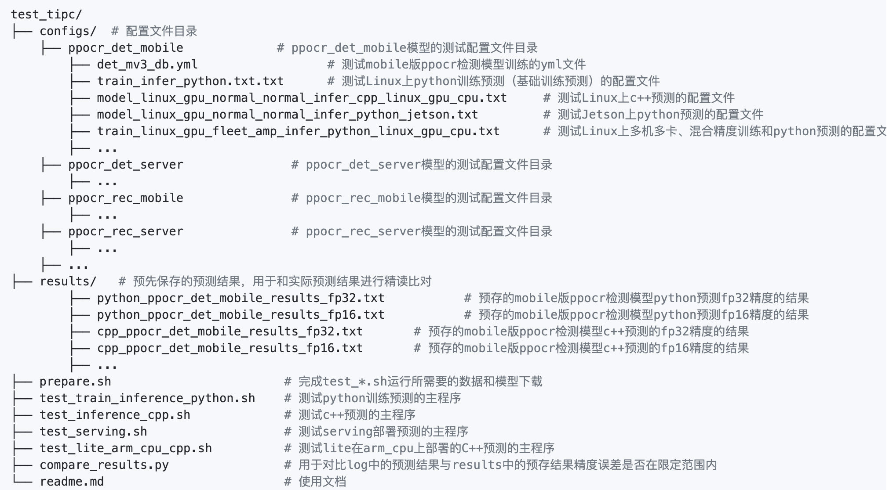
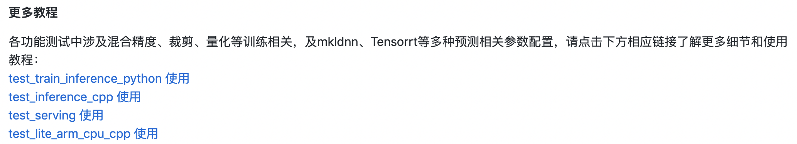

# 目录
- [1.背景](#背景)
- [2.目录与命名规范](#目录与命名规范)
- [3.文档规范](#文档规范)
	- [3.1 主文档规范](#主文档规范)
	- [3.2 子文档规范](#子文档规范)

<a name="背景"></a>
# 1. 背景
各代码仓库完成TIPC训推一体认证工具开发后，同时需要提供相应的**TIPC测试文档**，方便用户查阅每种模型的推理部署打通情况，并可以按照教程进行一键测试。

本文将**TIPC测试文档**的书写格式进行规范化，分为`目录规范`和`文档规范`两部分。

<a name="目录与命名规范"></a>
# 2. 目录与命名规范
**训推一体认证(Training and Inference Pipeline Certification(TIPC))工具目录统一命名为`test_tipc`**，位于代码仓库根目录下，下面以[PaddleOCR样板间](https://github.com/PaddlePaddle/PaddleOCR/tree/dygraph/test_tipc)为例说明目录结构规范。
```
test_tipc/
├── configs/  # 配置文件目录
    ├── ppocr_det_mobile             # ppocr_det_mobile模型的测试配置文件目录
        ├── det_mv3_db.yml                  # 测试mobile版ppocr检测模型训练的yml文件
        ├── train_infer_python.txt.txt      # 测试Linux上python训练预测（基础训练预测）的配置文件
        ├── model_linux_gpu_normal_normal_infer_cpp_linux_gpu_cpu.txt     # 测试Linux上c++预测的配置文件
        ├── model_linux_gpu_normal_normal_infer_python_jetson.txt         # 测试Jetson上python预测的配置文件
        ├── train_linux_gpu_fleet_amp_infer_python_linux_gpu_cpu.txt      # 测试Linux上多机多卡、混合精度训练和python预测的配置文件
        ├── ...  
    ├── ppocr_det_server               # ppocr_det_server模型的测试配置文件目录
        ├── ...  
    ├── ppocr_rec_mobile               # ppocr_rec_mobile模型的测试配置文件目录
        ├── ...  
    ├── ppocr_rec_server               # ppocr_rec_server模型的测试配置文件目录
        ├── ...  
    ├── ...  
├── results/   # 预先保存的预测结果，用于和实际预测结果进行精读比对
	├── python_ppocr_det_mobile_results_fp32.txt           # 预存的mobile版ppocr检测模型python预测fp32精度的结果
	├── python_ppocr_det_mobile_results_fp16.txt           # 预存的mobile版ppocr检测模型python预测fp16精度的结果
	├── cpp_ppocr_det_mobile_results_fp32.txt       # 预存的mobile版ppocr检测模型c++预测的fp32精度的结果
	├── cpp_ppocr_det_mobile_results_fp16.txt       # 预存的mobile版ppocr检测模型c++预测的fp16精度的结果
	├── ...
├── prepare.sh                        # 完成test_*.sh运行所需要的数据和模型下载
├── test_train_inference_python.sh    # 测试python训练预测的主程序
├── test_inference_cpp.sh             # 测试c++预测的主程序
├── test_serving.sh                   # 测试serving部署预测的主程序
├── test_lite_arm_cpu_cpp.sh          # 测试lite在arm_cpu上部署的C++预测的主程序
├── compare_results.py                # 用于对比log中的预测结果与results中的预存结果精度误差是否在限定范围内
└── readme.md                         # 使用文档
```
主要关注：
1. 所有工具位于`test_tipc`目录下，`test_tipc`目录位于代码仓库根目录下；
2. `results`目录存放精度测试所需的gt文件；
3. `doc`目录存放readme.md以外的其他子文档；
4. `prepare.sh`用于准备测试所需的模型、数据等；
5. `test_*.sh`为测试主程序，按照功能分为多个文件，命名格式为`test_[功能]_[语言].sh`。
6. `configs`目录存放测试所需的所有配置文件，该目录下，按模型名称划分为子目录，子目录中存放所有该模型测试需要用到的配置文件，配置文件的命名遵循如下规范：
	
- 基础训练预测配置简单命名为：`train_infer_python.txt`，表示**Linux环境下单机、不使用混合精度训练+python预测**，其完整命名对应`train_linux_gpu_fleet_amp_infer_python_linux_gpu_cpu.txt`，由于本配置文件使用频率较高，这里进行了名称简化。
- 其他带训练配置命名格式为：`train_训练硬件环境(linux_gpu/linux_dcu/…)_是否多机(fleet/normal)_是否混合精度(amp/normal)_预测模式(infer/lite/serving/js)_语言(cpp/python/java)_预测硬件环境(linux_gpu/mac/jetson/opencl_arm_gpu/...).txt`。如，linux gpu下多机多卡+混合精度链条测试对应配置 `train_linux_gpu_fleet_amp_infer_python_linux_gpu_cpu.txt`，linux dcu下基础训练预测对应配置 `train_linux_dcu_normal_normal_infer_python_dcu.txt`。
- 仅预测的配置（如serving、lite等）命名格式：`model_训练硬件环境(linux_gpu/linux_dcu/…)_是否多机(fleet/normal)_是否混合精度(amp/normal)_(infer/lite/serving/js)_语言(cpp/python/java)_预测硬件环境(linux_gpu/mac/jetson/opencl_arm_gpu/...).txt`，即，与2相比，仅第一个字段从train换为model，测试时模型直接下载获取，这里的“训练硬件环境”表示所测试的模型是在哪种环境下训练得到的。


<a name="文档规范"></a>
# 3. 文档规范
<a name="主文档规范"></a>
## 3.1 主文档规范
文档按以下格式进行撰写：

**推理部署导航**
**1. 简介**

- 内容：主要说明背景，各代码仓库应该差异不大。
- 示例：

**2. 汇总信息**

- 内容：给出代码仓库所有模型的预测部署打通情况汇总信息，表格形式呈现，须包含`算法论文`、`模型名称`、`基础训练预测`、`更多训练方式`、`模型压缩`、`其他预测部署`这6个必选字段。
	- 算法论文：该模型对应的算法，可以是算法简称；
	- 模型名称：与代码仓库提供模型的名称对应；
	- 基础训练预测：基础功能的支持情况，包括模型训练、Paddle Inference Python预测的支持情况，是所有代码仓库所有模型必须支持的功能。本字段有`"支持"`和`空缺`两种取值。
	- 更多训练方式：包括多机多卡、混合精度。
	- 模型压缩：包括裁剪、离线/在线量化、蒸馏。
	- 其他预测部署：补充功能的支持情况，包括Paddle Inference C++预测、Paddle Serving部署、Paddle-Lite部署等，是各代码仓库可选支持的功能。填入已支持的功能，尚未支持的不填即可。支持的功能后注明硬件(lite相关)、语言等信息。

- 示例：
- **注意**：表格内填“支持“或填入了信息均表示可以使用本工具进行一键测试，代码仓库已支持但尚未接入测试的，都算还不支持，不应填写。

**3. 一键测试工具使用**
目录介绍：测试工具树状图，介绍各目录/文件的功能，示例：


测试流程：测试流程整体说明，可参考[PaddleOCR样板间](https://github.com/PaddlePaddle/PaddleOCR/tree/dygraph/test_tipc#%E6%B5%8B%E8%AF%95%E6%B5%81%E7%A8%8B)


**最后需给出跳转链接，到每个test_*.sh的子文档**，如：


<a name="子文档规范"></a>
## 3.2 子文档规范
请参考子文档规范文档：  
- [基础训练预测测试文档规范]()
- [cpp预测测试文档规范]()
- [serving测试文档规范]()
- [lite测试文档规范]()
