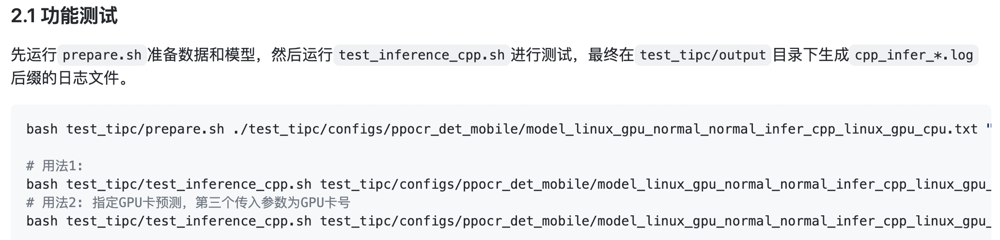
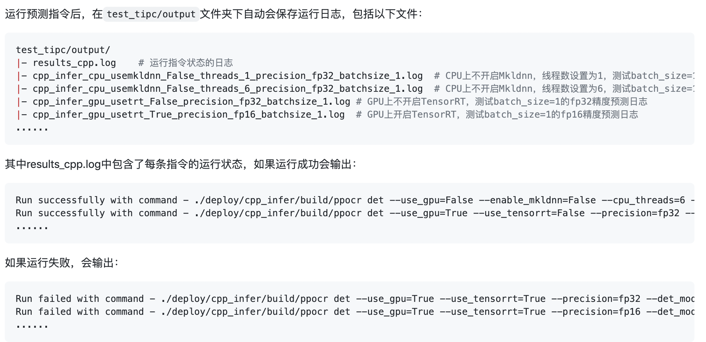
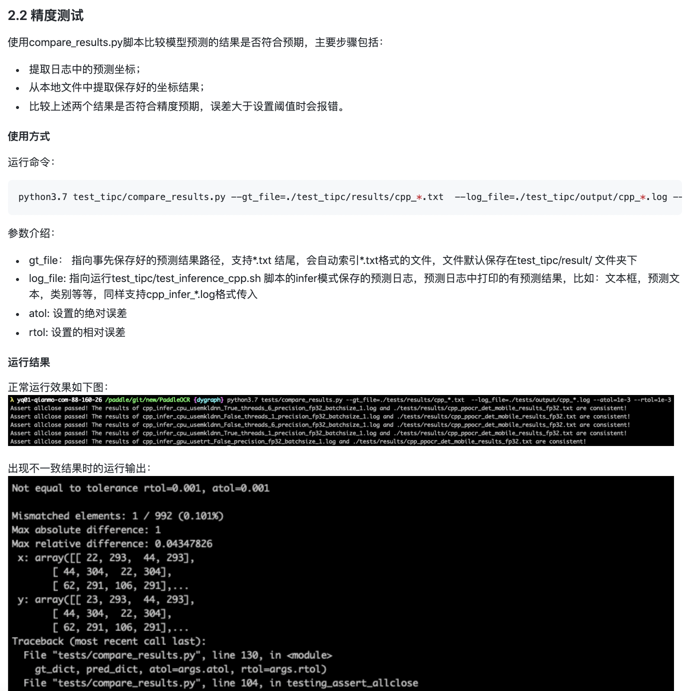

# 背景

基础训练文档对应C++预测功能测试，主程序为`test_inference_cpp.sh`。本文介绍C++预测功能测试文档的撰写规范。

# 文档规范

本文档和[基础训练预测文档]()大体结构类似，主要去掉了训练相关的部分，文档目录结构如下：

### 1.测试结论汇总

内容：基于训练是否使用量化，可以将训练产出的模型可以分为`正常模型`和`量化模型`，表格形式给出这两类模型对应的预测功能汇总情况，包含`模型类型`、`device`、`batchsize`、`tensorrt`、`mkldnn`、`cpu多线程`这6个字段。
	
- 模型类型：“正常模型”或“量化模型”；
- device：CPU或GPU，其他字段取值对应本字段指定的环境；
- batchsize：一般包括1、6两种batchsize，根据实际支持情况填写。
- tensorrt：开启tensorrt支持的精度，包括`fp32`、`fp16`、`int8`三种，当device为CPU时，本字段填`-`。
- mkldnn：开启mkldnn支持的精度，包括`fp32`、`fp16`、`int8`三种，当device为GPU时，本字段填`-`。
- cpu多线程：支持时填`支持`，不支持时留空即可，当device为GPU时，本字段填`-`。

示例：

### 2.测试流程
#### 2.1 功能测试
内容1：给出C++预测具体测试命令。  
示例：

内容2：给出预测log的解读指引。  
示例：

#### 2.2 精度测试
内容：给出精度测试的具体命令和运行结果示例。  
示例：

### 3.更多教程
内容：给出代码仓库中基础训练预测的具体教程链接。  
示例：

