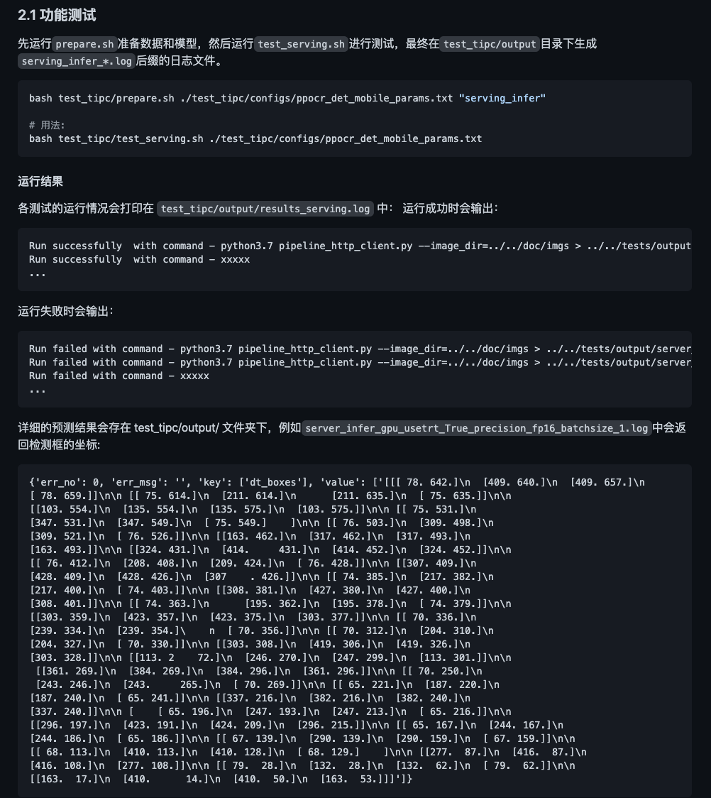

**目录**
- [背景](#--)
- [文档规范](#----)
  * [1.测试结论汇总](#1------)
  * [2.测试流程](#2----)
    + [2.1 功能测试](#21-----)
    + [2.2 精度测试](#22-----)

# 背景
PaddleServing 预测功能测试的主程序为 `test_serving.sh`，可以测试基于 PaddleServing 的部署功能。本文介绍 PaddleServing 预测功能测试文档的撰写规范。

# 文档规范

本文档和基础训练预测文档大体结构类似，主要去掉了训练相关的部分。

## 1.测试结论汇总

内容：基于训练是否使用量化，可以将训练产出的模型可以分为`正常模型`和`量化模型`，表格形式给出这两类模型对应的预测功能汇总情况，包含`模型类型`、`device`、`batchsize`、`tensorrt`、`mkldnn`、`cpu多线程`这6个字段。
	
- 算法名称：该模型对应的算法，可以是算法简称；
- device：CPU 或 GPU，其他字段取值对应本字段指定的环境；
- batchsize：一般包括1、6两种 batchsize，根据实际支持情况填写。
- tensorrt：开启 tensorrt 支持的精度，包括`fp32`、`fp16`、`int8`三种，当 device 为 CPU 时，本字段填`-`。
- mkldnn：开启 mkldnn 支持的精度，包括`fp32`、`fp16`、`int8`三种，当 device 为 GPU 时，本字段填`-`。
- cpu多线程：支持时填`支持`，不支持时留空即可，当 device 为 GPU 时，本字段填`-`。

示例：

| 模型类型 |device | batchsize | tensorrt | mkldnn | cpu多线程 |
|  ----   |  ---- |   ----   |  :----:  |   :----:   |  :----:  |
| 正常模型 | GPU | 1/6 | fp32/fp16 | - | - |
| 正常模型 | CPU | 1/6 | - | fp32 | 支持 |
| 量化模型 | GPU | 1/6 | int8 | - | - |
| 量化模型 | CPU | 1/6 | - | int8 | 支持 |

## 2.测试流程
### 2.1 功能测试
内容：给出 PaddleServing 预测具体测试命令。
示例：

### 2.2 精度测试

由于 PaddleServing 调用了 python inference 预测，因此不做精度对比。
