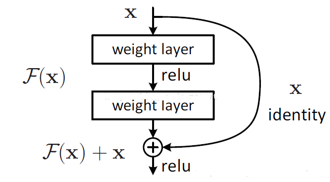
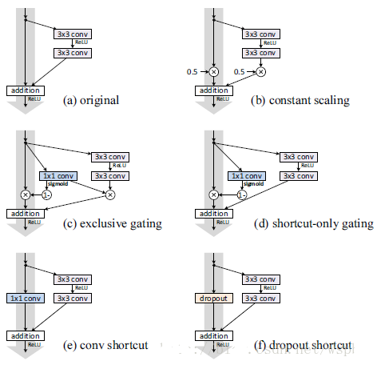
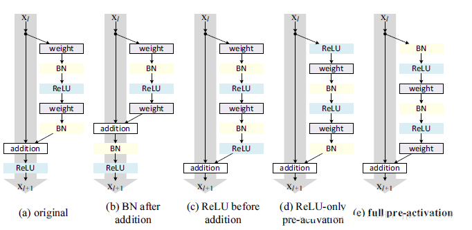

The minimum PaddlePaddle version needed for the code sample in this directory is v0.10.0. If you are on a version of PaddlePaddle earlier than v0.10.0, please [update your installation](http://www.paddlepaddle.org/docs/develop/documentation/en/build_and_install/pip_install_en.html).
-----------------------
# Deep Residual Networks（DRN）
## 简介
在论文[1]中提到了，1202层的ResNet出现了过拟合的问题，有待进一步改进。第二年，何的团队就发表了“Identity Mappings in Deep Residual Networks”这篇文章[2]，分析了ResNet成功的关键因素——residual block背后的算法，并对residual block以及after-addition activation进行改进，通过一系列的ablation experiments验证了，在residual block和after-addition activation上都使用identity mapping（恒等映射）时，能对模型训练产生很好的效果，通过这项改进，也成功的训练出了具有很好效果的ResNet-1001。
## DRN 网络结构
在原始的ResNet中，对于每一个residual building block：


可以表现为以下形式:   


其中为一个恒等映射，代表ReLU激活函数，在[2]中提出了，如果和都是恒等映射，即，那么在训练的前向和反向传播阶段，信号可以直接从一个单元传递到另外一个单元，使得训练变得更加简单。 

在DNN16中，具有以下优良特性：

（1）对于任意深的单元**L**的特征  可以表达为浅层单元**l**的特征加上一个形如 的残差函数，这表明了任意单元**L** 和 **l**之间都具有残差特性。 

（2）对于任意深的单元 **L**，它的特征 ，即为之前所有残差函数输出的总和(加上)。而正好相反的是，“plain network”中的特征是一系列矩阵向量的乘积，也就是，而求和的计算量远远小于求积的计算量。

实验发现，的误差衰减最快，误差也最低(下图a子图所示)：  




对于激活函数，验发现，将ReLU和BN都放在预激活中，即full pre-activation(下图子图e所示)在ResNet-110和ResNet-164上的效果都最好。



## 复现文件一览
在复现文件中，包含以下文件：

<table>
  <tr>
    <th width=60%>文件</th>
    <th width=40%>描述</th>
  </tr>
  <tr>
    <td> train.py  </td>
    <td> DRN模型训练脚本 </td>
  </tr>
  <tr>
    <td> infer.py </td>
    <td> 利用训练好的DRN模型做预测 </td>
  <tr>
    <td> drn.py </td>
    <td> 定义DRN的网络结构 </td>
  </tr>
    <tr>
    <td> utils.py </td>
    <td> 测验并显示训练过程 </td>
  </tr>
</table>

## 基于flower数据集的模型复现
### 数据准备
所使用的的数据集是paddle中自带的flowers数据集进行训练，直接import即可:

```
import paddle.v2.dataset.flowers as flowers
```

### 网络定义
网络的定义在文件```drn.py```中完整实现，其中最主要的是残差网络的部分：
```
def conv_bn_layer(input,
                  ch_out,
                  filter_size,
                  stride,
                  padding,
                  active_type=paddle.activation.Relu(),
                  ch_in=None):
    tmp = paddle.layer.img_conv(
        input=input,
        filter_size=filter_size,
        num_channels=ch_in,
        num_filters=ch_out,
        stride=stride,
        padding=padding,
        act=paddle.activation.Linear(),
        bias_attr=False)
    return paddle.layer.batch_norm(input=tmp, act=active_type)

```
### 训练
接下来，执行``` python train.py -model drn``` 即可训练过程，在训练过程中，建议使CUDA GPU进行训练，如果使用CPU训练耗时可长达90小时以上，关键代码为：

```
paddle.init(use_gpu=True, trainer_count=1)

image = paddle.layer.data(name="image", type=paddle.data_type.dense_vector(DATA_DIM))

lbl = paddle.layer.data(name="label", type=paddle.data_type.integer_value(CLASS_DIM))

# 省略部分代码

trainer = paddle.trainer.SGD(cost=cost,
                             parameters=parameters,
                             update_equation=optimizer,
                             extra_layers=extra_layers)
# 省略部分代码
   
trainer.train(
        reader=train_reader, num_passes=200, event_handler=event_handler)

```

下面是关于上述代码的解释：

1. 进行``` paddle.init ```以1个GPU的方式初始化

2. 定义```img```图像名 和 ```lbl``` 图像标签
 
3. 定义```trainer```，包含损失函数、参数、优化器和层数信息
 
4. 在```train```函数中进行实际训练，共执行200趟

执行过程中，控制台将打印如下所示的信息：
```
Pass 0, Batch 0, Cost 2.2512, ...
Pass 0, Batch 1, Cost 2.1532, ...
```

同时在```train.py```目录下，每趟训练完成时，将生成```params_pass_0.tar,gz```，最后一趟的200.tar.gz文件生成时，训练完成。
### 简化测验
应用```python utils.py```可以简化训练过程的输出，观察训练的cost和效果的变化
```
[INFO 2018-03-27 09:21:50,020 utils.py:83] pass_id:0,batch_id:0,train_cost:2.97480511665,s:{'classification_error_evaluator': 0.875}
INFO    :pass_id:0,batch_id:0,train_cost:2.97480511665,s:{'classification_error_evaluator': 0.875}
[INFO 2018-03-27 09:21:55,806 utils.py:83] pass_id:0,batch_id:10,train_cost:4.01303768158,s:{'classification_error_evaluator': 1.0}
INFO    :pass_id:0,batch_id:10,train_cost:4.01303768158,s:{'classification_error_evaluator': 1.0}
[INFO 2018-03-27 09:22:01,413 utils.py:83] pass_id:0,batch_id:20,train_cost:2.66417765617,s:{'classification_error_evaluator': 0.875}
INFO    :pass_id:0,batch_id:20,train_cost:2.66417765617,s:{'classification_error_evaluator': 0.875}

```

### 应用模型
应用训练好的模型，执行``` python infer.py -data_list <文件目录> -model drn```即可：
```
# load parameters
with gzip.open('params_pass_200.tar.gz', 'r') as f:
    parameters = paddle.parameters.Parameters.from_tar(f)

file_list = [line.strip() for line in open(image_list_file)]
test_data = [(paddle.image.load_and_transform(image_file, 256, 224, False)
              .flatten().astype('float32'), )
             for image_file in file_list]
probs = paddle.infer(
    output_layer=out, parameters=parameters, input=test_data)
lab = np.argsort(-probs)
for file_name, result in zip(file_list, lab):
    print "Label of %s is: %d" % (file_name, result[0])
```
代码将从图片文件夹中读取对应的图片文件，同时给出预测的标签结果，并进行输出。

### 参考文献

[1] [Deep Residual Learning for Image Recognition](http://arxiv.org/pdf/1512.03385.pdf)

[2] [Identity Mappings in Deep Residual Networks](https://arxiv.org/abs/1603.05027)
