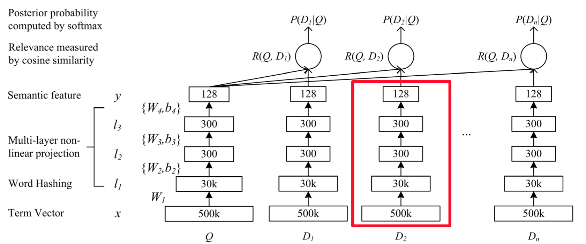
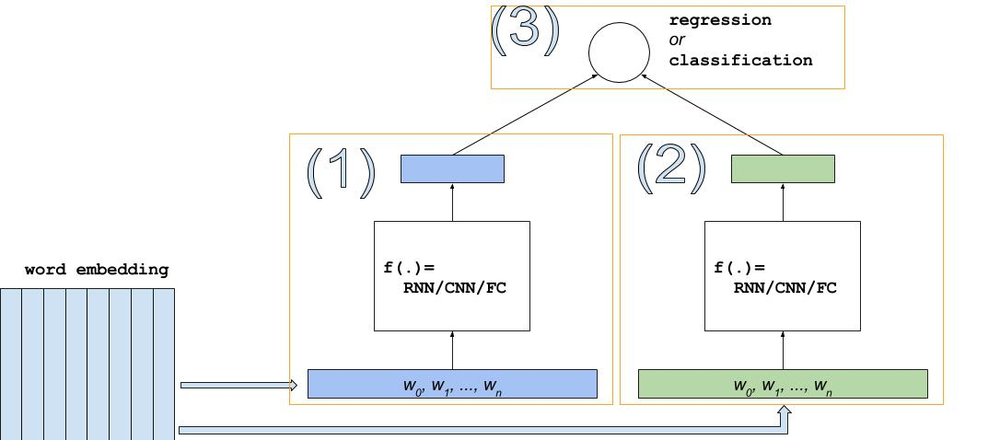
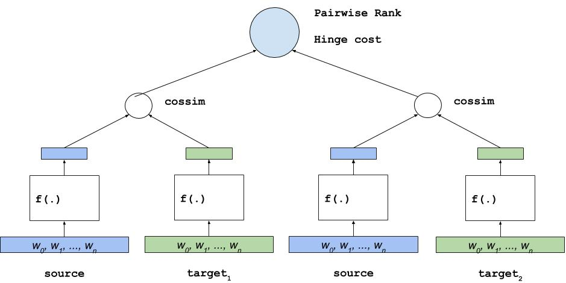

运行本目录下的程序示例需要使用PaddlePaddle v0.10.0 版本。如果您的PaddlePaddle安装版本低于此版本要求，请按照[安装文档](http://www.paddlepaddle.org/docs/develop/documentation/zh/build_and_install/pip_install_cn.html)中的说明更新PaddlePaddle安装版本。

---

# 深度结构化语义模型 (Deep Structured Semantic Models, DSSM)
DSSM使用DNN模型在一个连续的语义空间中学习文本低纬的表示向量，并且建模两个句子间的语义相似度。本例演示如何使用PaddlePaddle实现一个通用的DSSM 模型，用于建模两个字符串间的语义相似度，模型实现支持通用的数据格式，用户替换数据便可以在真实场景中使用该模型。

## 背景介绍
DSSM \[[1](##参考文献)\]是微软研究院13年提出来的经典的语义模型，用于学习两个文本之间的语义距离，广义上模型也可以推广和适用如下场景：

1. CTR预估模型，衡量用户搜索词（Query）与候选网页集合（Documents）之间的相关联程度。
2. 文本相关性，衡量两个字符串间的语义相关程度。
3. 自动推荐，衡量User与被推荐的Item之间的关联程度。

DSSM 已经发展成了一个框架，可以很自然地建模两个记录之间的距离关系，例如对于文本相关性问题，可以用余弦相似度 (cosin similarity) 来刻画语义距离；而对于搜索引擎的结果排序，可以在DSSM上接上Rank损失训练出一个排序模型。

## 模型简介
在原论文\[[1](#参考文献)\]中，DSSM模型用来衡量用户搜索词 Query 和文档集合 Documents 之间隐含的语义关系，模型结构如下

<p align="center">
<br/><br/>
图 1. DSSM 原始结构
</p>

其贯彻的思想是， **用DNN将高维特征向量转化为低纬空间的连续向量（图中红色框部分）** ，**在上层使用cosine similarity来衡量用户搜索词与候选文档间的语义相关性** 。

在最顶层损失函数的设计上，原始模型使用类似Word2Vec中负例采样的方法，一个Query会抽取正例 $D+$ 和4个负例 $D-$ 整体上算条件概率用对数似然函数作为损失，这也就是图 1中类似 $P(D_1|Q)$ 的结构，具体细节请参考原论文。

随着后续优化DSSM模型的结构得以简化\[[3](#参考文献)\]，演变为：

<p align="center">
<br/><br/>
图 2. DSSM通用结构
</p>

图中的空白方框可以用任何模型替代，例如：全连接FC，卷积CNN，RNN等。该模型结构专门用于衡量两个元素（比如字符串）间的语义距离。在实际任务中，DSSM模型会作为基础的积木，搭配上不同的损失函数来实现具体的功能，比如：

- 在排序学习中，将 图 2 中结构添加 pairwise rank损失，变成一个排序模型
- 在CTR预估中，对点击与否做0，1二元分类，添加交叉熵损失变成一个分类模型
- 在需要对一个子串打分时，可以使用余弦相似度来计算相似度，变成一个回归模型

本例提供一个比较通用的解决方案，在模型任务类型上支持：

- 分类
- [-1, 1] 值域内的回归
- Pairwise-Rank

在生成低纬语义向量的模型结构上，支持以下三种：

- FC, 多层全连接层
- CNN，卷积神经网络
- RNN，递归神经网络

## 模型实现
DSSM模型可以拆成三部分：分别是左边和右边的DNN，以及顶层的损失函数。在复杂任务中，左右两边DNN的结构可以不同。在原始论文中左右网络分别学习Query和Document的语义向量，两者数据的数据不同，建议对应定制DNN的结构。

**本例中为了简便和通用，将左右两个DNN的结构设为相同，因此只提供三个选项FC、CNN、RNN**。

损失函数的设计也支持三种类型：分类, 回归, 排序；其中，在回归和排序两种损失中，左右两边的匹配程度通过余弦相似度（cosine similairty）来计算；在分类任务中，类别预测的分布通过softmax计算。

在其它教程中，对上述很多内容都有过详细的介绍，例如：

- 如何CNN, FC 做文本信息提取可以参考 [text classification](https://github.com/PaddlePaddle/models/blob/develop/text_classification/README.md#模型详解)
- RNN/GRU 的内容可以参考 [Machine Translation](https://github.com/PaddlePaddle/book/blob/develop/08.machine_translation/README.md#gated-recurrent-unit-gru)
- Pairwise Rank即排序学习可参考 [learn to rank](https://github.com/PaddlePaddle/models/blob/develop/ltr/README.md)

相关原理在此不再赘述，本文接下来的篇幅主要集中介绍使用PaddlePaddle实现这些结构上。

如图3，回归和分类模型的结构相似:

<p align="center">
<br/><br/>
图 3. DSSM for REGRESSION or CLASSIFICATION
</p>

最重要的组成部分包括词向量，图中`(1)`,`(2)`两个低纬向量的学习器（可以用RNN/CNN/FC中的任意一种实现），最上层对应的损失函数。

Pairwise Rank的结构会复杂一些，图 4. 中的结构会出现两次，增加了对应的损失函数，模型总体思想是：
- 给定同一个source(源)为左右两个target(目标)分别打分——`(a),(b)`，学习目标是(a),(b)之间的大小关系
- `(a)`和`(b)`类似图3中结构，用于给source和target的pair打分
- `(1)`和`(2)`的结构其实是共用的，都表示同一个source，图中为了表达效果展开成两个

<p align="center">
<br/><br/>
图 4. DSSM for Pairwise Rank
</p>

下面是各个部分的具体实现，相关代码均包含在 `./network_conf.py` 中。


### 创建文本的词向量表

```python
def create_embedding(self, input, prefix=''):
    """
    Create word embedding. The `prefix` is added in front of the name of
    embedding"s learnable parameter.
    """
    logger.info("Create embedding table [%s] whose dimention is %d" %
                (prefix, self.dnn_dims[0]))
    emb = paddle.layer.embedding(
        input=input,
        size=self.dnn_dims[0],
        param_attr=ParamAttr(name='%s_emb.w' % prefix))
    return emb
```

由于输入给词向量表(embedding table)的是一个句子对应的词的ID的列表 ，因此词向量表输出的是词向量的序列。

### CNN 结构实现

```python
def create_cnn(self, emb, prefix=''):

    """
    A multi-layer CNN.
    :param emb: The word embedding.
    :type emb: paddle.layer
    :param prefix: The prefix will be added to of layers' names.
    :type prefix: str
    """

    def create_conv(context_len, hidden_size, prefix):
        key = "%s_%d_%d" % (prefix, context_len, hidden_size)
        conv = paddle.networks.sequence_conv_pool(
            input=emb,
            context_len=context_len,
            hidden_size=hidden_size,
            # set parameter attr for parameter sharing
            context_proj_param_attr=ParamAttr(name=key + "contex_proj.w"),
            fc_param_attr=ParamAttr(name=key + "_fc.w"),
            fc_bias_attr=ParamAttr(name=key + "_fc.b"),
            pool_bias_attr=ParamAttr(name=key + "_pool.b"))
        return conv

    conv_3 = create_conv(3, self.dnn_dims[1], "cnn")
    conv_4 = create_conv(4, self.dnn_dims[1], "cnn")
    return paddle.layer.concat(input=[conv_3, conv_4])
```

CNN 接受词向量序列，通过卷积和池化操作捕捉到原始句子的关键信息，最终输出一个语义向量（可以认为是句子向量）。

本例的实现中，分别使用了窗口长度为3和4的CNN学到的句子向量按元素求和得到最终的句子向量。

### RNN 结构实现

RNN很适合学习变长序列的信息，使用RNN来学习句子的信息几乎是自然语言处理任务的标配。

```python
def create_rnn(self, emb, prefix=''):
    """
    A GRU sentence vector learner.
    """
    gru = paddle.networks.simple_gru(
        input=emb,
        size=self.dnn_dims[1],
        mixed_param_attr=ParamAttr(name='%s_gru_mixed.w' % prefix),
        mixed_bias_param_attr=ParamAttr(name="%s_gru_mixed.b" % prefix),
        gru_param_attr=ParamAttr(name='%s_gru.w' % prefix),
        gru_bias_attr=ParamAttr(name="%s_gru.b" % prefix))
    sent_vec = paddle.layer.last_seq(gru)
    return sent_vec
```

### 多层全连接网络FC

```python
def create_fc(self, emb, prefix=''):

    """
    A multi-layer fully connected neural networks.
    :param emb: The output of the embedding layer
    :type emb: paddle.layer
    :param prefix: A prefix will be added to the layers' names.
    :type prefix: str
    """

    _input_layer = paddle.layer.pooling(
        input=emb, pooling_type=paddle.pooling.Max())
    fc = paddle.layer.fc(
        input=_input_layer,
        size=self.dnn_dims[1],
        param_attr=ParamAttr(name='%s_fc.w' % prefix),
        bias_attr=ParamAttr(name="%s_fc.b" % prefix))
    return fc
```

在构建全连接网络时首先使用`paddle.layer.pooling` 对词向量序列进行最大池化操作，将边长序列转化为一个固定维度向量，作为整个句子的语义表达，使用最大池化能够降低句子长度对句向量表达的影响。

### 多层DNN
在 CNN/DNN/FC提取出 semantic vector后，在上层可继续接多层FC来实现深层DNN结构。

```python
def create_dnn(self, sent_vec, prefix):
    if len(self.dnn_dims) > 1:
        _input_layer = sent_vec
        for id, dim in enumerate(self.dnn_dims[1:]):
            name = "%s_fc_%d_%d" % (prefix, id, dim)
            fc = paddle.layer.fc(
                input=_input_layer,
                size=dim,
                act=paddle.activation.Tanh(),
                param_attr=ParamAttr(name='%s.w' % name),
                bias_attr=ParamAttr(name='%s.b' % name),
                )
            _input_layer = fc
    return _input_layer
```

### 分类及回归
分类和回归的结构比较相似，具体实现请参考[network_conf.py]( https://github.com/PaddlePaddle/models/blob/develop/dssm/network_conf.py)中的
`_build_classification_or_regression_model` 函数。

### Pairwise Rank
Pairwise Rank复用上面的DNN结构，同一个source对两个target求相似度打分，如果左边的target打分高，预测为1，否则预测为 0。实现请参考 [network_conf.py]( https://github.com/PaddlePaddle/models/blob/develop/dssm/network_conf.py) 中的`_build_rank_model` 函数。

## 数据格式
在 `./data` 中有简单的示例数据

### 回归的数据格式
```
# 3 fields each line:
#   - source word list
#   - target word list
#   - target
<word list> \t <word list> \t <float>
```

比如：

```
苹果 六 袋    苹果 6s    0.1
新手 汽车 驾驶    驾校 培训    0.9
```
### 分类的数据格式
```
# 3 fields each line:
#   - source word list
#   - target word list
#   - target
<word list> \t <word list> \t <label>
```

比如：

```
苹果 六 袋    苹果 6s    0
新手 汽车 驾驶    驾校 培训    1
```

### 排序的数据格式
```
# 4 fields each line:
#   - source word list
#   - target1 word list
#   - target2 word list
#   - label
<word list> \t <word list> \t <word list> \t <label>
```

比如：

```
苹果 六 袋    苹果 6s    新手 汽车 驾驶    1
新手 汽车 驾驶    驾校 培训    苹果 6s    1
```

## 执行训练

可以直接执行 `python train.py -y 0 --model_arch 0 --class_num 2` 使用 `./data/classification` 目录里的实例数据来测试能否直接运行训练分类FC模型。

其他模型结构也可以通过命令行实现定制，详细命令行参数请执行 `python train.py --help`进行查阅。

这里介绍最重要的几个参数：

- `train_data_path` 训练数据路径
- `test_data_path` 测试数据路局，可以不设置
- `source_dic_path` 源字典字典路径
- `target_dic_path` 目标字典路径
- `model_type` 模型的损失函数的类型，分类0，排序1，回归2
- `model_arch` 模型结构，FC 0， CNN 1, RNN 2
- `dnn_dims` 模型各层的维度设置，默认为 `256,128,64,32`，即模型有4层，各层维度如上设置

## 使用训练好的模型预测
详细命令行参数请执行 `python infer.py --help`进行查阅。重要参数解释如下：

- `data_path` 需要预测的数据路径
- `prediction_output_path` 预测的输出路径

## 参考文献

1. Huang P S, He X, Gao J, et al. Learning deep structured semantic models for web search using clickthrough data[C]//Proceedings of the 22nd ACM international conference on Conference on information & knowledge management. ACM, 2013: 2333-2338.
2. [Microsoft Learning to Rank Datasets](https://www.microsoft.com/en-us/research/project/mslr/)
3. [Gao J, He X, Deng L. Deep Learning for Web Search and Natural Language Processing[J]. Microsoft Research Technical Report, 2015.](https://www.microsoft.com/en-us/research/wp-content/uploads/2016/02/wsdm2015.v3.pdf)
