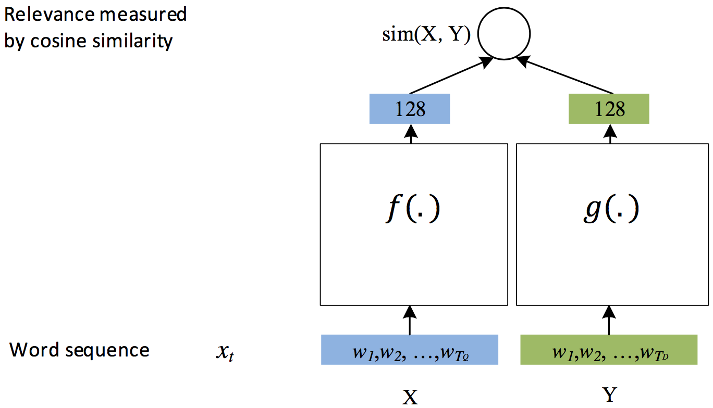

# 深度结构化语义模型 (Deep Structured Semantic Models, DSSM)
DSSM使用DNN模型在一个连续的语义空间中学习文本低纬的表示向量，并且建模两个句子间的语义相似度。
本例演示如何使用 PaddlePaddle实现一个通用的DSSM 模型，用于建模两个字符串间的语义相似度，
模型实现支持通用的数据格式，用户替换数据便可以在真实场景中使用该模型。

## 背景介绍
DSSM \[[1](##参考文档)\]是微软研究院13年提出来的经典的语义模型，用于学习两个文本之间的语义距离，
广义上模型也可以推广和适用如下场景：

1. CTR预估模型，衡量用户搜索词（Query）与候选网页集合（Documents）之间的相关联程度。
2. 文本相关性，衡量两个字符串间的语义相关程度。
3. 自动推荐，衡量User与被推荐的Item之间的关联程度。

DSSM 已经发展成了一个框架，可以很自然地建模两个记录之间的距离关系，
例如对于文本相关性问题，可以用余弦相似度 (cosin similarity) 来刻画语义距离；
而对于搜索引擎的结果排序，可以在DSSM上接上Rank损失训练处一个排序模型。

## 模型简介
在原论文\[[1](#参考文档)\]中，DSSM模型用来衡量用户搜索词 Query 和文档集合 Documents 之间隐含的语义关系，模型结构如下

<p align="center">
<a id="#figure1"></a>
<br/><br/>
图 1. DSSM 原始结构
<p>

其贯彻的思想是， **用DNN将高维特征向量转化为低纬空间的连续向量（图中红色框部分）** ，
**在上层用cosin similarity来衡量用户搜索词与候选文档间的语义相关性**。

在最顶层损失函数的设计上，原始模型使用类似Word2Vec中负例采样的方法，
一个Query会抽取正例 $D+$ 和4个负例 $D-$ 整体上算条件概率用对数似然函数作为损失，
这也就是图 1中类似 $P(D_1|Q)$ 的结构，具体细节请参考原论文。

随着后续优化DSSM模型的结构得以简化\[[3](#参考文档)\]，演变为：

<p align="center">
<br/><br/>
图 2. DSSM通用结构
<p>

图中的空白方框可以用任何模型替代，比如全连接FC，卷积CNN，RNN等都可以，
该模型结构专门用于衡量两个元素（比如字符串）间的语义距离。

在现实使用中，DSSM模型会作为基础的积木，搭配上不同的损失函数来实现具体的功能，比如

- 在排序学习中，将 图 2 中结构添加 pairwise rank损失，变成一个排序模型
- 在CTR预估中，对点击与否做0，1二元分类，添加交叉熵损失变成一个分类模型
- 在需要对一个子串打分时，可以使用余弦相似度来计算相似度，变成一个回归模型

本例将尝试面向应用提供一个比较通用的解决方案，在模型任务类型上支持

- CLASSIFICATION
- [-1, 1] 值域内的 REGRESSION
- Pairwise-Rank

在生成低纬语义向量的模型结构上，本模型支持以下三种：

- FC, 多层全连接层
- CNN，卷积神经网络
- RNN，递归神经网络

## 模型实现
DSSM模型可以拆成三小块实现，分别是左边和右边的DNN，
以及顶层的损失函数，在复杂任务中，左右两边DNN的结构可以是不同的，比如在原始论文中左右分别学习Query和Document的semantic vector，
两者数据的数据不同，最好定制下对应的DNN结构。

本教程中为了简便和通用，将左右两个DNN的结构都设为相同的，因此只有三个选项FC,CNN,RNN等。

在损失函数的设计方面，也支持三种，CLASSIFICATION, REGRESSION, RANK；
其中，在REGRESSION和RANK两种损失中，左右两边的匹配程度通过余弦相似度（cossim）来计算；
在CLASSIFICATION任务中，类别预测的分布通过softmax计算。

在 [paddle/models](https://github.com/PaddlePaddle/models)之前的系列教程中，对上面提到的很多内容都有了详细的介绍，比如

- 如何CNN, FC 做文本信息提取可以参考 [text classification](https://github.com/PaddlePaddle/models/blob/develop/text_classification/README.md#模型详解)
- RNN/GRU 的内容可以参考 [Machine Translation](https://github.com/PaddlePaddle/book/blob/develop/08.machine_translation/README.md#gated-recurrent-unit-gru)
- Pairwise Rank即排序学习可参考 [learn to rank](https://github.com/PaddlePaddle/models/blob/develop/ltr/README.md)

相关原理在此不再赘述，本文接下来的篇幅主要集中介绍使用PaddlePaddle实现这些结构上。

如图3，REGRESSION 和 CLASSIFICATION 模型的结构很相似

<p align="center">
<br/><br/>
图 3. DSSM for REGRESSION or CLASSIFICATION
</p>

最重要的组成部分包括 embedding，左右两个sentece vector的学习器（可以用RNN/CNN/FC中的任意一种实现），
最上层对应的损失函数。

而Pairwise Rank的结构会复杂一些，类似两个 图 3. 中的结构，增加了对应的 Hinge lost的损失函数。

<p align="center">
<br/><br/>
图 4. DSSM for Pairwise Rank
</p>

下面是各个部分具体的实现方法，所有的代码均包含在 `./network_conf.py` 中。

### 创建文本的embedding
```python
def create_embedding(self, input, prefix=''):
    '''
    Create an embedding table whose name has a `prefix`.
    '''
    logger.info("create embedding table [%s] which dimention is %d" %
                (prefix, self.dnn_dims[0]))
    emb = paddle.layer.embedding(
        input=input,
        size=self.dnn_dims[0],
        param_attr=ParamAttr(name='%s_emb.w' % prefix))
    return emb
```

由于输入给 `embedding` 的是一个句子对应的 `wordid list`，因此embedding 输出的是 word vector list.

### CNN 结构实现
```python
def create_cnn(self, emb, prefix=''):
    '''
    A multi-layer CNN.

    @emb: paddle.layer
        output of the embedding layer
    @prefix: str
        prefix of layers' names, used to share parameters between more than one `cnn` parts.
    '''

    def create_conv(context_len, hidden_size, prefix):
        key = "%s_%d_%d" % (prefix, context_len, hidden_size)
        conv = paddle.networks.sequence_conv_pool(
            input=emb,
            context_len=context_len,
            hidden_size=hidden_size,
            # set parameter attr for parameter sharing
            context_proj_param_attr=ParamAttr(name=key + 'contex_proj.w'),
            fc_param_attr=ParamAttr(name=key + '_fc.w'),
            fc_bias_attr=ParamAttr(name=key + '_fc.b'),
            pool_bias_attr=ParamAttr(name=key + '_pool.b'))
        return conv

    logger.info('create a sequence_conv_pool which context width is 3')
    conv_3 = create_conv(3, self.dnn_dims[1], "cnn")
    logger.info('create a sequence_conv_pool which context width is 4')
    conv_4 = create_conv(4, self.dnn_dims[1], "cnn")

    return conv_3, conv_4
```

CNN 接受 embedding 输出的 list of word vevtors，通过卷积和池化操作捕捉到原始句子的关键信息，
最终输出一个语义向量（可以认为是句子向量）。

这里实现中，分别使用了窗口长度为3和4的个CNN学到的句子向量按元素求和得到最终的句子向量。
### RNN 结构实现

RNN很适合学习变长序列的信息，使用RNN来学习句子的信息也算是标配之一。

```python
def create_rnn(self, emb, prefix=''):
    '''
    A GRU sentence vector learner.
    '''
    gru = paddle.layer.gru_memory(input=emb,)
    sent_vec = paddle.layer.last_seq(gru)
    return sent_vec
```
### FC 结构实现
```python
def create_fc(self, emb, prefix=''):
    '''
    A multi-layer fully connected neural networks.

    @emb: paddle.layer
        output of the embedding layer
    @prefix: str
        prefix of layers' names, used to share parameters between more than one `fc` parts.
    '''
    _input_layer = paddle.layer.pooling(
        input=emb, pooling_type=paddle.pooling.Max())
    fc = paddle.layer.fc(input=_input_layer, size=self.dnn_dims[1])
    return fc
```
在构建FC时，首先使用了 `paddle.layer.polling` 按元素取Max的操作将 embedding 出来的word vector list 的信息合并成一个等维度的semantic vector，
使用取Max的方法能够避免句子长度对semantic vector的影响。

### 多层DNN实现
在 CNN/DNN/FC提取出 semantic vector后，在上层接着用多层FC实现一个DNN的结构

```python
def create_dnn(self, sent_vec, prefix):
    # if more than three layers, than a fc layer will be added.
    if len(self.dnn_dims) > 1:
        _input_layer = sent_vec
        for id, dim in enumerate(self.dnn_dims[1:]):
            name = "%s_fc_%d_%d" % (prefix, id, dim)
            logger.info("create fc layer [%s] which dimention is %d" %
                        (name, dim))
            fc = paddle.layer.fc(
                name=name,
                input=_input_layer,
                size=dim,
                act=paddle.activation.Tanh(),
                param_attr=ParamAttr(name='%s.w' % name),
                bias_attr=ParamAttr(name='%s.b' % name))
            _input_layer = fc
    return _input_layer
```

### CLASSIFICATION或REGRESSION实现
CLASSIFICATION和REGRESSION的结构比较相似，因此可以用一个函数创建出来

```python
def _build_classification_or_regression_model(self, is_classification):
    '''
    Build a classification/regression model, and the cost is returned.

    A Classification has 3 inputs:
      - source sentence
      - target sentence
      - classification label

    '''
    # prepare inputs.
    assert self.class_num

    source = paddle.layer.data(
        name='source_input',
        type=paddle.data_type.integer_value_sequence(self.vocab_sizes[0]))
    target = paddle.layer.data(
        name='target_input',
        type=paddle.data_type.integer_value_sequence(self.vocab_sizes[1]))
    label = paddle.layer.data(
        name='label_input',
        type=paddle.data_type.integer_value(self.class_num)
        if is_classification else paddle.data_type.dense_input)

    prefixs = '_ _'.split(
    ) if self.share_semantic_generator else 'left right'.split()
    embed_prefixs = '_ _'.split(
    ) if self.share_embed else 'left right'.split()

    word_vecs = []
    for id, input in enumerate([source, target]):
        x = self.create_embedding(input, prefix=embed_prefixs[id])
        word_vecs.append(x)

    semantics = []
    for id, input in enumerate(word_vecs):
        x = self.model_arch_creater(input, prefix=prefixs[id])
        semantics.append(x)

    concated_vector = paddle.layer.concat(semantics)
    prediction = paddle.layer.fc(
        input=concated_vector,
        size=self.class_num,
        act=paddle.activation.Softmax())
    cost = paddle.layer.classification_cost(
        input=prediction,
        label=label) if is_classification else paddle.layer.mse_cost(
            prediction, label)
    return cost, prediction, label
```
### Pairwise Rank实现
Pairwise Rank复用上面的DNN结构，同一个source对两个target求相似度打分，使用了hinge lost，
如果左边的target打分高，则预测为1，否则预测为 0。

```python
def _build_rank_model(self):
    '''
    Build a pairwise rank model, and the cost is returned.

    A pairwise rank model has 3 inputs:
      - source sentence
      - left_target sentence
      - right_target sentence
      - label, 1 if left_target should be sorted in front of right_target, otherwise 0.
    '''
    source = paddle.layer.data(
        name='source_input',
        type=paddle.data_type.integer_value_sequence(self.vocab_sizes[0]))
    left_target = paddle.layer.data(
        name='left_target_input',
        type=paddle.data_type.integer_value_sequence(self.vocab_sizes[1]))
    right_target = paddle.layer.data(
        name='right_target_input',
        type=paddle.data_type.integer_value_sequence(self.vocab_sizes[1]))
    label = paddle.layer.data(
        name='label_input', type=paddle.data_type.integer_value(1))

    prefixs = '_ _ _'.split(
    ) if self.share_semantic_generator else 'source left right'.split()
    embed_prefixs = '_ _'.split(
    ) if self.share_embed else 'source target target'.split()

    word_vecs = []
    for id, input in enumerate([source, left_target, right_target]):
        x = self.create_embedding(input, prefix=embed_prefixs[id])
        word_vecs.append(x)

    semantics = []
    for id, input in enumerate(word_vecs):
        x = self.model_arch_creater(input, prefix=prefixs[id])
        semantics.append(x)

    # cossim score of source and left_target
    left_score = paddle.layer.cos_sim(semantics[0], semantics[1])
    # cossim score of source and right target
    right_score = paddle.layer.cos_sim(semantics[0], semantics[2])

    # rank cost
    cost = paddle.layer.rank_cost(left_score, right_score, label=label)
    # prediction = left_score - right_score
    # but this operator is not supported currently.
    # so AUC will not used.
    return cost, None, None
```
## 数据格式
在 `./data` 中有简单的示例数据

### REGRESSION 的数据格式
```
# 3 fields each line:
#   - source's wordids
#   - target's wordids
#   - target
<ids> \t <ids> \t <float>
```
### CLASSIFICATION的数据格式
```
# 3 fields each line:
#   - source's wordids
#   - target's wordids
#   - target
<ids> \t <ids> \t <label>
```
### RANK的数据格式
```
# 4 fields each line:
#   - source's wordids
#   - target1's wordids
#   - target2's wordids
#   - label
<ids> \t <ids> \t <ids> \t <label>
```

## 执行训练

可以直接执行 `python train.py -y 0 --model_arch 0` 使用简单的demo数据来训练一个分类的FC模型。

其他模型结构也可以通过命令行实现定制，详细命令行参数如下

```
usage: train.py [-h] [-i TRAIN_DATA_PATH] [-t TEST_DATA_PATH]
                [-s SOURCE_DIC_PATH] [--target_dic_path TARGET_DIC_PATH]
                [-b BATCH_SIZE] [-p NUM_PASSES] -y MODEL_TYPE --model_arch
                MODEL_ARCH
                [--share_network_between_source_target SHARE_NETWORK_BETWEEN_SOURCE_TARGET]
                [--share_embed SHARE_EMBED] [--dnn_dims DNN_DIMS]
                [--num_workers NUM_WORKERS] [--use_gpu USE_GPU] [-c CLASS_NUM]

PaddlePaddle DSSM example

optional arguments:
  -h, --help            show this help message and exit
  -i TRAIN_DATA_PATH, --train_data_path TRAIN_DATA_PATH
                        path of training dataset
  -t TEST_DATA_PATH, --test_data_path TEST_DATA_PATH
                        path of testing dataset
  -s SOURCE_DIC_PATH, --source_dic_path SOURCE_DIC_PATH
                        path of the source's word dic
  --target_dic_path TARGET_DIC_PATH
                        path of the target's word dic, if not set, the
                        `source_dic_path` will be used
  -b BATCH_SIZE, --batch_size BATCH_SIZE
                        size of mini-batch (default:10)
  -p NUM_PASSES, --num_passes NUM_PASSES
                        number of passes to run(default:10)
  -y MODEL_TYPE, --model_type MODEL_TYPE
                        model type, 0 for classification, 1 for pairwise rank
                        (default: classification)
  --model_arch MODEL_ARCH
                        model architecture, 1 for CNN, 0 for FC, 2 for RNN
  --share_network_between_source_target SHARE_NETWORK_BETWEEN_SOURCE_TARGET
                        whether to share network parameters between source and
                        target
  --share_embed SHARE_EMBED
                        whether to share word embedding between source and
                        target
  --dnn_dims DNN_DIMS   dimentions of dnn layers, default is '256,128,64,32',
                        which means create a 4-layer dnn, demention of each
                        layer is 256, 128, 64 and 32
  --num_workers NUM_WORKERS
                        num worker threads, default 1
  --use_gpu USE_GPU     whether to use GPU devices (default: False)
  -c CLASS_NUM, --class_num CLASS_NUM
                        number of categories for classification task.
```

## 参考文档

1. Huang P S, He X, Gao J, et al. Learning deep structured semantic models for web search using clickthrough data[C]//Proceedings of the 22nd ACM international conference on Conference on information & knowledge management. ACM, 2013: 2333-2338.
2. [Microsoft Learning to Rank Datasets](https://www.microsoft.com/en-us/research/project/mslr/)
3. [Gao J, He X, Deng L. Deep Learning for Web Search and Natural Language Processing[J]. Microsoft Research Technical Report, 2015.](https://www.microsoft.com/en-us/research/wp-content/uploads/2016/02/wsdm2015.v3.pdf)
