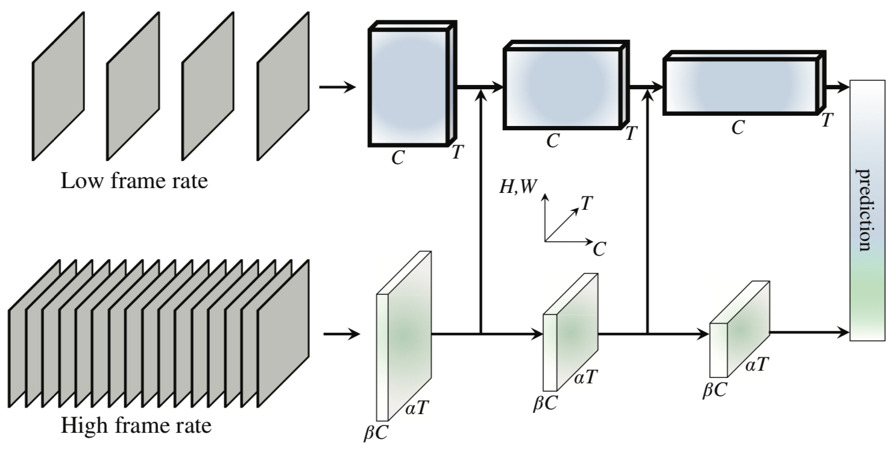

# SlowFast 视频分类模型动态图实现

---
## 内容

- [模型简介](#模型简介)
- [代码结构](#代码结构)
- [安装说明](#安装说明)
- [数据准备](#数据准备)
- [模型训练](#模型训练)
- [模型评估](#模型评估)
- [模型预测](#模型预测)
- [参考论文](#参考论文)


## 模型简介

SlowFast是视频分类领域的高精度模型，使用slow和fast两个分支。slow分支以稀疏采样得到的帧作为输入，捕捉视频中的表观信息。fast分支以高频采样得到的帧作为输入，捕获视频中的运动信息，最终将两个分支的特征拼接得到预测结果。

<p align="center">
 <br />
SlowFast Overview
</p>

详细内容请参考ICCV 2019论文[SlowFast Networks for Video Recognition](https://arxiv.org/abs/1812.03982)


## 代码结构
```
├── slowfast.yaml           # 多卡配置文件，用户可方便的配置超参数
├── slowfast-single.yaml    # 单卡评估预测配置文件，用户可方便的配置超参数
├── run_train_multi.sh      # 多卡训练脚本
├── run_train_single.sh     # 单卡训练脚本
├── run_eval_multi.sh       # 多卡评估脚本
├── run_infer_multi.sh      # 多卡预测脚本
├── run_eval_single.sh      # 单卡评估脚本
├── run_infer_single.sh     # 单卡预测脚本
├── train.py                # 训练代码
├── eval.py                 # 评估代码，评估网络性能
├── predict.py              # 预测代码
├── model.py                # 网络结构
├── model_utils.py          # 网络结构细节相关
├── lr_policy.py            # 学习率调整方式
├── kinetics_dataset.py     # kinetics-400数据预处理代码
└── config_utils.py         # 配置细节相关代码
```

## 安装说明

请使用```python3.7```运行样例代码

### 环境依赖：

```
    CUDA >= 9.0
    cudnn >= 7.5
```

### 依赖安装：

- PaddlePaddle版本>= 2.0.0-alpha0:
``` pip3.7 install paddlepaddle-gpu==2.0.0a0 -i https://mirror.baidu.com/pypi/simple ```
- 安装opencv 4.2:
``` pip3.7 install opencv-python==4.2.0.34```
- 如果想可视化训练曲线，请安装VisualDL:
``` pip3.7 install visualdl -i https://mirror.baidu.com/pypi/simple```


## 数据准备

SlowFast模型的训练数据采用Kinetics400数据集，数据下载及准备请参考[数据说明](../PaddleCV/video/data/dataset/README.md)。


## 模型训练

数据准备完成后，可通过如下两种方式启动训练：

默认使用8卡训练，启动方式如下:

    bash run_train_multi.sh

若使用单卡训练，启动方式如下:

    bash run_train_single.sh

- 建议使用多卡训练方式，单卡由于batch\_size减小，精度可能会有损失。

- 从头开始训练，使用上述启动命令行或者脚本程序即可启动训练，不需要用到预训练模型。

- Visual DL可以用来对训练过程进行可视化，具体使用方法请参考[VisualDL](https://github.com/PaddlePaddle/VisualDL)

**训练资源要求：**

*  8卡V100，总batch\_size=64，单卡batch\_size=8，单卡显存占用约9G。
*  Kinetics400训练集较大(约23万个样本)，SlowFast模型迭代epoch数较多(196个)，因此模型训练耗时较长，约200个小时。
*  训练加速工作进行中，敬请期待。


## 模型评估

训练完成后，可通过如下方式进行模型评估:

多卡评估方式如下：

    bash run_eval_multi.sh

若使用单卡评估，启动方式如下：

    bash run_eval_single.sh

- 进行评估时，可修改脚本中的`weights`参数指定用到的权重文件，如果不设置，将使用默认参数文件checkpoints/slowfast_epoch195.pdparams。

- 使用```multi_crop```的方式进行评估，因此评估有一定耗时，建议使用多卡评估，加快评估速度。若使用默认方式进行多卡评估，耗时约4小时。

- 模型最终的评估精度会打印在日志文件中。


在Kinetics400数据集下评估精度如下:

| Acc1 | Acc5 |
| :---: | :---: |
| 74.35 | 91.33 |

- 由于Kinetics400数据集部分源文件已缺失，无法下载，我们使用的数据集比官方数据少~5%，因此精度相比于论文公布的结果有一定损失。

## 模型预测

训练完成后，可通过如下方式进行模型预测:

多卡预测方式如下：

    bash run_infer_multi.sh

若使用单卡预测，启动方式如下：

    bash run_infer_single.sh

- 进行预测时，可修改脚本中的`weights`参数指定用到的权重文件，如果不设置，将使用默认参数文件checkpoints/slowfast_epoch195.pdparams。

- 使用```multi_crop```的方式进行评估，因此单个视频文件预测也有一定耗时。

- 预测结果保存在./data/results/result.json文件中。


## 参考论文

- [SlowFast Networks for Video Recognition](https://arxiv.org/abs/1812.03982)
