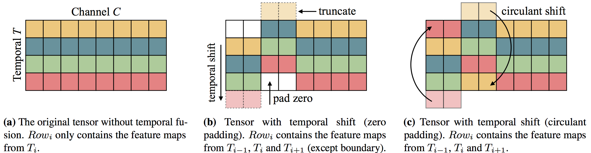

# TSM 视频分类模型

---
## 内容

- [模型简介](#模型简介)
- [数据准备](#数据准备)
- [模型训练](#模型训练)
- [模型评估](#模型评估)
- [模型推断](#模型推断)
- [参考论文](#参考论文)

## 模型简介

Temporal Shift Module是由MIT和IBM Watson AI Lab的Ji Lin，Chuang Gan和Song Han等人提出的通过时间位移来提高网络视频理解能力的模块，其位移操作原理如下图所示。

  
Temporal shift module

上图中矩阵表示特征图中的temporal和channel维度，通过将一部分的channel在temporal维度上向前位移一步，一部分的channel在temporal维度上向后位移一步，位移后的空缺补零。通过这种方式在特征图中引入temporal维度上的上下文交互，提高在时间维度上的视频理解能力。

TSM模型是将Temporal Shift Module插入到ResNet网络中构建的视频分类模型，本模型库实现版本为以ResNet-50作为主干网络的TSM模型。

详细内容请参考论文[Temporal Shift Module for Efficient Video Understanding](https://arxiv.org/abs/1811.08383v1)

## 数据准备

TSM的训练数据采用由DeepMind公布的Kinetics-400动作识别数据集。数据下载及准备请参考[数据说明](data/dataset/README.md)

### 小数据集验证

我们采用了较小的数据集进行动态图训练验证，分别进行了两组实验验证

1. 其中包括8k大小的训练数据和2k大小的测试数据。
2. 其中包括了十类大小的训练数据和测试数据。

## 模型训练

数据准备完毕后，可以通过如下两种方式启动训练：

    export CUDA_VISIBLE_DEVICES=0
    export FLAGS_fast_eager_deletion_mode=1
    export FLAGS_eager_delete_tensor_gb=0.0
    export FLAGS_fraction_of_gpu_memory_to_use=0.98
    python train.py --model_name=TSM \
                    --config=tsm.yaml \
                    --log_interval=10 \
                    --valid_interval=1 \
                    --use_gpu=True \
                    --save_dir=./data/checkpoints \
                    --fix_random_seed=False \
                    --pretrain=$PATH_TO_PRETRAIN_MODEL

    bash run.sh train TSM tsm.yaml

**数据读取器说明：** 模型读取Kinetics-400数据集中的`mp4`数据，每条数据抽取`seg_num`段，每段抽取1帧图像，对每帧图像做随机增强后，缩放至`target_size`。

**训练策略：**

*  采用Momentum优化算法训练，momentum=0.9
*  权重衰减系数为1e-4

## 模型评估

在从Kinetics400选取的十类的数据集下，动态图与静态图精度对比如下：

| |Top-1|Top-5|
|:-:|:-:|:-:|
|静态图|||
|动态图|||

## 参考论文

- [Temporal Shift Module for Efficient Video Understanding](https://arxiv.org/abs/1811.08383v1), Ji Lin, Chuang Gan, Song Han
