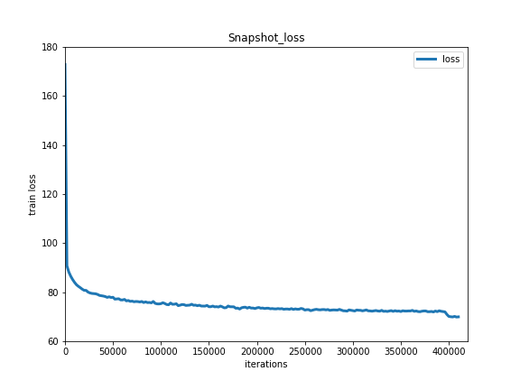
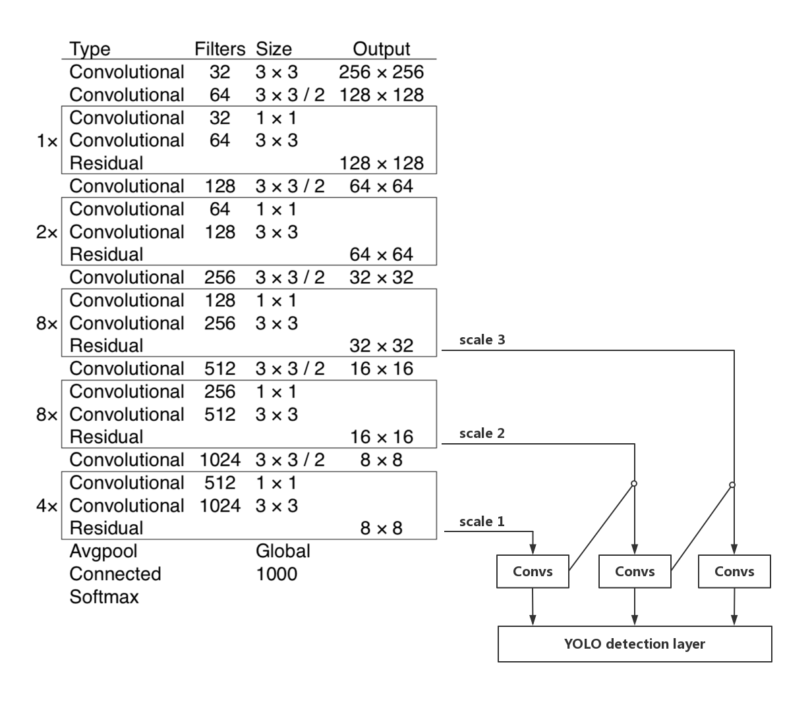

# YOLOv3 目标检测
---

本模型是[paddle_yolov3](https://github.com/PaddlePaddle/models/tree/develop/PaddleCV/yolov3)的动态图版本

## 内容

- [简介](#简介)
- [快速开始](#快速开始)
- [进阶使用](#进阶使用)
- [FAQ](#faq)
- [参考文献](#参考文献)
- [版本更新](#版本更新)
- [如何贡献代码](#如何贡献代码)
- [作者](#作者)

## 简介

[YOLOv3](https://arxiv.org/abs/1804.02767) 是由 [Joseph Redmon](https://arxiv.org/search/cs?searchtype=author&query=Redmon%2C+J) 和 [Ali Farhadi](https://arxiv.org/search/cs?searchtype=author&query=Farhadi%2C+A) 提出的单阶段检测器, 该检测器与达到同样精度的传统目标检测方法相比，推断速度能达到接近两倍.

在我们的实现版本中使用了 [Bag of Freebies for Training Object Detection Neural Networks](https://arxiv.org/abs/1902.04103v3) 中提出的图像增强和label smooth等优化方法，精度优于darknet框架的实现版本，在COCO-2017数据集上，达到`mAP(0.50:0.95)= 38.9`的精度，比darknet实现版本的精度(33.0)要高5.9.

同时，在推断速度方面，基于Paddle预测库的加速方法，推断速度比darknet高30%.

## 快速开始

### 安装

**安装[COCO-API](https://github.com/cocodataset/cocoapi)：**

训练前需要首先下载[COCO-API](https://github.com/cocodataset/cocoapi)：

    git clone https://github.com/cocodataset/cocoapi.git
    cd cocoapi/PythonAPI
    # if cython is not installed
    pip install Cython
    # Install into global site-packages
    make install
    # Alternatively, if you do not have permissions or prefer
    # not to install the COCO API into global site-packages
    python setup.py install --user

**安装[PaddlePaddle](https://github.com/PaddlePaddle/Paddle)：**

在当前目录下运行样例代码需要PadddlePaddle Fluid的v.1.7或以上的版本。如果你的运行环境中的PaddlePaddle低于此版本，请根据[安装文档](https://www.paddlepaddle.org.cn/documentation/docs/zh/beginners_guide/install/index_cn.html)中的说明来更新PaddlePaddle。

### 数据准备

**COCO数据集：**

在[MS-COCO数据集](http://cocodataset.org/#download)上进行训练，通过如下方式下载数据集。

```bash
python dataset/coco/download.py
```

数据目录结构如下：

```
dataset/coco/
├── annotations
│   ├── instances_train2014.json
│   ├── instances_train2017.json
│   ├── instances_val2014.json
│   ├── instances_val2017.json
|   ...
├── train2017
│   ├── 000000000009.jpg
│   ├── 000000580008.jpg
|   ...
├── val2017
│   ├── 000000000139.jpg
│   ├── 000000000285.jpg
|   ...

```

**自定义数据集：**

用户可使用自定义的数据集，我们推荐自定义数据集使用COCO数据集格式的标注，并可通过设置`--data_dir`或修改[reader.py](./reader.py#L39)指定数据集路径。使用COCO数据集格式标注时，目录结构可参考上述COCO数据集目录结构。

### 模型训练

**下载预训练模型：** 本示例提供DarkNet-53预训练[模型](https://paddlemodels.bj.bcebos.com/yolo/darknet53.pdparams )，该模型转换自作者提供的预训练权重[pjreddie/darknet](https://pjreddie.com/media/files/darknet53.conv.74)，采用如下命令下载预训练模型：

    sh ./weights/download.sh

**注意：** Windows用户可通过`./weights/download.sh`中的链接直接下载和解压。

通过设置`--pretrain` 加载预训练模型。同时在fine-tune时也采用该设置加载已训练模型。
请在训练前确认预训练模型下载与加载正确，否则训练过程中损失可能会出现NAN。

**开始训练：** 数据准备完毕后，可以通过如下的方式启动训练：

    python train.py \
       --model_save_dir=output/ \
       --pretrain=${path_to_pretrain_model} \
       --data_dir=${path_to_data} \
       --class_num=${category_num}

**多卡训练：**
动态图支持多进程多卡进行模型训练，启动方式：

首先通过设置`export CUDA_VISIBLE_DEVICES=0,1,2,3,4,5,6,7`指定8卡GPU训练。

`python -m paddle.distributed.launch --selected_gpus=0,1,2,3 --started_port=9999 train.py --batch_size=16 --use_data_parallel=1`

您也可以直接运行快速开始脚本`start_parall.sh`进行训练，默认使用4卡进行训练，每张卡的batch size为16
 
执行训练开始时，会得到类似如下输出，每次迭代打印的log数与指定卡数一致：

```
Iter 2, loss 9056.620443, time 3.21156
Iter 3, loss 7720.641968, time 1.63363
Iter 4, loss 6736.150391, time 2.70573

```

**注意：** YOLOv3模型总batch size为64，这里使用4 GPUs每GPU上batch size为16来训练

**模型设置：**

*  模型使用了基于COCO数据集生成的9个先验框：10x13，16x30，33x23，30x61，62x45，59x119，116x90，156x198，373x326
*  YOLOv3模型中，若预测框不是该点最佳匹配框但是和任一ground truth框的重叠大于`ignore_thresh=0.7`，则忽略该预测框的目标性损失

**训练策略：**

*  采用momentum优化算法训练YOLOv3，momentum=0.9。
*  学习率采用warmup算法，前4000个Iter学习率从0.0线性增加至0.001。在400000，450000个Iter时使用0.1,0.01乘子进行学习率衰减，最大训练500000个Iter。


下图为模型训练结果：
<p align="center">
<br />
Train Loss
</p>

### 模型评估

模型评估是指对训练完毕的模型评估各类性能指标。本示例采用[COCO官方评估](http://cocodataset.org/#detections-eval)


`eval.py`是评估模块的主要执行程序，调用示例如下：

    python eval.py \
        --dataset=coco2017 \
        --weights=${path_to_weights} \
        --class_num=${category_num}

- 通过设置`export CUDA_VISIBLE_DEVICES=0`指定单卡GPU评估。


## 进阶使用

### 背景介绍

传统目标检测方法通过两阶段检测，第一阶段生成预选框，第二阶段对预选框进行分类和位置坐标的调整，而YOLO将目标检测看做是对框位置和类别概率的一个单阶段回归问题，使得YOLO能达到近两倍的检测速度。而YOLOv3在YOLO的基础上引入的多尺度预测，使得YOLOv3网络对于小物体的检测精度大幅提高。

### 模型概览

[YOLOv3](https://arxiv.org/abs/1804.02767) 是一阶段End2End的目标检测器。其目标检测原理如下图所示:
<p align="center">
 <br />
YOLOv3检测原理
</p>

### 模型结构

YOLOv3将输入图像分成S\*S个格子，每个格子预测B个bounding box，每个bounding box预测内容包括: Location(x, y, w, h)、Confidence Score和C个类别的概率，因此YOLOv3输出层的channel数为B\*(5 + C)。YOLOv3的loss函数也有三部分组成：Location误差，Confidence误差和分类误差。

YOLOv3的网络结构如下图所示:
<p align="center">
 <br />
YOLOv3网络结构
</p>

YOLOv3 的网络结构由基础特征提取网络、multi-scale特征融合层和输出层组成。

1. 特征提取网络。YOLOv3使用 [DarkNet53](https://arxiv.org/abs/1612.08242)作为特征提取网络：DarkNet53 基本采用了全卷积网络，用步长为2的卷积操作替代了池化层，同时添加了 Residual 单元，避免在网络层数过深时发生梯度弥散。

2. 特征融合层。为了解决之前YOLO版本对小目标不敏感的问题，YOLOv3采用了3个不同尺度的特征图来进行目标检测，分别为13\*13,26\*26,52\*52,用来检测大、中、小三种目标。特征融合层选取 DarkNet 产出的三种尺度特征图作为输入，借鉴了FPN(feature pyramid networks)的思想，通过一系列的卷积层和上采样对各尺度的特征图进行融合。

3. 输出层。同样使用了全卷积结构，其中最后一个卷积层的卷积核个数是255：3\*(80+4+1)=255，3表示一个grid cell包含3个bounding box，4表示框的4个坐标信息，1表示Confidence Score，80表示COCO数据集中80个类别的概率。


## FAQ

**Q:** 我使用单GPU训练，训练过程中`loss=nan`，这是为什么？  
**A:** YOLOv3中`learning_rate=0.001`的设置是针对总batch size为64的情况，若用户的batch size小于该值，建议调小学习率。

**Q:** 我训练YOLOv3速度比较慢，要怎么提速？  
**A:** YOLOv3的数据增强比较复杂，速度比较慢，可通过在[reader.py](./reader.py#L284)中增加数据读取的进程数来提速。若用户是进行fine-tune，也可将`--no_mixup_iter`设置大于`--max_iter`的值来禁用mixup提升速度。

**Q:** 我使用YOLOv3训练两个类别的数据集，训练`loss=nan`或推断结果不符合预期，这是为什么？  
**A:** `--label_smooth`参数会把所有正例的目标值设置为`1-1/class_num`，负例的目标值设为`1/class_num`，当`class_num`较小时，这个操作影响过大，可能会出现`loss=nan`或者训练结果错误，类别数较小时建议设置`--label_smooth=False`。若使用Paddle Fluid v1.5及以上版本，我们在C++代码中对这种情况作了保护，设置`--label_smooth=True`也不会出现这些问题。

## 参考文献

- [You Only Look Once: Unified, Real-Time Object Detection](https://arxiv.org/abs/1506.02640v5), Joseph Redmon, Santosh Divvala, Ross Girshick, Ali Farhadi.
- [YOLOv3: An Incremental Improvement](https://arxiv.org/abs/1804.02767v1), Joseph Redmon, Ali Farhadi.
- [Bag of Freebies for Training Object Detection Neural Networks](https://arxiv.org/abs/1902.04103v3), Zhi Zhang, Tong He, Hang Zhang, Zhongyue Zhang, Junyuan Xie, Mu Li.

## 版本更新

- 12/2019, 新增YOLOv3动态图模型


## 如何贡献代码

如果你可以修复某个issue或者增加一个新功能，欢迎给我们提交PR。如果对应的PR被接受了，我们将根据贡献的质量和难度进行打分（0-5分，越高越好）。如果你累计获得了10分，可以联系我们获得面试机会或者为你写推荐信。

## 作者

- [heavengate](https://github.com/heavengate)
- [tink2123](https://github.com/tink2123)
