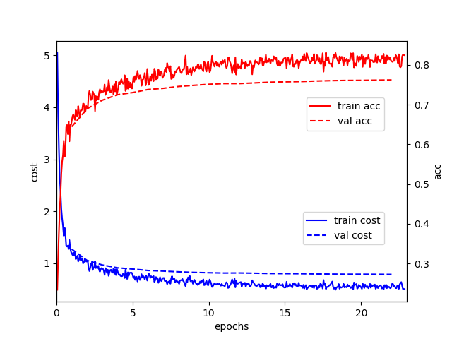

运行本目录下的程序示例需要使用 PaddlePaddle v0.14及以上版本。如果您的 PaddlePaddle 安装版本低于此要求，请按照[安装文档](http://www.paddlepaddle.org/docs/develop/documentation/zh/build_and_install/pip_install_cn.html)中的说明更新 PaddlePaddle 安装版本。

---

DeepASR (Deep Automatic Speech Recognition) 是一个基于PaddlePaddle FLuid与kaldi的语音识别系统。其利用Fluid框架完成声学模型的配置和训练，并集成kaldi的解码器。旨在方便已对kaldi的较为熟悉的用户实现语音识别中声学模型的快速、大规模训练，并利用kaldi完成复杂的语音数据预处理和最终的解码过程。

### 目录
- [安装](#installation)
- [数据预处理](#data-reprocessing)
- [模型训练](#training)
- [训练过程性能分析](#perf-profiling)
- [预测和解码](#infer-decoding)
- [Aishell示例](#aishell-example)
- [如何贡献更多的实例](#how-to-contrib)

### 安装

#### kaldi
DeepASR所用的解码器依赖于[kaldi](https://github.com/kaldi-asr/kaldi)环境, 按其中的命令安装好kaldi后设置环境变量：

```shell
export KALDI_ROOT=<kaldi的安装路径>

```
#### 解码器的安装
进入解码器源码所在的目录

```shell
cd models/fluid/DeepASR/decoder
```
运行安装脚本

```shell
sh setup.sh
```
 即完成解码器的编译和安装

### 数据预处理

### 声学模型的训练

可选择在CPU或GPU模式下进行声学模型的训练，例如在GPU模式下的训练

```shell
CUDA_VISIBLE_DEVICES=0,1,2,3 python -u train.py \
                   --train_feature_lst train_feature.lst \
                   --train_label_lst train_label.lst \
                   --val_feature_lst val_feature.lst \
                   --val_label_lst val_label.lst \
                   --mean_var global_mean_var \
                   --parallel
```
实际训练过程中要正确指定建模单元大小、学习率等重要参数。关于这些参数的说明，请运行

```shell
python train.py --help
```
获取更多信息。

### 训练过程性能分析

获取每个op的执行时间

```shell
CUDA_VISIBLE_DEVICES=0 python -u tools/profile.py \
                   --train_feature_lst train_feature.lst \
                   --train_label_lst train_label.lst \
                   --val_feature_lst val_feature.lst \
                   --val_label_lst val_label.lst \
                   --mean_var global_mean_var
```


### 预测和解码

```
CUDA_VISIBLE_DEVICES=0,1,2,3 python -u infer_by_ckpt.py \
                        --batch_size 96  \
                        --checkpoint deep_asr.pass_1.checkpoint \
                        --infer_feature_lst test_feature.lst  \
                        --infer_label_lst test_label.lst  \
                        --mean_var global_mean_var \
                        --parallel
```

### Aishell 实例

本小节以Aishell数据为例，展示如何完成从数据预处理到解码输出。[Aishell数据集](http://www.aishelltech.com/kysjcp)
```
cd examples/aishell
```

提供已经预处理好的数据集供下载

```
sh prepare_data.sh
```

下载数据完成后，执行训练

```
sh train.sh
```

训练过程中损失和精度的变化曲线如下图所示

<p align="center">
 <br />
Aishell数据集上训练声学模型的学习曲线
</p>

执行预测

```
sh infer_by_ckpt.sh
```

评估误差

```
sh score_cer.sh
```

利用经过20轮左右训练的声学模型，可以在Aishell的测试集上得到CER约10%的识别结果。


### 如何贡献更多的实例

欢迎贡献更多的实例
