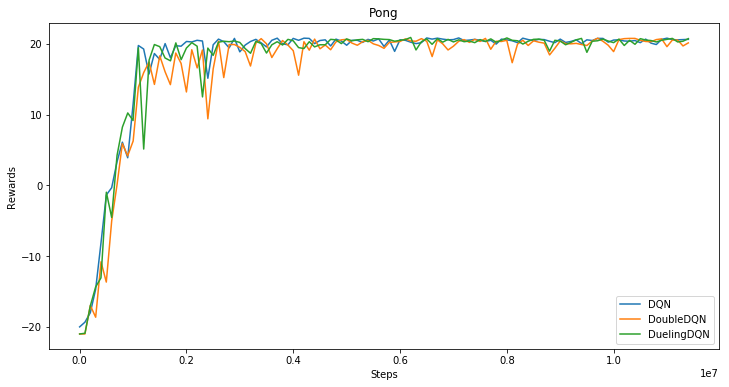

# 基于PaddlePaddle的Fluid版本复现DQN, DoubleDQN, DuelingDQN三个模型

+ DQN模型： 
[Human-level Control Through Deep Reinforcement Learning](http://www.nature.com/nature/journal/v518/n7540/full/nature14236.html)
+ DoubleDQN模型：
[Deep Reinforcement Learning with Double Q-Learning](https://www.aaai.org/ocs/index.php/AAAI/AAAI16/paper/viewPaper/12389)
+ DuelingDQN模型：
[Dueling Network Architectures for Deep Reinforcement Learning](http://proceedings.mlr.press/v48/wangf16.html)

# Atari游戏表现
## [Atari游戏介绍](https://gym.openai.com/envs/#atari)

+ Pong游戏训练结果


# 使用教程
+ 依赖:
    + python2.7
    + gym
    + tqdm
    + opencv-python
    + paddlepaddle-gpu==0.12.0 
    + ale_python_interface

+ 下载依赖：
    + 安装PaddlePaddle
    使用官方提供的PaddlePaddle编译环境和源码，通过源码编译安装
        1. 下载源码：git clone https://github.com/PaddlePaddle/Paddle.git
        2. 获取编译环境docker：docker pull docker.paddlepaddlehub.com/paddle:latest-dev
        3. 在该环境中编译PaddlePaddle源码，并安装python包
    + 下载其它依赖
    ```
    pip install -r requirement.txt 
    pip install gym[atari]
    ```
    安装ale_python_interface可以参考：https://github.com/mgbellemare/Arcade-Learning-Environment

+ 训练模型：
    ```
    # 使用GPU训练Pong游戏（默认使用DQN模型）
    python train.py --rom ./rom_files/pong.bin --use_cuda

    # 训练DoubleDQN模型
    python train.py --rom ./rom_files/pong.bin --use_cuda --alg DoubleDQN

    # 训练DuelingDQN模型
    python train.py --rom ./rom_files/pong.bin --use_cuda --alg DuelingDQN
    ```

    训练更多游戏，可以下载游戏rom从[这里](https://github.com/openai/atari-py/tree/master/atari_py/atari_roms)

+ 测试模型： 
    ```
    # Play the game with saved model and calculate the average rewards
    # 使用训练过程中保存的最好模型玩游戏，以及计算平均奖励（rewards） 
    python play.py --rom ./rom_files/pong.bin --use_cuda --model_path ./saved_model/DQN-pong

    # 以可视化的形式来玩游戏
    python play.py --rom ./rom_files/pong.bin --use_cuda --model_path ./saved_model/DQN-pong --viz 0.01
    ```
