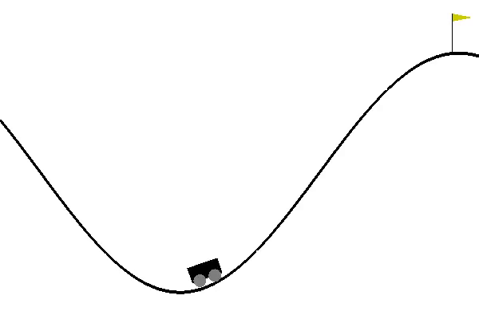

[//]:<>()

# Reproduce DQN, DoubleDQN, DuelingDQN model
+ DQN in:
[Human-level Control Through Deep Reinforcement Learning](http://www.nature.com/nature/journal/v518/n7540/full/nature14236.html)
+ DoubleDQN in:
[Deep Reinforcement Learning with Double Q-Learning](https://www.aaai.org/ocs/index.php/AAAI/AAAI16/paper/viewPaper/12389)
+ DuelingDQN in:
[Dueling Network Architectures for Deep Reinforcement Learning](http://proceedings.mlr.press/v48/wangf16.html)

# Mountain-CAR benchmark & performance
[MountainCar-v0](https://gym.openai.com/envs/MountainCar-v0/)

A car is on a one-dimensional track, positioned between two "mountains". The goal is to drive up the mountain on the right; however, the car's engine is not strong enough to scale the mountain in a single pass. Therefore, the only way to succeed is to drive back and forth to build up momentum.


# How to use
+ Dependencies:
   + python2.7
   + gym
   + tqdm
   + paddle-fluid
+ Start Training:
   ```
   # use mountain-car enviroment as default
   python DQN.py

   # use other enviorment
   python DQN.py --env CartPole-v0
   ```
