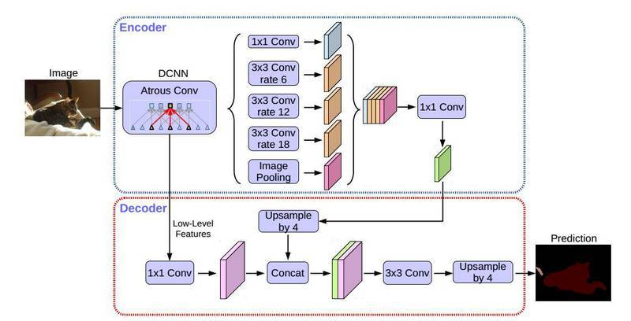

DeepLab运行本目录下的程序示例需要使用PaddlePaddle Fluid v1.0.0版本或以上。如果您的PaddlePaddle安装版本低于此要求，请按照安装文档中的说明更新PaddlePaddle安装版本，如果使用GPU，该程序需要使用cuDNN v7版本。


## 代码结构
```
├── models.py # 网络结构定义脚本
├── train.py   # 训练任务脚本
├── eval.py    # 评估脚本
└── reader.py    # 定义通用的函数以及数据预处理脚本
```

## 简介

DeepLabv3+ 是DeepLab语义分割系列网络的最新作，其前作有 DeepLabv1，DeepLabv2, DeepLabv3,
在最新作中，DeepLab的作者通过encoder-decoder进行多尺度信息的融合，同时保留了原来的空洞卷积和ASSP层，
其骨干网络使用了Xception模型，提高了语义分割的健壮性和运行速率，在 PASCAL VOC 2012 dataset取得新的state-of-art performance，89.0mIOU。




## 数据准备


本文采用Cityscape数据集，请前往[Cityscape官网](https://www.cityscapes-dataset.com)注册下载。
下载以后的数据目录结构如下
```
data/cityscape/
|-- gtFine
|   |-- test
|   |-- train
|   `-- val
|-- leftImg8bit
    |-- test
    |-- train
    `-- val
```

# 预训练模型准备

如果需要从头开始训练模型，用户需要下载我们的初始化模型
```
wget http://paddlemodels.cdn.bcebos.com/deeplab/deeplabv3plus_xception65_initialize.tar.gz
tar -xf deeplabv3plus_xception65_initialize.tar.gz && rm deeplabv3plus_xception65_initialize.tar.gz
```
如果需要最终训练模型进行fine tune或者直接用于预测，请下载我们的最终模型
```
wget http://paddlemodels.cdn.bcebos.com/deeplab/deeplabv3plus.tar.gz
tar -xf deeplabv3plus.tar.gz && rm deeplabv3plus.tar.gz
```


## 模型训练与预测

### 训练
执行以下命令进行训练，同时指定weights的保存路径，初始化路径，以及数据存放位置:
```
python ./train.py \
    --batch_size=1 \
    --train_crop_size=769 \
    --total_step=50 \
    --init_weights_path=$INIT_WEIGHTS_PATH \
    --save_weights_path=$SAVE_WEIGHTS_PATH \
    --dataset_path=$DATASET_PATH
```
使用以下命令获得更多使用说明：
```
python train.py --help
```
以上命令用于测试训练过程是否正常，仅仅迭代了50次并且使用了1的batch size，如果需要复现
原论文的实验，请使用以下设置：
```
python ./train.py \
    --batch_size=8 \
    --parallel=true \
    --train_crop_size=769 \
    --total_step=90000 \
    --init_weights_path=deeplabv3plus_xception65_initialize.params \
    --save_weights_path=output \
    --dataset_path=$DATASET_PATH
```

### 测试
执行以下命令在`Cityscape`测试数据集上进行测试：
```
python ./eval.py \
    --init_weights=deeplabv3plus.params \
    --dataset_path=$DATASET_PATH
```
需要通过选项`--model_path`指定模型文件。测试脚本的输出的评估指标为mean IoU。


## 实验结果
训练完成以后，使用`eval.py`在验证集上进行测试，得到以下结果：
```
load from: ../models/deeplabv3p
total number 500
step: 500, mIoU: 0.7873
```

## 其他信息
|数据集 | pretrained model | trained model | mean IoU
|---|---|---|---|
|CityScape | [deeplabv3plus_xception65_initialize.tar.gz](http://paddlemodels.cdn.bcebos.com/deeplab/deeplabv3plus_xception65_initialize.tar.gz) | [deeplabv3plus.tar.gz](http://paddlemodels.cdn.bcebos.com/deeplab/deeplabv3plus.tar.gz) | 0.7873 |

## 参考

- [Encoder-Decoder with Atrous Separable Convolution for Semantic Image Segmentation](https://arxiv.org/abs/1802.02611)
