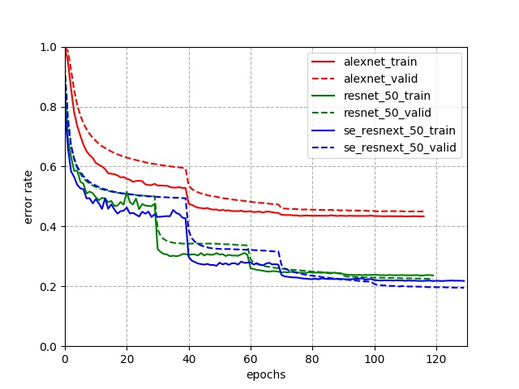

# 图像分类以及模型库
图像分类是计算机视觉的重要领域，它的目标是将图像分类到预定义的标签。近期，需要研究者提出很多不同种类的神经网络，并且极大的提升了分类算法的性能。本页将介绍如何使用PaddlePaddle进行图像分类，包括[数据准备](#data-preparation)、 [训练](#training-a-model)、[参数微调](#finetuning)、[模型评估](#evaluation)以及[模型推断](#inference)。

---
## 内容
- [安装](#installation)
- [数据准备](#data-preparation)
- [模型训练](#training-a-model)
- [参数微调](#finetuning)
- [模型评估](#evaluation)
- [模型推断](#inference)
- [已有模型及其性能](#supported-models)

## 安装

在当前目录下运行样例代码需要PadddlePaddle Fluid的v0.13.0或以上的版本。如果你的运行环境中的PaddlePaddle低于此版本，请根据安装文档中的说明来更新PaddlePaddle。

## 数据准备

下面给出了ImageNet分类任务的样例，首先，通过如下的方式进行数据的准备：
```
cd data/ILSVRC2012/
sh download_imagenet2012.sh
```
在```download_imagenet2012.sh```脚本中，通过下面三步来准备数据：

**步骤一：** 首先在```image-net.org```网站上完成注册，用于获得一对```Username```和```AccessKey```。

**步骤二：** 从ImageNet官网下载ImageNet-2012的图像数据。训练以及验证数据集会分别被下载到"train" 和 "val" 目录中。请注意，ImaegNet数据的大小超过40GB，下载非常耗时；已经自行下载ImageNet的用户可以直接将数据组织放置到```data/ILSVRC2012```。

**步骤三：** 下载训练与验证集合对应的标签文件。下面两个文件分别包含了训练集合与验证集合中图像的标签：

* *train_list.txt*: ImageNet-2012训练集合的标签文件，每一行采用"空格"分隔图像路径与标注，例如：
```
train/n02483708/n02483708_2436.jpeg 369
train/n03998194/n03998194_7015.jpeg 741
train/n04523525/n04523525_38118.jpeg 884
train/n04596742/n04596742_3032.jpeg 909
train/n03208938/n03208938_7065.jpeg 535
...
```
* *val_list.txt*: ImageNet-2012验证集合的标签文件，每一行采用"空格"分隔图像路径与标注，例如：
```
val/ILSVRC2012_val_00000001.jpeg 65
val/ILSVRC2012_val_00000002.jpeg 970
val/ILSVRC2012_val_00000003.jpeg 230
val/ILSVRC2012_val_00000004.jpeg 809
val/ILSVRC2012_val_00000005.jpeg 516
...
```

## 模型训练

数据准备完毕后，可以通过如下的方式启动训练：
```
python train.py \
       --model=SE_ResNeXt50_32x4d \
       --batch_size=32 \
       --total_images=1281167 \
       --class_dim=1000 \
       --image_shape=3,224,224 \
       --model_save_dir=output/ \
       --with_mem_opt=False \
       --lr_strategy=piecewise_decay \
       --lr=0.1
```
**参数说明：**
* **model**: name model to use. Default: "SE_ResNeXt50_32x4d".
* **num_epochs**: the number of epochs. Default: 120.
* **batch_size**: the size of each mini-batch. Default: 256.
* **use_gpu**: whether to use GPU or not. Default: True.
* **total_images**: total number of images in the training set. Default: 1281167.
* **class_dim**: the class number of the classification task. Default: 1000.
* **image_shape**: input size of the network. Default: "3,224,224".
* **model_save_dir**: the directory to save trained model. Default: "output".
* **with_mem_opt**: whether to use memory optimization or not. Default: False.
* **lr_strategy**: learning rate changing strategy. Default: "piecewise_decay".
* **lr**: initialized learning rate. Default: 0.1.
* **pretrained_model**: model path for pretraining. Default: None.
* **checkpoint**: the checkpoint path to resume. Default: None.
* **model_category**: the category of models, ("models"|"models_name"). Default:"models".

**数据读取器说明：** 数据读取器定义在```reader.py```和```reader_cv2.py```中, 一般, CV2 reader可以提高数据读取速度, reader(PIL)可以得到相对更高的精度, 在[训练阶段](#training-a-model), 默认采用的增广方式是随机裁剪与水平翻转, 而在[评估](#inference)与[推断](#inference)阶段用的默认方式是中心裁剪。当前支持的数据增广方式有：
* 旋转
* 颜色抖动
* 随机裁剪
* 中心裁剪
* 长宽调整
* 水平翻转

**训练曲线：** 通过训练过程中的日志可以画出训练曲线。举个例子，训练AlexNet出来的日志如下所示：
```
End pass 1, train_loss 6.23153877258, train_acc1 0.0150696625933, train_acc5 0.0552518665791, test_loss 5.41981744766, test_acc1 0.0519132651389, test_acc5 0.156150355935
End pass 2, train_loss 5.15442800522, train_acc1 0.0784279331565, train_acc5 0.211050540209, test_loss 4.45795249939, test_acc1 0.140469551086, test_acc5 0.333163291216
End pass 3, train_loss 4.51505613327, train_acc1 0.145300447941, train_acc5 0.331567406654, test_loss 3.86548018456, test_acc1 0.219443559647, test_acc5 0.446448504925
End pass 4, train_loss 4.12735557556, train_acc1 0.19437250495, train_acc5 0.405713528395, test_loss 3.56990146637, test_acc1 0.264536827803, test_acc5 0.507190704346
End pass 5, train_loss 3.87505435944, train_acc1 0.229518383741, train_acc5 0.453582793474, test_loss 3.35345435143, test_acc1 0.297349333763, test_acc5 0.54753267765
End pass 6, train_loss 3.6929500103, train_acc1 0.255628824234, train_acc5 0.487188398838, test_loss 3.17112898827, test_acc1 0.326953113079, test_acc5 0.581780135632
End pass 7, train_loss 3.55882954597, train_acc1 0.275381118059, train_acc5 0.511990904808, test_loss 3.03736782074, test_acc1 0.349035382271, test_acc5 0.606293857098
End pass 8, train_loss 3.45595097542, train_acc1 0.291462600231, train_acc5 0.530815005302, test_loss 2.96034455299, test_acc1 0.362228929996, test_acc5 0.617390751839
End pass 9, train_loss 3.3745200634, train_acc1 0.303871691227, train_acc5 0.545210540295, test_loss 2.93932366371, test_acc1 0.37129303813, test_acc5 0.623573005199
...
```

下图给出了AlexNet、ResNet50以及SE-ResNeXt-50网络的错误率曲线：
<p align="center">
 <br />
训练集合与验证集合上的错误率曲线
</p>

## 混合精度训练

可以通过开启`--fp16 1`启动混合精度训练，这样训练过程会使用float16数据，并输出float32的模型参数（"master"参数）。您可能需要同时传入`--scale_loss`来解决fp16训练的精度问题，通常传入`--scale_loss 8.0`即可。

注意，目前混合精度训练不能和内存优化功能同时使用，所以需要传`--with_mem_opt 0`这个参数来禁用内存优化功能。

## 参数微调

参数微调是指在特定任务上微调已训练模型的参数。通过初始化```path_to_pretrain_model```，微调一个模型可以采用如下的命令：
```
python train.py
       --model=SE_ResNeXt50_32x4d \
       --pretrained_model=${path_to_pretrain_model} \
       --batch_size=32 \
       --total_images=1281167 \
       --class_dim=1000 \
       --image_shape=3,224,224 \
       --model_save_dir=output/ \
       --with_mem_opt=True \
       --lr_strategy=piecewise_decay \
       --lr=0.1
```

## 模型评估
模型评估是指对训练完毕的模型评估各类性能指标。用户可以下载[预训练模型](#supported-models)并且设置```path_to_pretrain_model```为模型所在路径。运行如下的命令，可以获得一个模型top-1/top-5精度:
```
python eval.py \
       --model=SE_ResNeXt50_32x4d \
       --batch_size=32 \
       --class_dim=1000 \
       --image_shape=3,224,224 \
       --with_mem_opt=True \
       --pretrained_model=${path_to_pretrain_model}
```

根据这个评估程序的配置，输出日志形式如下：
```
Testbatch 0,loss 2.1786134243, acc1 0.625,acc5 0.8125,time 0.48 sec
Testbatch 10,loss 0.898496925831, acc1 0.75,acc5 0.9375,time 0.51 sec
Testbatch 20,loss 1.32524681091, acc1 0.6875,acc5 0.9375,time 0.37 sec
Testbatch 30,loss 1.46830511093, acc1 0.5,acc5 0.9375,time 0.51 sec
Testbatch 40,loss 1.12802267075, acc1 0.625,acc5 0.9375,time 0.35 sec
Testbatch 50,loss 0.881597697735, acc1 0.8125,acc5 1.0,time 0.32 sec
Testbatch 60,loss 0.300163716078, acc1 0.875,acc5 1.0,time 0.48 sec
Testbatch 70,loss 0.692037761211, acc1 0.875,acc5 1.0,time 0.35 sec
Testbatch 80,loss 0.0969972759485, acc1 1.0,acc5 1.0,time 0.41 sec
...
```


## 模型推断
模型推断可以获取一个模型的预测分数或者图像的特征：
```
python infer.py \
       --model=SE_ResNeXt50_32x4d \
       --batch_size=32 \
       --class_dim=1000 \
       --image_shape=3,224,224 \
       --with_mem_opt=True \
       --pretrained_model=${path_to_pretrain_model}
```
输出的预测结果包括最高分数(未经过softmax处理)以及相应的预测标签。
```
Test-0-score: [13.168352], class [491]
Test-1-score: [7.913302], class [975]
Test-2-score: [16.959702], class [21]
Test-3-score: [14.197695], class [383]
Test-4-score: [12.607652], class [878]
Test-5-score: [17.725458], class [15]
Test-6-score: [12.678599], class [118]
Test-7-score: [12.353498], class [505]
Test-8-score: [20.828007], class [747]
Test-9-score: [15.135801], class [315]
Test-10-score: [14.585114], class [920]
Test-11-score: [13.739927], class [679]
Test-12-score: [15.040644], class [386]
...
```

## 已有模型及其性能
Models包括两种模型：带有参数名字的模型，和不带有参数名字的模型。通过设置 ```model_category = models_name```来训练带有参数名字的模型。

表格中列出了在"models"目录下支持的神经网络种类，并且给出了已完成训练的模型在ImageNet-2012验证集合上的top-1/top-5精度；如无特征说明，训练模型的初始学习率为```0.1```，每隔预定的epochs会下降```0.1```。预训练模型可以通过点击相应模型的名称进行下载。


- Released models: specify parameter names

|model | top-1/top-5 accuracy(PIL)| top-1/top-5 accuracy(CV2) |
|- |:-: |:-:|
|[AlexNet](http://paddle-imagenet-models-name.bj.bcebos.com/AlexNet_pretrained.zip) | 56.71%/79.18% | 55.88%/78.65% |
|[VGG11](https://paddle-imagenet-models-name.bj.bcebos.com/VGG11_pretrained.zip) | 69.22%/89.09% | 69.01%/88.90% |
|[VGG13](https://paddle-imagenet-models-name.bj.bcebos.com/VGG13_pretrained.zip) | 70.14%/89.48% | 69.83%/89.13% |
|[VGG16](https://paddle-imagenet-models-name.bj.bcebos.com/VGG16_pretrained.zip) | 72.08%/90.63% | 71.65%/90.57% |
|[VGG19](https://paddle-imagenet-models-name.bj.bcebos.com/VGG19_pretrained.zip) | 72.56%/90.83% | 72.32%/90.98% |
|[MobileNetV1](http://paddle-imagenet-models-name.bj.bcebos.com/MobileNetV1_pretrained.zip) | 70.91%/89.54% | 70.51%/89.35% |
|[MobileNetV2](https://paddle-imagenet-models-name.bj.bcebos.com/MobileNetV2_pretrained.zip) | 71.90%/90.55% | 71.53%/90.41% |
|[ResNet50](http://paddle-imagenet-models-name.bj.bcebos.com/ResNet50_pretrained.zip) | 76.35%/92.80% | 76.22%/92.92% |
|[ResNet101](http://paddle-imagenet-models-name.bj.bcebos.com/ResNet101_pretrained.zip) | 77.49%/93.57% | 77.56%/93.64% |
|[ResNet152](https://paddle-imagenet-models-name.bj.bcebos.com/ResNet152_pretrained.zip) | 78.12%/93.93% | 77.92%/93.87% |
|[SE_ResNeXt50_32x4d](https://paddle-imagenet-models-name.bj.bcebos.com/SE_ResNext50_32x4d_pretrained.zip) | 78.50%/94.01% | 78.44%/93.96% |
|[SE_ResNeXt101_32x4d](https://paddle-imagenet-models-name.bj.bcebos.com/SE_ResNeXt101_32x4d_pretrained.zip) | 79.26%/94.22% | 79.12%/94.20% |

- Released models: not specify parameter names

|model | top-1/top-5 accuracy(PIL)| top-1/top-5 accuracy(CV2) |
|- |:-: |:-:|
|[ResNet152](http://paddle-imagenet-models.bj.bcebos.com/ResNet152_pretrained.zip) | 78.18%/93.93% | 78.11%/94.04% |
|[SE_ResNeXt50_32x4d](http://paddle-imagenet-models.bj.bcebos.com/se_resnext_50_model.tar) | 78.32%/93.96% | 77.58%/93.73% |
