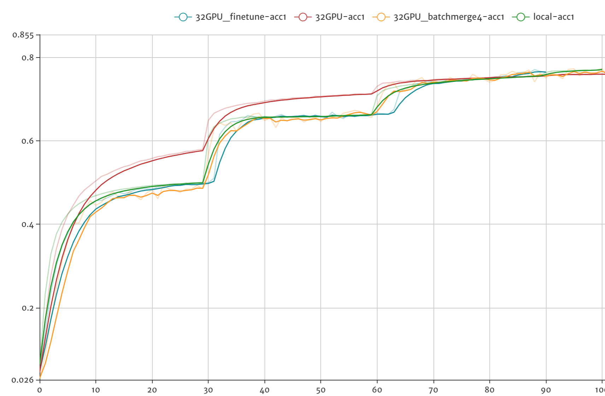

# Distributed Image Classification Models Training

This folder contains implementations of **Image Classification Models**, they are designed to support
large-scaled distributed training with two distributed mode: parameter server mode and NCCL2(Nvidia NCCL2 communication library) collective mode.

## Getting Started

Before getting started, please make sure you have go throught the imagenet [Data Preparation](../README.md#data-preparation).

1. The entrypoint file is `dist_train.py`, some important flags are as follows:

    - `model`, the model to run with, default is the fine tune model `DistResnet`.
    - `batch_size`, the batch_size per device.
    - `update_method`, specify the update method, can choose from local, pserver or nccl2.
    - `device`, use CPU or GPU device.
    - `gpus`, the GPU device count that the process used.

    you can check out more details of the flags by `python dist_train.py --help`.

1. Runtime configurations

    We use the environment variable to distinguish the different training role of a distributed training job.

    - `PADDLE_TRAINING_ROLE`, the current training role, should be in [PSERVER, TRAINER].
    - `PADDLE_TRAINERS`, the trainer count of a job.
    - `PADDLE_CURRENT_IP`, the current instance IP.
    - `PADDLE_PSERVER_IPS`, the parameter server IP list, separated by ","  only be used with update_method is pserver.
    - `PADDLE_TRAINER_ID`, the unique trainer ID of a job, the ranging is [0, PADDLE_TRAINERS).
    - `PADDLE_PSERVER_PORT`, the port of the parameter pserver listened on.
    - `PADDLE_TRAINER_IPS`, the trainer IP list, separated by ",", only be used with upadte_method is nccl2.

### Parameter Server Mode

In this example, we launched 4 parameter server instances and 4 trainer instances in the cluster:

1. launch parameter server process

    ``` bash
    PADDLE_TRAINING_ROLE=PSERVER \
    PADDLE_TRAINERS=4 \
    PADDLE_PSERVER_IPS=192.168.0.100,192.168.0.101,192.168.0.102,192.168.0.103 \
    PADDLE_CURRENT_IP=192.168.0.100 \
    PADDLE_PSERVER_PORT=7164 \
    python dist_train.py \
        --model=DistResnet \
        --batch_size=32 \
        --update_method=pserver \
        --device=CPU \
        --data_dir=../data/ILSVRC2012
    ```

1. launch trainer process

    ``` bash
    PADDLE_TRAINING_ROLE=TRAINER \
    PADDLE_TRAINERS=4 \
    PADDLE_PSERVER_IPS=192.168.0.100,192.168.0.101,192.168.0.102,192.168.0.103 \
    PADDLE_TRAINER_ID=0 \
    PADDLE_PSERVER_PORT=7164 \
    python dist_train.py \
        --model=DistResnet \
        --batch_size=32 \
        --update_method=pserver \
        --device=GPU \
        --data_dir=../data/ILSVRC2012
    ```

### NCCL2 Collective Mode

1. launch trainer process

    ``` bash
    PADDLE_TRAINING_ROLE=TRAINER \
    PADDLE_TRAINERS=4 \
    PADDLE_TRAINER_IPS=192.168.0.100,192.168.0.101,192.168.0.102,192.168.0.103 \
    PADDLE_TRAINER_ID=0 \
    python dist_train.py \
        --model=DistResnet \
        --batch_size=32 \
        --update_method=nccl2 \
        --device=GPU \
        --data_dir=../data/ILSVRC2012
    ```

### Visualize the Training Process

It's easy to draw the learning curve accroding to the training logs, for example,
the logs of ResNet50 is as follows:

``` text
Pass 0, batch 0, loss 7.0336914, accucacys: [0.0, 0.00390625]
Pass 0, batch 1, loss 7.094781, accucacys: [0.0, 0.0]
Pass 0, batch 2, loss 7.007068, accucacys: [0.0, 0.0078125]
Pass 0, batch 3, loss 7.1056547, accucacys: [0.00390625, 0.00390625]
Pass 0, batch 4, loss 7.133543, accucacys: [0.0, 0.0078125]
Pass 0, batch 5, loss 7.3055463, accucacys: [0.0078125, 0.01171875]
Pass 0, batch 6, loss 7.341838, accucacys: [0.0078125, 0.01171875]
Pass 0, batch 7, loss 7.290557, accucacys: [0.0, 0.0]
Pass 0, batch 8, loss 7.264951, accucacys: [0.0, 0.00390625]
Pass 0, batch 9, loss 7.43522, accucacys: [0.00390625, 0.00390625]
```

The below figure shows top 1 train accuracy for local training with 8 GPUs and distributed training
with 32 GPUs, and also distributed training with batch merge feature turned on. Note that the
red curve is train with origin model configuration, which do not have warmup and some detailed modifications.

For distributed training with 32GPUs using `--model DistResnet` we can achieve test accuracy 75.5% after
90 passes of training (the test accuracy is not shown in below figure).

<p align="center">
 <br/>
Training top-1 accuracy curves
</p>

### Finetuning for Distributed Training

The default resnet50 distributed training config is based on this paper: https://arxiv.org/pdf/1706.02677.pdf

- use `--model DistResnet`
- we use 32 P40 GPUs with 4 Nodes, each have 8 GPUs
- we set `batch_size=32` for each GPU, in `batch_merge=on` case, we repeat 4 times before communicating with pserver.
- learning rate start from 0.1 and warm up to 0.4 in 5 passes(because we already have gradient merging,
  so we only need to linear scale up to trainer count) using 4 nodes.
- using batch_merge (`--multi_batch_repeat 4`) can make better use of GPU computing power and increase the
  total training throughput. Because in the fine-tune configuration, we have to use `batch_size=32` per GPU,
  and recent GPU is so fast that the communication between nodes may delay the total speed. In batch_merge mode
  we run several batches forward and backward computation, then merge the gradients and send to pserver for
  optimization, we use different batch norm mean and variance variable in each repeat so that adding repeats
  behaves the same as adding more GPUs.


### Performance

TBD
