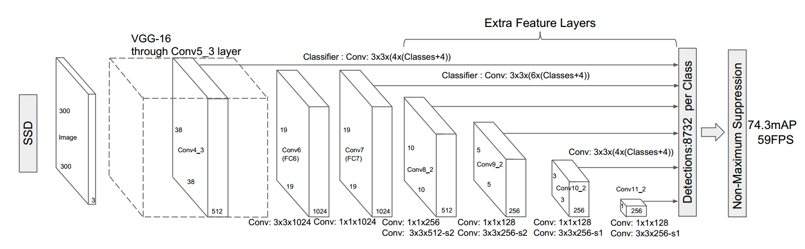
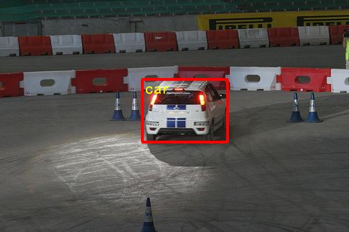
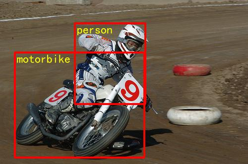
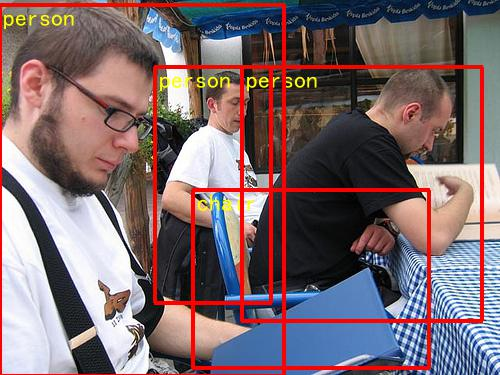

## SSD Object Detection

## Table of Contents
- [Introduction](#introduction)
- [Data Preparation](#data-preparation)
- [Train](#train)
- [Evaluate](#evaluate)
- [Infer and Visualize](#infer-and-visualize)
- [Released Model](#released-model)

### Introduction

[Single Shot MultiBox Detector (SSD)](https://arxiv.org/abs/1512.02325) framework for object detection can be categorized as a single stage detector. A single stage detector simplifies object detection as a regression problem, which directly predicts the bounding boxes and class probabilities without region proposal. SSD further makes improves by producing these predictions of different scales from different layers, as shown below. Six levels predictions are made in six different scale feature maps. And there are two 3x3 convolutional layers in each feature map, which predict category or a shape offset relative to the prior box(also called anchor), respectively. Thus, we get 38x38x4 + 19x19x6 + 10x10x6 + 5x5x6 + 3x3x4 + 1x1x4 = 8732 detections per class.
<p align="center">
 <br />
The Single Shot MultiBox Detector (SSD)
</p>

SSD is readily pluggable into a wide variant standard convolutional network, such as VGG, ResNet, or MobileNet, which is also called base network or backbone. In this tutorial we used [MobileNet](https://arxiv.org/abs/1704.04861).


### Data Preparation

Please download [PASCAL VOC dataset](http://host.robots.ox.ac.uk/pascal/VOC/) at first, skip this step if you already have one.

```bash
cd data/pascalvoc
./download.sh
```

The command `download.sh` also will create training and testing file lists.

### Train

#### Download the Pre-trained Model.

We provide two pre-trained models. The one is MobileNet-v1 SSD trained on COCO dataset, but removed the convolutional predictors for COCO dataset. This model can be used to initialize the models when training other datasets, like PASCAL VOC. The other pre-trained model is MobileNet-v1 trained on ImageNet 2012 dataset but removed the last weights and bias in the Fully-Connected layer. Download MobileNet-v1 SSD:

    ```bash
    ./pretrained/download_coco.sh
    ```

Declaration: the MobileNet-v1 SSD model is converted by [TensorFlow model](https://github.com/tensorflow/models/blob/f87a58cd96d45de73c9a8330a06b2ab56749a7fa/research/object_detection/g3doc/detection_model_zoo.md).


#### Train on PASCAL VOC

`train.py` is the main caller of the training module. Examples of usage are shown below.
  ```bash
  python -u train.py --batch_size=64 --dataset='pascalvoc' --pretrained_model='pretrained/ssd_mobilenet_v1_coco/'
  ```
   - Set ```export CUDA_VISIBLE_DEVICES=0,1``` to specifiy the number of GPU you want to use.
   - For more help on arguments:

  ```bash
  python train.py --help
  ```

Data reader is defined in `reader.py`. All images will be resized to 300x300. In training stage, images are randomly distorted, expanded, cropped and flipped:
   - distort: distort brightness, contrast, saturation, and hue.
   - expand: put the original image into a larger expanded image which is initialized using image mean.
   - crop: crop image with respect to different scale, aspect ratio, and overlap.
   - flip: flip horizontally.

We used RMSProp optimizer with mini-batch size 64 to train the MobileNet-SSD. The initial learning rate is 0.001, and was decayed at 40, 60, 80, 100 epochs with multiplier 0.5, 0.25, 0.1, 0.01, respectively. Weight decay is 0.00005. After 120 epochs we achieve 73.32% mAP under 11point metric.

### Evaluate

You can evaluate your trained model in different metrics like 11point, integral on both PASCAL VOC and COCO dataset. Note we set the default test list to the dataset's test/val list, you can use your own test list by setting ```--test_list``` args.

`eval.py` is the main caller of the evaluating module. Examples of usage are shown below.
```bash
python eval.py --dataset='pascalvoc' --model_dir='train_pascal_model/best_model' --data_dir='data/pascalvoc' --test_list='test.txt' --ap_version='11point' --nms_threshold=0.45
```

### Infer and Visualize
`infer.py` is the main caller of the inferring module. Examples of usage are shown below.
```bash
python infer.py --dataset='pascalvoc' --nms_threshold=0.45 --model_dir='train_pascal_model/best_model' --image_path='./data/pascalvoc/VOCdevkit/VOC2007/JPEGImages/009963.jpg'
```
Below are the examples of running the inference and visualizing the model result.
<p align="center">



 <br />
MobileNet-v1-SSD 300x300 Visualization Examples
</p>


### Released Model


| Model                    | Pre-trained Model  | Training data    | Test data    | mAP |
|:------------------------:|:------------------:|:----------------:|:------------:|:----:|
|[MobileNet-v1-SSD 300x300](http://paddlemodels.bj.bcebos.com/ssd_mobilenet_v1_pascalvoc.tar.gz) | COCO MobileNet SSD | VOC07+12 trainval| VOC07 test   | 73.32%  |
