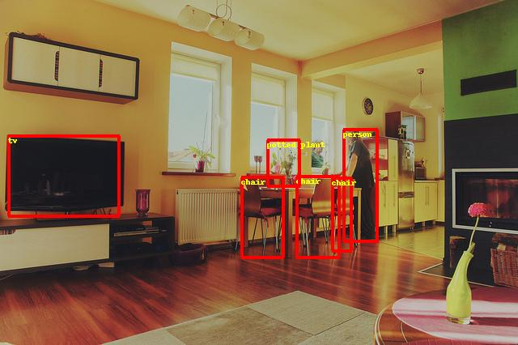
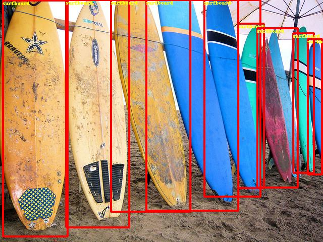
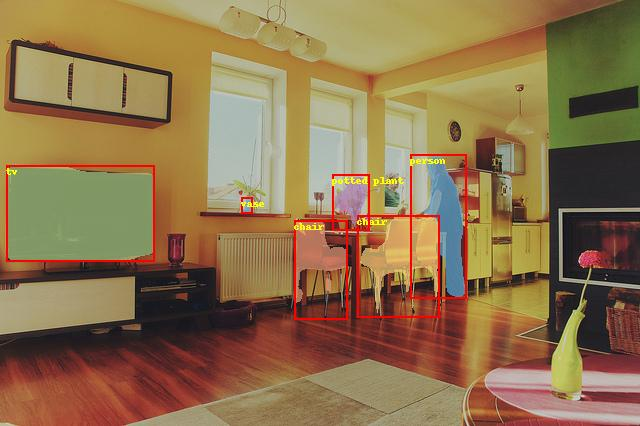

# RCNN 系列目标检测

---
## 内容

- [安装](#安装)
- [简介](#简介)
- [数据准备](#数据准备)
- [模型训练](#模型训练)
- [模型评估](#模型评估)
- [模型推断及可视化](#模型推断及可视化)

## 安装

在当前目录下运行样例代码需要PadddlePaddle Fluid的v.1.3.0或以上的版本。如果你的运行环境中的PaddlePaddle低于此版本，请根据[安装文档](http://www.paddlepaddle.org/)中的说明来更新PaddlePaddle。

## 简介
区域卷积神经网络（RCNN）系列模型为两阶段目标检测器。通过对图像生成候选区域，提取特征，判别特征类别并修正候选框位置。
RCNN系列目前包含两个代表模型：Faster RCNN，Mask RCNN

[Faster RCNN](https://arxiv.org/abs/1506.01497) 整体网络可以分为4个主要内容：

1. 基础卷积层。作为一种卷积神经网络目标检测方法，Faster RCNN首先使用一组基础的卷积网络提取图像的特征图。特征图被后续RPN层和全连接层共享。本示例采用[ResNet-50](https://arxiv.org/abs/1512.03385)作为基础卷积层。
2. 区域生成网络(RPN)。RPN网络用于生成候选区域(proposals)。该层通过一组固定的尺寸和比例得到一组锚点(anchors), 通过softmax判断锚点属于前景或者背景，再利用区域回归修正锚点从而获得精确的候选区域。
3. RoI Align。该层收集输入的特征图和候选区域，将候选区域映射到特征图中并池化为统一大小的区域特征图，送入全连接层判定目标类别, 该层可选用RoIPool和RoIAlign两种方式，在config.py中设置roi\_func。
4. 检测层。利用区域特征图计算候选区域的类别，同时再次通过区域回归获得检测框最终的精确位置。

[Mask RCNN](https://arxiv.org/abs/1703.06870) 扩展自Faster RCNN，是经典的实例分割模型。

Mask RCNN同样为两阶段框架，第一阶段扫描图像生成候选框；第二阶段根据候选框得到分类结果，边界框，同时在原有Faster RCNN模型基础上添加分割分支，得到掩码结果，实现了掩码和类别预测关系的解藕。


## 数据准备

在[MS-COCO数据集](http://cocodataset.org/#download)上进行训练，通过如下方式下载数据集。

    cd dataset/coco
    ./download.sh

数据目录结构如下：

```
data/coco/
├── annotations
│   ├── instances_train2014.json
│   ├── instances_train2017.json
│   ├── instances_val2014.json
│   ├── instances_val2017.json
|   ...
├── train2017
│   ├── 000000000009.jpg
│   ├── 000000580008.jpg
|   ...
├── val2017
│   ├── 000000000139.jpg
│   ├── 000000000285.jpg
|   ...

```

## 模型训练

**下载预训练模型：** 本示例提供Resnet-50预训练模型，该模性转换自Caffe，并对批标准化层(Batch Normalization Layer)进行参数融合。采用如下命令下载预训练模型：

    sh ./pretrained/download.sh

通过初始化`pretrained_model` 加载预训练模型。同时在参数微调时也采用该设置加载已训练模型。
请在训练前确认预训练模型下载与加载正确，否则训练过程中损失可能会出现NAN。

**安装[cocoapi](https://github.com/cocodataset/cocoapi)：**

训练前需要首先下载[cocoapi](https://github.com/cocodataset/cocoapi)：

    git clone https://github.com/cocodataset/cocoapi.git
    cd cocoapi/PythonAPI
    # if cython is not installed
    pip install Cython
    # Install into global site-packages
    make install
    # Alternatively, if you do not have permissions or prefer
    # not to install the COCO API into global site-packages
    python2 setup.py install --user

数据准备完毕后，可以通过如下的方式启动训练：

- Faster RCNN

    ```
    python train.py \
       --model_save_dir=output/ \
       --pretrained_model=${path_to_pretrain_model} \
       --data_dir=${path_to_data} \
       --MASK_ON=False
    ```

- Mask RCNN

    ```
    python train.py \
       --model_save_dir=output/ \
       --pretrained_model=${path_to_pretrain_model} \
       --data_dir=${path_to_data} \
       --MASK_ON=True
    ```

    - 通过设置export CUDA\_VISIBLE\_DEVICES=0,1,2,3,4,5,6,7指定8卡GPU训练。
    - 通过设置```MASK_ON```选择Faster RCNN和Mask RCNN模型。
    - 可选参数见：

        python train.py --help

**数据读取器说明：** 数据读取器定义在reader.py中。所有图像将短边等比例缩放至`scales`，若长边大于`max_size`, 则再次将长边等比例缩放至`max_size`。在训练阶段，对图像采用水平翻转。支持将同一个batch内的图像padding为相同尺寸。

**模型设置：**

* 分别使用RoIAlign和RoIPool两种方法。
* 训练过程pre\_nms=12000, post\_nms=2000，测试过程pre\_nms=6000, post\_nms=1000。nms阈值为0.7。
* RPN网络得到labels的过程中，fg\_fraction=0.25，fg\_thresh=0.5，bg\_thresh_hi=0.5，bg\_thresh\_lo=0.0
* RPN选择anchor时，rpn\_fg\_fraction=0.5，rpn\_positive\_overlap=0.7，rpn\_negative\_overlap=0.3


**训练策略：**

*  采用momentum优化算法训练，momentum=0.9。
*  权重衰减系数为0.0001，前500轮学习率从0.00333线性增加至0.01。在120000，160000轮时使用0.1,0.01乘子进行学习率衰减，最大训练180000轮。同时我们也提供了2x模型，该模型采用更多的迭代轮数进行训练，训练360000轮，学习率在240000，320000轮衰减，其他参数不变，训练最大轮数和学习率策略可以在config.py中对max_iter和lr_steps进行设置。
*  非基础卷积层卷积bias学习率为整体学习率2倍。
*  基础卷积层中，affine_layers参数不更新，res2层参数不更新。

## 模型评估

模型评估是指对训练完毕的模型评估各类性能指标。本示例采用[COCO官方评估](http://cocodataset.org/#detections-eval)

`eval_coco_map.py`是评估模块的主要执行程序，调用示例如下：

- Faster RCNN

    ```
    python eval_coco_map.py \
        --dataset=coco2017 \
        --pretrained_model=${path_to_trained_model} \
        --MASK_ON=False
    ```

- Mask RCNN

    ```
    python eval_coco_map.py \
        --dataset=coco2017 \
        --pretrained_model=${path_to_trained_model} \
        --MASK_ON=True
    ```

    - 通过设置`--pretrained_model=${path_to_trained_model}`指定训练好的模型，注意不是初始化的模型。
    - 通过设置`export CUDA\_VISIBLE\_DEVICES=0`指定单卡GPU评估。
    - 通过设置```MASK_ON```选择Faster RCNN和Mask RCNN模型。

下表为模型评估结果：

Faster RCNN

| 模型                   |   RoI处理方式  | 批量大小   | 迭代次数   | mAP  |
| :--------------- | :--------: | :------------:    | :------------------:    |------: |
| [Fluid RoIPool minibatch padding](http://paddlemodels.bj.bcebos.com/faster_rcnn/model_pool_minibatch_padding.tar.gz) | RoIPool | 8   |    180000        | 0.316 |
| [Fluid RoIPool no padding](http://paddlemodels.bj.bcebos.com/faster_rcnn/model_pool_no_padding.tar.gz)  | RoIPool | 8   |    180000        | 0.318 |
| [Fluid RoIAlign no padding](http://paddlemodels.bj.bcebos.com/faster_rcnn/model_align_no_padding.tar.gz)  | RoIAlign | 8   |    180000        | 0.348 |
| [Fluid RoIAlign no padding 2x](http://paddlemodels.bj.bcebos.com/faster_rcnn/model_align_no_padding_2x.tar.gz)  | RoIAlign | 8   |    360000        | 0.367 |


* Fluid RoIPool minibatch padding: 使用RoIPool，同一个batch内的图像填充为相同尺寸。该方法与detectron处理相同。
* Fluid RoIPool no padding: 使用RoIPool，不对图像做填充处理。
* Fluid RoIAlign no padding: 使用RoIAlign，不对图像做填充处理。
* Fluid RoIAlign no padding 2x: 使用RoIAlign，不对图像做填充处理。训练360000轮，学习率在240000，320000轮衰减。

Mask RCNN:

| 模型                   | 批量大小   | 迭代次数   | box mAP  | mask mAP |
| :--------------- | :--------: | :------------:    | :--------:    |------: |
| [Fluid mask no padding](https://paddlemodels.bj.bcebos.com/faster_rcnn/Fluid_mask_no_padding.tar.gz) | 8 | 180000 | 0.359 | 0.314 |  

* Fluid mask no padding: 使用RoIAlign，不对图像做填充处理

## 模型推断及可视化

模型推断可以获取图像中的物体及其对应的类别，`infer.py`是主要执行程序，调用示例如下：

```
python infer.py \
    --pretrained_model=${path_to_trained_model}  \
    --image_path=dataset/coco/val2017/000000000139.jpg  \
    --draw_threshold=0.6
```

注意，请正确设置模型路径`${path_to_trained_model}`和预测图片路径。默认使用GPU设备，也可通过设置`--use_gpu=False`使用CPU设备。可通过设置`draw_threshold`调节得分阈值控制检测框的个数。

下图为模型可视化预测结果：
<p align="center">

 <br />
Faster RCNN 预测可视化
</p>

<p align="center">

 <br />
Mask RCNN 预测可视化
</p>
