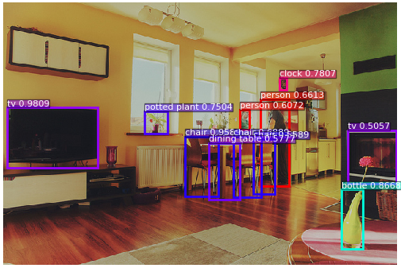
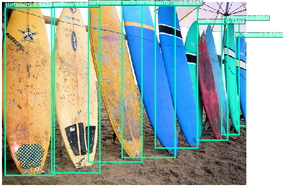
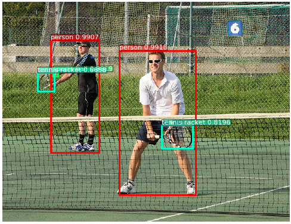

# YOLO V3 目标检测

---
## 内容

- [安装](#安装)
- [简介](#简介)
- [数据准备](#数据准备)
- [模型训练](#模型训练)
- [模型评估](#模型评估)
- [模型推断及可视化](#模型推断及可视化)
- [附录](#附录)

## 安装

在当前目录下运行样例代码需要PadddlePaddle Fluid的v.1.1.0或以上的版本。如果你的运行环境中的PaddlePaddle低于此版本，请根据[安装文档](http://www.paddlepaddle.org/documentation/docs/zh/0.15.0/beginners_guide/install/install_doc.html#paddlepaddle)中的说明来更新PaddlePaddle。

## 简介

[YOLOv3](https://arxiv.org/abs/1804.02767) 是一阶段End2End的目标检测器。其目标检测原理如下图所示:

  
YOLOv3检测原理

YOLOv3将输入图像分成S\*S个格子，每个格子预测B个bounding box，每个bounding box预测内容包括: Location(x, y, w, h)、Confidence Score和C个类别的概率，因此YOLOv3输出层的channel数为S\*S\*B\*(5 + C)。YOLOv3的loss函数也有三部分组成：坐标误差，IOU误差和分类误差。

YOLOv3的网络结构如下图所示:

  
YOLOv3网络结构

YOLOv3 的网络结构由基础特征提取网络、multi-scale特征融合层和输出层组成。

1. 特征提取网络。YOLOv3使用 [DarkNet53](https://arxiv.org/abs/1612.08242)作为特征提取网络，DarkNet53 基本采用了全卷积网络，用步长为2的卷积操作替代了池化层，同时添加了 Residual 单元，避免在网络层数过深时发生梯度弥散。

2. 特征融合层。为了解决之前YOLO版本对小目标不敏感的问题，YOLOv3采用了3个不同尺度的特征图来进行目标检测，分别为13\*13,26\*26,52\*52,用来检测大、中、小三种目标。特征融合层选取 DarkNet 产出的三种尺度特征图作为输入，借鉴了FPN(feature pyramid networks)的思想，通过一系列的卷积层和上采样对各尺度的特征图进行融合。

3. 输出层。同样使用了全卷积结构，其中最后一个卷积层的卷积核个数是255：3\*(80+4+1)=255，3表示一个grid cell包含3个bounding box，4表示框的4个坐标信息，1表示Confidence Score，80表示COCO数据集中80个类别的概率。

## 数据准备

在[MS-COCO数据集](http://cocodataset.org/#download)上进行训练，通过如下方式下载数据集。

    cd dataset/coco
    ./download.sh

## 模型训练

数据准备完毕后，可以通过如下的方式启动训练：

    python train.py \
       --model_save_dir=output/ \
       --pretrained_model=${path_to_pretrain_model}
       --data_dir=${path_to_data}

- 通过设置export CUDA\_VISIBLE\_DEVICES=0,1,2,3,4,5,6,7指定8卡GPU训练。
- 可选参数见：

    python train.py --help

**下载预训练模型：** 本示例提供darknet53预训练模型，该模型转换自作者提供的darknet53在ImageNet上预训练的权重，采用如下命令下载预训练模型：

    sh ./weights/download_pretrained_weight.sh

通过初始化`pretrained_model` 加载预训练模型。同时在参数微调时也采用该设置加载已训练模型。
请在训练前确认预训练模型下载与加载正确，否则训练过程中损失可能会出现NAN。

**安装[cocoapi](https://github.com/cocodataset/cocoapi)：**

训练前需要首先下载[cocoapi](https://github.com/cocodataset/cocoapi)：

    # COCOAPI=/path/to/clone/cocoapi
    git clone https://github.com/cocodataset/cocoapi.git $COCOAPI
    cd $COCOAPI/PythonAPI
    # if cython is not installed
    pip install Cython
    # Install into global site-packages
    make install
    # Alternatively, if you do not have permissions or prefer
    # not to install the COCO API into global site-packages
    python2 setup.py install --user

**数据读取器说明：**

* 数据读取器定义在reader.py中。

**模型设置：**

* 模型使用了基于COCO数据集生成的9个先验框：(10x13)，(16x30)，(33x23)，(30x61)，(62x45)，(59x119)，(116x90)，(156x198)，(373x326)
* 检测过程中，nms_topk=400, nms_posk=100，nms_thresh=0.4

**训练策略：**

*  采用momentum优化算法训练YOLOv3，momentum=0.9。
*  学习率采用warmup算法，前1000轮学习率从0.0线性增加至0.01。在400000，450000轮时使用0.1,0.1乘子进行学习率衰减，最大训练500000轮。

## 模型评估

模型评估是指对训练完毕的模型评估各类性能指标。本示例采用[COCO官方评估](http://cocodataset.org/#detections-eval)

`eval.py`是评估模块的主要执行程序，调用示例如下：

    python eval.py \
        --dataset=coco2017 \
        --pretrained_model=${path_to_pretrain_model} \

- 通过设置export CUDA\_VISIBLE\_DEVICES=0指定单卡GPU评估。

下图为模型评估结果：

  
YOLOv3

## 模型推断及可视化

模型推断可以获取图像中的物体及其对应的类别，`infer.py`是主要执行程序，调用示例如下：

    python infer.py \
       --dataset=coco2017 \
        --pretrained_model=${path_to_pretrain_model}  \
        --image_path=data/COCO17/val2017/  \
        --image_name=000000000139.jpg \
        --draw_threshold=0.5

下图为模型可视化预测结果：

  
YOLOv3 预测可视化

